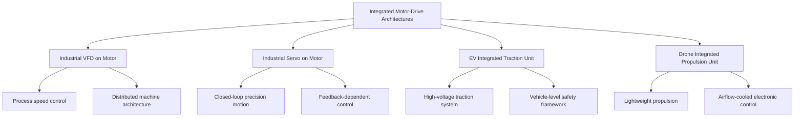

<!--
CONTENT_CLASS: RAG_APPROVED
AI_READ_ACCESS: ALLOWED
STATUS: DRAFT
-->

# Integrated Motor-Drive Architecture Comparison

## 0. Purpose

Use this note to compare integrated drive-on-motor architectures across industrial machinery, EV traction, and drone propulsion contexts.

This is a design-framework comparison note. It is not a substitute for product certification, machine integration review, or application-specific qualification.

## 1. Core concept

An integrated motor-drive architecture places some or all power electronics at the motor assembly rather than in a separate cabinet or remote enclosure.

Common patterns include:

- drive mounted on motor housing
- drive mounted on gearbox/motor assembly
- propulsion controller integrated into motor-arm module
- traction inverter integrated into motor/transaxle housing

## 2. High-level architecture map

## 3. Why integration is used

Typical reasons to integrate the drive with the motor include:

- reduced cabinet space
- shorter motor leads
- reduced panel wiring
- modular machine design
- decentralized architecture
- simplified field installation

## 4. Architecture comparison matrix

| Architecture | Primary mission | Typical control complexity | Main integration concern | Typical use |
| --- | --- | --- | --- | --- |
| Industrial VFD on motor | process speed control | moderate | enclosure, thermal rise, field wiring EMC | conveyors, fans, pumps, logistics |
| Industrial servo on motor | precision motion | high | feedback integrity, thermal density, safety functions | compact axes, packaging, robotics |
| EV integrated traction unit | traction | high | cooling, packaging, high-voltage isolation | e-axles, vehicle propulsion |
| Drone integrated propulsion unit | propulsion | moderate | mass, airflow cooling, vibration | UAV propulsion modules |

## 5. Design review themes

Review these themes before selecting an integrated architecture:

1. application domain
2. governing standards family
3. thermal margin at the motor
4. enclosure and environmental exposure
5. EMC and signal-integrity consequences
6. service and replacement strategy
7. safety-function boundary, if any

## 6. Good candidates

Typical good candidates:

- distributed conveyor zones
- compact packaging modules
- fan arrays
- pump skids
- AGV/AMR subsystems
- compact servo axes with controlled environment

## 7. Caution cases

Use caution when:

- ambient temperature is high
- washdown or corrosion exposure is severe
- serviceability requires separate motor/drive replacement
- vibration is severe and not well qualified
- power density is high but cooling margin is weak

## 8. Practical conclusion

The right question is not simply "can the drive be integrated?"

The right question is:

- which standards and qualification path governs the product
- what failure mechanisms are introduced by the packaging choice
- whether the integrated assembly is maintainable in the real environment

## Related files

- [Industrial vs EV vs Drone Motor-Drive Standards Matrix](./industrial_vs_ev_vs_drone_motor_drive_standards_matrix.md)
- [Motor-Mounted Drive Thermal and EMC Design Notes](./motor_mounted_drive_thermal_and_emc_design_notes.md)
- [Integrated Drive Failure Modes and Tradeoffs](./integrated_drive_failure_modes_and_tradeoffs.md)
- [Integrated Drive Serviceability and Field Replacement Review](./integrated_drive_serviceability_and_field_replacement_review.md)
