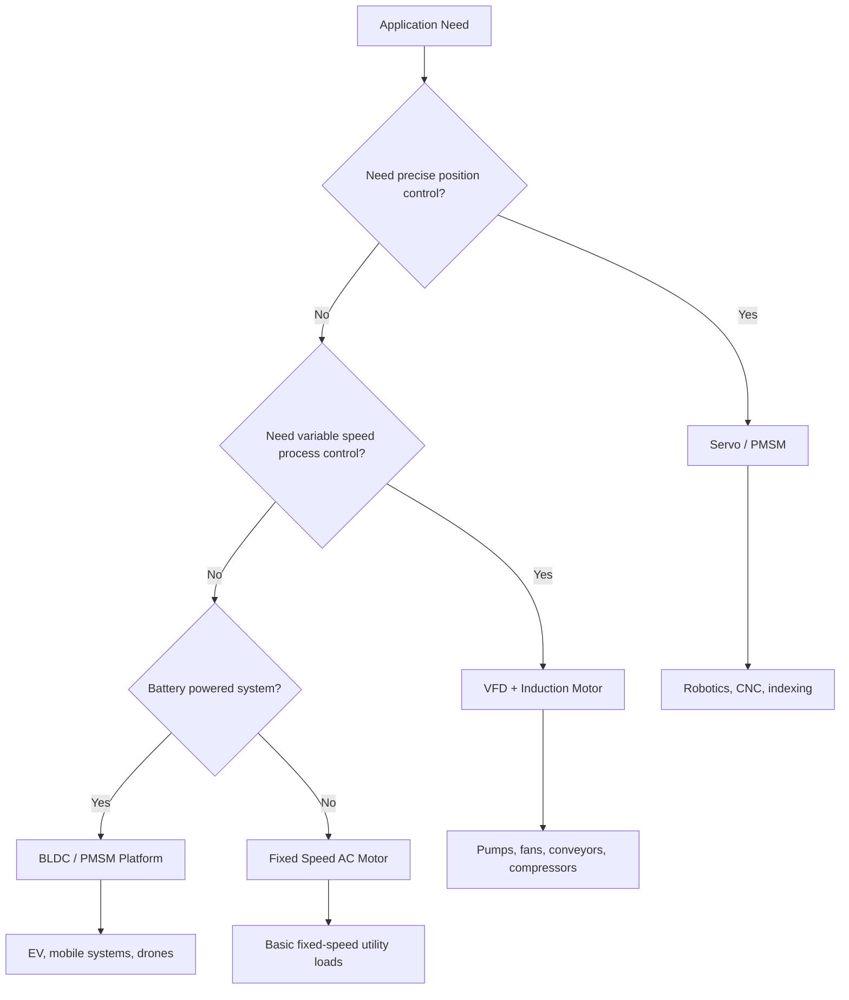

<!--
CONTENT_CLASS: RAG_APPROVED
AI_READ_ACCESS: ALLOWED
STATUS: DRAFT
-->

# Motor Selection Comparison Matrix

## 0. Purpose

Use this design framework during early concept selection when the question is not just "what motor size?" but "what motor-system family fits the application?"

This note is not a substitute for detailed motor sizing, thermal review, protection review, or manufacturer-specific drive selection.

## 1. Motor selection logic

## 2. Comparison matrix

| Motor/system type | Supply form | Control complexity | Maintenance | Precision | Torque density | Typical speed range | Typical applications |
| --- | --- | --- | --- | --- | --- | --- | --- |
| Fixed-speed induction motor | plant AC | low | low | low | moderate | utility motor range | pumps, fans, simple machinery |
| VFD + induction motor | AC plus inverter | moderate | low | moderate | moderate | broad adjustable range | conveyors, pumps, process equipment |
| PMSM servo system | DC bus plus servo inverter | high | low | high | high | broad controlled range | robotics, CNC, packaging |
| BLDC system | DC bus plus electronic commutation | moderate | low | moderate to high depending on controller | high | wide | compact battery systems |
| Stepper system | DC bus plus stepper driver | low to moderate | low | moderate at low speed | lower at higher speed | lower to medium | light positioning |
| Brushed DC motor system | DC | low to moderate | high | moderate | moderate | wide | legacy variable-speed systems |
| EV traction motor system | high-voltage battery plus inverter | high | low | high torque/speed control | very high | wide traction range | vehicle propulsion |
| Drone propulsion motor | battery plus ESC | moderate | low | not selected for position precision | high for mass | very high | UAV propulsion |

## 3. Application mapping

### Process and utility loads

Best fit:

- induction motor
- VFD plus induction motor

Typical loads:

- pumps
- fans
- blowers
- conveyors
- compressors

Primary concern:

- robustness
- speed control
- plant maintainability

### Precision motion systems

Best fit:

- PMSM servo system
- advanced closed-loop motion platform

Typical loads:

- robotic joints
- indexing axes
- semiconductor stages
- packaging axes
- CNC feed systems

Primary concern:

- repeatability
- dynamic response
- precise control
- coordinated motion

### Compact battery-powered machines

Best fit:

- BLDC
- PMSM platform
- specialized compact controller

Primary concern:

- compactness
- efficiency
- power density

### Vehicle traction and drone propulsion

These are comparative categories rather than current default plant scope.

Primary concern:

- torque density
- thermal integration
- weight
- flight or drive-cycle efficiency

## 4. Decision factors

Review at least the following:

1. required motion type
2. power source
3. duty cycle
4. thermal environment
5. maintenance expectations
6. control architecture

## 5. Common mistakes

### Selecting by power rating only

Power rating alone is not enough. Application behavior, torque profile, duty cycle, and control requirements matter.

### Selecting servo where VFD is sufficient

Servo complexity should be justified by motion-performance requirements.

### Selecting industrial motor architecture for lightweight mobile propulsion

Industrial motors and drone or vehicle motors are optimized for different environments and priorities.

### Ignoring the full system

Motor selection must be coordinated with:

- drive
- feedback method
- cable and grounding design
- protection strategy
- machine mechanics
- safety function design

## 6. Recommended follow-on reviews

After provisional motor-family selection, continue with:

- [Motor Selection Workflow](./motor_selection_workflow.md)
- [VFD Motor Integration Review](./vfd_motor_integration_review.md)
- [VFD Commissioning Workflow](./vfd_commissioning_workflow.md)
- [Servo Commissioning Workflow](./servo_commissioning_workflow.md)
