<!--
AI_READ_ACCESS: ALLOWED
CONTENT_CLASS: DERIVED_REFERENCE
CATEGORY: SEMI_FACILITY
STATUS: DRAFT
-->

# Semiconductor Gas Cabinet — Control, Safety, and Interlock Architecture

## Purpose

This note is the cabinet-level reference for semiconductor specialty-gas delivery.

It sits below the broad facility gas-system view and focuses on the local package that typically includes:

- gas source isolation
- pressure control
- purge routing
- vent and exhaust dependency
- gas detection
- cabinet-door and maintenance interlocks
- tool permit and shutdown exchange

This is an engineering pattern reference, not a vendor P&ID, not a substitute for the governing standards, and not a final SIL claim.

## Why gas cabinets need their own reference

Gas cabinets are not just a smaller version of the bulk specialty-gas page.

They combine:

- hazardous gas containment
- local sequence control
- exhaust-dependent safety behavior
- cabinet-specific detection and shutdown logic
- a direct interface to the process tool

That combination makes them one of the most interlock-heavy packages in a semiconductor facility.

## Scope and boundary

This note covers the cabinet package from the gas source connection to the tool-facing permit and gas-delivery boundary.

It usually includes:

- cylinder or source connection
- automatic shutoff valves
- regulator and pressure measurement
- purge and vent path
- MFC or local flow-control hardware where applicable
- gas detector and exhaust proof inputs
- door interlock and E-stop integration
- local PLC and safety-layer responsibilities

It usually excludes:

- bulk pad and gas-room design
- facility distribution upstream of the cabinet boundary
- tool-internal process-gas box design
- vendor-specific wiring details

## Functional block summary

| Block | Primary role | Typical engineering concern |
| --- | --- | --- |
| Source connection | bring gas into the cabinet boundary | wrong gas, wrong hookup, manual isolation discipline |
| Automatic shutoff valves | isolate hazardous gas rapidly | fail position, valve proof, cycle life |
| Regulation train | reduce and stabilize pressure | overpressure, contamination, drift |
| Purge path | clear hazardous gas before or after flow | proof of purge availability, timing, pressure confirmation |
| Vent and exhaust path | remove released or purged gas safely | prove capture, not just fan running |
| Detection and interlocks | identify unsafe condition | detector placement, nuisance trip management, proof testing |
| Local control and safety layers | run sequence and hazardous shutdown | ownership split between PLC, safety logic, and tool handshake |

## Core design rules

- Gas enable should depend on cabinet health, exhaust proof, and no active hazard alarm.
- Hazardous shutdown should isolate gas first, then remove tool permit, then drive the cabinet toward its defined safe state.
- Purge should be treated as a defined sequence with entry, proof, timing, and exit criteria.
- Manual mode should not bypass leak, gas-detection, exhaust-loss, or emergency-stop shutdown paths.
- A cabinet page should separate `PERMISSIVE`, `INTERLOCK`, `TRIP`, and `ALARM` behavior clearly.

## Overall gas cabinet architecture

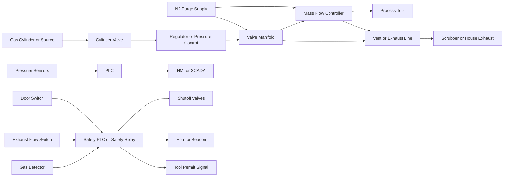

This diagram shows the minimum architectural layers that make the cabinet work as a controlled hazardous-gas package instead of a simple valve panel.

## Gas flow path and isolation points

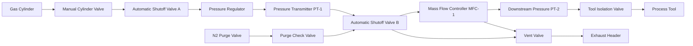

The exact hardware varies by gas and vendor, but the engineering pattern stays stable: two fast isolation points, pressure observation, purge injection, controlled venting, and a defined tool boundary.

## Instrumentation layout

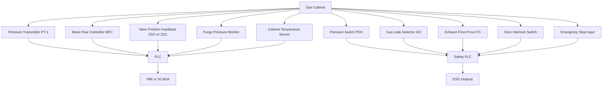

The instrumentation burden is one reason gas cabinets deserve a dedicated note. Several signals are not there to optimize flow; they exist to block unsafe operation or trigger immediate isolation.

## Control state model

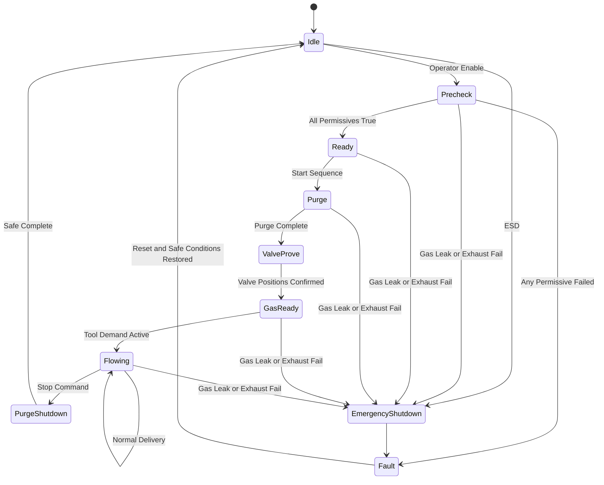

Not every cabinet uses every state name, but the behavioral stages should still be explicit and testable.

## Start permissive logic

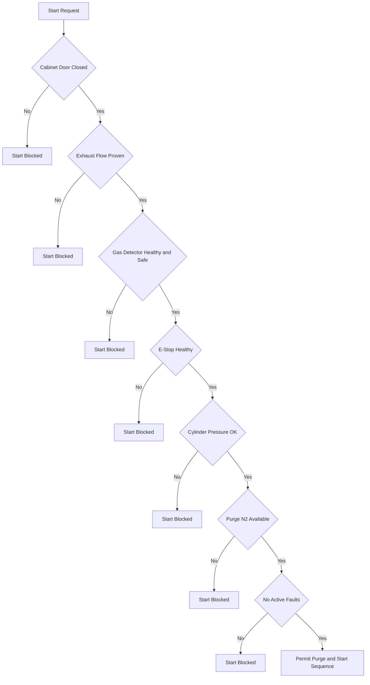

These permissives answer one question only: may the cabinet begin the sequence. They should not be mixed with hazardous trip logic.

## Purge sequence logic

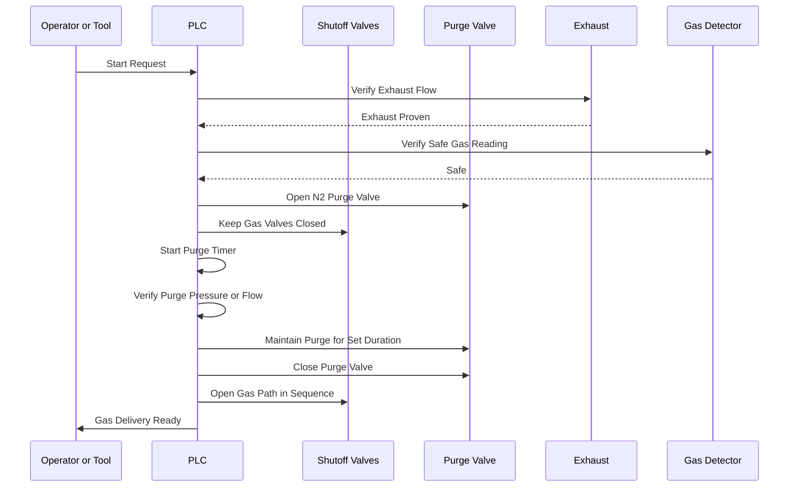

The purge path should be proven, timed, and closed deliberately. It is not just a convenience feature.

## Valve actuation sequence

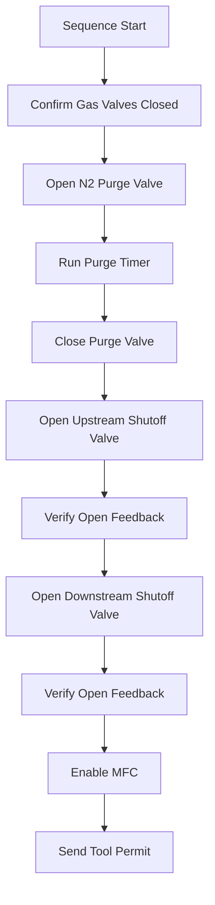

Valve proving belongs in the sequence, not just in maintenance notes. The cabinet should know whether the commanded path is actually established.

## Emergency shutdown logic

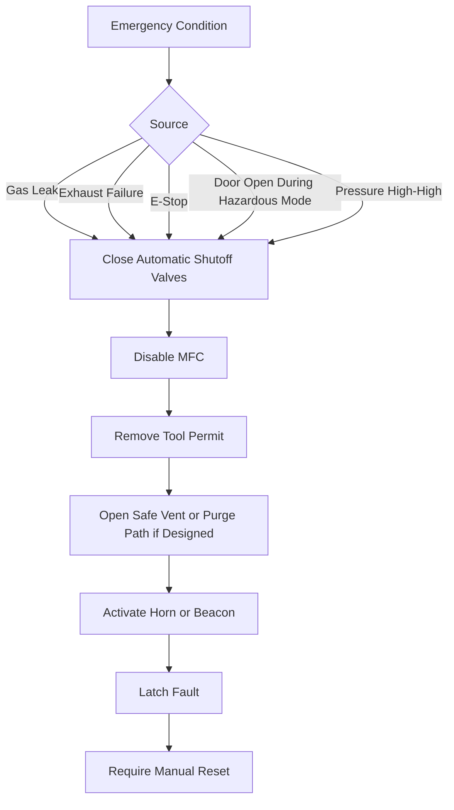

This is the local hazardous shutdown layer for the cabinet. It should remain active regardless of the current operating mode.

## Safety layer architecture

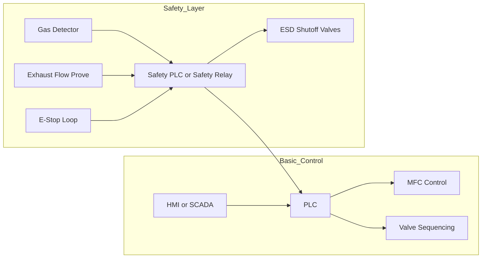

The separation matters because operator displays and normal sequence control are not sufficient protection against a gas release scenario.

## Tool interface and handshake

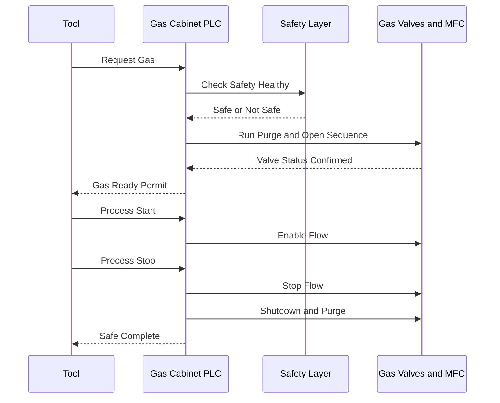

The cabinet-to-tool handshake should define both permission and shutdown behavior. A "permit" signal without ownership rules is not enough.

## Alarm philosophy

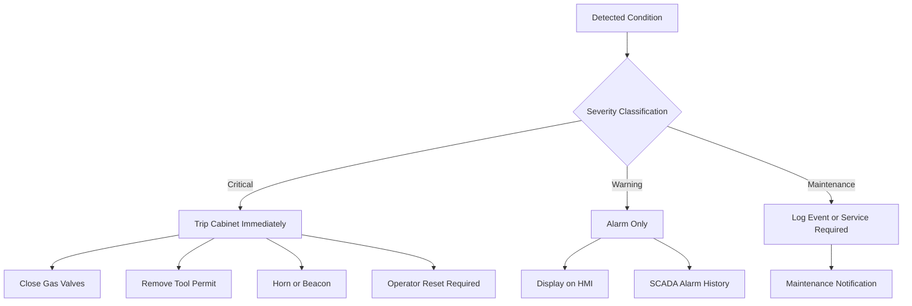

This keeps the cabinet readable: not every abnormal signal should trip, and every trip-capable signal should be obvious.

## Failure mode flow

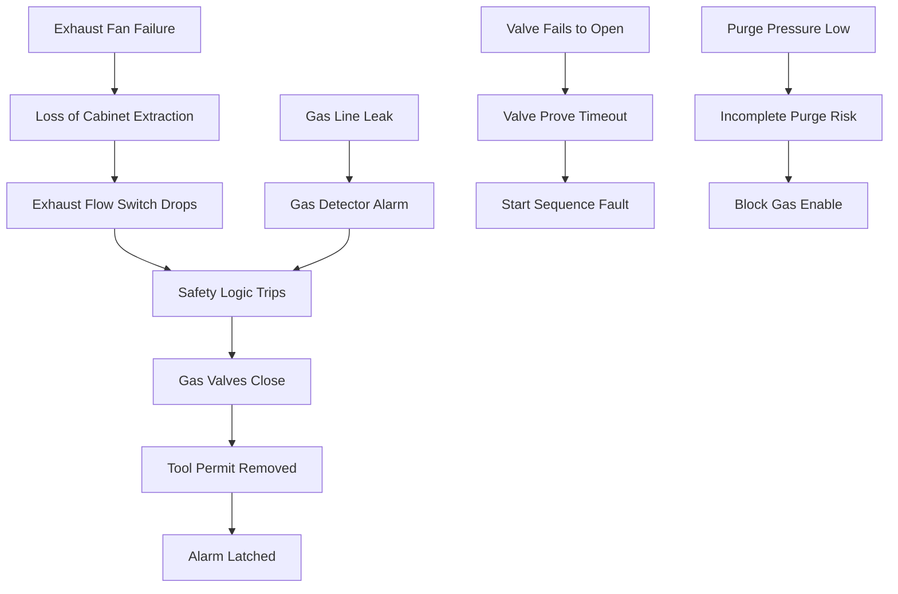

The cabinet is a good example of why failure-mode visualization matters. Several failures are not process upsets first; they are state-machine or hazardous-shutdown problems first.

## Operating modes

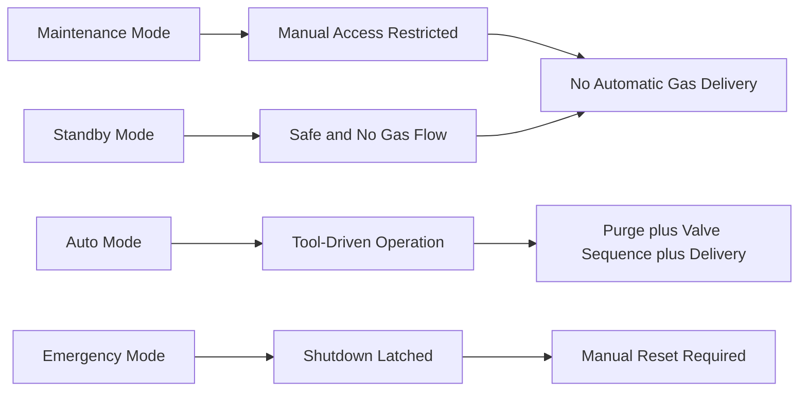

Mode naming can vary by site, but the restrictions should stay explicit.

## Representative signal set

Example tag stems for one cabinet:

- `GCAB_GD_ALM`
- `GCAB_EXH_PROOF`
- `GCAB_DOOR_CLS`
- `GCAB_PSHH`
- `GCAB_N2_AVAIL`
- `GCAB_SOV_A_CMD`
- `GCAB_SOV_A_ZSO`
- `GCAB_SOV_B_CMD`
- `GCAB_SOV_B_ZSO`
- `GCAB_MFC_EN`
- `GCAB_TOOL_PERMIT`
- `GCAB_FAULT_LATCH`

These are placeholders for engineering discussion, not a required naming standard.

## Standards routes

Use these standards families to route detailed questions:

- `SEMI F13` and `SEMI F14` for gas source control equipment and enclosure guidance
- `SEMI F6` and `SEMI S6` for containment and exhaust-related design context
- `SEMI S2` and `SEMI S14` for equipment safety and fire-risk framing
- `NFPA 55` and `NFPA 318` for facility gas and fab fire-life-safety context
- `IEC 61511` when cabinet shutdown logic becomes part of a formal safety lifecycle

Confirm current edition and project applicability before turning any one of these routes into a requirement claim.

## Related files

- [Bulk Specialty Gas Systems](./bulk_specialty_gas.md)
- [Common Control Philosophy](./common_control_philosophy.md)
- [Safety and Shutdown Architecture](./safety_and_shutdown.md)
- [Tool-Facility Interface](./tool_facility_interface.md)
- [Instrumentation Use Matrix](./instrumentation_use_matrix.md)

## Scope caution

This note is intentionally cabinet-level and vendor-neutral.

It is meant to answer:

- what the cabinet must prove before enabling gas
- what should happen when the cabinet loses a critical protection input
- how purge, valve proving, and tool permit fit together
- how to separate operator information from hazardous shutdown logic

Final valve selection, detector technology, integrity assignment, hazardous-area detail, and code compliance remain project-specific.
