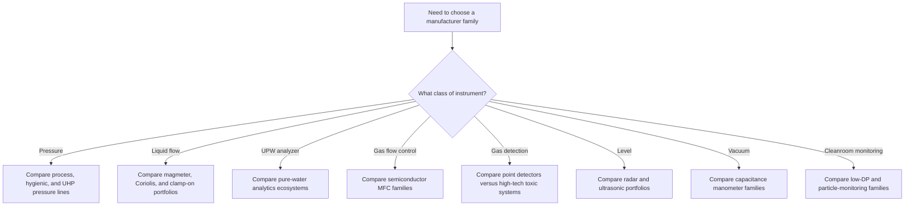

<!--
AI_READ_ACCESS: ALLOWED
CONTENT_CLASS: DERIVED_REFERENCE
STATUS: PROMOTED
CATEGORY: SEMI_FACILITY_VENDOR_FAMILIES
SOURCE: planning/semi_facility/instrumentation/manufacturer_product_family_comparison.md
-->

# Common Major Manufacturers and Product Family Comparison

## Purpose

This note compares common major manufacturer families used around semiconductor-facility instrumentation.

It is organized by measurement class instead of by brand so you can compare vendors where they actually compete.

## How to read the comparison

- `Best fit` means where the family is strongest based on its public positioning and features.
- `Watch item` means what usually disqualifies a family if the application is more demanding than it looks.
- This note does not rank vendors by absolute market share except where a vendor makes an explicit public claim.

## Vendor-selection flow

## Pressure transmitters

| Manufacturer | Product families | Core technology angle | Best fit | Useful compliance or interface angle | Watch item |
| --- | --- | --- | --- | --- | --- |
| Emerson / Rosemount | `3051`, `3051S`, `3051HT` | mature general-purpose and hygienic pressure platforms with diagnostics and broad plant familiarity | facility utilities, skid pressure, level via DP, hygienic skid pressure where Rosemount platform is already standard | official materials highlight Bluetooth, diagnostics, HART hosts, and SIL2 capability on newer 3051 generation content | verify exact approvals and wetted parts on the configured model, especially if trying to use the family in high-purity liquid service |
| Yokogawa | `EJX A`, `EJX S` | silicon resonant sensor platform focused on accuracy and long-term stability | water, chemical, gas utility pressure where stable long-life transmitters are preferred | public pages show `SIL2/SIL3`, HART, PROFINET, IP68 on newer `EJX S` release content | not a semiconductor-UHP specialist family by itself; use where utility boundary rather than gas-panel internals is the main issue |
| WIKA | `HYDRA`, `WUD-2x`, `S-20`, `O-10` | wide spread from semiconductor UHP transducers to rugged OEM industrial transmitters | UHP gas-panel pressure, compact machine-skid pressure, OEM utility packages | official WIKA semiconductor content emphasizes EtherCAT and ultra-clean wetted parts for HYDRA/WUD lines | do not confuse general industrial WIKA lines with semiconductor-UHP lines |
| Endress+Hauser | `Cerabar PMP43`, `PMP71`, compact `PMP21/PMP23` | strong process and hygienic pressure portfolio from compact utility devices to high-performance transmitters | chemical and utility pressure, hygienic skid pressure, level by hydrostatic pressure | official pages show hazardous-area certificates, hygienic approvals, and `IEC 61508` / `SIL` on selected lines | process-centric portfolio; check fit carefully before assuming semiconductor-specific contamination suitability |

## Liquid flow measurement

| Manufacturer | Product families | Core technology angle | Best fit | Useful compliance or interface angle | Watch item |
| --- | --- | --- | --- | --- | --- |
| Endress+Hauser | `Promag H`, `Promag H 200/500`, `Promass` family context | magmeter strength in lined hygienic and chemical service; broader flow ecosystem around it | conductive UPW and chemical flow, especially where PFA liner and integrated temperature or conductivity are helpful | official Promag H pages mention `PFA` liner, multivariable measurement, hazardous-area and `SIL` availability on selected models | ensure conductivity and material assumptions fit the actual fluid; mag is not universal |
| Emerson / Micro Motion | `ELITE`, `G-Series`, broader Coriolis portfolio | direct mass flow and density, strong diagnostics, compact Coriolis options | precise chemical transfer, blend, dose, or skid flow where density and entrained-gas behavior matter | official content emphasizes Smart Meter Verification and compact hygienic offerings | cost, weight, and entrained gas behavior still need application-specific review |
| Siemens | `SITRANS FM MAG 3100`, `FMT020`, broader `SITRANS F` portfolio | broad process-industry flow platform with modular transmitter strategy | general process liquid service, chemical and water systems, plant standardization where Siemens is already strong | official Siemens content highlights `ISO/IEC 17025` calibration, hazardous-area use, and hot-swappable `SensorProm` concept | portfolio is broad but not purpose-built around semiconductor high-purity needs |
| Emerson / Flexim | clamp-on ultrasonic flow technology | non-invasive retrofit and verification | retrofit checks, temporary studies, or services where cutting the line is undesirable | official Emerson acquisition materials position Flexim as clamp-on ultrasonic center of excellence | not the first choice when the process requires in-line custody of a critical control loop at the smallest low flows |

## Pure-water analyzers and sensors

| Manufacturer | Product families | Core technology angle | Best fit | Useful compliance or interface angle | Watch item |
| --- | --- | --- | --- | --- | --- |
| METTLER TOLEDO Thornton | `M800`, `770MAX`, `UniCond`, pure-water sensor families | pure and ultrapure water analytics ecosystem with strong semiconductor heritage | UPW resistivity/conductivity, integrated pure-water monitoring, semiconductor water treatment and recycle/reclaim | public Thornton content emphasizes semiconductor pure water heritage, ASTM/NIST traceable calibration, and pure-water specialization | verify whether the exact analyzer or sensor is targeted at UPW versus more general pure-water duty |
| Yokogawa | `FLXA402` and conductivity/resistivity analyzer families | modular liquid analyzer platform with conductivity, resistivity, and digital communications | plants that want one common analyzer family across wastewater, scrubber, and some pure-water duty | official pages show HART, Modbus TCP, Modbus RTU, and multiple measurement methods | broader process focus means the sample-system design matters if trying to push into the most demanding UPW duty |
| Endress+Hauser | `Liquiline` family | broad multichannel analytical platform across conductivity, pH, oxygen, and more | plants standardizing around one analyzer family across water, wastewater, and chemical service | official pages show support for HART, Profibus, Modbus, and EtherNet/IP in selected family members | use care in ultrapure water applications where semiconductor-specific analytics history matters as much as feature breadth |
| Veolia / Sievers | `M9`, `M500` family context | TOC-focused water analytics and laboratory-to-online quality culture | TOC-critical water monitoring and pure-water quality programs | public Veolia material around high-purity water and Sievers ecosystem supports TOC-centric monitoring context | product discovery through public pages is less straightforward; confirm exact semiconductor-fit analyzer and support model early |

## Semiconductor gas flow control

| Manufacturer | Product families | Core technology angle | Best fit | Useful compliance or interface angle | Watch item |
| --- | --- | --- | --- | --- | --- |
| Brooks Instrument | `GF100`, `GF80`, `GP200`, `GF120xHT`, `5850EM(H)` | deep semiconductor gas-control portfolio across thermal metal-sealed, pressure-based, safe-delivery, and high-temperature vapor delivery | etch, deposition, implant, and high-purity gas-panel work | official materials emphasize `MultiFlo`, EtherCAT options, safe-delivery support, and semiconductor reliability positioning | choose carefully between metal-sealed, pressure-based, and elastomer families; they are not interchangeable |
| HORIBA STEC | `SEC-Z500X`, `S600`, `DZ-107`, `SEC-E`, `SEC-N100` | broad semiconductor-focused MFC lineup including multi-range/multi-gas and ultra-thin panel formats | dense gas panels, semiconductor OEMs, and users who want broad STEC ecosystem fit | official pages show semiconductor segment positioning, EtherCAT on newer ultra-thin line, and wide flow coverage | determine whether the duty needs ultra-thin, high-temperature, general-purpose, or multi-range capability before standardizing |
| MKS Instruments | `GM50A`, `C-Series`, broader flow solutions portfolio | strong semiconductor and advanced-process heritage with metal-sealed multi-gas lines and MEMS fast-response lines | high-purity semiconductor gas panels, fast-response non-corrosive gas control, compact digital gas control | official content shows MEMS fast response, PROFINET/Modbus TCP on `C-Series`, and metal-sealed multi-gas multi-range options on `GM50A` | `C-Series` is explicitly positioned for non-corrosive gases; do not assign it to corrosive specialty gas duty without re-checking |

## Fixed gas detection

| Manufacturer | Product families | Core technology angle | Best fit | Useful compliance or interface angle | Watch item |
| --- | --- | --- | --- | --- | --- |
| Dräger | `Polytron 7000`, `Polytron 8100 EC` | robust electrochemical toxic and oxygen detection with broad industrial gas list | point toxic gas or oxygen monitoring in gas rooms, cabinets, and exhausted spaces | official pages show `SIL 2`, `ATEX`, `IECEx`, `UL`, `CSA`, HART/Modbus/Fieldbus on 8100 | point detectors still need zoning, sample access, and bump-test strategy; they do not solve difficult remote sampling by themselves |
| Honeywell | `Vertex Edge` and broader high-tech gas detection ecosystem including Chemcassette and infrared-spectroscopy systems | system-level toxic gas monitoring for high-tech environments | high-tech and semiconductor toxic gas monitoring where remote sampling and lower-level detection may be needed | public Honeywell material explicitly positions its high-tech portfolio for semiconductor manufacturing and shows `Modbus TCP/IP` and `Modbus RTU` on Vertex Edge | Honeywell's portfolio spans full systems, not just simple point transmitters, so project scope and maintenance burden must be understood early |
| Teledyne Gas & Flame Detection | `DG7`, `OLCT 100` | multiple sensing technologies from electrochemical to MOS and catalytic/MEMS in common families | broad industrial toxic/combustible monitoring where one vendor family needs to cover many sensor types | official materials show HART options, sensor modularity, and Ex-related positioning on selected lines | wide sensor choice is useful, but technology fit must be checked carefully gas-by-gas |

## Level measurement for tanks and day tanks

| Manufacturer | Product families | Core technology angle | Best fit | Useful compliance or interface angle | Watch item |
| --- | --- | --- | --- | --- | --- |
| VEGA | `VEGAPULS 6X` | universal non-contact radar platform | bulk chemical tanks, day tanks, aggressive media where non-contact measurement reduces maintenance | official pages position it as a broad application platform and technical materials show strong radar capability with wide operating envelope | universal marketing still does not remove the need to check nozzle, foam, and buildup behavior |
| Endress+Hauser | `Micropilot` family | broad radar family from process tanks to high-performance solids duty | chemical and utility tanks where process-industry radar depth and safety certifications are valued | official Micropilot content shows `IEC 61508`, `SIL`, hazardous-area certificates on selected models | a given Micropilot model may be targeted more to solids or general process than to clean chemical tanks |
| Siemens | `SITRANS Probe LU240` and broader level portfolio | cost-effective ultrasonic option with chemical-resistant encapsulation for simpler duties | smaller chemical vessels, wastewater, and cost-sensitive utility tanks | official content shows `HART 7`, Bluetooth options, and PVDF-encapsulated sensor body | ultrasonic remains more sensitive than radar to geometry, vapor, and foam in difficult vessels |

## Vacuum and low-pressure measurement

| Manufacturer | Product families | Core technology angle | Best fit | Useful compliance or interface angle | Watch item |
| --- | --- | --- | --- | --- | --- |
| MKS Instruments | `Baratron`, `DA05A`, `DA03B`, `DA07A` | high-accuracy gas-independent capacitance manometers with strong semiconductor pedigree | pressure-control-critical vacuum and low-pressure process duty | official pages show EtherCAT options, Inconel sensor heritage, gas independence, and strong corrosion resistance | choose heated versus unheated and communication protocol carefully; process by-products can still drive maintenance |
| INFICON | `PCG55x`, `Stripe`, `Porter` | mixed Pirani/CDG coverage plus fast ceramic CDG options | broader vacuum coverage and semiconductor-friendly corrosion-resistant ceramic gauge options | official pages highlight gas independence above 10 mbar on PCG55x and sub-2 ms response on Stripe | combination gauges are not identical to a dedicated Baratron-style control gauge in all regimes |
| Pfeiffer Vacuum+Fab Solutions | `CenterLine CNR`, `CMR` context | semiconductor-oriented diaphragm-gauge family emphasizing contamination and corrosion resistance | harsh semiconductor vacuum service where corrosion and drift control matter | public release highlights ALD-coated ceramic shield and adaptive pressure-control filtering in CNR series | public information is thinner than for MKS/INFICON; confirm detailed controller integration and long-term support early |

## Cleanroom and environmental monitoring

| Manufacturer | Product families | Core technology angle | Best fit | Useful compliance or interface angle | Watch item |
| --- | --- | --- | --- | --- | --- |
| Setra | `264`, `FLEX`, room pressure monitor families | specialization in low differential pressure and room monitoring | room cascade monitoring, local room displays, critical environment monitoring | official pages position Setra strongly around room pressurization and cleanroom monitoring | room DP success depends heavily on install location and balancing strategy, not just sensor model |
| Dwyer | `MagneSense` family | practical low-DP monitoring with broad HVAC familiarity | general cleanroom-adjacent and facility DP applications where simplicity matters | public data-sheet search results show a current `MSX Pro` MagneSense line | less semiconductor-specific ecosystem support than Setra or full cleanroom platforms |
| TSI | `AeroTrak+ A100`, `AeroTrak 9001 CPC` | particle-focused cleanroom instrumentation from routine optical counting to nanoscale CPC monitoring | cleanroom qualification and monitoring, especially where ISO particle compliance and sub-100 nm monitoring matter | official pages show `ISO 14644-1:2015`, `ISO 21501-4:2018`, and CPC fit for ISO Class 1/2 environments | particle monitoring strategy still needs agreed sampling plan and maintenance ownership |

## Short vendor-picking rules

### If the job is semiconductor gas delivery

- Start with Brooks, HORIBA STEC, and MKS.
- Prefer metal-sealed or explicitly semiconductor-positioned families before looking at general industrial MFCs.

### If the job is UPW quality

- Start with METTLER TOLEDO Thornton for pure-water analytics.
- Add Yokogawa or Endress+Hauser when platform standardization across more parameters matters.

### If the job is toxic gas detection

- Start with Dräger for strong point-detector platforms.
- Look at Honeywell when the requirement is a high-tech monitoring system rather than only a point transmitter.
- Use Teledyne when multi-technology flexibility in one vendor family is valuable.

### If the job is chemical tank level

- Start with radar first.
- Use VEGA or Endress+Hauser for the harder non-contact cases.
- Use Siemens ultrasonic when the vessel is simpler and the cost target is tighter.

### If the job is cleanroom room pressure

- Start with Setra.
- Bring in Dwyer for more general facility coverage.

## Official public references checked

- Rosemount / Emerson: [3051 new capabilities](https://videos.emerson.com/detail/videos/featured-collection/video/6314376861112/rosemount%25E2%2584%25A2-3051-pressure-transmitter-new-capabilities%3FautoStart%3Dtrue), [3051S](https://videos.emerson.com/detail/video/4929119883001/emerson-s-rosemount-3051s), [3051HT hygienic](https://videos.emerson.com/detail/video/4434374169001/)
- Yokogawa: [EJX A](https://www.yokogawa.com/us/solutions/products-and-services/measurement/field-instruments-products/pressure-transmitters/differential-pressure/ejx-a/), [EJX S release](https://www.yokogawa.com/news/press-releases/2026/2026-02-26/), [FLXA402](https://www.yokogawa.com/us/solutions/products-and-services/measurement/analyzers/liquid-analyzers/conductivity-analyzers/)
- WIKA: [HYDRA](https://www.wika.com/en-us/hydra_sensor.WIKA), [WUD-2x](https://www.wika.com/en-us/wud_20_wud_25_wud_26.WIKA), [pressure sensors overview](https://www.wika.com/en-en/pressure_sensors.WIKA)
- Endress+Hauser: [Promag H 200](https://www.us.endress.com/en/field-instruments-overview/flow-measurement-product-overview/electromagnetic-flowmeter-promag-h200-5h2b), [Cerabar PMP43](https://www.us.endress.com/en/field-instruments-overview/pressure/Pressure-Cerabar-PMP43), [PMP71](https://www.us.endress.com/en/field-instruments-overview/pressure/Absolute-Gauge-Cerabar-PMP71), [Micropilot FMR67](https://www.us.endress.com/en/field-instruments-overview/level-measurement/Radar-Micropilot-FMR67), [Liquiline CM44P](https://www.us.endress.com/liquiline-cm44p)
- Siemens: [SITRANS FM MAG 3100](https://www.siemens.com/ro-ro/products/sitrans/f-m-mag-3100/), [SITRANS Probe LU240](https://www.siemens.com/global/en/products/automation/process-instrumentation/level-measurement/continuous/ultrasonic/sitrans-probe-lu240.html)
- Brooks: [GF100](https://www.brooksinstrument.com/product/gf100-series-high-flow), [GF80](https://www.brooksinstrument.com/products/mass-flow-controllers/metal-sealed/gf80-series), [GP200](https://www.brooksinstrument.com/en/products/mass-flow-controllers/metal-sealed/gp200-series), [GF120xHT](https://www.brooksinstrument.com/product/gf120xht-series)
- HORIBA: [SEC-E](https://www.horiba.com/usa/semiconductor/products/detail/action/show/Product/sec-e-series-724/), [SEC-Z500X](https://www.horiba.com/usa/semiconductor/products/detail/action/show/Product/sec-z500x-series-729/), [DZ-107](https://www.horiba.com/usa/company/news/detail/news/1/2025/20250114dz/)
- MKS: [GM50A](https://www.mks.com/f/gm50a-mass-flow-controller), [C-Series](https://www.mks.com/c/c-series-mass-flow-controllers), [Baratron family](https://www.mks.com/c/capacitance-manometers/), [DA05A](https://www.mks.com/f/f/da05A-ethercat-capacitance-manometers)
- METTLER TOLEDO Thornton: [Water purification](https://www.mt.com/gb/en/home/applications/Top_application_browse/Water_Purification_application_browse.html), [UniCond sensor page](https://www.mt.com/us/en/home/products/Process-Analytics/conductivity-resistivity-analyzers/conductivity-sensor/cond-sensor-1-5tri-0-1c-ti.html), [M800 process transmitter](https://www.mt.com/us/en/home/products/Process-Analytics/transmitter/multi-parameter-digital-transmitter-M800/m800-process-transmitter-1-ch.html)
- Dräger: [Polytron 7000](https://www.draeger.com/en-us_us/Products/Polytron-7000), [Polytron 8100 EC](https://www.draeger.com/en-us_us/Products/Draeger-Polytron-8100)
- Honeywell: [high-tech gas protection brochure](https://sps.honeywell.com/content/dam/honeywell-edam/sps/his/en-us/services/sensing-and-software-technologies/industrial-processing-and-safety/calibration-services/documents/sps-his-honeywell-fixed-or-high-tech-gas-protection-0621-brochure.pdf), [Vertex Edge](https://sps.honeywell.com/content/dam/honeywell-edam/sps/his/en-us/industries/manufacturing/infrastructure/gas-detection-for-the-high-tech-industry/sps-his-hon-dts-vertex-edge-a4-en-0820-20-08.pdf)
- Teledyne: [DG7](https://www.teledynegasandflamedetection.com/en-us/dg7-series-intelligent-toxic-and-flammable-gas-detectors), [OLCT 100](https://www.teledynegasandflamedetection.com/en-us/olct-100-olc-100-toxic-and-combustible-gas-detector)
- VEGA: [VEGAPULS 6X](https://www.vega.com/en-us/products/product-catalog/level/radar/vegapuls-6x)
- Setra: [264](https://www.setra.com/product/pressure/model-264), [room pressure monitors](https://www.setra.com/product/room-pressure-monitors), [cleanroom monitoring](https://www.setra.com/cleanroom-monitoring)
- INFICON: [PCG55x](https://www.inficon.com/en/products/vacuum-gauge-and-controller/pcg55x), [Stripe CDG100Dhs](https://www.inficon.com/en/products/vacuum-gauge-and-controller/stripe-cdg100dhs)
- Pfeiffer: [CenterLine CNR release](https://www.pfeiffer-vacuum.com/us/en/company/news-media/pfeiffer-vacuum-fab-solutions-introduces-the-centerline-cnr-series.html)
- TSI: [AeroTrak+ A100](https://tsi.com/discover-tsi/latest-news/2023/new-tsi-aerotrak-plus-portable-particle-counter-a100-series-now-available), [AeroTrak 9001 CPC](https://tsi.com/discover-tsi/latest-news/2017/tsi-introduces-the-aerotrak-9001-cleanroom-condensation-particle-counter)
- **Veolia Water Technologies / Sievers** — Sievers M-Series TOC analyzers product page: https://www.veoliawatertechnologies.com/en/products/sievers-m-series-toc-analyzers (accessed for general product family context only)
