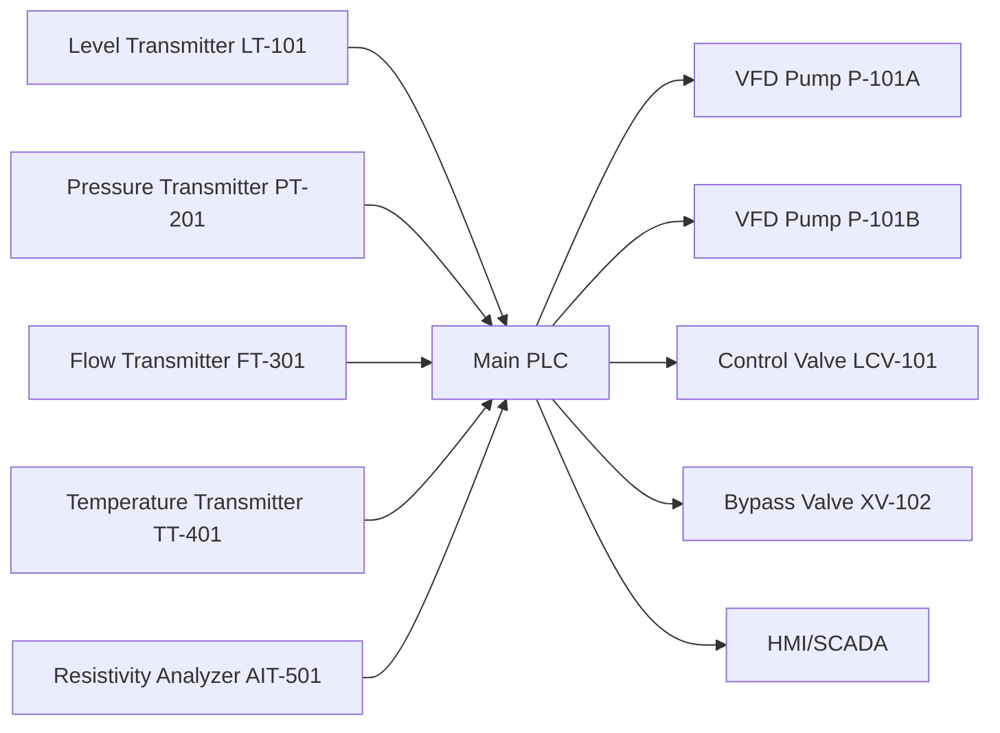
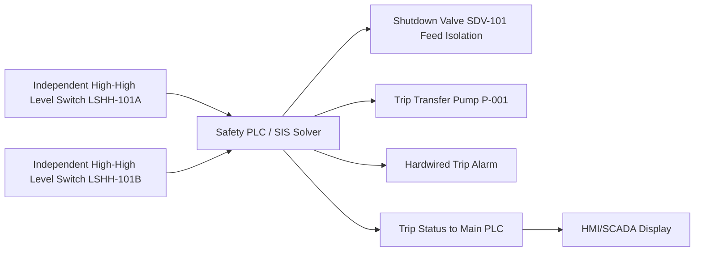
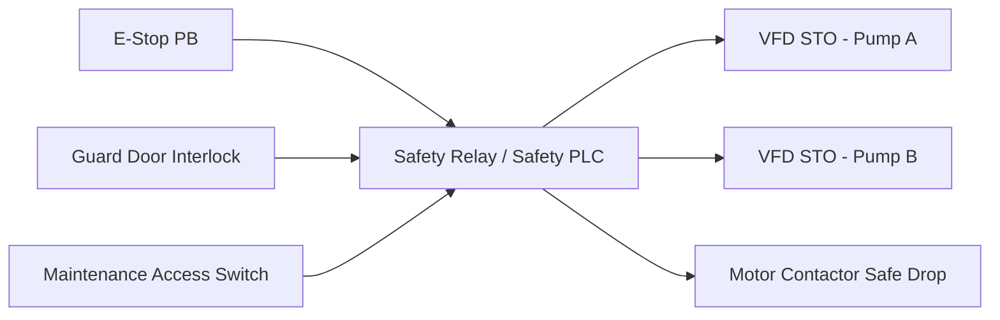
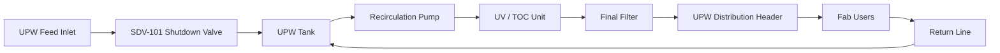
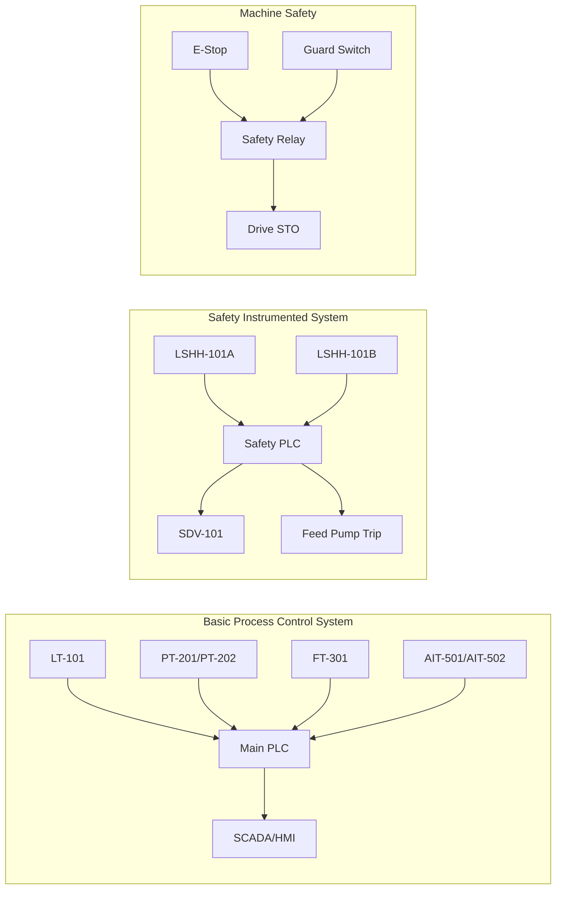
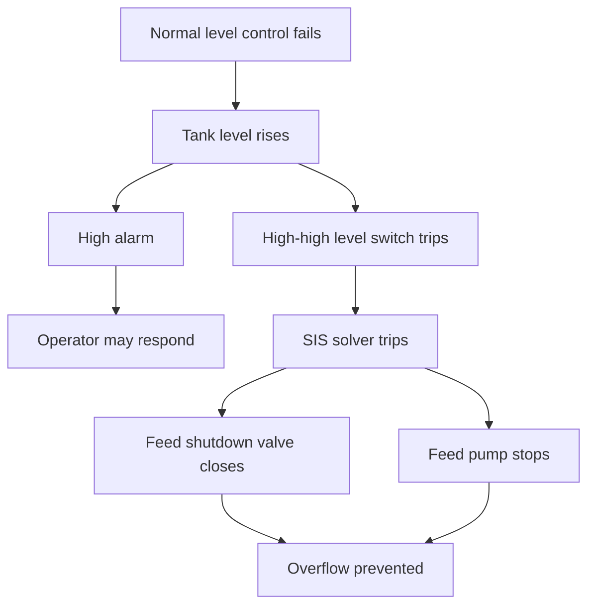
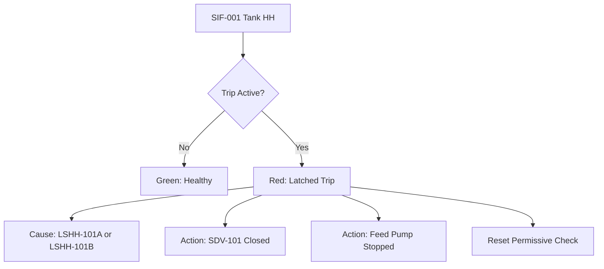
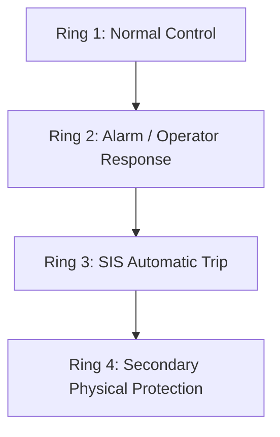
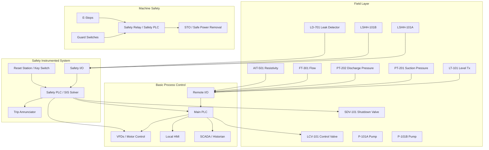
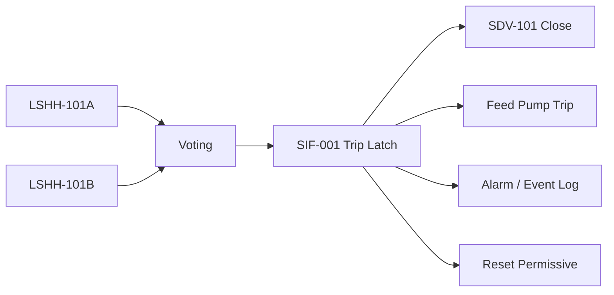

<!--
CONTENT_CLASS: RAG_APPROVED
AI_READ_ACCESS: ALLOWED
STATUS: DRAFT
-->

Below is a **worked scenario** for a **UPW system** showing:

* what the **regular control system** does
* what the **SIS** does
* what a **SIF** looks like
* what **components and sensors** are used
* how the **logic works**
* how this sits **on top of normal machine safety**
* several **visual layers** to make it easier to understand

This is a **conceptual engineering example**, not a certified design package. Real SIL assignment, device selection, trip setpoints, proof test intervals, and architecture must come from **HAZOP/LOPA, site standards, utility process requirements, and OEM data**.

---

# 1. Scenario: UPW Distribution and Storage Skid

Assume a semiconductor facility has a **UPW polishing and distribution system** with:

* incoming RO/EDI treated water
* UPW storage tank
* recirculation loop
* distribution pumps
* UV / TOC reduction unit
* final filters
* heat exchanger
* branch supply to fab users
* return line back to tank / loop

The system’s normal purpose is to deliver:

* very high purity water
* stable pressure
* stable flow
* stable temperature
* continuous recirculation
* no particle contamination
* no stagnant zones

---

# 2. Why UPW needs both normal control and safety control

A UPW skid is not usually “high hazard” like toxic gas or flammable solvent, but it can still create serious problems:

## Process risks

* tank overflow causing water damage
* pump deadhead / overpressure
* loss of circulation causing temperature drift or quality degradation
* dry running pump damage
* cross-contamination event
* branch header pressure excursion damaging downstream equipment
* chemical cleaning skid interface causing accidental misrouting

## Machine risks

* rotating pump shafts
* motor starters / VFD cabinets
* moving valve actuators
* maintenance access doors
* electrical shock
* lockout/tagout hazards

So you end up with **two protection domains**:

## A. Regular machine safety

This protects people from machinery hazards:

* E-stops
* cabinet door interlocks
* motor safe stop / STO
* maintenance lockout
* guard switches

## B. Process safety / SIS

This protects the process and facility from hazardous process states:

* tank high-high level trip
* pump low suction trip
* discharge overpressure trip
* overflow containment response
* critical quality diversion / isolation

That distinction is the same point from IEC 61511: **process SIS is separate from normal control and separate from machine safety logic**.  

---

# 3. First define the three layers

## Layer 1 — Basic Process Control System (BPCS)

This is the normal PLC/HMI/SCADA control:

* start/stop pumps
* maintain loop pressure
* maintain tank level
* regulate temperature
* switch duty/standby pumps
* monitor conductivity/resistivity, TOC, flow, pressure
* run alarms and trends

## Layer 2 — Machine safety

This is the safety relay / safety PLC / STO / E-stop layer:

* local emergency stop
* cabinet safety interlock
* maintenance access interlock
* motor STO
* safe shutdown for personnel protection

## Layer 3 — SIS / SIF

This is the independent process protection layer:

* separate sensors where needed
* separate logic solver
* separate trip path to final elements
* drives process to safe state when a hazardous process condition occurs

---

# 4. Example hazardous scenario for UPW

We need one scenario to build the example around.

## Scenario

**UPW storage tank inlet control valve fails open while outlet demand is low.**
The tank continues filling. Normal level control fails to stop it. If not stopped:

* tank overflows
* water floods utility area
* electrical cabinets may be affected
* contamination and facility downtime occur
* floor drain capacity may be exceeded

This is a good process-safety-style scenario.

---

# 5. Define the SIS and SIF for this scenario

## SIS

The **Safety Instrumented System** is the whole dedicated protection system for process trips in the UPW skid.

Example SIS for this skid may include:

* independent level switches/transmitters
* safety logic solver
* hardwired trip outputs
* shutdown valve(s)
* pump trip command
* trip alarm annunciation
* reset / bypass control with management rules

## SIF-001

One individual function inside that SIS:

### SIF-001 — UPW Tank High-High Level Shutdown

**Cause:** tank reaches dangerous high-high level
**Action:** close feed isolation valve and stop transfer pump
**Safe state:** no further water enters tank

That is one SIF.

---

# 6. Typical system architecture

## 6.1 Normal control architecture



This is the **BPCS**.

---

## 6.2 Process safety architecture with SIS



This is the **SIS path**, separate from the normal control path.

---

## 6.3 Machine safety architecture



This is **personnel/machine protection**, not the process SIS.

---

# 7. Components and sensors

Now make it concrete.

## 7.1 For normal process control

### Tank and level control

* **LT-101**: continuous radar or guided-wave level transmitter
* **LCV-101**: modulating inlet control valve
* **LSL-101**: low-level switch for pump protection
* **LSH-101**: high-level alarm switch

### Pump skid

* **P-101A / P-101B**: duty/standby recirculation pumps
* **VFD-A / VFD-B**: variable speed drives
* **PT-201**: suction pressure transmitter
* **PT-202**: discharge pressure transmitter
* **FT-301**: recirculation flow transmitter
* **TSH-401**: motor bearing or winding high temp switch
* **Vibration switch** if required

### Water quality

* **AIT-501**: resistivity/conductivity analyzer
* **AIT-502**: TOC analyzer
* **AIT-503**: dissolved oxygen or silica analyzer if used
* **DPIT-601**: differential pressure across final filter
* **TT-402**: loop temperature transmitter

### Valves

* modulating diaphragm valves
* pneumatically actuated isolation valves
* fail-closed or fail-last depending on design intent
* feedback limit switches: open/closed proof

---

## 7.2 For the SIS / SIF path

For **SIF-001 Tank High-High Level Shutdown**, use dedicated protective devices:

* **LSHH-101A**: independent high-high level switch
* **LSHH-101B**: second independent high-high level switch
* **SIS logic solver**: safety PLC or dedicated logic solver
* **SDV-101**: fail-closed feed shutdown valve
* **P-001 trip output**: de-energize transfer pump starter / VFD run permit
* **trip annunciator**
* **manual reset station**
* **bypass key switch** with strict procedural control if allowed

Possible architecture:

* **1oo2 sensing** for high-high trip voting
* **1oo1 final element** for shutdown valve
* pump trip in parallel for extra protection

---

## 7.3 For machine safety

* E-stop pushbuttons
* safety relay or machine safety PLC
* safety-rated door switches
* VFD STO channels
* lockable disconnect switches
* motor contactor feedback
* safety status indicators

---

# 8. Separation of duties: what each system is allowed to do

This is where many designs become messy.

## Main PLC/BPCS responsibilities

* maintain tank at normal operating level
* modulate LCV-101
* start/stop duty pump based on schedule and demand
* switch lead/lag pumps
* alarm on high level, low flow, low resistivity, high DP, etc.
* trend and log all data
* perform non-safety permissives

## SIS responsibilities

* monitor independent trip condition
* ignore normal control objectives
* execute trip to safe state
* latch trip
* require controlled reset
* provide trip status only, not depend on BPCS for action

## Machine safety responsibilities

* protect personnel from hazardous motion/energy
* force safe torque off or safe motor shutdown
* operate independently of operator software controls
* not be replaced by normal PLC logic

---

# 9. Control philosophy: normal operation vs abnormal protection

## 9.1 Normal operation

The PLC runs the UPW skid like this:

1. Tank level LT-101 reads current level
2. PLC modulates inlet valve LCV-101
3. Pumps maintain header pressure
4. Quality analyzers verify resistivity / TOC / temp
5. If one pump fails, standby pump starts
6. SCADA trends all process values

### Simple normal logic

* maintain tank level at 60%
* high alarm at 80%
* high-high trip setpoint at 92%
* low alarm at 25%
* low-low permissive stop at 10%

The key point: **normal level control uses LT-101 and LCV-101**.
The **trip function should not depend only on that same chain**.

---

## 9.2 Abnormal but non-SIS condition

Suppose level rises above normal high alarm but not yet dangerous.

BPCS actions:

* alarm operator
* command inlet valve closed
* maybe stop feed pump by normal PLC command
* log event

This is still **control/alarm layer**, not SIS.

---

## 9.3 Dangerous condition requiring SIF

Suppose:

* inlet control valve failed open
* PLC output failed
* operator did not respond
* level continues rising

At high-high level, **independent level switches** activate.

### SIF-001 action

When trip condition is satisfied:

* safety PLC trips
* SDV-101 de-energizes and closes
* transfer feed pump trips
* trip is latched
* alarm horn / beacon activates
* main PLC receives trip status
* operator sees “SIS TRIP: TANK HIGH-HIGH LEVEL”

This is the process safety layer.

---

# 10. Detailed SIF design example

## SIF-001 — UPW Tank High-High Level Shutdown

### Hazard

Overflow of UPW storage tank due to failure of normal level control

### Initiating causes

* inlet control valve fails open
* PLC analog output fails high
* wrong setpoint or software bug
* operator leaves manual mode open
* instrument drift / false low reading on normal LT

### SIF purpose

Prevent overflow by stopping further inflow

### Inputs

* LSHH-101A
* LSHH-101B

### Voting

* either 1oo2 or 2oo2 depending risk/availability philosophy

#### Option A: 1oo2

* trip if either switch trips
* safer against dangerous non-trip
* more nuisance trips

#### Option B: 2oo2

* both switches must agree
* fewer nuisance trips
* weaker fault tolerance for hidden failure

For water utility systems, many teams may choose **1oo2 or 1oo1D style thinking** if overflow consequence is mainly property/process damage, but final choice must come from risk study.

### Logic solver

* safety PLC with dedicated inputs/outputs
* separate power and I/O segmentation preferred

### Final elements

* SDV-101 fail-close feed isolation valve
* feed pump trip relay / VFD run permit removal

### Safe state

* inflow isolated
* pump stopped
* no restart until reset and condition normal

### Reset rule

Reset allowed only when:

* both level switches are normal
* operator performs reset locally or from secure HMI role
* cause reviewed
* bypass removed

---

# 11. Truth table for the SIF

Assume 1oo2 trip voting.

| LSHH-101A | LSHH-101B | SIS Action |
| --------- | --------: | ---------- |
| Normal    |    Normal | No trip    |
| Trip      |    Normal | Trip       |
| Normal    |      Trip | Trip       |
| Trip      |      Trip | Trip       |

If 2oo2 were used:

| LSHH-101A | LSHH-101B | SIS Action                 |
| --------- | --------: | -------------------------- |
| Normal    |    Normal | No trip                    |
| Trip      |    Normal | No trip, discrepancy alarm |
| Normal    |      Trip | No trip, discrepancy alarm |
| Trip      |      Trip | Trip                       |

---

# 12. Example pseudo-logic

## 12.1 BPCS normal level control

```text
IF AUTO_MODE = TRUE THEN
    LEVEL_PID controls LCV-101 to maintain Tank Level SP
END_IF

IF LT-101 >= HIGH_ALARM THEN
    Raise Alarm "Tank Level High"
END_IF

IF LT-101 >= HIGH_HIGH_WARN THEN
    Command LCV-101 = 0%
    Stop Feed Pump by normal control command
END_IF
```

This is **not the SIS**. This is normal control with alarm response.

---

## 12.2 SIS trip logic

```text
TRIP_CONDITION =
    (LSHH-101A = TRIPPED) OR (LSHH-101B = TRIPPED)

IF TRIP_CONDITION THEN
    DE_ENERGIZE SDV-101
    REMOVE RUN PERMIT TO FEED PUMP
    LATCH SIF-001_TRIP
    ACTIVATE HARDWIRED ALARM
END_IF

RESET_ALLOWED =
    (LSHH-101A = NORMAL) AND
    (LSHH-101B = NORMAL) AND
    (OPERATOR_RESET = TRUE) AND
    (NO_BYPASS_ACTIVE)

IF RESET_ALLOWED THEN
    CLEAR SIF-001_TRIP
END_IF
```

---

# 13. Add another SIF to show the system concept

One SIF is not enough to see the structure clearly. Here is a second realistic one.

## SIF-002 — Pump Low Suction / Dry Run Protection

### Hazard

Recirculation pump runs without adequate suction, causing:

* seal failure
* overheating
* cavitation
* loss of water quality / process interruption

### Inputs

* PSL-201A suction low pressure switch
* FSL-301A low flow switch
* LSL-101 tank low-low level switch

### Action

* stop pump
* close discharge valve if needed
* generate trip
* prevent auto-restart until reset

### Logic philosophy

Pump trip if:

* suction pressure too low for X seconds, or
* suction flow lost, or
* tank low-low level reached

This may be process protection but not always a formal SIS depending on consequence. Still, it shows how SIF thinking scales.

---

# 14. Visualization by layers

## Layered view 1 — Physical process layer



---

## Layered view 2 — Instrumentation layer


---

## Layered view 3 — Functional layer



---

## Layered view 4 — Cause and effect



---

# 15. How SIS sits on top of regular machine safety

This is a critical concept.

## Machine safety answers:

“How do I stop hazardous energy so a person is protected?”

Examples:

* E-stop pressed
* guard door opened
* maintenance mode entered

Typical action:

* VFD STO
* motor contactor drop
* actuator power removed

## SIS answers:

“How do I stop the process from entering a hazardous state?”

Examples:

* tank high-high
* pump low suction
* discharge overpressure
* quality diversion failure during contamination scenario

Typical action:

* shut isolation valve
* trip pump
* isolate branch
* divert to drain / reject loop if designed

## They can interact, but one should not casually replace the other

For example:

* Opening a maintenance guard door may stop the pump via machine safety.
* But machine safety alone does **not** replace a process overfill SIF.
* Likewise, a process high-high level trip does **not** automatically satisfy personnel safety requirements.

---

# 16. Recommended control-system structure

For a clean engineering design, structure it like this.

## Level 0 — Field devices

* transmitters
* switches
* analyzers
* valves
* motors
* VFDs

## Level 1 — Controllers

* main PLC for BPCS
* safety PLC / SIS solver
* machine safety relay / safety PLC

## Level 2 — Operations

* HMI
* SCADA
* historian
* alarm management
* maintenance diagnostics

## Level 3 — Engineering / reporting

* trends
* proof test records
* batch/event logs
* MOC records
* maintenance CMMS interface

---

# 17. Suggested sensor list for a robust UPW skid

## Tank

* 1 continuous level transmitter for control
* 1 high alarm switch
* 2 independent high-high switches for SIF
* 1 low-low level switch for pump protection
* optional leak detection in bund / containment

## Pumps

* suction pressure transmitter
* discharge pressure transmitter
* flow transmitter
* motor current / drive feedback
* winding temp or bearing temp switch
* vibration monitor if critical

## Water quality

* resistivity analyzer
* conductivity analyzer if on less pure side
* TOC analyzer
* temperature transmitter
* filter differential pressure
* optional particle counter in critical applications

## Valves

* valve position feedback
* solenoid healthy feedback if used
* air pressure low switch for pneumatic actuators

## Facility protection

* skid leak detector
* sump high level
* panel moisture detector if needed
* floor drain overflow monitoring in sensitive utility area

---

# 18. Example cause-and-effect matrix

| Condition           | BPCS Action                | SIS Action                        | Machine Safety Action     |
| ------------------- | -------------------------- | --------------------------------- | ------------------------- |
| Tank high           | Alarm, close control valve | None                              | None                      |
| Tank high-high      | Normal PLC may also react  | Trip feed valve + stop feed pump  | None                      |
| Pump suction low    | Alarm, stop by permissive  | Optional SIF if risk warrants     | None                      |
| Motor overtemp      | Alarm / controlled stop    | Optional depending design         | None                      |
| E-stop pressed      | PLC sees status only       | None unless integrated by design  | STO / safe motor shutdown |
| Guard door opened   | PLC sees status only       | None                              | STO / safe shutdown       |
| Quality out of spec | Alarm, divert/recirc       | Possible process trip if critical | None                      |

---

# 19. What the operator sees on the HMI

Visualization matters. Separate the displays by intent.

## Screen 1 — Process overview

Show:

* tank level
* recirculation flow
* header pressure
* temperature
* resistivity / TOC
* pump status
* valve positions

## Screen 2 — Safety overview

Show:

* SIS healthy / fault
* each SIF status
* bypass active / inactive
* last trip cause
* reset permissive
* proof test mode status

## Screen 3 — Machine safety overview

Show:

* E-stop chain healthy
* guard circuit healthy
* STO active / inactive
* local disconnect status

## Screen 4 — Cause/effect page

Show:

* trip input
* voted result
* final outputs commanded
* final device feedback
* latch/reset state

That separation helps operators and maintenance avoid confusing:

* alarms
* trips
* safety trips
* machine interlocks

---

# 20. Example HMI safety visualization concept



---

# 21. Proof test and maintenance visualization

Because IEC 61511 is lifecycle-driven, include maintenance visuals.

## Recommended maintenance dashboard

For each SIF show:

* SIF tag
* service description
* last proof test date
* next due date
* bypass status
* failed components
* trip history count
* valve stroke test status

Example:

| SIF     | Description             |  Last Test |   Next Due | Status  |
| ------- | ----------------------- | ---------: | ---------: | ------- |
| SIF-001 | Tank high-high shutdown | 2026-03-01 | 2026-09-01 | Healthy |
| SIF-002 | Pump low suction trip   | 2026-02-15 | 2026-08-15 | Healthy |

This is where the standard becomes operationally real, because overdue proof tests degrade the claimed protection performance. 

---

# 22. Practical implementation notes

## Device separation

Do not build a fake SIS by using:

* one normal PLC
* one normal level transmitter
* one shared power supply
* one shared network path
* then just adding a “trip bit”

That is not robust independence.

## Better practice

Use:

* independent high-high switches
* separate safety I/O or safety PLC
* hardwired trip path to final element where appropriate
* feedback confirmation from shutdown valve
* latched trip and controlled reset

## Final element design

For SIF-001, make the feed isolation valve:

* fail-close on loss of energy
* position monitored
* accessible for proof testing
* located where it truly isolates inflow

Because in many SIFs, the final element is the weak point.

---

# 23. Expanded scenario with three protection rings

A strong way to explain it is with concentric rings.



## Ring 1 — Normal control

* LT-101 controls inlet valve

## Ring 2 — Alarm / operator

* high level alarm
* operator intervention

## Ring 3 — SIS

* high-high independent switches
* safety trip valve closure and feed pump stop

## Ring 4 — passive backup

* overflow containment / bund
* floor drainage
* leak detection

This is classic layered protection thinking.

---

# 24. One complete narrative

Here is the scenario written as an engineering narrative.

## UPW Tank Overfill Protection Narrative

During normal operation, the UPW storage tank level is controlled by the main PLC using LT-101 and modulating control valve LCV-101 to maintain the tank at its normal operating setpoint. High level alarm LSH-101 warns the operator if the tank level rises above the normal operating range. The operator can view level trend, inlet valve command, and pump status on the HMI.

If the normal control loop fails due to inlet valve failure, PLC output failure, incorrect mode selection, or instrument error, the tank level may continue to rise. To prevent overflow, an independent SIS-based SIF is provided.

The SIF uses two independent high-high level switches, LSHH-101A and LSHH-101B, wired to a dedicated safety logic solver. Upon detection of the high-high level trip condition according to the selected voting logic, the safety logic solver shall de-energize shutdown valve SDV-101 causing it to fail closed, and shall simultaneously remove the run permit to the feed pump. The trip shall be latched. A hardwired trip alarm and HMI annunciation shall indicate the cause of trip. Restart shall not occur automatically. Manual reset shall only be permitted after the trip condition clears and the operator performs a controlled reset.

Machine safety functions such as emergency stop pushbuttons, guard interlocks, and VFD STO shall remain separate and shall protect personnel from hazardous energy during maintenance or emergency personnel conditions. These machine safety functions do not replace the process overfill SIF.

That is how the story should read.

---

# 25. Bottom line

For a UPW system, the clean design approach is:

## Normal control

Use the main PLC for:

* level control
* pressure control
* pump sequencing
* quality monitoring
* alarms and trends

## SIS

Use a separate protective layer for credible hazardous process scenarios such as:

* tank high-high overflow
* critical overpressure
* low suction / dry run where risk justifies it
* contamination isolation if the consequence is serious enough

## Machine safety

Use safety relays / safety PLC / STO for:

* E-stops
* access doors
* maintenance hazard protection

## Visualization

Present the system in four views:

* physical process flow
* instrumentation layer
* functional control layer
* cause/effect safety layer

That separation is what keeps the design understandable, maintainable, and defensible.

---

# 26. Starter tag list example

Here is a simple tag naming starter set.

## BPCS tags

* LT-101 Tank Level Transmitter
* LCV-101 Tank Inlet Control Valve
* PT-201 Pump Suction Pressure
* PT-202 Pump Discharge Pressure
* FT-301 Recirculation Flow
* AIT-501 Resistivity Analyzer
* AIT-502 TOC Analyzer
* P-101A Duty Pump
* P-101B Standby Pump

## SIS tags

* LSHH-101A Tank High-High Level Switch A
* LSHH-101B Tank High-High Level Switch B
* SDV-101 Feed Shutdown Valve
* SIF-001 Tank Overfill Shutdown
* SIF-002 Pump Dry Run Trip
* SIS-PLC-01 Safety Logic Solver

## Machine safety tags

* ES-001 Emergency Stop
* GS-001 Guard Switch
* STO-101A Pump A Safe Torque Off
* STO-101B Pump B Safe Torque Off

---

# 27. Recommended next step

The strongest next deliverable would be one of these:

1. a **formal SRS-style document** for the UPW SIFs
2. a **cause-and-effect matrix** for the entire UPW skid
3. a **PLC + SIS + machine safety architecture drawing** in panel/I/O style
4. a **semiconductor facility version** with bulk chemical distribution, reclaim, and drain interfaces

I recommend doing **#2 and #3 next**, because that turns this from concept into controls-engineering structure.

Good. I’ll extend it into the next practical layer: a **cause-and-effect matrix**, a **control architecture**, and a **more implementation-oriented control narrative**.

---

# 28. UPW Cause-and-Effect Matrix

This is the part that turns concept into an actual controls package.

## 28.1 Legend

* **A** = Alarm only
* **C** = Control action by BPCS
* **T** = Trip by SIS
* **MS** = Machine safety action
* **L** = Latched
* **R** = Manual reset required

---

## 28.2 Cause-and-effect table

| Cause / Condition                        | Detection Device(s)  | BPCS Action                                     | SIS Action                                     | Machine Safety Action     | Latch / Reset          |
| ---------------------------------------- | -------------------- | ----------------------------------------------- | ---------------------------------------------- | ------------------------- | ---------------------- |
| Tank high level                          | LT-101, LSH-101      | Alarm, close LCV-101, operator alert            | None                                           | None                      | No latch               |
| Tank high-high level                     | LSHH-101A, LSHH-101B | Display trip status                             | Close SDV-101, stop feed pump                  | None                      | Latched, manual reset  |
| Tank low-low level                       | LSL-101              | Stop recirc pump by permissive, alarm           | Optional SIF if risk requires                  | None                      | Usually latched        |
| Pump suction low                         | PT-201 / PSL-201     | Alarm, stop affected pump                       | Optional SIF if dry-run is critical            | None                      | Manual reset preferred |
| Pump discharge high-high                 | PT-202 / PSHH-202    | Alarm, reduce speed, open recycle if configured | Trip pump, isolate discharge if required       | None                      | Latched                |
| Recirculation flow low                   | FT-301 / FSL-301     | Alarm, auto-start standby pump                  | Optional                                       | None                      | Depends on philosophy  |
| Filter DP high                           | DPIT-601             | Alarm, maintenance request                      | None                                           | None                      | No latch               |
| Resistivity out of spec                  | AIT-501              | Alarm, divert / block distribution              | Optional isolation if product risk is critical | None                      | Usually operator reset |
| Leak detected in skid bund               | LD-701               | Alarm, stop nonessential equipment              | Stop feed source, isolate skid                 | None                      | Latched                |
| E-stop pressed                           | ES-001               | PLC receives status only                        | None unless specifically cross-linked          | STO / safe motor shutdown | Latched                |
| Guard door open                          | GS-001               | PLC receives status only                        | None                                           | STO / safe access state   | Latched or maintained  |
| Loss of air to fail-close valve actuator | PSL-AIR-101          | Alarm                                           | Depending on design, valve fails closed        | None                      | Depends                |
| Safety PLC fault                         | SIS diagnostics      | Alarm to HMI/SCADA                              | Drive outputs to defined safe state            | None                      | Manual intervention    |

---

# 29. Minimum recommended SIF set for a UPW skid

For a basic but defensible design, I would define these as candidate SIFs for risk review.

## SIF-001 — Tank High-High Level Shutdown

**Purpose:** prevent overflow
**Action:** close feed SDV, stop feed pump

## SIF-002 — Pump Discharge Overpressure Shutdown

**Purpose:** protect piping / skid from damaging overpressure
**Action:** stop pump, close discharge isolation or open relief/recycle path depending design

## SIF-003 — Skid Leak / Bund High Level Isolation

**Purpose:** stop feeding water into a leaking skid area
**Action:** isolate source, stop pumps, alarm

## SIF-004 — Critical Quality Isolation

**Purpose:** prevent bad UPW from reaching process tools if a critical contamination condition is detected
**Action:** divert return, isolate supply header, alarm

Not every UPW skid will need all four as formal IEC 61511 SIFs. That depends on the risk study. The standard logic still applies: define the hazard, determine whether a SIF is needed, then calculate whether the design achieves the required performance.  

---

# 30. Recommended control architecture

Now let’s structure the system the way a controls engineer would actually draw it.

## 30.1 Architecture overview



---

## 30.2 Separation rule

A clean design rule is:

### BPCS path

* modulates
* optimizes
* alarms
* sequences
* logs

### SIS path

* detects dangerous process condition
* trips to safe state
* latches
* requires reset
* does not rely on HMI or normal PLC scan for primary protection

### Machine safety path

* protects people
* hard stops hazardous motion/energy
* should remain valid even if process control software is wrong

That separation is exactly the principle behind IEC 61511 process SIS versus machinery safety frameworks. 

---

# 31. Component selection by function

## 31.1 Sensors for BPCS

These are for continuous control and monitoring.

### Tank / vessel

* guided-wave radar level transmitter or hygienic pressure level transmitter
* high level switch
* low-low level switch

### Pump hydraulic protection

* suction pressure transmitter
* discharge pressure transmitter
* magnetic flowmeter or ultrasonic flowmeter
* differential pressure across filter

### Quality

* resistivity analyzer
* TOC analyzer
* temperature transmitter
* optional dissolved oxygen / silica / particle monitor

### Utilities

* pneumatic supply low pressure switch
* cabinet temperature switch
* leak detector in skid bund

---

## 31.2 Sensors for SIS

These should be chosen for independence and functional reliability.

### For SIF-001 Tank High-High

* 2 independent point level switches
* mounted at verified trip elevation
* separate wiring to safety I/O
* separate calibration / proof test procedure

### For SIF-002 Overpressure

* 1 or 2 pressure switches/transmitters depending risk and voting
* hard trip setpoint independent from normal pressure control loop

### For SIF-003 Leak isolation

* leak rope or point leak sensor in bund/sump
* optional sump high-high switch

### For critical quality isolation

* this one is harder, because some analyzers are slow and not always appropriate as a primary SIS initiating device
* often better handled by quality interlock / reject logic unless risk study clearly pushes it into formal SIS territory

---

## 31.3 Final elements

This is where most SIF designs become weak in practice.

The uploaded standard summary correctly notes that **final elements often dominate PFDavg** and are hard to test. 

For UPW SIFs, final elements typically include:

* fail-close feed isolation valve
* pump trip contact / run permit removal
* motor starter de-energization
* recycle/divert valve
* branch isolation valve

### Good final element design rules

* fail-safe position must match hazard
* position feedback should be monitored
* actuator loss-of-air behavior must be known
* proof test must be possible without heroic shutdown effort
* trip path should not depend on nonessential network messaging

---

# 32. Example I/O list

## 32.1 BPCS I/O

| Tag        | Description                  | Type  | PLC Use                      |
| ---------- | ---------------------------- | ----- | ---------------------------- |
| LT-101     | Tank level transmitter       | AI    | PID control                  |
| PT-201     | Pump suction pressure        | AI    | permissive / alarm           |
| PT-202     | Pump discharge pressure      | AI    | control / alarm              |
| FT-301     | Recirc flow                  | AI    | monitoring / low flow action |
| AIT-501    | Resistivity                  | AI    | quality alarm                |
| DPIT-601   | Filter differential pressure | AI    | maintenance alarm            |
| LCV-101    | Inlet control valve          | AO/DO | level control                |
| P-101A_RUN | Pump A run cmd               | DO    | sequencing                   |
| P-101B_RUN | Pump B run cmd               | DO    | sequencing                   |

## 32.2 SIS I/O

| Tag            | Description                   | Type | SIS Use                |
| -------------- | ----------------------------- | ---- | ---------------------- |
| LSHH-101A      | Tank HH switch A              | DI   | SIF-001                |
| LSHH-101B      | Tank HH switch B              | DI   | SIF-001                |
| LD-701         | Leak detector                 | DI   | SIF-003                |
| PSHH-202       | Discharge overpressure switch | DI   | SIF-002                |
| SDV-101_TRIP   | Feed SDV trip output          | DO   | de-energize to close   |
| FEED_PUMP_TRIP | Feed pump trip                | DO   | remove run permit      |
| SIF_RESET      | Reset pb/key                  | DI   | reset logic            |
| SIF_BYPASS     | Bypass key status             | DI   | maintenance management |

## 32.3 Machine safety I/O

| Tag    | Description  | Type      | Safety Use        |
| ------ | ------------ | --------- | ----------------- |
| ES-001 | E-stop loop  | Safety DI | personnel stop    |
| GS-001 | Guard switch | Safety DI | access protection |
| STO-A  | Pump A STO   | Safety DO | safe torque off   |
| STO-B  | Pump B STO   | Safety DO | safe torque off   |

---

# 33. Detailed control narrative

## 33.1 Normal sequence

### Startup

1. Verify no active SIS trip
2. Verify machine safety chain healthy
3. Verify tank level above minimum
4. Open required manual block valves
5. Start duty pump
6. Ramp VFD to maintain recirculation pressure
7. Enable inlet level control
8. Begin trending and alarm monitoring

### Normal operation

* LT-101 controls LCV-101 to maintain tank level
* PT-202 and FT-301 supervise pump performance
* standby pump auto-starts on duty pump fault
* AIT-501 resistivity alarms if quality degrades
* DPIT-601 alarms for filter fouling

---

## 33.2 Abnormal non-SIS logic

### Tank high

If LT-101 > High Alarm:

* alarm operator
* drive LCV-101 toward closed
* hold feed permissive false if level continues rising
* log event

### Low flow

If FT-301 < Low Flow for 5 seconds:

* alarm
* attempt standby pump start
* stop failed duty pump
* maintain service if possible

### Quality degraded

If resistivity out of range:

* alarm
* optionally divert return or isolate supply branch by process interlock
* require operator acknowledgement

---

## 33.3 SIS logic narrative

## SIF-001 Tank High-High Shutdown

### Initiating condition

Either or both LSHH switches reach trip state, according to selected voting

### Action

* de-energize SDV-101
* remove feed pump run permit
* latch trip bit
* annunciate horn/beacon
* send trip status to PLC/HMI/SCADA
* inhibit auto-restart

### Reset conditions

* both switches normal
* SDV feedback confirms capable state
* no active bypass
* operator reset performed
* optional supervisor authorization if site requires

---

## SIF-002 Discharge Overpressure

### Initiating condition

PSHH-202 active beyond debounce delay

### Action

* stop affected pump
* close or hold discharge valve as defined
* open recycle if that is the safer hydraulic relief path
* latch trip
* annunciate cause

### Notes

Do not design conflicting actions. For example, stopping pump and simultaneously forcing a hydraulic configuration that spikes trapped pressure is poor design. The cause/effect must reflect real piping behavior.

---

## SIF-003 Leak Isolation

### Initiating condition

Leak detector or sump high-high switch active

### Action

* isolate feed
* stop nonessential pumps
* alarm locally and to SCADA
* latch until inspected and reset

---

# 34. Voting examples

## 34.1 Tank HH voting

### Option 1 — 1oo2

Trip if either LSHH-101A or LSHH-101B trips.

**Advantages**

* stronger protection against missed trip
* simple

**Disadvantages**

* more nuisance trips

### Option 2 — 2oo2

Trip only if both switches trip.

**Advantages**

* fewer nuisance trips

**Disadvantages**

* weaker tolerance against hidden failure or calibration error

For a UPW overflow scenario, choice depends on:

* consequence of overflow
* cost of nuisance shutdown
* switch reliability
* testing discipline
* required risk reduction

---

## 34.2 Pump overpressure voting

Often this is simpler:

* one independent hard trip switch
* one pressure transmitter for monitoring/alarm
* relief path as passive layer if applicable

This can be more practical than overcomplicated voting on a modest utility skid.

---

# 35. Operator graphics structure

You asked for layers of visualization, so here is how I would build the HMI.

## 35.1 Screen A — Process overview

Shows:

* tank with animated level
* pump A/B status
* header pressure
* flow
* resistivity
* key valve positions
* alarm banner

## 35.2 Screen B — Safety overview

Shows:

* SIS healthy/faulted
* each SIF as a box: Healthy / Bypassed / Tripped / Faulted
* trip cause
* reset permissive
* proof test mode status

## 35.3 Screen C — Machine safety overview

Shows:

* E-stop healthy
* guard circuit healthy
* STO active/inactive
* maintenance access status

## 35.4 Screen D — Cause/effect screen

Shows one SIF at a time:



## 35.5 Screen E — Maintenance / proof test

Shows:

* last proof test date
* next due date
* bypass status
* stroke test results
* failure history

That matters because proof testing is what maintains the claimed protective performance over time. 

---

# 36. Recommended alarm and trip philosophy

Do not mix alarms and trips casually.

## Alarm

“Initiate operator attention.”

Examples:

* filter DP high
* resistivity drifting low
* pump current high
* tank level high

## Trip

“Automatic protective action required.”

Examples:

* tank high-high
* leak detected
* discharge overpressure
* dry run condition if hazard warrants

## Machine safety event

“Personnel protection function activated.”

Examples:

* E-stop
* guard opened
* STO active

On the HMI, use separate visual categories for these three. Otherwise operators will treat everything as just another alarm.

---

# 37. Practical panel and network structure

## 37.1 Panels

A clean setup is:

* **CP-01 Main Control Panel**

  * main PLC
  * standard I/O
  * managed industrial Ethernet
  * HMI / SCADA gateway

* **SP-01 Safety / SIS Panel**

  * safety PLC / safety relay system
  * segregated power
  * trip relays
  * annunciator
  * reset/bypass controls

* **MCC/VFD section**

  * pump drives
  * STO terminals
  * contactors where required

## 37.2 Networks

* BPCS on standard control Ethernet
* SIS should not depend on the general SCADA network for its primary trip action
* SCADA can read status from SIS through defined interface
* avoid designs where the SIF exists only as a software tag over Ethernet

---

# 38. One-page design philosophy

Here is the short design philosophy statement.

## UPW Control and Safety Philosophy

The UPW skid shall use a layered protection architecture consisting of:

1. a Basic Process Control System for normal operation and optimization,
2. a separate process safety layer for defined hazardous process conditions,
3. a separate machine safety layer for personnel protection.

The BPCS shall perform continuous control of tank level, recirculation pressure, flow, and water quality monitoring. The SIS shall provide independent automatic trips for selected hazardous scenarios such as tank overfill, skid leak, and pump overpressure. Machine safety functions such as emergency stop and access interlocks shall remain independent and shall not be replaced by process PLC logic.

That is the right conceptual foundation.

---

# 39. What usually goes wrong in the field

These are the weak points.

## Bad pattern 1

Using one level transmitter for both PID control and formal SIF trip with no real independence.

## Bad pattern 2

Using HMI or SCADA scripting as part of the primary trip action.

## Bad pattern 3

No valve position feedback on the shutdown valve.

## Bad pattern 4

No clear reset policy, so operators keep cycling trips blindly.

## Bad pattern 5

No proof test planning, so the “SIS” exists only on paper.

## Bad pattern 6

Confusing machine E-stop architecture with process SIS architecture.

The uploaded IEC 61511 summary explicitly warns against mixing domains and against treating the design basis casually.  

---

# 40. Next engineering deliverables

The strongest next items are:

## A. SRS sheet for each SIF

For each SIF:

* tag
* hazard
* initiating causes
* trip condition
* voting
* safe state
* final elements
* reset method
* proof test interval
* bypass rules

## B. Full I/O marshalling table

* terminal numbers
* card/channel
* signal type
* fail state
* cable type
* JB location

## C. P&ID annotation layer

* mark BPCS instruments
* mark SIS instruments
* mark machine safety points
* mark final elements and safe state

## D. PLC state logic

* AUTO / MANUAL / MAINT / TEST / TRIP / RESET states
* interlocks
* sequence table

The next best move is **A + C** because that turns this into a real engineering package.

I can write the next section as a **formal SIF/SRS datasheet pack for SIF-001 through SIF-003**.
