# Standards Atlas — Diagram Reference Pack

**AI_READ_ACCESS: ALLOWED**

This file collects the core diagrams for the Control System Standards Atlas project.

Use these as source diagrams for the site, docs, or future SVG redraws.

---

## 1. Platform Information Architecture

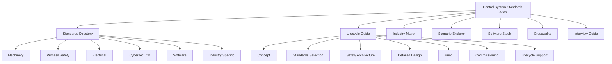

---

## 2. Directory Navigation Model

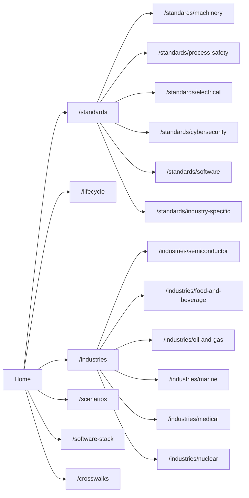

---

## 3. Standards Relationship Graph

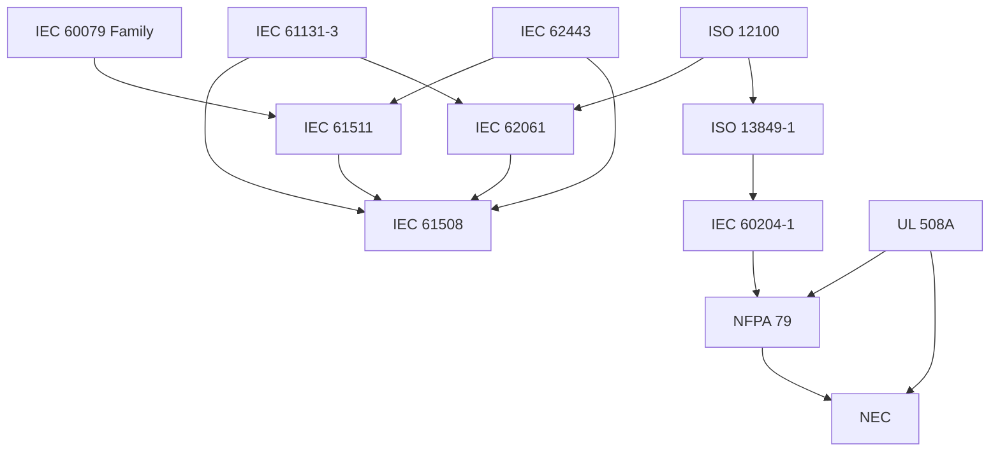

---

## 4. Machinery vs Process Safety Routing

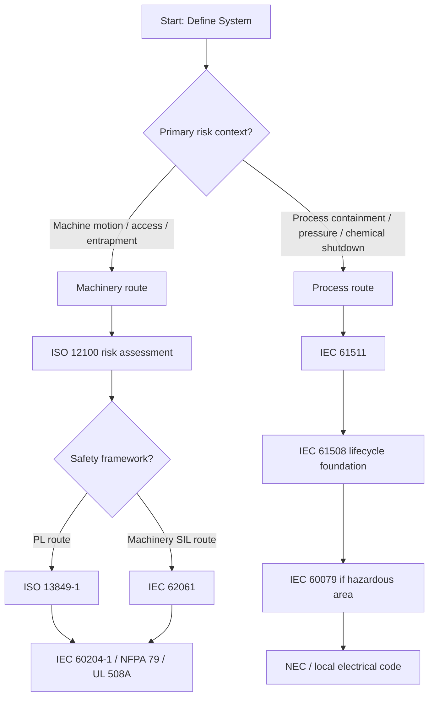

---

## 5. SIL vs PL Concept Map

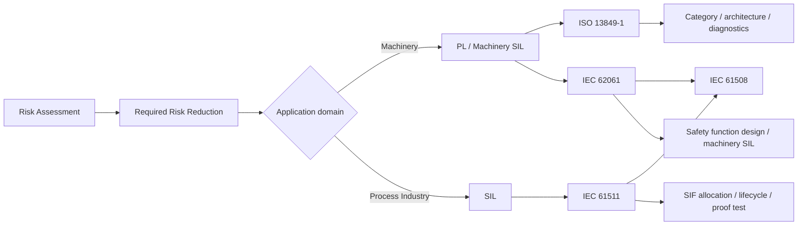

---

## 6. Control System Lifecycle with Standards Overlay

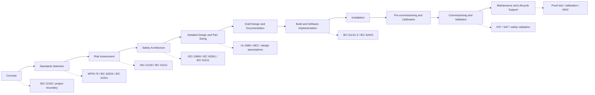

---

## 7. Lifecycle Deliverables Map

```mermaid
graph TD
    A[Concept] --> A1[System description]
    A --> A2[Operating assumptions]
    A --> A3[Boundary definition]

    B[Risk Assessment] --> B1[Hazard list]
    B --> B2[Risk evaluation]
    B --> B3[Safe state definition]

    C[Safety Architecture] --> C1[Safety function register]
    C --> C2[PLr or SIL target]
    C --> C3[Architecture concept]

    D[Detailed Design] --> D1[Device list]
    D --> D2[I/O list]
    D --> D3[Panel BOM]
    D --> D4[Cable and network architecture]

    E[Drafting] --> E1[Schematics]
    E --> E2[P&ID]
    E --> E3[Cause and effect]
    E --> E4[Loop drawings]

    F[Commissioning] --> F1[Loop checks]
    F --> F2[Calibration sheets]
    F --> F3[FAT / SAT]
    F --> F4[Validation report]

    G[Lifecycle Support] --> G1[Proof-test procedures]
    G --> G2[PM checklists]
    G --> G3[MOC records]
    G --> G4[Revision history]
```

---

## 8. 7-Layer Industrial Machine Architecture

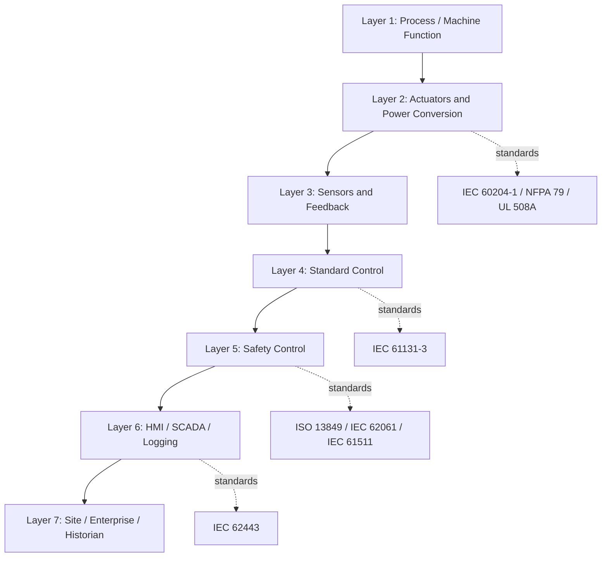

---

## 9. Standard Control vs Safety Control Separation

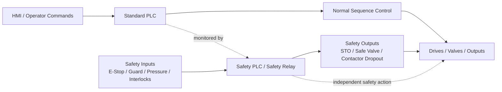

---

## 10. Safety Function Chain

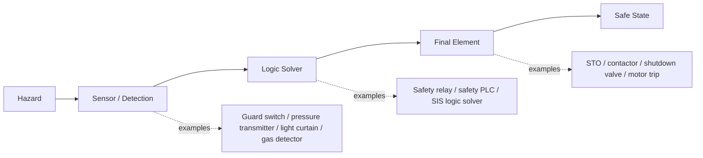

---

## 11. Machinery Safety Function Example

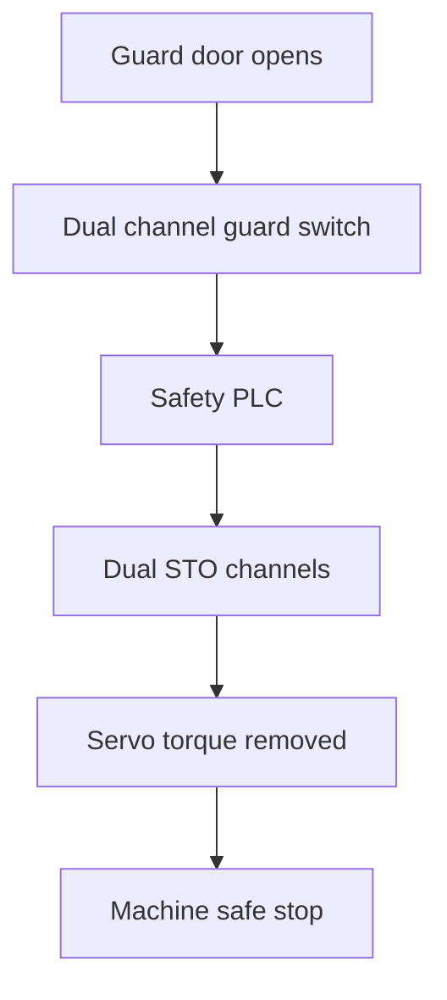

---

## 12. Process Shutdown Function Example

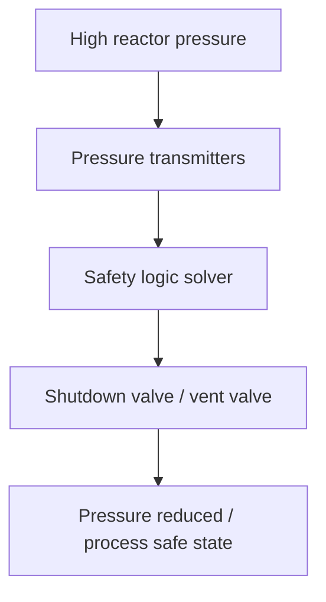

---

## 13. 1oo1, 1oo2, and 2oo3 Architecture Comparison

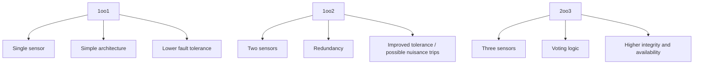

---

## 14. Detailed Design and Part Sizing Logic

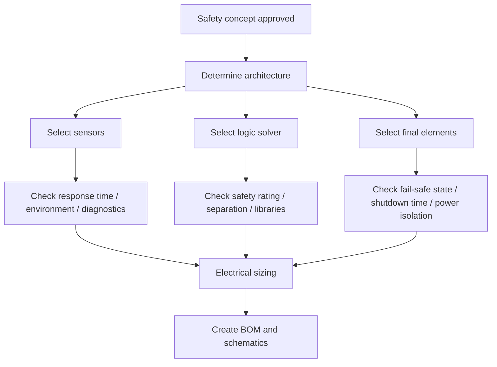

---

## 15. Electrical Design Standards Route

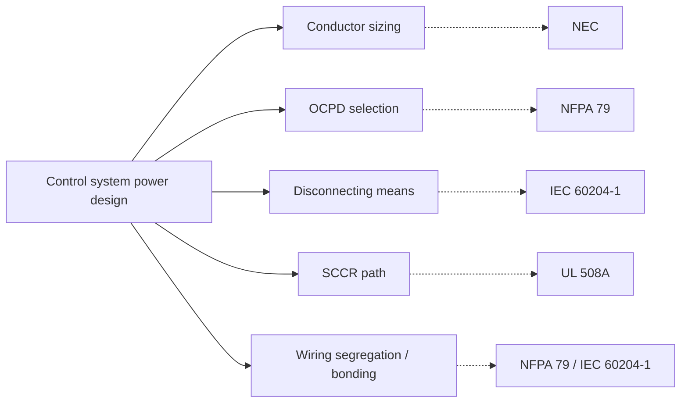

---

## 16. Draft Design Documentation Stack

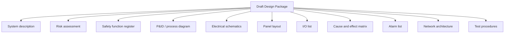

---

## 17. Software Stack Architecture

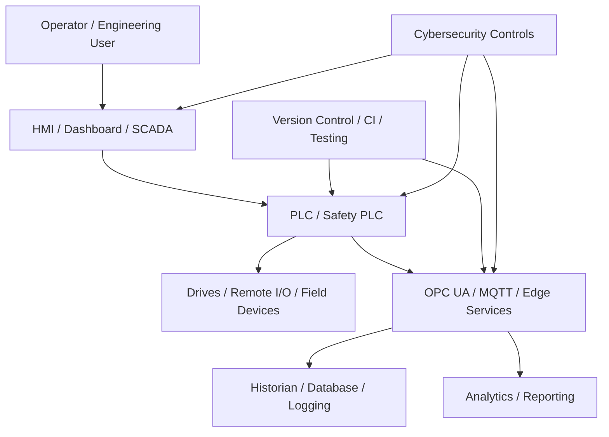

---

## 18. Cybersecurity Overlay for Controls

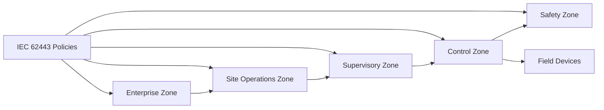

---

## 19. Installation and Pre-Commissioning Workflow

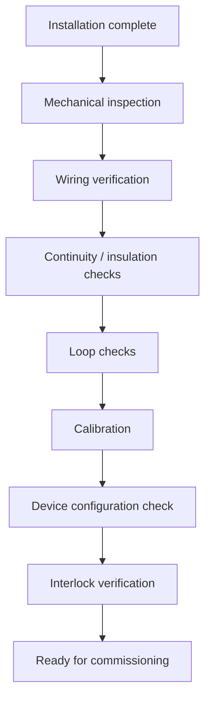

---

## 20. Calibration Workflow

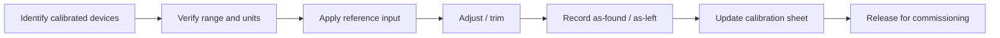

---

## 21. Commissioning and Validation Workflow

```mermaid
flowchart TD
    A[Pre-commissioning complete] --> B[Power-up checks]
    B --> C[Functional sequence checks]
    C --> D[Alarm verification]
    D --> E[Safety interlock tests]
    E --> F[Stop time / shutdown tests]
    F --> G[FAT / SAT closeout]
    G --> H[Validation report]
    H --> I[Operational handover]
```

---

## 22. Maintenance and Lifecycle Support Loop

```mermaid
flowchart LR
    A[Operate system] --> B[Preventive maintenance]
    B --> C[Proof testing]
    C --> D[Recalibration]
    D --> E[Review diagnostics / alarms]
    E --> F[Manage changes / MOC]
    F --> G[Update drawings / software revisions]
    G --> H[Spare parts / obsolescence review]
    H --> A
```

---

## 23. Industry Standards Matrix Navigator

```mermaid
graph TD
    A[Industry Matrix] --> B[Semiconductor]
    A --> C[Food and Beverage]
    A --> D[Warehouse Automation]
    A --> E[Medical]
    A --> F[Energy and Power]
    A --> G[Oil and Gas]
    A --> H[Marine]
    A --> I[Nuclear]
    A --> J[Agriculture]

    B --> B1[ISO 12100 / ISO 13849 / IEC 60204 / SEMI]
    C --> C1[ISO 12100 / ISO 13849 / IEC 60204 / hygiene constraints]
    D --> D1[ISO 12100 / ISO 13849 / NFPA 79]
    E --> E1[Medical-specific frameworks]
    F --> F1[IEC 61508 / IEC 62443]
    G --> G1[IEC 61511 / IEC 61508 / IEC 60079]
    H --> H1[Marine electrical and safety frameworks]
    I --> I1[Nuclear-specific frameworks]
    J --> J1[ISO 12100 / agriculture-specific safety frameworks]
```

---

## 24. Semiconductor Standards Route Example

```mermaid
flowchart TD
    A[Semiconductor equipment concept] --> B[ISO 12100]
    B --> C[ISO 13849-1]
    C --> D[IEC 60204-1]
    D --> E[SEMI S2 / related SEMI requirements]
    E --> F[IEC 62443]
    F --> G[Scenario and validation documents]
```

---

## 25. US Industrial Control Panel Route Example

```mermaid
flowchart TD
    A[US industrial control panel] --> B[NEC]
    A --> C[NFPA 79]
    A --> D[UL 508A]
    C --> E[Machine electrical requirements]
    D --> F[Panel construction / SCCR]
    B --> G[Installation code path]
    E --> H[Panel documentation and testing]
    F --> H
    G --> H
```

---

## 26. Global Machine Route Example (US + EU)

```mermaid
flowchart TD
    A[Global machine project] --> B[ISO 12100]
    B --> C{Safety route}
    C --> D[ISO 13849-1]
    C --> E[IEC 62061]
    D --> F[IEC 60204-1]
    E --> F
    F --> G[US adaptation: NFPA 79 / UL 508A / NEC]
    G --> H[Common design core + regional compliance overlays]
```

---

## 27. Chemical / Process Skid Route Example

```mermaid
flowchart TD
    A[Chemical dosing or process skid] --> B[Hazard and risk review]
    B --> C[IEC 61511]
    C --> D[IEC 61508]
    D --> E{Hazardous area?}
    E -->|Yes| F[IEC 60079 family]
    E -->|No| G[Standard industrial installation]
    F --> H[Shutdown logic / SIS / loop design]
    G --> H
    H --> I[Proof test and lifecycle support]
```

---

## 28. Safety PLC Software + Networked Control + Cybersecurity Scenario

```mermaid
graph TD
    A[Safety PLC application] --> B[Safety inputs and interlocks]
    A --> C[Standard PLC and HMI]
    A --> D[Industrial network]
    D --> E[Remote I/O / drives]
    D --> F[Historian / edge services]

    G[IEC 61131-3] --> C
    H[IEC 62443] --> D
    I[ISO 13849 / IEC 62061 / IEC 61511] --> A
    J[Validation and change control] --> A
    J --> C
    J --> D
```

---

## 29. Scenario Explorer Model

```mermaid
graph TD
    A[Scenario Explorer] --> B[Robotic Cell]
    A --> C[Conveyor / Sorter]
    A --> D[Chemical Dosing Skid]
    A --> E[Hydraulic Machine]
    A --> F[Semiconductor Tool]
    A --> G[Food Processing Machine]
    A --> H[Offshore Process Skid]

    B --> X[Lifecycle + standards + software stack]
    C --> X
    D --> X
    E --> X
    F --> X
    G --> X
    H --> X
```

---

## 30. Interview Answer Logic: How I Choose Standards

```mermaid
flowchart TD
    A[Define machine or process boundary] --> B[Identify hazards and safe state]
    B --> C{Machinery or process?}
    C -->|Machinery| D[ISO 12100]
    C -->|Process| E[IEC 61511]
    D --> F{PL or machinery SIL route?}
    F --> G[ISO 13849-1]
    F --> H[IEC 62061]
    E --> I[IEC 61508 foundation]
    G --> J[Electrical implementation]
    H --> J
    I --> J
    J --> K[NEC / NFPA 79 / UL 508A / IEC 60204-1]
    K --> L[Software / cybersecurity / validation / lifecycle support]
```

---

## 31. Repository-to-Website Content Flow

```mermaid
graph LR
    A[Repository Source Docs] --> B[Standards Pages]
    A --> C[Lifecycle Pages]
    A --> D[Industry Pages]
    A --> E[Scenario Pages]
    A --> F[Crosswalk Pages]

    B --> G[Website Navigation]
    C --> G
    D --> G
    E --> G
    F --> G
```

---

## 32. Trust Boundary Diagram

```mermaid
graph TD
    A[Website Overview Layer] --> B[Paraphrased guidance]
    A --> C[Navigation and routing]
    A --> D[Scenario learning]

    E[Repository Detail Layer] --> F[Deeper technical source material]
    E --> G[Reference models]
    E --> H[Crosswalk notes]

    I[Purchased / official standards] --> J[Authoritative clause-level requirements]

    A -. does not replace .-> I
    E -. does not replace .-> I
```

---

## 33. MVP vs Phase 2 Expansion Map

```mermaid
graph TD
    A[MVP] --> B[Home]
    A --> C[Standards Directory]
    A --> D[Lifecycle Guide]
    A --> E[Industry Matrix]
    A --> F[Scenario Explorer]
    A --> G[Crosswalks]

    H[Phase 2] --> I[Interactive graph]
    H --> J[Search and filters]
    H --> K[Linked standards cards]
    H --> L[Printable diagrams]
    H --> M[Interview answer mode]
    H --> N[Scenario comparison mode]
```

---

## 34. Recommended Diagram Priority

```mermaid
graph TD
    A[Priority 1] --> A1[Lifecycle flow]
    A --> A2[Standards relationship graph]
    A --> A3[Machinery vs process routing]
    A --> A4[7-layer architecture]
    A --> A5[Control vs safety separation]

    B[Priority 2] --> B1[Industry matrix navigator]
    B --> B2[Scenario explorer]
    B --> B3[Software stack architecture]
    B --> B4[Commissioning workflow]
    B --> B5[Maintenance loop]
```
