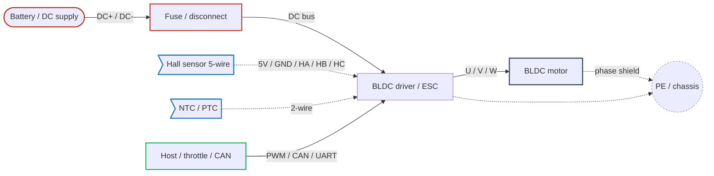

<!--
CONTENT_CLASS: RAG_APPROVED
AI_READ_ACCESS: ALLOWED
STATUS: DRAFT

MODULE_FAMILY: ELECTRICAL_MACHINES
MODULE_ID: bldc_motor_reference
LEARNING_LEVEL: intermediate

INDEX_TAGS:
  topics: ["bldc", "brushless_dc", "commutation", "inverter", "pwm", "hall_sensor", "back_emf", "torque_constant", "motor_control", "feedback"]
  systems: ["motor_drive", "machine", "servo"]
-->

# BLDC Motor Reference

## 0. Purpose

This module is a deep single-family reference on brushless DC (BLDC) motors: what they are physically, how they are commutated, how the drive stack (inverter, gate driver, MCU) is structured, what feedback options exist and when each is the right choice, how the wiring groups break down, and which electrical specifications actually matter when selecting or diagnosing a BLDC system. It is intended for readers who already understand DC motor basics and need to move into brushless, sensored/sensorless commutation, and inverter-driven operation.

# 1. What a BLDC Motor Really Is

A **BLDC motor** is a **3-phase permanent magnet motor** whose rotor has magnets and whose stator has windings.
It is called “brushless DC” because:

- there are **no brushes**
- the input power source is often a **DC bus**
- commutation is done **electronically** instead of mechanically

### Important correction

A BLDC motor is not “just a DC motor without brushes.”

In practice it behaves much more like a **3-phase synchronous motor** driven by an inverter.

---

## Internal Structure

### Rotor

- Permanent magnets
- Usually surface-mounted or interior magnets
- Number of poles matters a lot

### Stator

- Laminated core
- 3-phase windings: U, V, W
- Winding connection:
  - Wye (star)
  - Delta

### Electronic Commutation

The driver energizes the phases in sequence to keep the stator magnetic field pulling or pushing the rotor magnets.

---

# 2. BLDC vs PMSM

This matters because many people mix them up.

## BLDC

Usually refers to:

- trapezoidal back-EMF
- 6-step commutation
- Hall-sensor-based commutation or sensorless zero-crossing

## PMSM

Usually refers to:

- sinusoidal back-EMF
- sinusoidal current control
- FOC / vector control

## Reality

The motor hardware may be physically very similar.
The difference is often in:

- back-EMF shape
- controller strategy
- smoothness requirement
- cost and performance target

A lot of modern “BLDC” systems are really **PMSM-style control systems** in practice.

---

# 3. Operating Principle

The controller energizes phases to create a rotating stator magnetic field.
The rotor magnets try to align with that field.
Torque is produced from the angle difference between stator field and rotor field.

### Core idea

- Rotor position must be known or estimated
- Phase currents must be applied in the correct sequence
- Timing is everything

If commutation is wrong:

- noise increases
- torque drops
- heating increases
- current spikes
- startup may fail

---

# 4. Control Modes

There are several levels of control sophistication.

## A. Open-loop commutation

Used in some simple applications.

- Fixed commutation sequence
- Limited starting robustness
- Poor load disturbance handling

Usually not enough for demanding systems.

---

## B. 6-step trapezoidal commutation

Classic BLDC control.

### How it works

At any instant:

- one phase is driven high
- one phase is driven low
- one phase is floating

This creates 6 commutation states per electrical cycle.

### Benefits

- Simple
- Low cost
- Common in pumps, fans, simple motion systems

### Drawbacks

- Torque ripple
- More acoustic noise
- Less smooth low-speed operation
- Less precise than vector control

---

## C. Sinusoidal commutation

Instead of abrupt 6-step switching, the controller commands smoother phase currents.

### Benefits

- lower ripple
- quieter
- smoother motion

### Drawbacks

- more control complexity
- position information quality matters more

---

## D. FOC / Vector Control

This is the advanced method.

### What it does

It converts the 3-phase current system into a rotating reference frame aligned to rotor position, then separately controls:

- **flux-producing component**
- **torque-producing component**

This is the gold standard for:

- precision
- efficiency
- dynamic response
- low-speed control

---

# 5. Control Hierarchy

Think of the drive in nested loops.

## Loop 1 — Current loop

Fastest loop.
Controls motor torque indirectly.

Since motor torque is proportional to controlled current, this is the core loop.

## Loop 2 — Speed loop

Uses speed feedback and commands torque/current as needed.

## Loop 3 — Position loop

Uses position feedback and commands speed or torque.

---

## Simple hierarchy

```text
Position command
   ↓
Position controller
   ↓
Speed command
   ↓
Speed controller
   ↓
Torque / current command
   ↓
Current controller
   ↓
PWM / inverter switching
   ↓
Motor phases
```

---

# 6. The Math — Practical Version

You do not need to turn into a motor-control PhD overnight, but you must know the equations that actually drive design decisions.

---

## A. Electrical equation per phase

For one phase winding:

V = R·i + L·(di/dt) + e

Where:

- V = applied voltage
- R = phase resistance
- i = phase current
- L = phase inductance
- e = back-EMF

### Meaning

The driver voltage must overcome:

- winding resistance drop
- inductive current change
- back-EMF from motor rotation

This is why high-speed operation becomes voltage-limited.

---

## B. Back-EMF

e = Ke · ω

Where:

- Ke = back-EMF constant
- ω = angular speed

As speed rises, back-EMF rises.
Eventually the DC bus can no longer force additional current into the motor.

That limits high-speed torque.

---

## C. Torque equation

T = Kt · I

Where:

- T = torque
- Kt = torque constant
- I = torque-producing current

This is one of the most important relationships in motor control.

### Meaning

If current rises, torque rises.
That also means:

- current limit = torque limit
- current spikes = torque spikes
- thermal sizing strongly depends on RMS current

---

## D. Mechanical equation

T − T_load = J·(dω/dt) + B·ω

Where:

- J = inertia
- B = viscous friction
- T_load = external load torque

### Meaning

Available torque gets used for:

- accelerating inertia
- overcoming friction
- overcoming load torque

This explains:

- slow response under high inertia
- large current on acceleration
- instability when gains are too aggressive

---

## E. Mechanical and electrical speed

ω_e = p · ω_m

Where:

- ω_e = electrical angular speed
- ω_m = mechanical angular speed
- p = pole pairs

This matters because commutation timing is based on **electrical angle**, not just shaft angle.

---

# 7. 6-Step Commutation Basics

For a 3-phase BLDC motor, the controller uses six active switching states per electrical cycle.

Typical pattern:

1. U+ / V-
2. U+ / W-
3. V+ / W-
4. V+ / U-
5. W+ / U-
6. W+ / V-

One phase is unpowered/floating each step.

### Requirements

- correct phase order
- correct rotor position estimate
- correct commutation advance

If phase order is wrong:

- reverse rotation
- harsh current spikes
- failure to start
- oscillation

---

# 8. PWM and Inverter Operation

The BLDC driver is usually a **3-phase inverter** made of six switches.

## Power stage

- 3 half-bridges
- usually MOSFETs or IGBTs
- driven from DC bus

## DC bus

- battery or DC supply
- capacitors across bus for ripple suppression

## PWM

The controller rapidly switches transistors to regulate effective phase voltage/current.

### Important PWM design concerns

- switching frequency
- dead time
- gate drive quality
- EMI
- bus ripple current
- thermal losses

---

# 9. MOSFET vs IGBT

## MOSFET

Better for:

- lower voltage
- high switching frequency
- lower conduction loss at many BLDC power levels

Common in:

- 12 V, 24 V, 48 V, 72 V, 100 V-class systems

## IGBT

Better for:

- higher voltage
- high power industrial inverters
- lower switching frequency than MOSFET designs

---

# 10. Gate Driver Role

The gate driver is not the motor controller itself.
It is the interface between controller logic and power switches.

## Gate driver functions

- level shifting for high-side switches
- dead-time management
- gate charge/discharge
- desaturation or overcurrent protection in some systems
- undervoltage lockout

If gate driving is poor:

- shoot-through risk
- overheating
- switching losses
- unstable inverter behavior

---

# 11. Driver Categories

There are multiple meanings of “driver,” so separate them clearly.

## A. Power driver / inverter stage

The MOSFET or IGBT switching hardware.

## B. Gate driver IC

The circuit that drives transistor gates.

## C. Motor controller

The logic/control system:

- microcontroller
- DSP
- FPGA
- dedicated motor-control IC

## D. Integrated driver

Single module containing:

- control
- gate driver
- power stage
- protection

---

# 12. Feedback Options

Rotor position knowledge is central.

## A. Hall sensors

Simple and common.

### Benefits

- cheap
- robust
- easy startup commutation

### Drawbacks

- coarse resolution
- limited smoothness
- not ideal for precision servo applications

---

## B. Encoder

- incremental or absolute
- much higher precision

### Benefits

- precise speed and position
- supports sinusoidal control and FOC well

### Drawbacks

- more cost
- more wiring
- alignment/integration complexity

---

## C. Resolver

Very robust in harsh environments.

### Benefits

- high reliability
- good for industrial/high-temp/vibration environments

### Drawbacks

- interface electronics more complex

---

## D. Sensorless

Uses back-EMF or model-based estimation.

### Benefits

- fewer wires
- lower BOM
- lower maintenance risk from sensor failure

### Drawbacks

- startup harder
- very low-speed performance harder
- load transients may be harder to handle

---

# 13. Wiring — What Exists in a BLDC System

Separate wiring into groups. This is where many field problems start.

---

## Wiring archetype (at a glance)

A minimal BLDC system has five wiring groups. The diagram below shows them at once before the following subsections drill into each group.



Cable-class color legend: see the Cable-group legend in `bldc_pmsm_implementation_guide.md` §14. Solid lines carry primary conductors; dashed lines are shields, optional cables, or PE bonds.

*For more detailed battery-BLDC architecture with precharge and contactor, see `bldc_pmsm_implementation_guide.md` §14 Archetype A — Battery BLDC. For real-world application scenarios, see `bldc_pmsm_scenarios.md` Scenario 1 (BLDC-favored high-speed cooling fan / pump system).*

---

## A. Power input wiring

From supply to drive.

Typical items:

- DC+
- DC-
- protective earth / chassis ground
- precharge path if bus capacitance is large
- fuse or breaker
- contactor if needed

### Concerns

- wire ampacity
- bus ripple current
- surge/transient protection
- inrush current
- grounding and bonding

---

## B. Motor phase wiring

From drive to motor:

- U
- V
- W

### Concerns

- current rating
- insulation rating
- cable length
- EMI
- reflected voltage effects in some systems
- shield termination strategy
- connector reliability

---

## C. Feedback wiring

- Hall A/B/C
- encoder A/A-, B/B-, Z/Z-
- SPI / SSI / BiSS / resolver signals depending on system

**Hall connector pinout (typical):**

| Pin | Signal | Typical color (IEC 60757) | Notes |
|-----|--------|---------------------------|-------|
| 1   | +5V    | Red                       | Sensor supply (check drive datasheet — some drives use 3.3V) |
| 2   | GND    | Black                     | Common return |
| 3   | HA     | Yellow                    | Hall phase A — open-drain or push-pull |
| 4   | HB     | Green                     | Hall phase B |
| 5   | HC     | Blue                      | Hall phase C |
| —   | Shield | —                         | 360° terminated at the drive end; one-end termination is standard practice for encoders and Halls |

Motor manufacturer pinouts vary. Always verify against the motor datasheet before energizing — a swapped pair will either give a wrong rotation direction or wrong commutation sequence (commutation sequence error will cause severe current draw and no useful torque).

### Concerns

- noise immunity
- twisted pairs
- shield
- separation from power cables
- correct reference ground

---

## D. Temperature / protection wiring

- motor thermistor
- thermostat
- winding temp sensor
- heatsink temp sensor

---

## E. Communication/control wiring

- enable
- fault reset
- analog speed command
- PWM command
- CAN
- RS-485
- EtherCAT
- UART
- SPI, etc.

---

# 14. Wiring Practice — Practical Rules

## Keep these separate

- power input
- phase output
- low-level feedback
- communications

Do not casually bundle encoder or Hall wiring next to noisy phase conductors.

## Use shield correctly

A shield only helps if termination is done correctly.
Bad shield practice often makes noise worse.

## Minimize loop area

For high-current DC bus and inverter wiring:

- keep conductors short
- keep forward and return close together

## Chassis bonding matters

Do not treat grounding as an afterthought.
Motor drives are EMI generators.

---

# 15. Electrical Specifications That Actually Matter

When reviewing a BLDC motor, do not get distracted by marketing specs.

## Motor-side key specs

### Voltage rating

Usually not a strict “apply exactly this voltage” number by itself.
It is tied to:

- insulation
- operating speed
- controller range

### Rated current

Continuous thermal current.

### Peak current

Short-duration allowable current.

### Rated torque

Continuous thermal torque.

### Peak torque

Short-duration torque.

### Rated speed

Normal design speed.

### Max speed

Mechanical and electrical safe upper limit.

### Pole count / pole pairs

Critical for control and speed calculations.

### Phase resistance

Affects copper loss and current response.

### Phase inductance

Affects current ripple and control bandwidth.

### Back-EMF constant (Ke)

Links speed to generated voltage.

### Torque constant (Kt)

Links current to torque.

### Inertia

Critical for system tuning.

### Thermal class

Winding insulation temperature capability.

### IP rating

Environmental protection.

---

## Drive-side key specs

### DC bus voltage range

Must match supply and operating envelope.

### Continuous current

Thermal continuous output.

### Peak current

Short-duration output capacity.

### PWM frequency

Affects current ripple, noise, and losses.

### Control mode support

- 6-step
- sinusoidal
- FOC
- torque mode
- speed mode
- position mode

### Feedback support

- Hall
- encoder
- sensorless
- resolver

### Protection features

- overcurrent
- short circuit
- overvoltage
- undervoltage
- overtemperature
- stall
- phase loss
- overspeed

### Communication interface

- CANopen
- EtherCAT
- Modbus
- serial
- analog / digital IO

---

# 16. Thermal Reality

Most motor problems are really thermal problems with electrical symptoms.

## Copper loss

P_cu = I² · R

Current hurts you fast because heating scales with the square of current.

## Switching losses

In inverter transistors due to switching transitions.

## Core loss

In stator iron, increases with frequency.

## Magnet heating

Can degrade rotor magnet performance.

### What to check

- motor case temperature
- winding temperature
- drive heatsink temperature
- continuous vs intermittent duty
- ambient conditions
- cooling path

A motor that “works” for 30 seconds may still be undersized.

---

# 17. Mechanical Integration Matters More Than People Admit

Even if the electrical system is perfect, poor mechanics will wreck performance.

## Key mechanical items

- load inertia ratio
- backlash
- shaft alignment
- coupler stiffness
- bearing condition
- imbalance
- resonance
- gearbox compliance

### Why it matters

The controller is not controlling a motor only.
It is controlling a **motor + shaft + coupler + load + compliance + friction + resonance system**.

That is why systems oscillate under load even when they look fine unloaded.

---

# 18. BLDC Control Modes in Real Products

## Torque mode

Drive regulates current/torque.
Used when outer controller handles speed or position.

## Speed mode

Drive regulates shaft speed.

## Position mode

Drive performs motion control to commanded position.

## Current mode

Common in lower-level control or lab setups.

You need to know which layer owns which function:

- PLC?
- motor drive?
- MCU?
- external motion controller?

---

# 19. Sensorless Control Basics

Sensorless BLDC often estimates rotor position from back-EMF.

## Good for

- fans
- pumps
- simpler spinning loads
- cost-sensitive products

## Weak at

- zero speed
- startup under heavy load
- very low speed precision
- frequent reversal with heavy inertia

If your application needs:

- holding torque
- precise startup
- low speed smoothness
- exact positioning

sensorless may not be the right choice.

---

# 20. Common Failure Modes

## Electrical

- wrong phase order
- Hall sequence mismatch
- incorrect commutation angle
- insufficient bus capacitance
- overcurrent trips
- shoot-through
- undervoltage during acceleration
- long cable noise
- encoder noise
- poor grounding

## Thermal

- undersized motor
- undersized drive
- inadequate cooling
- excessive RMS current
- ambient too hot

## Mechanical

- jammed load
- high inertia mismatch
- backlash
- resonance
- coupling slip

## Control

- gains too high
- poor current loop tuning
- wrong pole count
- wrong encoder counts
- wrong Hall alignment
- inadequate current limit strategy
- poor ramping profile

---

# 21. What to Check First on a Proprietary BLDC System

Without revealing details, this is the fastest disciplined review order.

## Step 1 — Motor identity

Confirm:

- poles / pole pairs
- phase resistance
- phase inductance
- back-EMF constant
- torque constant
- continuous and peak current
- rated and max speed
- Hall or encoder type

## Step 2 — Supply and power stage

Confirm:

- bus voltage range
- current capacity
- inrush handling
- fuse/breaker/protection
- braking path or regen handling if needed

## Step 3 — Commutation correctness

Confirm:

- phase order
- Hall sequence / encoder alignment
- electrical angle offset
- direction convention

## Step 4 — Control mode

Confirm whether system is:

- 6-step
- sinusoidal
- FOC
- sensorless
- Hall-based
- encoder-based

## Step 5 — Load reality

Confirm:

- reflected inertia
- friction
- duty cycle
- startup load
- reversal load
- stall risk
- resonance zones

## Step 6 — Thermal margin

Confirm:

- continuous current vs actual RMS current
- peak duration
- drive thermal headroom
- motor temperature rise

## Step 7 — Wiring integrity

Confirm:

- power/feedback separation
- shielding
- grounding
- connector retention
- cable length impact

---

# 22. Minimum Math You Should Be Comfortable Using

For engineering review, you should be fluent with these:

## Electrical

V = R·i + L·(di/dt) + Ke·ω

## Torque

T = Kt · I

## Mechanical dynamics

T − T_load = J·(dω/dt) + B·ω

## Copper heating

P = I² · R

## Speed relation

ω_e = p · ω_m

These five already explain a large part of BLDC behavior.

---

# 23. A Clean Mental Model

Use this model:

## Motor

Converts current into torque.

## Drive

Converts DC bus into controlled 3-phase excitation.

## Feedback

Tells controller where rotor is and how fast it is moving.

## Controller

Chooses when and how much current to apply.

## Mechanics

Determine whether the commanded torque creates smooth motion or trouble.

---

# 24. Practical Design Questions You Should Ask

When you review the proprietary system, ask:

### Motor

- Is the motor actually the right torque-speed match?
- Is continuous current enough for real duty?
- Is low-speed operation smooth enough?
- Is the pole count correctly configured?

### Drive

- Is the drive sized for startup and transient current?
- Is bus voltage high enough for required speed?
- Is regen energy handled?
- Is protection behavior appropriate or overly sensitive?

### Control

- 6-step or FOC?
- sensorless or sensored?
- who owns speed and position loop?
- what is the current limit and why?
- what is the ramp profile?

### Wiring

- are phase and feedback cables separated?
- is shield termination correct?
- are grounds referenced cleanly?
- are cable lengths within drive guidance?

### Thermal

- what is the true RMS current during mission profile?
- how hot does the winding get?
- how hot does the drive get?

### Mechanics

- what is the inertia ratio?
- any resonance or compliance?
- does the issue appear only under load?
- does reversal create current spikes?

---

# 25. What “Specification Review” Should Really Look Like

Do not just read datasheets individually. Build a **motor-drive-load stack review**.

## Stack review categories

- motor electrical match
- drive electrical match
- feedback match
- control-method match
- mechanical match
- thermal match
- environmental match
- safety/protection match

A system can have a good motor and a good drive but still be a bad match.

---

# 26. A Generic Architecture of a BLDC System

```text
DC Supply / Battery
   ↓
Protection / Fuse / Contactor / Precharge
   ↓
DC Bus Capacitors
   ↓
3-Phase Inverter (MOSFET/IGBT bridge)
   ↓
Motor U/V/W
   ↓
Rotor + Load

Feedback path:
Hall / Encoder / Resolver
   ↓
Motor controller
   ↓
Current / speed / position algorithms
   ↓
PWM generation
   ↓
Gate driver
   ↓
Power switches
```

---

# 27. When BLDC Is Usually the Wrong Choice

BLDC may not be ideal if you need:

- very simple line-powered industrial constant-speed duty where induction motor is cheaper and more rugged
- very high precision positioning with integrated industrial servo ecosystem, where dedicated servo platform is cleaner
- extreme zero-speed holding without appropriate feedback and control sophistication

---

# 28. What to Learn Next, in Order

For your case, the best progression is:

## Phase 1 — Foundation

- 3-phase inverter basics
- 6-step commutation
- Hall sensor sequencing
- Kt, Ke, resistance, inductance

## Phase 2 — Control

- current loop
- speed loop
- PWM
- current limiting
- startup logic
- sensorless basics

## Phase 3 — Advanced

- Clarke transform
- Park transform
- dq control
- FOC
- field weakening
- observer/estimator methods

## Phase 4 — System engineering

- thermal modeling
- EMI / grounding
- regen handling
- protection design
- reliability review
- failure analysis

---

# 29. A Practical Proprietary-System Worksheet

Use this privately for your application.

## Motor

- Manufacturer / model:
- Pole pairs:
- Rated voltage:
- Continuous current:
- Peak current:
- Rated torque:
- Peak torque:
- Rated speed:
- Max speed:
- Phase resistance:
- Phase inductance:
- Kt:
- Ke:
- Rotor inertia:
- Feedback type:
- Temp sensing:

## Drive

- Input voltage range:
- Continuous output current:
- Peak output current:
- Switching device type:
- PWM frequency:
- Control modes:
- Sensor support:
- Communication interface:
- Protection functions:
- Cooling method:

## Wiring

- Supply cable size:
- Phase cable size:
- Feedback cable type:
- Shield method:
- Grounding method:
- Max cable length:
- Connector type:

## Control

- Commutation method:
- Startup method:
- Current limit:
- Speed loop bandwidth:
- Position loop used?:
- Direction/reversal behavior:
- Fault actions:
- Restart behavior:

## Mechanical

- Load type:
- Inertia:
- Gear ratio:
- Coupling type:
- Resonance concerns:
- Duty cycle:
- Ambient conditions:

---

# 30. Bottom Line

A BLDC system is not just:

- motor
- driver
- wires

It is a tightly coupled **electromechanical control system**.

You need to evaluate it as:

- **electrical machine**
- **power electronics system**
- **control loop**
- **wiring/EMI problem**
- **thermal problem**
- **mechanical load problem**

That is the correct engineering frame.

---

## Best next move

The strongest next step is to build a **BLDC engineering master note** with these sections:

1. motor fundamentals
2. 6-step commutation
3. FOC basics
4. spec interpretation
5. drive sizing
6. wiring and grounding
7. fault diagnosis
8. review checklist

I can write that next as a **GitHub-ready markdown document** for your engineering knowledge base.
You’re running into a **real limitation**, not a setup mistake.

A tool like the Fluke 435-II Power Quality Analyzer is designed for **50/60 Hz grid power**, not for **PWM inverter outputs** from VFDs/BLDC drives. That’s why your readings “don’t work.”

Let’s fix this properly.

---

# 1. Why Your Measurement Failed

## What you tried

- Measuring **VFD / BLDC drive output (U/V/W)**
- Using a **power quality analyzer**

## Why it breaks

### PWM output is NOT sinusoidal

- Switching frequency: 2 kHz – 20 kHz (or higher)
- Voltage waveform: fast edges, high dv/dt
- Current waveform: distorted + phase-shifted

### Result

- Analyzer assumes sinusoidal waveform → wrong math
- Phase angle detection fails
- Power calculation becomes meaningless

👉 **Conclusion:**
You cannot directly trust RMS power readings on motor phases using standard analyzers.

---

# 2. Correct Way to Measure Motor Efficiency

You must separate the system into **two domains**:

## Domain A — Electrical Input (Clean)

Measure here:

- DC bus (BLDC/servo)
- OR AC input to VFD

## Domain B — Mechanical Output (Truth)

Measure:

- torque
- speed

---

## Efficiency Definition

η = P_mechanical / P_electrical

---

# 3. Recommended Measurement Architecture

## Option 1 — BEST (Professional Method)

### Electrical Input (Clean side)

Measure:

- DC bus voltage
- DC bus current

OR:

- AC input power to drive

### Mechanical Output

Measure:

- Torque (Nm)
- Speed (rad/s or RPM)

Then:

P_mech = T · ω

---

## Practical Setup

```text
AC Supply → VFD / BLDC Drive → Motor → Load

MEASURE HERE:
[Input Side] → clean power measurement
[Output Shaft] → torque + speed
```

---

# 4. Why NOT Measure at Motor Phases

## Problems

### 1. PWM distortion

Voltage is:

- square wave
- high frequency
- switching noise

### 2. Current is not sinusoidal

- depends on inductance
- depends on control method (6-step vs FOC)

### 3. Instantaneous power calculation is hard

True power:

P = (1/T) · ∫ v(t)·i(t) dt

👉 You need **high-speed synchronized sampling**

---

# 5. If You REALLY Want Phase-Level Measurement

You need:

## Equipment

### 1. Oscilloscope (high bandwidth)

- ≥ 100 MHz recommended

### 2. Differential voltage probes

- For U-V, V-W, W-U
- High dv/dt capable

### 3. Current probes

- Hall effect or Rogowski coil
- Bandwidth ≥ switching frequency

---

## Measurement Method

Measure:

- v_uv(t), v_vw(t), v_wu(t)
- i_u(t), i_v(t), i_w(t)

Then compute:

P = v_u·i_u + v_v·i_v + v_w·i_w

Average over time.

---

## Reality Check

This is:

- complex
- noisy
- error-prone
- unnecessary for efficiency comparison

👉 Only do this if you're validating control algorithms, not efficiency.

---

# 6. Better Approach for Comparing BLDC vs PMSM

You don’t need phase-level power.

## Instead measure:

### Electrical Input

- DC bus power (best for BLDC/servo)
- OR AC input to drive (for VFD)

### Mechanical Output

- torque sensor
- encoder / tachometer

---

## Key Insight

> Efficiency comparison is NOT about waveform shape —
> it’s about **input vs output energy**.

---

# 7. How to Distinguish BLDC vs PMSM from Measurement

You mentioned:

> “I should be able to describe based on back EMF or control method”

Yes — but not with RMS meters.

---

## Use Oscilloscope Instead

### Step 1 — Spin motor (no load if needed)

### Step 2 — Measure back-EMF

Disconnect drive (or spin externally):

Measure phase voltage waveform.

---

## What you’ll see

### BLDC (trapezoidal EMF)

- flat tops
- sharp transitions
- aligns with 6-step commutation

---

### PMSM (sinusoidal EMF)

- smooth sine waves
- low harmonic distortion

---

# 8. Logging Data (What You Actually Need)

## Option A — From Drive (Best)

Most drives expose:

- DC bus voltage
- DC bus current
- torque estimate
- speed

Via:

- EtherCAT
- CAN
- Modbus
- Ethernet/IP

👉 This is the cleanest dataset.

---

## Option B — External DAQ

Use:

- NI DAQ
- Keysight DAQ
- or similar

Log:

- DC voltage
- DC current
- torque sensor
- encoder speed

---

## Option C — Oscilloscope + Export

- Capture waveforms
- Export CSV
- Post-process in Python

---

# 9. Minimal Practical Setup (What I Recommend)

Given your situation:

## Do this:

### Electrical

- Measure **DC bus voltage + current**

### Mechanical

- Add:
  - inline torque sensor (if possible)
  - encoder / RPM measurement

---

## Then log:

```text
time
Vdc
Idc
Torque
Speed
```

---

## Compute:

P_in = V_dc · I_dc

P_out = T · ω

η = P_out / P_in

---

# 10. What You Were Trying (And Why It Felt Right)

You were thinking:

> “Measure phase voltage/current → derive behavior → compare motors”

That is correct **for control analysis**, not for **efficiency measurement**.

---

# 11. Clean Engineering Summary

- ❌ Do NOT use power analyzer on VFD output

- ❌ Do NOT rely on RMS phase measurements

- ❌ Do NOT try to infer efficiency from distorted waveforms

- ✅ Measure **input power (clean side)**

- ✅ Measure **mechanical output (torque + speed)**

- ✅ Use oscilloscope ONLY for waveform/EMF/control analysis

---

# 12. If You Want Next Step

I can help you build:

### 1. A **complete motor test bench design**

- wiring diagram
- sensor selection
- DAQ architecture

### 2. A **Python logging + analysis tool**

- real-time plots
- efficiency curves
- torque-speed map

### 3. A **BLDC vs PMSM experimental protocol**

- exact test steps
- comparable datasets
- reporting format for your documentation site

Tell me which direction you want.
