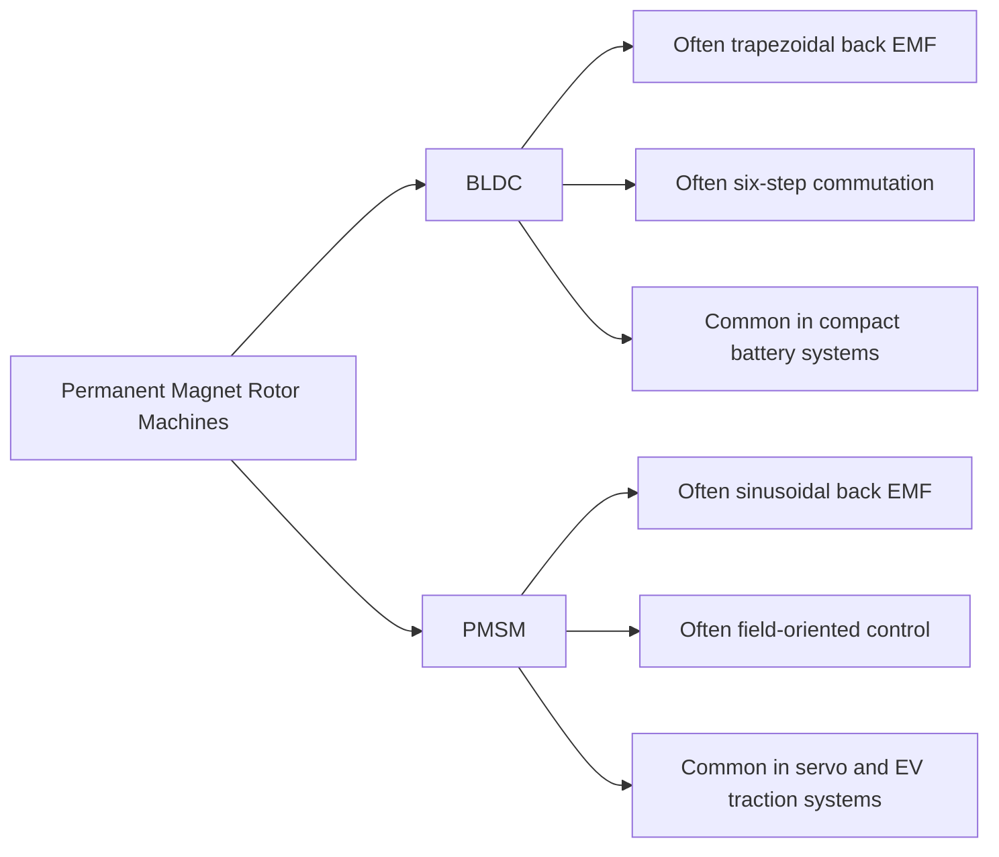
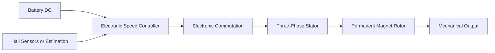
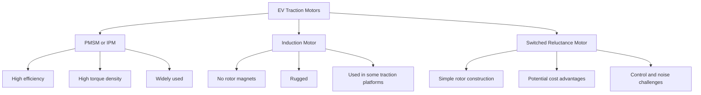
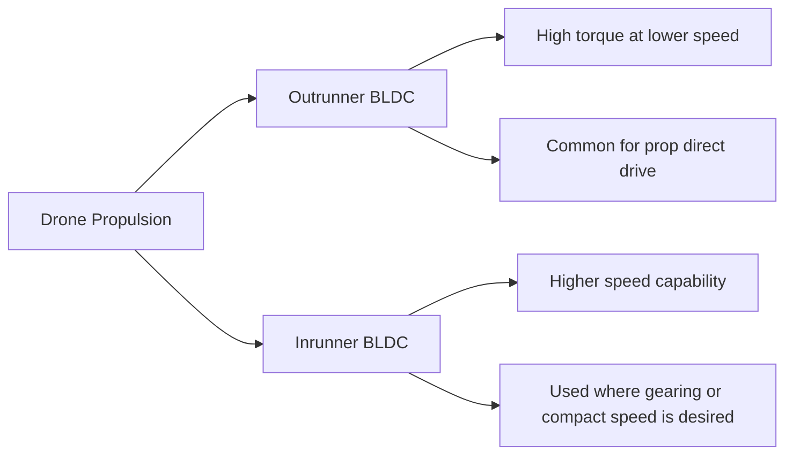

<!--
CONTENT_CLASS: RAG_APPROVED
AI_READ_ACCESS: ALLOWED
STATUS: DRAFT

MODULE_FAMILY: ELECTRICAL_MACHINES
MODULE_ID: brushless_dc_ev_and_drone_motor_comparison
LEARNING_LEVEL: intermediate

INDEX_TAGS:
  topics: ["bldc", "pmsm", "ev_motors", "drone_motors", "traction_motors", "esc"]
  systems: ["motor_drive", "mobile_motion"]
-->

# Brushless DC, EV, and Drone Motor Comparison

## 0. Purpose

This module compares BLDC systems, EV traction motors, and drone propulsion motors. These categories are often discussed together, but they are not optimized for the same design goals.

This file is comparative training content, not a default industrial-motor selection guide.

## 1. BLDC vs PMSM relationship

## 2. BLDC control chain

## 3. EV motor families

## 4. Drone motor architecture

## 5. Comparison table

| Category | Typical supply | Typical control | Main priority | Typical use |
| --- | --- | --- | --- | --- |
| BLDC | battery DC bus | ESC or motor controller | compact efficiency | portable systems, tools, drones |
| PMSM traction/servo | DC bus plus inverter | field-oriented control or servo control | performance and controllability | EVs, robotics, servo systems |
| EV traction motor | high-voltage battery bus | traction inverter | efficiency, torque density, drive-cycle performance | electric vehicles |
| Drone motor | battery DC bus | ESC | minimum mass and thrust efficiency | UAV propulsion |

## 6. Industrial motor vs EV motor vs drone motor

| Category | Industrial VFD motor | EV traction motor | Drone motor |
| --- | --- | --- | --- |
| Design priority | reliability and continuous duty | power density and efficiency across drive cycle | lowest mass for required thrust |
| Cooling approach | industrial enclosure/cooling methods | advanced thermal design, often liquid cooled | airflow dependent |
| Control goal | process speed control | traction torque and vehicle response | propeller thrust control |
| Packaging goal | robust plant installation | vehicle integration | ultra-lightweight propulsion |
| Duty assumptions | continuous industrial operation | variable vehicle cycle | intermittent and flight-critical |

## 7. Engineering implications

### BLDC

BLDC motors are commonly selected for:

- compact systems
- high efficiency
- battery-powered motion
- low-mass applications

### EV motors

EV traction motors are selected based on:

- torque density
- thermal performance
- inverter strategy
- battery voltage
- vehicle efficiency map
- packaging constraints

### Drone motors

Drone propulsion motors are selected based on:

- thrust-to-weight ratio
- propeller matching
- speed behavior
- thermal margin
- ESC compatibility
- flight-duration constraints

## 8. Common mistakes

### Treating drone motors like industrial motors

Drone motors are optimized for mass-sensitive propulsion, not industrial enclosure robustness.

### Assuming EV traction motors are just bigger BLDC motors

The packaging, thermal system, control methods, safety envelope, and duty expectations are much more demanding.

### Treating BLDC and PMSM terminology as completely rigid

Engineers should focus on:

- magnetic structure
- back-EMF behavior
- controller method
- feedback architecture
- application context

## 9. Design guidance

- choose `BLDC` for compact and efficient battery-powered rotating systems
- choose `PMSM / servo-type architecture` for high-performance controlled motion
- choose `traction-specific motor architecture` for EV propulsion
- choose `outrunner drone BLDC motors` for direct propeller drive where weight is critical

## Related files

- [Motor Family Comparison](./motor_family_comparison.md)
- [VFD and Servo Architecture Diagrams](./vfd_and_servo_architecture_diagrams.md)
- [Motor Selection Comparison Matrix](../../design_framework/motor_systems/motor_selection_comparison_matrix.md)
