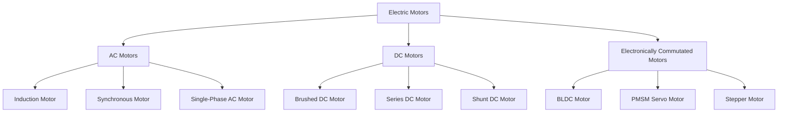

<!--
CONTENT_CLASS: RAG_APPROVED
AI_READ_ACCESS: ALLOWED
STATUS: DRAFT

MODULE_FAMILY: ELECTRICAL_MACHINES
MODULE_ID: motor_family_comparison
LEARNING_LEVEL: intermediate

INDEX_TAGS:
  topics: ["motor_families", "ac_motors", "dc_motors", "bldc", "pmsm", "stepper", "servo"]
  systems: ["machine", "motor_drive"]
-->

# Motor Family Comparison

## 0. Purpose

This module introduces the major motor families used in industrial automation and adjacent motion systems so the reader can distinguish the motor type before choosing a drive, control method, or protection strategy.

## 1. High-level motor family map

## 2. Core motor families

### AC motors

AC motors dominate industrial power applications.

Common examples:

- induction motors
- synchronous motors
- single-phase utility motors

Common uses:

- pumps
- fans
- conveyors
- compressors
- process equipment

### DC motors

Classical DC motors use brushes and a commutator.

Common examples:

- brushed DC motors
- series DC motors
- shunt DC motors

These motors still matter in legacy systems, but many modern adjustable-speed systems use electronically commutated platforms instead.

### Electronically commutated motors

These motors need an electronic controller to generate phase switching.

Common examples:

- BLDC motors
- PMSM servo motors
- stepper motors

These are common in:

- robotics
- CNC systems
- battery-powered systems
- high-performance automation

## 3. Comparison table

| Motor family | Supply form | Typical commutation method | Main strength | Main limitation | Common use |
| --- | --- | --- | --- | --- | --- |
| AC induction | AC | electromagnetic induction | rugged, common, economical | less precise without advanced control | pumps, fans, conveyors |
| Synchronous AC | AC | synchronous magnetic field | efficient and controlled speed relation | more specialized control | precision drives, power systems |
| Brushed DC | DC | brushes and commutator | simple speed-control concept | brush wear and maintenance | legacy motion systems |
| BLDC | DC bus plus inverter | electronic commutation | compact, efficient, high power density | controller dependent | portable and compact systems |
| PMSM servo | DC bus plus servo drive | electronic commutation plus feedback | precise control, fast response | higher cost and tuning complexity | robotics, CNC, packaging |
| Stepper | DC bus plus driver | step sequence | simple position control | can lose steps, weaker at speed | light-duty positioning |

## 4. Engineering implications

Motor family changes the rest of the system design, including:

- drive architecture
- control strategy
- cable and grounding method
- commissioning workflow
- troubleshooting approach

Examples:

- induction motor plus VFD fits industrial variable-speed process loads
- PMSM servo fits precise positioning and dynamic motion
- BLDC often fits compact battery-powered systems

## 5. Common mistakes

### Treating all electronic motors as servo motors

Not every electronically commutated motor is a servo system. A servo system usually implies closed-loop feedback and tuned position, velocity, or torque control.

### Treating BLDC and PMSM as completely unrelated

These families are closely related in hardware terms. Engineers often distinguish them by back-EMF shape, control method, and application context.

### Treating EV or drone motors like ordinary industrial motors

Their thermal assumptions, packaging goals, and duty expectations are often very different from industrial continuous-duty systems.

## 6. Selection guidance

- choose `induction motor + VFD` for industrial variable-speed process loads
- choose `PMSM servo` for precise positioning and dynamic motion
- choose `BLDC` for lightweight or compact battery-powered systems
- choose `stepper` for lower-cost discrete positioning when performance limits are acceptable
- choose `brushed DC` mainly for legacy or specialized simple DC applications

## Related files

- [AC vs DC Motor Comparison](./ac_vs_dc_motor_comparison.md)
- [VFD and Servo Architecture Diagrams](./vfd_and_servo_architecture_diagrams.md)
- [Motor Selection Comparison Matrix](../../design_framework/motor_systems/motor_selection_comparison_matrix.md)
