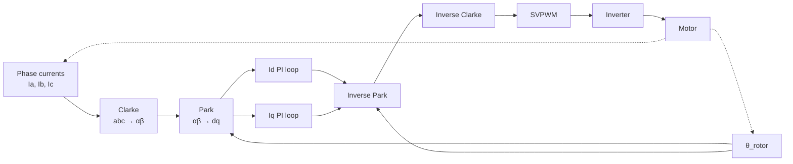
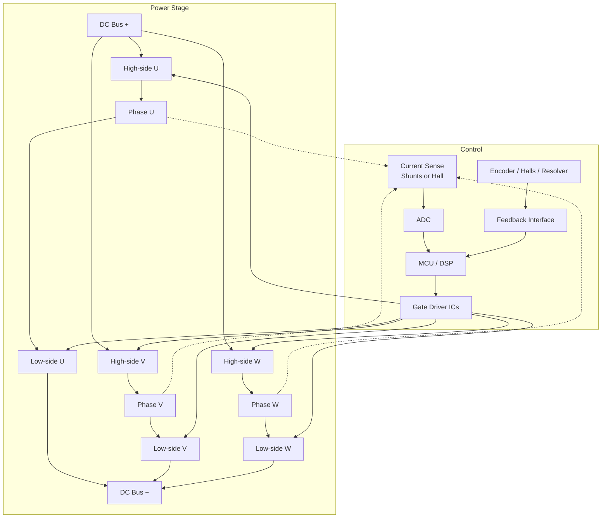
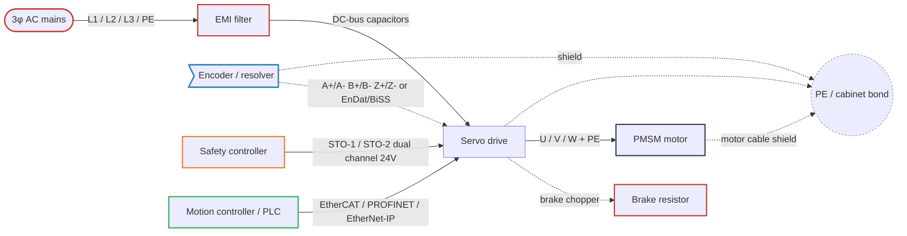

<!--
CONTENT_CLASS: RAG_APPROVED
AI_READ_ACCESS: ALLOWED
STATUS: DRAFT

MODULE_FAMILY: ELECTRICAL_MACHINES
MODULE_ID: pmsm_motor_reference
LEARNING_LEVEL: intermediate

INDEX_TAGS:
  topics: ["pmsm", "permanent_magnet", "ipm", "spm", "foc", "clarke_park", "field_weakening", "mtpa", "sinusoidal_emf", "encoder", "resolver", "servo"]
  systems: ["motor_drive", "servo", "machine"]
-->

# PMSM Motor Reference

## 0. Purpose

This module is a deep reference on permanent-magnet synchronous motors (PMSM): SPM vs IPM construction and saliency, sinusoidal back-EMF and its control implications, field-oriented control (Clarke, Park, SVPWM) as the standard PMSM drive technique, reluctance torque and MTPA on interior-magnet machines, feedback requirements that separate PMSM from BLDC, field weakening at high speed, drive architecture specific to PMSM, commissioning workflow, and PMSM-specific failure modes. Prerequisite knowledge: BLDC Motor Reference and basic servo-drive fundamentals.

# 1. PMSM Definition and Family Relationship (SPM vs IPM)

A **PMSM (Permanent Magnet Synchronous Motor)** is a 3-phase permanent-magnet synchronous machine with a **sinusoidal back-EMF**, driven with **sinusoidal current** via **FOC (Field-Oriented Control)**. PMSMs are optimized for smooth torque, precision, and efficiency.

PMSM and BLDC are the **same family** of machine — 3-phase stator windings wrapped around a permanent-magnet rotor. The distinction lives in:

- **Back-EMF waveform shape** (sinusoidal for PMSM vs trapezoidal for BLDC)
- **Stator winding layout** (distributed for PMSM vs concentrated for BLDC)
- **Control strategy** (FOC for PMSM vs 6-step commutation for BLDC)

The motor nameplate will not always tell you which you have — the **back-EMF waveform** does. Vendors mix the terms freely: a "BLDC" with sinusoidal BEMF + FOC is really a PMSM system; a "PMSM" driven 6-step behaves like a noisy BLDC.

### SPM vs IPM subfamilies

- **SPM (Surface Permanent Magnet)** — magnets bonded to the rotor surface. Ld ≈ Lq (no magnetic saliency). Smooth rotor, straightforward control, no reluctance torque available.
- **IPM (Interior Permanent Magnet)** — magnets buried inside the rotor laminations. Ld < Lq (magnetically salient). Produces an additional **reluctance torque** component that SPM machines cannot exploit, and supports a wide field-weakening speed range.

### Why the PMSM distinction matters in real systems

- **Torque smoothness** — FOC produces < 2% torque ripple (vs 14–25% for BLDC 6-step)
- **Zero-speed torque** — FOC with proper feedback delivers deterministic torque at standstill
- **Speed range** — IPM-PMSM + FOC field weakening extends constant-power range 3–5× base speed
- **Cost / complexity** — FOC needs a DSP, high-res feedback, and parameter ID
- **Functional safety** — industrial PMSM servo drives carry STO/SS1/SLS per IEC 61800-5-2

---

# 2. Construction — Distributed Windings, Magnet Placement, Saliency

| Feature                 | PMSM                                             |
| ----------------------- | ------------------------------------------------ |
| Magnet placement        | SPM (sinusoidal shaping) or IPM (interior)       |
| Stator winding          | Distributed (sinusoidal MMF)                     |
| Back-EMF shape          | Sinusoidal                                       |
| Slot/pole ratio         | Optimized for sinusoidal EMF                     |
| Cogging torque          | Low (by design, often with skew)                 |
| Rotor saliency (Ld, Lq) | SPM: Ld ≈ Lq; IPM: Ld ≠ Lq → reluctance torque available |
| Typical feedback        | Encoder, resolver, or high-res sensorless        |

### Why the winding matters

- **Distributed windings** spread the MMF smoothly around the air gap → clean sinusoidal flux linkage → low torque ripple under sine current.
- Distributed windings are more expensive to wind than concentrated windings but are required for a clean sinusoidal back-EMF shape.
- PMSM rotors are often **skewed** to further reduce cogging torque.

### IPM saliency — Ld ≠ Lq

In an IPM machine, the magnetic reluctance seen by the stator varies with rotor angle because the magnets (low permeability) are buried inside the iron rotor. This produces:

- **Ld (direct-axis inductance)** — inductance along the magnet axis, lower because the magnet acts like an air gap
- **Lq (quadrature-axis inductance)** — inductance perpendicular to the magnet axis, higher because flux travels through iron
- **Ld < Lq** for IPM (the inverse of how induction machines are often drawn; the convention here is based on the magnet axis)

This saliency is what makes reluctance torque and wide field weakening possible on IPM. SPM rotors are magnetically symmetric and have Ld ≈ Lq, so they cannot exploit this effect.

---

# 3. Sinusoidal Back-EMF and Why It Matters

A PMSM produces a **clean sinusoidal back-EMF**, aligned with rotor position. Constant shaft torque requires the **phase current to be sinusoidal and phase-locked** to the rotor.

### Implications

- If you feed **6-step square current** into a sinusoidal motor, you get large torque ripple, acoustic noise, and extra heating — the current waveform does not match the back-EMF shape.
- If you feed **sinusoidal current into a trapezoidal motor**, torque ripple increases for the same reason in reverse.
- The drive strategy must match the motor's back-EMF shape. That match is the whole game.

### Consequences of sinusoidal BEMF for the drive

- Continuous 3-phase modulation — all three phases conduct simultaneously, not one floating at a time
- Continuous position feedback required — 60°-electrical Hall resolution (good enough for 6-step) is insufficient
- Torque ripple on a well-aligned FOC system on a PMSM with a good encoder is < 2%

### Torque ripple reference

| Scheme                           | Typical torque ripple       |
| -------------------------------- | --------------------------- |
| Sinusoidal commutation (no FOC)  | 3–8%                        |
| FOC on PMSM with good encoder    | < 2%                        |
| FOC on PMSM with encoder misalign| rises fast — 5–15%          |
| 6-step on sinusoidal motor       | 30–50% (mismatched)         |

Ripple matters any time you drive a load that sees it mechanically — gearheads, precision stages, camera gimbals, coordinate-table positioners.

---

# 4. Field-Oriented Control (Clarke, Park, SVPWM)

FOC (also called vector control) is the standard PMSM control technique.

### Pipeline

- Measure 2 or 3 phase currents
- **Clarke transform:** abc → αβ (stationary 2-phase)
- **Park transform:** αβ → dq (rotor-aligned)
- Two independent PI loops:
  - **Id loop** — regulates flux-producing current (typically Id = 0 for SPM, Id < 0 for IPM/field weakening)
  - **Iq loop** — regulates torque-producing current (torque ∝ Iq)
- **Inverse Park / inverse Clarke** → phase voltage commands → **SVPWM** → inverter gates

### Strengths

- Smooth torque from zero speed
- Deterministic response, wide bandwidth
- Decouples flux and torque (same math as a separately-excited DC machine)
- Field weakening for extended speed range
- MTPA (Maximum Torque Per Ampere) on IPM machines
- High efficiency at partial load

### Limitations

- High compute requirement (current loop at 10–20 kHz)
- Demands accurate rotor position — encoder offset error directly reduces torque
- Parameter identification required (Rs, Ls or Ld/Lq, ψ_f)
- Complex commissioning

### When to use FOC

- Servo-grade applications (precision motion, torque control)
- Anything requiring full torque at zero speed
- Wide speed range with field weakening
- Low audible noise, low torque ripple required

### Sinusoidal commutation (scalar, without dq)

An intermediate step between 6-step and full FOC:

- Three sine references aligned to rotor angle; phase-current magnitude scales with command
- Smoother than 6-step but no decoupling between flux and torque
- Transitional architecture — rarely a final product target on new designs

---

# 5. Mathematical Foundation

The equations below apply directly to PMSM analysis and drive design.

### Electrical equation (per phase)

V = R·i + L·(di/dt) + Ke·ω

- **V** — applied phase voltage
- **R** — winding resistance (copper loss: P = I²R)
- **L** — phase inductance (sets current slew rate and ripple)
- **i** — phase current (torque is proportional to this)
- **Ke·ω** — back-EMF (rises linearly with speed)

**Engineering meaning:** the drive must overcome resistance, inductance, and back-EMF. At high speed, BEMF approaches DC bus → no voltage headroom left → torque collapses. This is what limits top speed and motivates field weakening.

### Torque equation (surface PM / general)

T = Kt · I

- **T** — shaft torque
- **Kt** — torque constant (numerically equal to Ke in SI units)
- **I** — current (Iq in FOC language)

**Engineering meaning:** torque is a current problem, not a voltage problem. Torque limits = current limits = thermal limits. When the user demands "more torque," they are demanding "more current" → more copper loss → more heat.

### Torque equation (IPM, with reluctance term)

T = (3/2) · p · [ψ_f · Iq + (Ld − Lq) · Id · Iq]

- First term — magnet (alignment) torque, available on both SPM and IPM
- Second term — **reluctance torque**, available only when Ld ≠ Lq (IPM)
- On IPM, because Ld < Lq, (Ld − Lq) is negative, so injecting a negative Id adds positive torque

This is the equation MTPA trajectories are derived from.

### Electrical vs mechanical speed

ω_e = p · ω_m

- **ω_e** — electrical angular frequency (what the commutation sees)
- **ω_m** — mechanical shaft speed
- **p** — number of pole pairs

**Engineering meaning:** a 4-pole-pair motor spinning at 3000 RPM mechanically has an electrical frequency of 200 Hz. Commutation timing, current-loop bandwidth, and PWM frequency must all be specified relative to ω_e, not ω_m. A common bug: designers think in RPM, then the current loop runs out of bandwidth at high pole counts.

### Mechanical equation (sizing / dynamics)

T − T_load = J · (dω/dt) + B · ω

- **J** — rotor + load inertia
- **B** — viscous friction
- **T_load** — external load torque

**Engineering meaning:** motor torque is spent on accelerating inertia, overcoming friction, and driving the load. Inertia mismatch (load J >> motor J × gear²) is the classic cause of oscillation and gain-limited tuning.

---

# 6. Reluctance Torque on IPM and MTPA

IPM-PMSM exploits Ld < Lq. Revisiting the torque equation:

T = (3/2) · p · [ψ_f · Iq + (Ld − Lq) · Id · Iq]

The second term is **reluctance torque**. It lets the drive inject controlled negative `Id` to gain torque per amp and to extend the speed range via **field weakening**. BLDCs (and SPM PMSMs) cannot do this meaningfully.

### MTPA (Maximum Torque Per Ampere)

For a given magnitude of stator current |Is|, MTPA chooses the Id / Iq split that **maximizes output torque**. On IPM this means:

- Id is pushed negative (partially cancelling magnet flux on the d-axis)
- Iq carries the bulk of the torque-producing current
- The locus of (Id, Iq) points satisfying MTPA is called the **MTPA trajectory**
- For SPM (Ld = Lq), MTPA collapses to the trivial answer Id = 0, Iq = |Is| — all current goes to torque

MTPA delivers a modest efficiency gain (3–8%) vs Id = 0 operation, which is meaningful on EV traction and other energy-limited applications.

---

# 7. Feedback Requirements

PMSM FOC demands much higher position resolution than BLDC 6-step commutation. The dq transform math only works if the controller knows rotor angle to well below 1° electrical — encoder offset error turns directly into torque loss.

| Feedback          | Resolution             | Suitable for PMSM FOC        |
| ----------------- | ---------------------- | ---------------------------- |
| 3 Halls           | 60° electrical         | Marginal, startup only       |
| Incremental enc.  | typ. 1024–10000 PPR    | Yes (needs index + align)    |
| Absolute enc.     | 17–26 bit single-turn  | Yes — preferred              |
| Resolver          | analog, ~12–16 bit     | Yes — rugged                 |
| Sensorless (BEMF) | Zero-cross detection   | Poor at low speed            |
| Sensorless (obs.) | Luenberger / SMO / MRAS| Yes, with startup caveat     |

### Feedback interface (signaling)

| Feedback        | Signaling                         | Resolution          |
| --------------- | --------------------------------- | ------------------- |
| Incremental enc.| A/B quadrature + Z                | 1024–10000 PPR      |
| Absolute enc.   | BiSS-C, EnDat, SSI, Nikon         | 17–26 bit           |
| Resolver        | Analog sine/cosine + excitation   | 12–16 bit effective |
| Sensorless      | Back-EMF observation or MRAS/SMO  | Estimated, not direct |

### Rules of thumb

- Want precise torque at zero speed → you need a **real encoder** and **FOC**
- Want rugged feedback in a harsh environment → resolver
- Want no sensor in the rotor hub → observer-based sensorless (with startup caveats)

---

# 8. Field Weakening

Field weakening is how a PMSM extends its constant-power speed range beyond the base (voltage-limited) speed.

### Why it is needed

The electrical equation shows that BEMF rises linearly with ω. As speed approaches the point where Ke·ω ≈ Vbus × modulation index, there is no voltage headroom left to drive current into the stator, so torque collapses. Field weakening uses negative Id to partially cancel the magnet flux linkage on the d-axis, reducing the effective BEMF at a given speed and creating voltage headroom for torque-producing Iq.

### SPM (surface magnet)

- Field weakening via negative Id
- Modest speed range extension, typically **1.5–2× base speed**
- Torque falls approximately ∝ 1/ω above base speed
- The d-axis inductance Ld is small so the amount of flux cancellation Id can produce is limited

### IPM (interior magnet)

- Field weakening **plus** reluctance torque working together
- Wide constant-power range, typically **3–5× base speed**
- Used in EV traction and spindle drives

### Why this matters

The field-weakening window is the **single biggest reason** to choose PMSM + FOC (especially IPM) over trapezoidal BLDC once the application needs a wide speed range from a fixed DC bus. BLDC 6-step cannot field-weaken meaningfully — crude phase advance can push a small extra RPM window, but there is no clean flux control.

---

# 9. Drive Architecture Specific to PMSM

### Controller (MCU / DSP)

| Control | MCU class                             | Current loop rate |
| ------- | ------------------------------------- | ----------------- |
| PMSM FOC (general)      | Cortex-M4F, 100–200 MHz   | 10 kHz            |
| PMSM FOC (industrial)   | Cortex-M7, C2000 DSP, 300 MHz | 10–20 kHz     |
| High-end servo          | FPGA + DSP                | 20–40 kHz         |

### Drive block summary (typical industrial PMSM servo)

| Block                   | Typical choice                                      |
| ----------------------- | --------------------------------------------------- |
| MCU / DSP               | 32-bit DSP or MCU with FPU, 150–300 MHz             |
| Current sense           | 2 or 3 in-line phase shunts or Hall-effect sensors  |
| PWM frequency           | 8–20 kHz (industrial servo), higher on small motors |
| Feedback                | Incremental encoder, absolute encoder, or resolver  |
| Modulation              | Space Vector PWM (SVPWM)                            |
| Control loop rate       | 10–20 kHz current, 1–5 kHz velocity, 0.5–2 kHz pos  |
| Protection              | OC, OV/UV, OT, I²t, position error, STO, SBC        |

### Current sensing topologies

| Topology                  | Pros                                     | Cons                                     |
| ------------------------- | ---------------------------------------- | ---------------------------------------- |
| Single DC-link shunt      | Cheapest, one amplifier                  | Requires per-state reconstruction; harder on FOC |
| Two phase shunts          | Good accuracy, Ic = −(Ia + Ib)           | Two amplifiers, needs ground-referenced  |
| Three phase shunts        | Redundant, best accuracy, fault detect   | Three amplifiers                         |
| Hall-effect current sensor| Isolated, linear over wide range         | More expensive, more board area          |

For FOC, two or three in-line phase shunts (or Hall-effect current sensors) are preferred over a single DC-link shunt because FOC needs phase-current samples at high rate regardless of modulation state.

### Firmware footprint

PMSM FOC firmware is typically **60–200 KB** (plus autotuning routines, parameter identification, fault logging, and fieldbus stack: EtherCAT, PROFINET, CANopen). This is an order of magnitude more code than BLDC 6-step firmware (8–20 KB).

### Functional safety

PMSM servo drives routinely carry **STO (Safe Torque Off)**, and often SS1, SS2, SLS, SBC per IEC 61800-5-2.

---

# 10. Commissioning Considerations

PMSM FOC commissioning is typically a **days-long** effort (vs hours for BLDC 6-step). The two biggest drivers are parameter identification and encoder offset calibration.

### Parameter identification

FOC math depends on accurate motor parameters. The drive typically runs a self-ID routine, or the user enters values from the motor datasheet:

- **Rs** — stator resistance (per phase)
- **Ls** (SPM) or **Ld and Lq** (IPM) — stator inductance(s)
- **ψ_f** — rotor flux linkage (derived from Ke)
- Optionally: rotor inertia J, friction coefficient B

Wrong parameters show up as loop instability, torque error, or reduced speed range. On IPM, **swapping Ld and Lq is a classic commissioning bug** — it causes instability around base speed.

### Encoder offset calibration

The Park transform only works if the drive knows the electrical angle of the rotor relative to the encoder's zero position. If the encoder offset is wrong:

- The dq frame is rotated incorrectly
- Current commanded as pure Iq ends up partly on Id
- Max torque per amp drops, motor runs hot at moderate load
- In extreme cases the torque can go negative or the drive oscillates

Offset calibration is usually performed with a commissioning wizard that applies a known current vector and measures the resulting rotor alignment, or by using the encoder Z/index pulse against a known mechanical reference.

### Tuning and commissioning workflow summary

- Motor parameter identification (Rs, Ld, Lq, ψ_f)
- Encoder offset calibration
- Current loop tuning (bandwidth typically 1/10 of PWM frequency)
- Velocity loop tuning (≤ 1/4 of current-loop bandwidth)
- Position loop tuning (≤ 1/4 of velocity-loop bandwidth)
- Feedforward terms (velocity, acceleration, friction)
- Safety function configuration (STO reaction, SS1 ramp, SLS threshold)

---

# 11. Wiring and Integration

PMSM systems differ from BLDC in one large way at the wiring level: they need high-resolution rotor feedback and are almost always servo-class, which means the drive stack includes functional safety (STO) and fieldbus integration as standard. The diagram below shows the canonical industrial PMSM servo wiring pattern.

## Industrial PMSM servo wiring

Cable-class color legend: see bldc_pmsm_implementation_guide.md §14 cable-group legend. Solid lines carry primary conductors; dashed lines are shields, feedback, or safety bonds.

Key differences from a BLDC wiring archetype:

- Power side is 3-phase AC rather than DC battery (for industrial class; battery-PMSM exists in AGVs and EVs)
- Brake resistor is a first-class part of the stack — deceleration energy has to go somewhere
- Feedback is a dedicated shielded cable for encoder or resolver; Hall feedback alone is insufficient for FOC performance
- STO is a dual-channel 24 V safety path with its own terminal block and cross-monitoring
- Fieldbus is standard — direct PWM / analog inputs exist but are uncommon on industrial PMSM servo drives

## Encoder connector pinout (typical servo encoder)

| Pin group | Signal | Notes |
|-----------|--------|-------|
| Power     | +5V or +9V or +12V | Supply voltage depends on encoder; verify drive datasheet |
| Power     | GND (0 V)          | Common return |
| Incremental | A+, A−           | Differential line pair, impedance 120 Ω typical |
| Incremental | B+, B−           | Differential line pair, 90° out of phase from A |
| Incremental | Z+, Z−           | Once-per-revolution index |
| Absolute protocol | DATA+, DATA− | EnDat, BiSS-C, Hiperface DSL use this pair (serial bidirectional) |
| Absolute protocol | CLOCK+, CLOCK− | Clock pair for EnDat and BiSS-C (Hiperface DSL is single-pair) |
| Temp      | TEMP+, TEMP−       | Motor winding temperature (PTC / KTY / Pt1000) — often carried through the same connector on hybrid cables |
| Shield    | Cable shield       | 360° terminated at drive end via EMC gland |

Connector types: DB-15, M23, M17 (industrial circular), or drive-vendor proprietary. Hybrid One-Cable variants (OCT, Beckhoff OCT, Siemens DRIVE-CLiQ, SEW Hiperface DSL) combine power + feedback + temp + sometimes brake into a single cable — check the drive manufacturer's cable catalog for the exact pinout on each.

## STO (Safe Torque Off) — dual-channel wiring

STO is the entry-level safety function on every industrial servo drive. Wiring rules:

- Two independent 24 V DC channels (STO-1 and STO-2) routed to separate terminal blocks on the drive
- Both channels must be energized for the drive to enable torque output
- Channels are cross-monitored by a safety controller or safety relay; single-channel failure is detected within a defined response time
- STO is NOT an emergency stop on its own — it removes torque but does not dissipate kinetic energy. Combine with a mechanical brake or SS1 (Safe Stop 1) ramp-down for loads with significant inertia
- STO wiring is separate from the E-stop chain even if both are triggered by the same safety relay — the drive's safety inputs are on a dedicated terminal block

For the operational walkthrough (commissioning, testing, validation), see workflows/servo-commissioning/.

---

# 12. Typical Failure Modes Specific to PMSM

These failure modes are specific to PMSM + FOC systems (shared BLDC/PMSM failures like gate-driver shoot-through, DC-link cap aging, and thermistor open-circuit are covered in the BLDC Motor Reference).

- **Encoder offset not calibrated (or lost after replacement)** → wrong dq alignment → motor runs hot, max torque unreachable, poor efficiency
- **Encoder cable noise** → position jitter → current jitter → acoustic whine, sometimes mistaken for a mechanical problem
- **Parameter ID wrong (Ld/Lq swapped on IPM)** → instability near base speed, oscillation when field weakening engages
- **DC-link undervoltage during hard regen** → drive trips on brake events; brake chopper resistor needs to be sized and wired correctly
- **Wrong FOC Id command below base speed (IPM)** → negative Id is only useful for field weakening above base speed; applying it below base wastes power as heat
- **Firmware bug in field-weakening logic** → runaway at high speed, or torque collapse at the weakening transition
- **Encoder battery flat (absolute multi-turn)** → multi-turn position lost on power cycle, requiring re-homing
- **Sensorless observer divergence at startup** → fails to acquire rotor angle under load; open-loop ramp or align-and-go needed as a fallback

---
