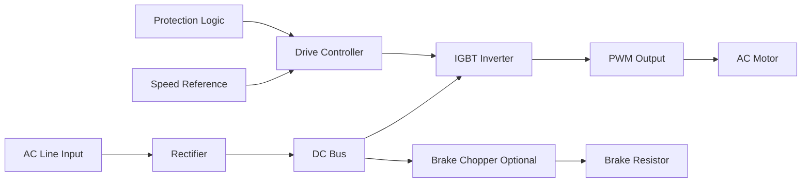
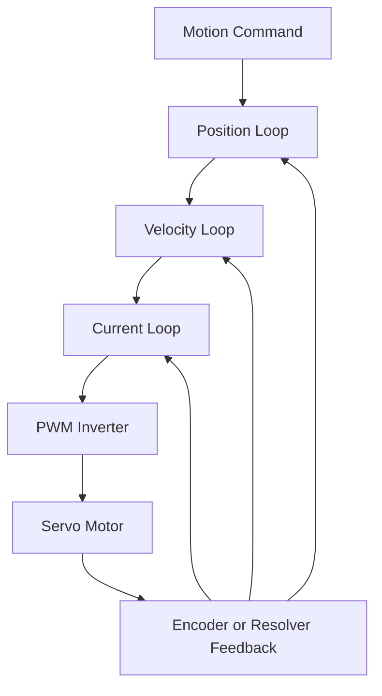

<!--
CONTENT_CLASS: RAG_APPROVED
AI_READ_ACCESS: ALLOWED
STATUS: DRAFT

MODULE_FAMILY: ELECTRICAL_MACHINES
MODULE_ID: vfd_and_servo_architecture_diagrams
LEARNING_LEVEL: intermediate

INDEX_TAGS:
  topics: ["vfd", "servo_drive", "control_loops", "pwm", "inverter", "motor_drive_architecture"]
  systems: ["motor_drive", "motion_axis"]
-->

# VFD and Servo Architecture Diagrams

## 0. Purpose

This module compares the internal architecture of a VFD system and a servo-drive system so the reader can see why the two are related but not interchangeable.

## 1. VFD architecture

### VFD functional description

A typical VFD:

1. takes AC input power
2. rectifies it to DC
3. stores energy in a DC bus
4. synthesizes variable-frequency output with an inverter
5. controls motor speed and torque within its configured operating mode

Typical uses:

- conveyors
- pumps
- fans
- compressors
- mixers
- process systems

## 2. Servo architecture

### Servo functional description

A servo system is built around nested closed loops:

- position loop
- velocity loop
- current loop

The servo controller continuously uses feedback to regulate the motor response.

Typical uses:

- robotics
- CNC systems
- indexing systems
- semiconductor tools
- packaging machinery

## 3. Comparison table

| Topic | VFD system | Servo system |
| --- | --- | --- |
| Primary goal | speed/process control | precise motion control |
| Feedback requirement | optional or limited depending on mode | usually essential |
| Control structure | simpler than full servo loop hierarchy | nested closed-loop control |
| Typical motor | induction motor, sometimes PMSM depending on drive | PMSM servo, BLDC-style servo |
| Tuning burden | lower | higher |
| Position accuracy | limited unless specialized architecture is used | high |
| Dynamic response | moderate to good | very high |

## 4. Engineering interpretation

### When a VFD is usually the right tool

Use a VFD when the job is primarily:

- speed control
- energy savings
- process flow control
- reduced mechanical shock
- soft starting and stopping of industrial loads

### When a servo is usually the right tool

Use a servo system when the job is primarily:

- position accuracy
- repeatability
- fast acceleration and deceleration
- contouring or coordinated motion
- dynamic torque response

## 5. Common mistakes

### Assuming a VFD can replace a servo in precision motion

A VFD may run the motor, but that does not make it a precision servo solution.

### Assuming every servo application needs a high-end multi-axis platform

Some motion tasks can be solved with simpler controlled motor architectures. The application must justify the complexity.

### Ignoring the feedback device

A servo system depends strongly on the quality and configuration of:

- encoder
- resolver
- commutation alignment
- feedback scaling

## 6. Design review questions

1. Is the job primarily speed control or position control?
2. Is feedback required?
3. What dynamic response is required?
4. What tuning complexity is acceptable?
5. What are the cable, EMC, and grounding implications?
6. Does the machine need synchronized motion or just adjustable speed?

## Related files

- [VFD Fundamentals](./vfd_fundamentals.md)
- [Servo Drive Fundamentals](./servo_drive_fundamentals.md)
- [Motor Selection Comparison Matrix](../../design_framework/motor_systems/motor_selection_comparison_matrix.md)
