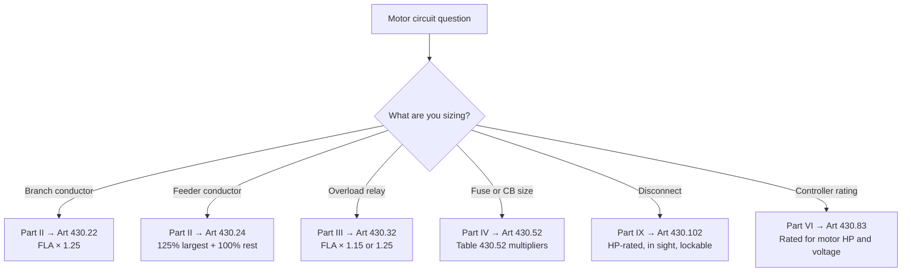

<!--
CONTENT_CLASS: RAG_APPROVED
AI_READ_ACCESS: ALLOWED
STATUS: DRAFT

MODULE_FAMILY: NEC_APPLICATION
MODULE_ID: article_430_practical_workflow
LEARNING_LEVEL: applied

INDEX_TAGS:
  topics: ["article_430", "motor_circuits", "workflow", "conductor_sizing", "overcurrent_protection"]
  systems: ["industrial_control_panel", "machine", "motor_branch_circuit"]
-->

# Practical Article 430 Workflow

## 0. Purpose

This module maps the internal structure of NEC Article 430 so that any motor-circuit question can be routed to the correct Part without reading the full article. It also covers the most common sizing sequence from FLA lookup to disconnect selection.

## 1. Article 430 internal structure

Art 430 is organized into Parts. Knowing which Part covers which topic eliminates the most common source of confusion — starting from the wrong section.

| Part | Scope | Typical question |
|------|-------|-----------------|
| Part I — General | Scope, definitions, FLA table references | What tables do I use? |
| Part II — Conductors | Branch-circuit and feeder sizing | What AWG conductor do I need? |
| Part III — Overload Protection | Motor overload relay sizing | How do I set my overload relay? |
| Part IV — Branch-Circuit SCPD | Fuse and CB sizing for starting current | What size fuse or breaker? |
| Part V — Feeder Conductors | Feeder to multiple motors | How do I size a shared feeder? |
| Part VI — Motor Controllers | Controller ratings | What controller rating do I need? |
| Part VII — Grounding | Motor frame grounding | Do I need a separate EGC to the motor? |
| Part IX — Disconnecting Means | Disconnect type and placement | What disconnect is required? |
| Part X — Motor Controllers (industrial) | Controller ratings in industrial settings | — |
| Part XIV — Tables | FLA tables | 430.247 / 430.248 / 430.250 |

## 2. The critical rule: use table FLA, not nameplate

Art 430.6(A) is the single most important rule in the article:

> For the purpose of determining conductor and overcurrent device sizes, the values given in Tables 430.247, 430.248, and 430.250 shall be used instead of the actual current rating marked on the motor nameplate.

This rule applies to conductors (Part II), overload protection (Part III), and branch-circuit SCPD (Part IV).

Exception: overload relays (Part III) may use nameplate FLA when the table value is unavailable or the motor is a Design E motor — see Art 430.32(A)(1).

## 3. Decision flowchart — routing a motor question

## 4. Standard sizing sequence — single motor

Follow this sequence for a new motor branch circuit:

**Step 1 — Find table FLA**
Use Table 430.250 (three-phase AC), 430.248 (single-phase AC), or 430.247 (DC). Do not use the nameplate.

**Step 2 — Size branch-circuit conductors (Part II)**
Required ampacity = table FLA × 1.25 (Art 430.22(A))
Select conductor from Table 310.15(B)(16) at the applicable temperature rating.

**Step 3 — Size overload relay (Part III)**
Per Art 430.32(A)(1):
- If SF ≥ 1.15 or temperature rise ≤ 40°C: relay trip = FLA × 1.25
- Otherwise: relay trip = FLA × 1.15
If the motor won't start, Art 430.32(C) allows increasing up to 140% or 130%.

**Step 4 — Size branch-circuit OCPD (Part IV)**
Per Art 430.52 and Table 430.52:
- Non-time-delay fuse: FLA × 300%
- Dual-element time-delay fuse: FLA × 175%
- Inverse-time CB: FLA × 250%
- Instantaneous-trip CB: FLA × 800–1300% (listed combination only)

The OCPD from Table 430.52 protects against short-circuit and ground-fault only — not overload. The overload relay handles sustained overload.

If the motor won't start with the standard multiplier, Art 430.52(C)(1) Exception allows increasing:
- Non-time-delay fuse → up to 400%
- Dual-element fuse → up to 225%
- Inverse-time CB → up to 400%

**Step 5 — Size and locate disconnect (Part IX)**
Per Art 430.109: use HP-rated motor-circuit switch, inverse-time CB, or other listed type.
Per Art 430.102(A): locate in sight from motor, ≤ 50 ft, lockable open.

## 5. Worked example — 25 HP, 460V, 3-phase, Design B

| Item | Calculation | Result |
|------|-------------|--------|
| Table FLA | Table 430.250 | 34 A |
| Branch conductor | 34 × 1.25 = 42.5 A → 310.15(B)(16) 75°C | 8 AWG Cu (50 A) |
| Overload relay (SF ≥ 1.15) | 34 × 1.25 = 42.5 A | Set ≤ 42 A |
| Inverse-time CB | 34 × 2.5 = 85 A → next standard size | 90 A CB |
| Motor-circuit switch | Rated ≥ 25 HP at 460V | 30 HP switch |

If the 90 A CB trips on starting: per 430.52 Exception, increase to 34 × 4.0 = 136 A → 150 A CB is the next standard size permitted.

## 6. Engineering takeaway

The four sizing steps (conductor, overload, OCPD, disconnect) are independent. Each has its own rule, its own table, and its own multiplier. Do not conflate them. The OCPD from Table 430.52 is intentionally large — it must let the motor start; the overload relay is what protects the motor and conductor from sustained overload once running.

## Related files

- [NEC Code Reading Fundamentals](./nec_code_reading_fundamentals.md)
- [Branch Circuits vs. Feeders for Motor Loads](./branch_circuits_vs_feeders_motor_loads.md)
- [Conductor and OCPD Sizing Worked Examples](./conductor_ocpd_sizing_examples.md)
- [Disconnecting Means for Machinery](./disconnecting_means_for_machinery.md)
