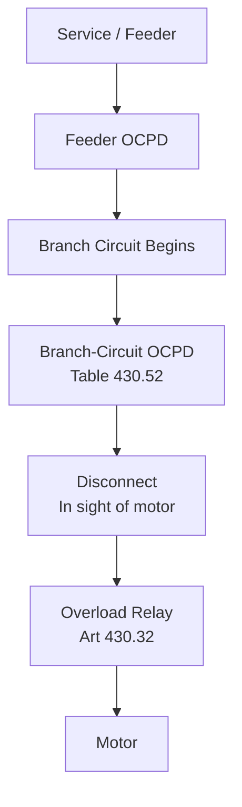

<!--
CONTENT_CLASS: RAG_APPROVED
AI_READ_ACCESS: ALLOWED
STATUS: DRAFT

MODULE_FAMILY: NEC_APPLICATION
MODULE_ID: branch_circuits_vs_feeders_motor_loads
LEARNING_LEVEL: applied

INDEX_TAGS:
  topics: ["branch_circuit", "feeder", "motor_loads", "article_430", "conductor_sizing"]
  systems: ["industrial_control_panel", "machine", "motor_branch_circuit"]
-->

# Branch Circuits vs. Feeders for Motor Loads

## 0. Purpose

This module defines the boundary between a branch circuit and a feeder, explains why that boundary matters for motor installations, and shows how Art 430 changes conductor sizing rules compared to general-load circuits.

## 1. Definitions

A **branch circuit** is the circuit conductors between the final overcurrent device protecting the circuit and the outlet(s) where load is connected. For a motor, the branch circuit begins at the last OCPD before the motor and ends at the motor terminals.

A **feeder** is all conductors between the service equipment (or the source of a separately derived system) and the final branch-circuit overcurrent device. A feeder supplies one or more branch circuits.

The boundary between feeder and branch circuit is always a specific OCPD. Everything upstream of that device is feeder; everything downstream is branch circuit.

## 2. Why motor loads are different

General loads are sized at 100% of continuous load (plus 125% for continuous operation per Art 210.19). Motor loads follow Art 430, which has its own sizing multipliers based on full-load current from the NEC tables — not the motor nameplate.

Key distinction: Art 430.6(A) requires using Table 430.247 (DC), Table 430.248 (single-phase AC), or Table 430.250 (three-phase AC) for conductor and OCPD sizing — not the nameplate FLA.

## 3. Branch-circuit conductor sizing for a single motor

Per Art 430.22(A), branch-circuit conductors supplying a single motor must have an ampacity of at least **125% of the motor FLA** (from the applicable table).

Example — 10 HP, 460V, 3-phase motor:
- Table 430.250 FLA = 14 A
- Required conductor ampacity = 14 × 1.25 = **17.5 A minimum**
- Select from Table 310.15(B)(16) at 75°C: 12 AWG Cu = 20 A (satisfactory)

Common mistake: using the nameplate FLA (often lower than the table value after efficiency correction) and skipping the 125% multiplier. Both errors undersize the conductor.

## 4. Feeder conductor sizing for multiple motors

Per Art 430.24, conductors supplying several motors must have an ampacity of at least:

- **125% of the FLA of the largest motor** in the group, plus
- **100% of the FLA** of all remaining motors

Example — feeder serving three motors: 10 HP (14 A), 7.5 HP (11 A), 5 HP (7.6 A):
- Largest = 14 A × 1.25 = 17.5 A
- Remaining = 11 + 7.6 = 18.6 A
- Total feeder ampacity required = 17.5 + 18.6 = **36.1 A minimum**
- Select conductor from Table 310.15(B)(16) at 75°C: 8 AWG Cu = 50 A (satisfactory)

## 5. Typical single-motor branch circuit layout

```
Service / Feeder
      │
  [Feeder OCPD]         ← last upstream device before branch
      │
  Branch circuit begins
      │
  [Branch-circuit OCPD] ← sized per Table 430.52 (SCPD only — does NOT protect conductors for overload)
      │
  [Disconnect]           ← in sight of motor, lockable off
      │
  [Overload relay]       ← sized per Art 430.32 to protect motor windings
      │
  [Motor]
```

The branch-circuit OCPD (fuse or CB) is not sized to protect the conductor for overload — it is sized for starting current per Table 430.52. The overload relay protects the motor and conductor from sustained overload.

## 6. Mermaid diagram — feeder to motor branch circuit



## 7. Key rules summary

| Item | Rule | Reference |
|------|------|-----------|
| Single-motor branch conductor | ≥ 125% of table FLA | Art 430.22(A) |
| Multi-motor feeder conductor | 125% largest + 100% rest | Art 430.24 |
| Use table FLA, not nameplate | Table 430.250 (3-phase) | Art 430.6(A) |
| Branch-circuit OCPD | Per Table 430.52 | Art 430.52 |
| Overload protection | Per Art 430.32 | Art 430.32 |

## 8. Engineering takeaway

The 125% multiplier is not optional and is not doubled-up with the continuous-load rule from Art 210. Art 430.22 is the controlling rule for motor branch circuits; Art 210.19 does not apply.

When a single feeder supplies mixed loads (motors and non-motor), calculate the motor portion per Art 430.24 and add the non-motor loads separately per their applicable articles.

## Related files

- [NEC Code Reading Fundamentals](./nec_code_reading_fundamentals.md)
- [Motor and Panel Code Application](./motor_and_panel_code_application.md)
- [Conductor and OCPD Sizing Worked Examples](./conductor_ocpd_sizing_examples.md)
- [Practical Article 430 Workflow](./article_430_practical_workflow.md)
