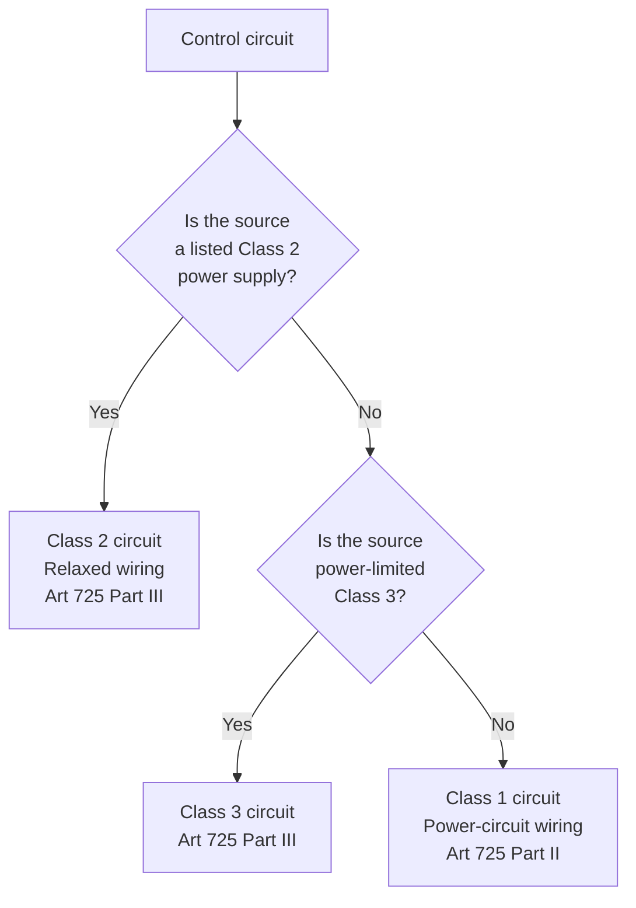

<!--
CONTENT_CLASS: RAG_APPROVED
AI_READ_ACCESS: ALLOWED
STATUS: DRAFT

MODULE_FAMILY: NEC_APPLICATION
MODULE_ID: class1_class2_remote_control_circuits
LEARNING_LEVEL: applied

INDEX_TAGS:
  topics: ["class_1_circuit", "class_2_circuit", "article_725", "control_wiring", "separation_rules"]
  systems: ["industrial_control_panel", "machine"]
-->

# Class 1, Class 2, and Remote-Control Circuits

## 0. Purpose

This module explains how NEC Article 725 classifies remote-control and signaling circuits, what wiring rules apply to each class, and why the classification matters for control panel wiring.

## 1. Why Article 725 matters for machine builders

Most industrial machines use both power wiring (480 VAC, 3-phase) and control wiring (24 VDC, 120 VAC single-phase). Art 725 defines how these two categories must be separated and what wiring methods apply to the lower-energy circuits.

Without understanding Art 725, a panel builder may route 24 VDC PLC I/O wiring in the same conduit or wireway as 480 VAC power conductors — a violation that causes problems at inspection and potential interference in operation.

## 2. Three circuit classes

### Class 1

- Power-limited circuits with **no power limitation** on the source
- Or non-power-limited circuits used for remote control, signaling, or power-limited functions
- **Wiring follows the same rules as power circuits** (Chapter 3 wiring methods, 14 AWG minimum in most cases)
- Common examples: 120 VAC control wiring from a control transformer, motor-starter coil wiring sized to Art 430

Class 1 circuits carry the same wiring burden as power circuits because the source is not power-limited — a fault can drive unlimited current.

### Class 2

- Power-limited circuits sourced from a **listed Class 2 power supply** (≤ 100 VA, ≤ 30V typically)
- **Relaxed wiring methods** permitted — smaller conductors, different cable types, fewer separation requirements when routed as listed Class 2 cable
- Common examples: 24 VDC PLC inputs/outputs, low-voltage sensor wiring, 24 VDC pilot devices
- The power supply listing (e.g., "Listed Class 2 Power Supply") is what makes the circuit Class 2 — not the voltage alone

### Class 3

- Power-limited circuits at higher voltage than Class 2 (≤ 100 VA, 30–150V range)
- Similar relaxed wiring to Class 2 but for higher-voltage low-energy systems
- Common examples: some intercom systems, certain fire-alarm initiating devices
- Less common in industrial machine control

## 3. How to classify a circuit

The classification follows the **power supply**, not the voltage or wire size alone.

Decision logic:

A 24 VDC circuit powered by a standard transformer/rectifier combination (not listed as Class 2) is a **Class 1 circuit** — it must follow power-wiring rules even though it is low voltage.

## 4. Separation requirements

### Class 2 wiring separation (Art 725.136)

Class 2 conductors must be separated from power conductors, Class 1 conductors, and non-power-limited conductors unless:

- The cables are listed for the combination (e.g., Type CL2 with appropriate power wiring jacket), or
- A fixed barrier separates the conductors in the raceway, or
- The conductors are in separate raceways

In practice, this means 24 VDC PLC wiring in a machine panel should be in a **separate wireway** from 480 VAC power wiring. Routing them together in the same wireway without a barrier is a common inspection failure.

### Class 1 separation

Class 1 conductors may occupy the same raceway as power conductors of the same system (Art 725.49). Different voltage systems in the same conduit require specific conditions to be met.

## 5. Practical wiring rules for Class 2 circuits (Art 725.130)

Class 2 conductors installed in raceways may use smaller conductors than the 14 AWG minimum required by power wiring:
- Conductors must be rated at least 300V
- Minimum conductor size: per the Class 2 source listing (often 22 AWG or 24 AWG permitted)
- Must be listed for the installed environment (plenum, riser, or general-purpose cable rating)

When routed in conduit alongside other Class 2 circuits only, standard raceway fill rules of Chapter 3 still apply.

## 6. Conductor color coding and labeling

Art 725 does not specify conductor colors, but NFPA 79 Section 13.2 does for machinery:
- 24 VDC control wiring: typically blue (NFPA 79 convention)
- 120 VAC control wiring: typically red
- Power wiring: black (phase), white or gray (neutral), green or green/yellow (EGC)

Consistent color coding helps during troubleshooting and is required under NFPA 79 for industrial machinery.

## 7. Common mistakes

| Mistake | Rule violated |
|---------|---------------|
| Routing 24 VDC and 480 VAC in same wireway without barrier | Art 725.136 |
| Treating any 24 VDC source as Class 2 (source not listed) | Art 725 — classification follows source listing |
| Using 22 AWG wire on a Class 1 circuit | Class 1 requires minimum 14 AWG (Art 725.49(A)) |
| Omitting cable type labeling on Class 2 runs through walls or above ceilings | Art 725.130 — environment rating required |

## 8. Engineering takeaway

Class 2 wiring freedom comes entirely from the power supply listing. Verify the supply's UL or ETL listing before designing the circuit as Class 2. If in doubt, design it as Class 1 and follow power-circuit rules — an oversized wire never fails inspection.

## Related files

- [NEC Code Reading Fundamentals](./nec_code_reading_fundamentals.md)
- [Motor and Panel Code Application](./motor_and_panel_code_application.md)
- [Grounding and Bonding for Control Panels](./grounding_bonding_control_panels.md)
