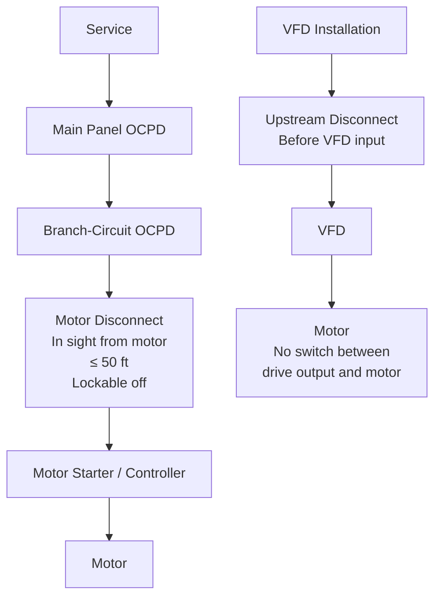

<!--
CONTENT_CLASS: RAG_APPROVED
AI_READ_ACCESS: ALLOWED
STATUS: DRAFT

MODULE_FAMILY: NEC_APPLICATION
MODULE_ID: disconnecting_means_for_machinery
LEARNING_LEVEL: applied

INDEX_TAGS:
  topics: ["disconnect", "disconnecting_means", "article_430", "lockout_tagout", "machinery_safety"]
  systems: ["industrial_control_panel", "machine", "motor_branch_circuit"]
-->

# Disconnecting Means for Machinery

## 0. Purpose

This module covers the NEC requirements for disconnecting means on motors and machinery — what types are permitted, where they must be located, and how VFD installations change the rules.

## 1. Why disconnecting means matter

A disconnecting means allows maintenance personnel to de-energize equipment before servicing. NEC Art 430 Part IX sets the minimum requirements. NFPA 79 Chapter 6 adds requirements for industrial machinery specifically. Both must be satisfied on a machine installation.

## 2. Individual motor disconnects — Art 430.102

Art 430.102(A) requires a disconnecting means for each motor and its controller. The disconnect must be:

- **In sight from the motor location** — visible and not more than 50 ft from the motor
- **Readily accessible** — reachable without climbing or removing obstacles
- **Able to be locked in the open (off) position** — to support lockout/tagout

"In sight" is defined in Art 430.102(A): the disconnect and the motor must be simultaneously visible to someone standing at either location, and the distance must not exceed 50 ft.

## 3. Permitted disconnect types — Art 430.109

Acceptable disconnecting means include:

| Type | Condition |
|------|-----------|
| Motor-circuit switch rated in HP | Must match or exceed motor HP rating |
| Inverse-time circuit breaker | Must be rated for motor circuit use |
| Molded-case switch | Listed for motor circuit use |
| Instantaneous-trip CB (with controller) | Only in listed combination |
| Self-protected combination controller | Listed as a unit |

A general-duty safety switch not rated in HP is not acceptable as a motor disconnect unless specifically listed for the application.

## 4. NFPA 79 requirements for machinery

NFPA 79 Section 6.2 requires:

- A **main disconnecting device** at the machine that disconnects all power to the machine (except for circuits needed to retain memory, hold workpieces, or maintain safe conditions)
- The main disconnect must be **lockable in the off position** with a padlock
- The handle must be operable from outside the enclosure with the enclosure door closed
- The handle must be in a position that is readily accessible to the machine operator

NFPA 79 allows the disconnect to be remote (not on the machine itself) if a remote disconnect is accessible within 50 ft per NEC 430.102.

## 5. Group motor disconnects — Art 430.112

A single disconnect may serve a group of motors under Art 430.112 if all of the following apply:

- A supervisor or qualified person controls the equipment
- The motors drive a single machine (or closely associated machinery)
- Each motor in the group has its own overload protection
- The disconnect is in sight from all motors it serves, or the disconnect is lockable

This exception is common in large machine tools where multiple motors drive parts of the same process and a single main disconnect serves the whole machine.

## 6. VFD installations

A VFD changes the disconnect placement logic. Key points:

- The disconnecting means must be placed **upstream of the VFD input** — not between the drive output and the motor
- Placing a disconnect between the drive and motor can damage the drive if operated under load (some drives require a contactor instead, not a mechanical switch)
- The motor does not need its own separate in-sight disconnect if the VFD has a built-in disconnect rated per Art 430.109 and the VFD is within 50 ft of the motor and in sight
- If the VFD is in a remote panel, provide a separate in-sight disconnect at the motor per 430.102(A)

## 7. Mermaid diagram — disconnect placement

## 8. Common mistakes

- Using a non-HP-rated switch as the motor disconnect
- Locating the disconnect more than 50 ft from the motor without a supplemental in-sight device
- Installing a manual switch between a VFD output and the motor (can cause overvoltage spike on the drive)
- Forgetting the lockout provision — Art 430.102 requires the ability to lock the disconnect open

## 9. Engineering takeaway

The disconnect rule has two purposes: safe maintenance access and lockout/tagout compliance. NEC sets the minimum; OSHA 29 CFR 1910.147 (control of hazardous energy) sets the workplace safety standard. Both apply on a machine installation. A disconnect that satisfies NEC does not automatically satisfy OSHA requirements — verify that the lockout point is practical for the maintenance workflow.

## Related files

- [NEC Code Reading Fundamentals](./nec_code_reading_fundamentals.md)
- [Motor and Panel Code Application](./motor_and_panel_code_application.md)
- [Practical Article 430 Workflow](./article_430_practical_workflow.md)
