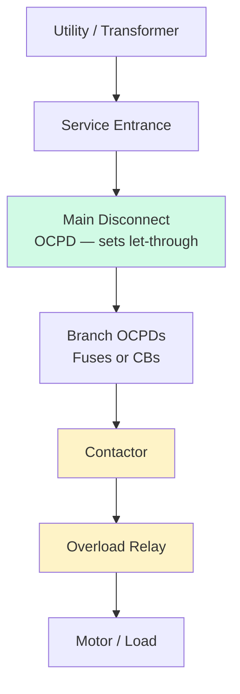

<!--
CONTENT_CLASS: RAG_APPROVED
AI_READ_ACCESS: ALLOWED
STATUS: DRAFT

MODULE_FAMILY: NEC_APPLICATION
MODULE_ID: sccr_workflow
LEARNING_LEVEL: applied

INDEX_TAGS:
  topics: ["SCCR", "short_circuit_current_rating", "article_409", "UL_508A", "fault_current"]
  systems: ["industrial_control_panel"]
-->

# SCCR Workflow for Industrial Control Panels

## 0. Purpose

This module explains what SCCR is, why NEC 409.110 requires it to be marked on every industrial control panel, and provides a step-by-step workflow for determining a panel's SCCR using the component method from UL 508A.

## 1. What SCCR means

**Short-Circuit Current Rating (SCCR)** is the maximum fault current (in kA rms symmetrical) that an industrial control panel can safely interrupt without damage to personnel or equipment.

The SCCR is determined by the lowest-rated component in the fault-current path, unless a higher-rated protective device upstream limits the let-through current to a value that the downstream components can withstand.

Every ICP shipped in the US must have its SCCR marked on the enclosure label per NEC 409.110. The AHJ uses this marking to confirm the panel is suitable for the available fault current at the installation point.

## 2. Why SCCR matters

If the available fault current at the panel exceeds the panel's SCCR, a bolted fault can cause:
- Catastrophic failure of contactors, terminals, or bus bars
- Arc flash, fire, or explosion
- Failure to interrupt the fault, leaving the system energized

The NEC requires a match: **available fault current ≤ panel SCCR**.

## 3. Available fault current

Available fault current (AIC — available interrupting current) at the panel comes from a short-circuit study or can be calculated from utility data and transformer impedance. The engineer of record or the utility provides this value for the installation.

Typical values:
- Small commercial service (< 200 A): 10–22 kA
- Industrial 480V service: 22–65 kA
- Large industrial or substation-fed: 65–100 kA

## 4. Component method — UL 508A Supplement SB

The most common method for establishing ICP SCCR is the component method defined in UL 508A Supplement SB. The workflow:

**Step 1 — List all components in the fault-current path**

Identify every device between the incoming supply and the loads:
- Main disconnect (fuse block, CB, or switch)
- Branch OCPDs (fuses or CBs)
- Contactors and starters
- Overload relays
- Terminal blocks and bus bars
- Any other device carrying fault current

**Step 2 — Find the listed SCCR of each component**

Each listed component has a published SCCR from its listing standard (UL 508, UL 489, etc.). This value appears in the component's datasheet or the UL 508A component directory.

Common default SCCRs (absent specific listing):
- Contactors: 5 kA (unprotected)
- Overload relays: 5 kA (unprotected)
- Terminal blocks: rated at the wire/panel level

**Step 3 — Identify the limiting component**

The panel SCCR is the lowest SCCR of any component in the fault path — unless a protective device upstream raises it.

Example:
- Main fuse block: 100 kA
- Contactor: 5 kA
- Overload relay: 5 kA
→ Panel SCCR = 5 kA (limited by contactor and overload)

**Step 4 — Use a current-limiting device to raise SCCR**

A current-limiting fuse or listed CB placed upstream of a low-rated component can raise the effective SCCR of that component. UL 508A Supplement SB includes tables of "series ratings" — combinations of protective device + downstream component that together achieve a higher SCCR than the component alone.

Example with current-limiting fuse:
- Class J 30A fuse (let-through at 65 kA available: ~3 kA peak)
- Contactor listed for 5 kA with the above fuse: achieves 65 kA SCCR for the combination

This is how a panel with 5 kA-rated contactors can legitimately carry a 65 kA SCCR marking.

## 5. Fault-current path diagram



Green = typically high SCCR. Yellow = commonly the limiting components.

## 6. Practical workflow summary

```
1. Get available fault current (kA) at the panel from engineer or utility
2. List all components in fault-current path
3. Look up listed SCCR for each component
4. Identify lowest SCCR — that is the unprotected panel SCCR
5. If lowest SCCR < available fault current:
   a. Select a current-limiting OCPD
   b. Find the series-rated combination in UL 508A SB tables
   c. Confirm combination SCCR ≥ available fault current
6. Mark the verified SCCR on the enclosure label per NEC 409.110
```

## 7. Common mistakes

| Mistake | Consequence |
|---------|-------------|
| Not checking contactor SCCR (default 5 kA) | Panel marked 65 kA but can only handle 5 kA |
| Using a standard CB instead of current-limiting fuse | Series rating does not apply; SCCR stays at component default |
| Marking SCCR without checking all components in path | Non-compliant marking; potential AHJ rejection |
| Ignoring terminal block SCCR in high-fault installations | Terminal block may be the limiting component |

## 8. Engineering takeaway

SCCR is a system property, not a single component property. A panel is only as strong as its weakest link in the fault-current path. Current-limiting fuses are the most reliable tool for raising SCCR because their let-through current is predictable and tabulated. Always verify the series-rated combination against the UL 508A Supplement SB tables — do not assume that any fuse will work with any contactor.

## Related files

- [NEC Code Reading Fundamentals](./nec_code_reading_fundamentals.md)
- [Motor and Panel Code Application](./motor_and_panel_code_application.md)
- [Practical Article 409 Workflow](./article_409_practical_workflow.md)
- [Conductor and OCPD Sizing Worked Examples](./conductor_ocpd_sizing_examples.md)
