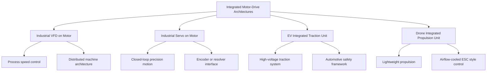

Yes — **the driver can be built into or onto the motor assembly** and still perform reliably. That is already done in industry.

Examples:

- ABB markets **integrated motor drives / EC motors** as compact, simplified-startup solutions. ([ABB Group][1])
- SEW-EURODRIVE’s **MOVIMOT** line combines a gearmotor with an **integrated inverter** for decentralized drive technology. ([SEW-Eurodrive][2])

But the real answer is:

## 1. Is it allowed?

**Yes.** There is no general rule that says a servo drive or VFD must be in a separate cabinet. The requirement is not “separate vs integrated.” The requirement is that the **complete product and machine** meet the applicable safety, EMC, thermal, enclosure, and installation standards. IEC 61800-5-1 covers adjustable-speed power drive systems and their elements for electrical, thermal, fire, mechanical, and energy hazards. IEC 60204-1 then applies at the **machine electrical equipment** level. ([IEC Webstore][3])

---

## 2. What standards matter?

### Industrial servo drives / VFDs

For industrial integrated drives, the core standards stack is:

- **IEC / UL 61800-5-1** for product safety of adjustable-speed power drive systems. UL says UL 508C was withdrawn and replaced by UL 61800-5-1 in North America. ([IEC Webstore][3])
- **IEC 61800-3** for EMC requirements and test methods for AC and DC power drive systems. ([IEC Webstore][4])
- **IEC 61800-5-2** if the drive has functional safety features such as STO, SS1, SLS, etc. ([IEC Webstore][5])
- **IEC 60034-1** for rotating electrical machines. ([IEC Webstore][6])
- **IEC 60529** for enclosure ingress protection, if the drive is mounted on or in the motor and exposed to dust/water. ([IEC Webstore][7])
- **IEC 60204-1** or **NFPA 79** for the machine as installed. IEC 60204-1 applies from the point of connection of supply to the machine electrical equipment; NFPA 79 is the U.S. industrial machinery electrical standard. ([IEC Webstore][8])
- In the U.S., **NEMA MG 1** and **NEMA MG 10012** are also relevant for motor construction, performance, selection, installation, and use. ([NEMA][9])

### EV traction motors with integrated inverter/drive

This is different. **IEC 61800-5-1 explicitly excludes traction and electric-vehicle BDM/CDM** from its scope. For road vehicles, the more relevant frameworks are **ISO 26262** for functional safety of automotive E/E systems and **UNECE R100** for electric power train safety. ([IEC Webstore][3])

### Drone / UAV motor drivers

This is different again:

- **FAA Part 107** governs U.S. small-UAS operation, not component product construction. ([eCFR][10])
- For certificated airborne equipment, **RTCA DO-160** is the recognized environmental qualification framework, and the FAA points to it as acceptable environmental qualification guidance. ([RTCA][11])

So the short version is:

- **Industrial integrated motor+drive:** mature product-standard path
- **EV integrated traction drive:** automotive / traction path
- **Drone integrated ESC+motor:** aerospace/UAS path, often operational and environmental qualification driven rather than industrial-drive-standard driven

---

## 3. Can it be reliable?

**Yes, but only if the design handles the failure mechanisms created by integration.**

The main engineering issues are:

### Thermal coupling

When the inverter/servo electronics are mounted on the motor, the electronics see:

- motor frame temperature
- ambient heat
- reduced cooling margin

That is manageable, but it becomes one of the main design constraints. IEC 61800-5-1 is explicitly concerned with **thermal hazards**, and IEC 60034-1 covers motor rating/performance. ([IEC Webstore][3])

### EMC / cable behavior

Integrated drives can reduce long motor leads, which often helps, but the product still has to meet **IEC 61800-3 EMC** requirements. ([IEC Webstore][4])

### Enclosure/environment

If the electronics are on the motor, the enclosure usually needs stronger environmental protection because it is now in the field, not in a cabinet. That brings **IP rating** and sealing into the center of the design. ([IEC Webstore][7])

### Functional safety

If the integrated drive provides machine safety functions, you are now evaluating safety at the drive level too, not only at the cabinet/control level. That is where **IEC 61800-5-2** enters. ([IEC Webstore][5])

### Serviceability

An integrated unit often reduces wiring and panel space, but replacement strategy changes. In many cases you replace a larger assembly, not just a separate motor or separate drive. That is a design tradeoff, not a standards violation.

---

# 4. The differences between them

## A. Servo drive built into the motor

This is usually the most demanding integration.

### Why

A servo system typically includes:

- power electronics
- encoder/resolver interface
- closed-loop current/velocity/position control
- sometimes functional safety

### Best use

- compact automation axes
- robotics
- packaging
- distributed motion systems

### Main constraints

- thermal design is tighter
- feedback integrity matters more
- EMC/noise control is more critical
- functional safety validation may be required

### Standards emphasis

- IEC/UL 61800-5-1
- IEC 61800-5-2
- IEC 61800-3
- IEC 60034-1
- machine standard: IEC 60204-1 / NFPA 79 ([IEC Webstore][3])

---

## B. VFD built onto / near the motor

This is common in decentralized conveyor/logistics/HVAC/process equipment.

### Best use

- conveyors
- fans
- pumps
- distributed machines
- logistics equipment

### Advantages

- less cabinet space
- shorter motor leads
- simpler distributed architecture
- easier modular installation

### Main constraints

- field enclosure/IP
- thermal rise on the motor-mounted unit
- maintenance access
- vibration/environmental exposure

### Standards emphasis

- IEC/UL 61800-5-1
- IEC 61800-3
- IEC 60034-1
- IEC 60529
- IEC 60204-1 / NFPA 79 ([IEC Webstore][3])

---

## C. Drone ESC built into or attached to the motor/arm

This is absolutely feasible and common in packaged propulsion systems. Hobbywing, for example, markets integrated UAV propulsion systems, and the drone industry widely uses motor/ESC combos. ([HOBBYWING][12])

### But the standards situation is different

For drones, the main frameworks are usually:

- operation rules under **FAA Part 107**
- environmental qualification under **DO-160** for aircraft-grade equipment
- airworthiness requirements depending on certification route

So the question is less “does it meet IEC 61800 like an industrial VFD?” and more “does it meet the applicable aviation/UAS certification and environmental qualification path?” ([eCFR][10])

### Main constraints

- weight
- airflow cooling dependence
- vibration
- moisture/contamination
- high RPM / propeller dynamics
- loss-of-propulsion consequences

---

## D. EV inverter integrated into motor housing

This is also feasible and increasingly common, but **do not treat it like an industrial VFD problem**.

### Why

IEC 61800-5-1 excludes EV traction drive modules from scope. EV systems are developed under automotive and vehicle regulations instead. ([IEC Webstore][3])

### Main constraints

- traction duty cycle
- liquid cooling
- crash and isolation considerations
- ASIL-based safety process
- power density and packaging

---

# 5. What the standards really require in practice

If you build the drive into the motor frame, the design usually must prove these things:

## Electrical safety

Creepage, clearance, insulation coordination, touch safety, protective bonding, temperature limits, and fault protection must satisfy the drive-product standard and installation standard. ([IEC Webstore][3])

## Thermal safety

The electronics must stay inside component and standard temperature limits across worst-case motor heating and ambient conditions. IEC 61800-5-1 explicitly includes thermal hazards. ([IEC Webstore][3])

## EMC

The complete integrated assembly must meet the EMC standard for drives. ([IEC Webstore][4])

## Enclosure/environment

IP rating and environmental protection must match the location and exposure of the mounted drive. ([IEC Webstore][7])

## Functional safety, if claimed

If the product claims STO or other safety functions, those claims fall into IEC 61800-5-2 territory for industrial drives, or into automotive/aerospace safety processes for EV/UAV products. ([IEC Webstore][5])

## Machine-level integration

Even if the motor+drive is certified as a product, the **machine** still has to comply with machine-level electrical rules such as IEC 60204-1 or NFPA 79. Product certification does not replace machine integration duties. ([IEC Webstore][8])

---

# 6. Practical engineering verdict

## Good candidates for integrated motor+drive

- distributed conveyors
- compact packaging modules
- AGV/AMR subsystems
- fans and pumps
- decentralized logistics equipment
- compact servo axes

## Bad candidates or caution cases

- high ambient temperature without strong cooling margin
- heavy contamination unless enclosure/sealing is excellent
- very high power where cabinet cooling and serviceability are better
- harsh vibration/shock without proper qualification
- applications needing easy field replacement of motor and drive separately

---

# 7. Bottom line

**Yes — servo drives, VFDs, and drone motor controllers can be integrated into the motor assembly and be reliable.**
But they are **not judged by the same standards stack**:

- **Industrial servo/VFD integrated motors:** IEC/UL 61800, IEC 60034, IEC 60529, IEC 60204/NFPA 79, NEMA MG family ([IEC Webstore][3])
- **EV integrated traction units:** automotive/traction frameworks such as ISO 26262 and UNECE R100, not IEC 61800-5-1 scope ([IEC Webstore][3])
- **Drone integrated ESC/motor units:** FAA/UAS operational rules plus aviation environmental qualification such as DO-160 for certifiable airborne equipment ([eCFR][10])

So the correct design question is not “can it be integrated?”
It is: **which standards stack applies to this integrated product, and can the design survive its thermal, EMC, environmental, and safety obligations?**

I can turn this into a **repo-ready comparison page** with a standards matrix for industrial vs EV vs drone integrated drives.

[1]: https://www.abb.com/global/en/areas/motion/motors-generators/low-voltage-motors/ec-motors/integrated-motor-drive?utm_source=chatgpt.com "EC motors"
[2]: https://www.seweurodrive.com/products/decentralized-drives-mechatronics/antriebseinheit-/movimot-advanced-drive-unit/movimot-advanced-drive-unit.html?utm_source=chatgpt.com "MOVIMOT® advanced drive unit - SEW Eurodrive"
[3]: https://webstore.iec.ch/en/publication/62103?utm_source=chatgpt.com "IEC 61800-5-1:2022"
[4]: https://webstore.iec.ch/en/publication/65056?utm_source=chatgpt.com "IEC 61800-3:2022"
[5]: https://webstore.iec.ch/en/publication/24556?utm_source=chatgpt.com "IEC 61800-5-2:2016"
[6]: https://webstore.iec.ch/en/publication/65446?utm_source=chatgpt.com "IEC 60034-1:2022"
[7]: https://webstore.iec.ch/en/publication/2452?utm_source=chatgpt.com "IEC 60529:1989+AMD1:1999+AMD2:2013 CSV"
[8]: https://webstore.iec.ch/en/publication/26037?utm_source=chatgpt.com "IEC 60204-1:2016"
[9]: https://www.nema.org/standards/view/motors-and-generators?utm_source=chatgpt.com "Motors and Generators"
[10]: https://www.ecfr.gov/current/title-14/chapter-I/subchapter-F/part-107?utm_source=chatgpt.com "14 CFR Part 107 -- Small Unmanned Aircraft Systems"
[11]: https://www.rtca.org/do-160/?utm_source=chatgpt.com "DO-160 - RTCA"
[12]: https://www.hobbywing.com/en/?utm_source=chatgpt.com "HOBBYWING: UAV Propulsion Systems, RC Motors & ..."

Here is the **next layer**: a practical **standards-and-design comparison** for **integrated motor + drive** architectures.

# Short answer

Yes, you can build the driver into or onto the motor frame and still get a reliable product. The difference is not whether it is “allowed.” The difference is **which standards stack applies** and **which failure modes dominate**.

For **industrial integrated drives**, the core product standards are in the **IEC 61800 family**; **UL 508C has been withdrawn and replaced by UL 61800-5-1** in North America. IEC 61800-5-1 covers electrical, thermal, fire, mechanical, and energy hazards for adjustable-speed power drive systems and explicitly **excludes traction and electric-vehicle drive modules**. IEC 61800-3 covers EMC, IEC 61800-5-2 covers safety-related drive functions, and IEC 60034-1 covers rotating electrical machines. At the machine level, IEC 60204-1 still applies, and enclosure protection is handled through IEC 60529. ([IEC Webstore][1])

For **EV traction**, the standards path is different: ISO 26262 is the functional-safety framework for automotive E/E systems, and UNECE R100 addresses electric power train safety for road vehicles. That is a different regime from industrial 61800-based drive products. ([ISO][2])

For **drone / UAV systems**, industrial drive standards are usually not the main path. FAA Part 107 governs U.S. small-UAS operation, while RTCA DO-160 is the standard environmental qualification framework referenced by FAA guidance for airborne equipment. ([eCFR][3])

# The core differences

## 1. Integrated industrial VFD on the motor

This is common in:

- conveyors
- fans
- pumps
- distributed material handling
- decentralized machine modules

### Main design priorities

- field installation simplicity
- reduced cabinet space
- shorter motor leads
- acceptable thermal margin
- EMC compliance in field wiring

### Main standards emphasis

- IEC / UL 61800-5-1
- IEC 61800-3
- IEC 60034-1
- IEC 60529
- IEC 60204-1 / NFPA 79 at machine level

### Main risks

- enclosure temperature
- ingress protection
- field serviceability
- vibration and contamination exposure

---

## 2. Integrated servo drive on the motor

This is more demanding than an integrated VFD because the system usually includes:

- closed-loop current control
- velocity loop
- position loop
- encoder/resolver interface
- possibly STO or other safety functions

### Main design priorities

- feedback integrity
- loop stability
- EMC around encoder signals
- thermal control of dense electronics
- functional-safety validation if safety functions are claimed

### Main standards emphasis

- IEC / UL 61800-5-1
- IEC 61800-3
- IEC 61800-5-2
- IEC 60034-1
- IEC 60204-1 at machine level

### Main risks

- encoder noise
- control instability
- safety architecture mistakes
- thermal coupling between motor and electronics

---

## 3. EV inverter integrated with traction motor

This is a different engineering category.

IEC 61800-5-1 explicitly excludes traction and EV drive modules from scope, and IEC 60034-1 excludes rotating electrical machines for road vehicles from its scope. So the industrial motor-drive standards path is not the right primary lens here. ([IEC Webstore][1])

### Main design priorities

- torque density
- liquid cooling integration
- vehicle package volume
- crash and isolation behavior
- automotive functional safety process

### Main standards emphasis

- ISO 26262
- UNECE R100
- vehicle-specific OEM specs and validation plans

### Main risks

- HV isolation under vehicle conditions
- thermal cycling
- vibration
- crash-event robustness
- ASIL-driven safety obligations

---

## 4. Drone motor driver integrated with the propulsion unit

This is also a separate category.

### Main design priorities

- minimum mass
- thrust efficiency
- airflow-based cooling
- vibration tolerance
- moisture and contamination resistance
- high-RPM reliability

### Main standards emphasis

- FAA operational framework depending on mission/use case
- RTCA DO-160 environmental qualification for airborne equipment in certifiable contexts

### Main risks

- cooling collapse at certain operating points
- propeller-induced vibration
- high-speed bearing and rotor issues
- weather exposure
- loss-of-propulsion consequences

# Standards comparison matrix

| Architecture                         | Primary standards path                                                 | What it focuses on                                                          |
| ------------------------------------ | ---------------------------------------------------------------------- | --------------------------------------------------------------------------- |
| Industrial VFD integrated on motor   | IEC/UL 61800-5-1, IEC 61800-3, IEC 60034-1, IEC 60529, IEC 60204-1     | product safety, EMC, motor product behavior, enclosure, machine integration |
| Industrial servo integrated on motor | IEC/UL 61800-5-1, IEC 61800-3, IEC 61800-5-2, IEC 60034-1, IEC 60204-1 | product safety, EMC, functional safety, motor behavior, machine integration |
| EV integrated traction unit          | ISO 26262, UNECE R100                                                  | automotive functional safety and electric power train safety                |
| Drone integrated propulsion driver   | FAA operational rules + RTCA DO-160 in certification-oriented contexts | airborne environmental qualification and mission-use framework              |

# Reliability question: what actually decides it

Whether the integrated unit is reliable comes down to five engineering checks.

## Thermal margin

If the electronics sit on the motor, they must survive:

- motor frame heat
- ambient heat
- reduced airflow
- worst-case load duty

This is usually the first thing that makes or breaks an integrated design. IEC 61800-5-1 explicitly covers thermal hazards. ([IEC Webstore][1])

## EMC and signal integrity

Integrated designs can reduce long motor leads, which helps, but servo feedback and field wiring can still be difficult. EMC compliance for industrial drive products is handled through IEC 61800-3. ([IEC Webstore][4])

## Enclosure and ingress protection

If the drive leaves the cabinet and goes onto the motor, the enclosure now has to survive the real environment. IEC 60529 is the IP framework used for that. ([IEC Webstore][5])

## Functional safety boundary

If the integrated drive claims STO or other safety functions, that is not just a convenience feature. It moves the design into safety-related drive territory under IEC 61800-5-2 for industrial drives. ([IEC Webstore][6])

## Machine-level integration

Even if the integrated motor-drive is compliant as a product, the **machine** still has to be designed correctly. IEC 60204-1 starts at the point of connection of the supply to the machine electrical equipment. Product certification does not remove the machine builder’s duties. ([IEC Webstore][7])

# Practical engineering verdict

## Good candidates for integrated drive-on-motor

- distributed conveyor zones
- compact packaging stations
- pump skids
- fan arrays
- AMR / AGV subsystems
- compact servo axes with clean environmental control

## Bad candidates or caution cases

- high ambient temperature with weak cooling margin
- harsh washdown without strong enclosure design
- severe vibration unless qualified
- very high-power axes where cabinet serviceability is better
- applications where separate replacement of motor and drive is operationally important

# The clean design rule

Use this decision logic:

- If it is **industrial machinery**, think **IEC/UL 61800 + IEC 60034 + IEC 60204 + IP/EMC**. ([IEC Webstore][1])
- If it is **road-vehicle traction**, shift to **ISO 26262 + UNECE R100**. ([ISO][2])
- If it is **airborne/UAV propulsion**, shift to **FAA/airworthiness context + DO-160 qualification logic**. ([eCFR][3])

# Bottom line

Integrated drive-on-motor designs are real, common, and reliable when the design is disciplined. But **servo**, **VFD**, **EV traction**, and **drone propulsion** are not the same problem wearing different packaging.

The standards boundary is different, the failure modes are different, and the validation burden is different.

I can turn this into a **repo-ready markdown file** with:

- a standards matrix
- architecture diagrams
- design tradeoff tables
- “where integrated drives make sense / where they do not” sections.

[1]: https://webstore.iec.ch/en/publication/62103?utm_source=chatgpt.com "IEC 61800-5-1:2022"
[2]: https://www.iso.org/standard/68383.html?utm_source=chatgpt.com "Road vehicles — Functional safety - ISO 26262-1:2018"
[3]: https://www.ecfr.gov/current/title-14/chapter-I/subchapter-F/part-107?utm_source=chatgpt.com "14 CFR Part 107 -- Small Unmanned Aircraft Systems"
[4]: https://webstore.iec.ch/en/publication/65056?utm_source=chatgpt.com "IEC 61800-3:2022"
[5]: https://webstore.iec.ch/en/publication/2452?utm_source=chatgpt.com "IEC 60529:1989+AMD1:1999+AMD2:2013 CSV"
[6]: https://webstore.iec.ch/en/publication/24556?utm_source=chatgpt.com "IEC 61800-5-2:2016"
[7]: https://webstore.iec.ch/en/publication/26037?utm_source=chatgpt.com "IEC 60204-1:2016"

Below is a **repo-ready comparison page** you can drop into your repo.

---

# `control-standards/rag/design_framework/motor_systems/integrated_motor_drive_architecture_comparison.md`

````markdown
---
CONTENT_CLASS: RAG_APPROVED
AI_READ_ACCESS: ALLOWED
STATUS: DRAFT
INDEX_TAGS: integrated_drive, motor_integrated_inverter, servo, vfd, ev_traction, drone_propulsion, standards_comparison
---

# Integrated Motor-Drive Architecture Comparison

## Purpose

This document compares integrated motor-drive architectures across four domains:

- industrial VFD integrated on or near the motor
- industrial servo drive integrated on or near the motor
- EV traction motor with integrated inverter
- drone / UAV propulsion motor with integrated driver

The goal is to distinguish:

- where integration is practical
- what design tradeoffs change
- which standards family applies
- what reliability risks dominate

This document is a design-framework comparison. It does not replace product certification, machine integration review, or application-specific qualification.

---

## Core Concept

An integrated motor-drive architecture places some or all power electronics at the motor assembly rather than in a separate cabinet or remote enclosure.

Typical integration patterns:

- drive mounted on motor housing
- drive mounted on gearbox/motor assembly
- propulsion controller integrated into motor-arm module
- traction inverter integrated into motor/transaxle housing

---

## High-Level Architecture Comparison


````

---

## Why Integration Is Used

Typical reasons to integrate the drive with the motor include:

- reduced cabinet space
- shorter motor leads
- reduced panel wiring
- modular machine design
- decentralized architecture
- simplified field installation

In industrial adjustable-speed power drive systems, the IEC 61800-5-1 scope explicitly includes adjustable-speed power drive systems or their elements, including the power conversion/control module and a motor or motors, while excluding traction and electric-vehicle BDM/CDM.
That means integrated industrial motor-drive products are within the expected product-standard space, but EV traction units are not. ([IEC Webstore][1])

---

## Standards Boundary by Domain

### 1. Industrial integrated VFD

Primary standards family:

- IEC / UL 61800-5-1
- IEC 61800-3
- IEC 60034-1
- IEC 60529
- IEC 60204-1
- NFPA 79 for U.S. machine integration

IEC 61800-5-1 covers safety requirements for adjustable-speed electrical power drive systems with respect to electrical, thermal, fire, mechanical, energy, and related hazards. IEC 61800-3 is the EMC standard for power drive systems. IEC 60204-1 applies at the machine electrical-equipment level. ([IEC Webstore][1])

### 2. Industrial integrated servo

Primary standards family:

- IEC / UL 61800-5-1
- IEC 61800-3
- IEC 61800-5-2 when safety functions are claimed
- IEC 60034-1
- IEC 60204-1
- NFPA 79 for U.S. machine integration

IEC 61800-5-2 covers safety requirements and functional-safety requirements for adjustable-speed electrical power drive systems. That matters when the integrated servo claims STO or other safety-related functions. ([IEC Webstore][2])

### 3. EV integrated traction unit

Primary standards family:

- ISO 26262
- UNECE R100
- OEM automotive validation requirements

IEC 61800-5-1 explicitly excludes traction and electric-vehicle BDM/CDM, so EV integrated traction units should not be treated as ordinary industrial integrated drives. ISO 26262 is the automotive functional-safety framework for road vehicles. ([IEC Webstore][1])

### 4. Drone / UAV integrated propulsion unit

Primary standards family depends on use case, but typically includes:

- FAA / aviation operational or certification framework
- RTCA DO-160 for environmental qualification in certification-oriented airborne equipment

FAA Part 107 governs small unmanned aircraft systems operations in the U.S., while DO-160 is the established environmental test framework for airborne equipment. ([eCFR][3])

---

## Standards Comparison Matrix

| Architecture                         | Primary standards path                                                 | Main focus                                                     |
| ------------------------------------ | ---------------------------------------------------------------------- | -------------------------------------------------------------- |
| Industrial VFD integrated on motor   | IEC/UL 61800-5-1, IEC 61800-3, IEC 60034-1, IEC 60529, IEC 60204-1     | product safety, EMC, enclosure, machine integration            |
| Industrial servo integrated on motor | IEC/UL 61800-5-1, IEC 61800-3, IEC 61800-5-2, IEC 60034-1, IEC 60204-1 | product safety, EMC, functional safety, feedback-driven motion |
| EV integrated traction unit          | ISO 26262, UNECE R100, OEM automotive validation                       | automotive functional safety, HV traction safety               |
| Drone integrated propulsion unit     | FAA/UAS framework + DO-160 in certification-oriented contexts          | airborne environmental qualification, propulsion reliability   |

---

## Reliability Question

The driver can be built into or onto the motor frame and still perform reliably. Reliability depends less on the packaging choice itself and more on whether the integrated design controls the failure mechanisms introduced by that packaging.

The most important review categories are:

1. thermal margin
2. EMC and signal integrity
3. enclosure / ingress protection
4. functional-safety boundary
5. serviceability and replacement strategy

---

## Thermal Design Differences

### Industrial VFD on motor

Main thermal concern:

- electronics mounted in a field environment rather than a cooled cabinet

Typical risks:

- enclosure heat rise
- reduced convection
- ambient temperature derating
- contamination affecting cooling surfaces

### Industrial servo on motor

Main thermal concern:

- dense electronics plus feedback electronics plus control-loop performance sensitivity

Typical risks:

- encoder interface thermal drift
- loop instability at temperature extremes
- tighter packaging margin than simple VFD systems

### EV integrated traction unit

Main thermal concern:

- high power density under vehicle duty cycles

Typical risks:

- thermal cycling
- liquid-cooling integration errors
- traction overload behavior

### Drone propulsion unit

Main thermal concern:

- heavy dependence on airflow and low mass

Typical risks:

- reduced cooling at off-design airflow
- high-RPM losses
- limited thermal inertia

IEC 61800-5-1 explicitly addresses thermal hazards for industrial power-drive systems. ([IEC Webstore][1])

---

## EMC and Wiring Differences

### Industrial VFD integrated on motor

Advantages:

- shorter motor leads
- reduced reflected-wave concerns on long output cables

Challenges:

- field wiring EMC
- line-side noise
- grounding and bonding quality

### Industrial servo integrated on motor

Advantages:

- reduced motor lead complexity

Challenges:

- encoder/resolver signal integrity
- safety-signal wiring
- more sensitive control electronics

### EV integrated traction unit

Challenges:

- HV switching noise
- vehicle grounding architecture
- inverter-motor packaging constraints

### Drone propulsion unit

Challenges:

- compact, high-speed switching
- EMI near control electronics, radios, and sensors

IEC 61800-3 is the EMC standard for industrial power-drive systems. It is the correct industrial reference for VFD/servo EMC treatment, but not the sole governing framework for EV or airborne systems. ([IEC Webstore][4])

---

## Enclosure and Environmental Differences

### Industrial integrated drives

The product often leaves the panel and enters the machine field environment. That makes ingress protection, sealing, and mechanical robustness more important. IEC 60529 is the ingress-protection framework used for this kind of enclosure classification. ([IEC Webstore][1])

### EV integrated units

Environmental conditions include:

- vehicle vibration
- splash exposure
- thermal cycling
- crash-adjacent safety conditions

### Drone integrated units

Environmental conditions include:

- propeller vibration
- moisture exposure
- airborne dust
- lightweight packaging limitations

### Practical implication

An integrated drive that is acceptable in a clean packaging machine may be a poor choice in washdown, offshore, or severe outdoor environments unless the enclosure and qualification plan are upgraded.

---

## Functional Safety Differences

### Industrial servo / VFD with safety functions

If the integrated drive claims safety functions such as STO, then the design review moves into IEC 61800-5-2 territory for industrial drive systems. That is a product-level functional-safety issue, not just a controls convenience feature. ([IEC Webstore][2])

### EV integrated units

Functional safety is evaluated in the automotive process framework, especially ISO 26262. ([ISO][5])

### Drone propulsion units

Safety treatment depends strongly on whether the use case is hobby, commercial operations, or certification-oriented airborne equipment. Operational rules and airworthiness/environmental qualification become more important than industrial-drive safety standards. ([eCFR][3])

---

## Serviceability Differences

| Architecture              | Typical service model                                       |
| ------------------------- | ----------------------------------------------------------- |
| Industrial VFD on motor   | replace decentralized module or motor-drive assembly        |
| Industrial servo on motor | replace precision axis assembly or integrated servo package |
| EV traction unit          | service at vehicle assembly / subsystem level               |
| Drone propulsion unit     | replace propulsion module or ESC/motor pair                 |

Integrated products can simplify installation but often reduce the ability to replace motor and drive independently.

---

## Good Candidates for Integrated Designs

### Industrial VFD integrated on motor

Good candidates:

- conveyors
- distributed logistics zones
- fan arrays
- pump skids
- modular machine sections

### Industrial servo integrated on motor

Good candidates:

- compact indexing axes
- packaging modules
- distributed motion platforms
- space-constrained automation axes

### EV integrated traction unit

Good candidates:

- tightly packaged traction systems
- e-axles
- automotive subsystems where cooling and packaging are co-designed

### Drone propulsion unit

Good candidates:

- UAV propulsion modules
- light, direct-drive propeller systems
- compact distributed propulsion arrangements

---

## Poor Candidates or Caution Cases

Use caution when:

- ambient temperature is high
- washdown or corrosion exposure is severe
- serviceability requires separate replacement of motor and drive
- feedback wiring is highly noise-sensitive
- power density is high but cooling margin is weak
- vibration/shock qualification is not well established

---

## Comparison Table: Main Differences

| Topic                      | Industrial VFD on Motor           | Industrial Servo on Motor                | EV Integrated Unit           | Drone Integrated Unit               |
| -------------------------- | --------------------------------- | ---------------------------------------- | ---------------------------- | ----------------------------------- |
| Primary mission            | process speed control             | precision motion                         | traction                     | propulsion                          |
| Typical supply context     | facility AC                       | facility AC / DC bus within machine      | HV traction battery          | battery DC                          |
| Typical control complexity | moderate                          | high                                     | high                         | moderate                            |
| Feedback dependence        | low to moderate                   | high                                     | high                         | low to moderate depending on system |
| Functional safety path     | industrial drive + machine safety | industrial drive safety + machine safety | automotive functional safety | aviation/UAS framework              |
| Cooling dependence         | enclosure and ambient             | enclosure + control density              | advanced thermal integration | airflow and mass limits             |
| Serviceability             | modular field replacement         | axis-level replacement                   | subsystem replacement        | propulsion-module replacement       |

---

## Design Review Questions

Before selecting an integrated architecture, answer:

1. Is the application industrial machinery, road traction, or airborne propulsion?
2. Which standards family governs the product?
3. Does the thermal design still work when electronics sit at the motor?
4. Does the enclosure rating match the actual environment?
5. Is EMC easier or harder with the chosen packaging?
6. Are safety functions claimed at the integrated-drive level?
7. Is field replacement strategy acceptable?

---

## Common Mistakes

### Mistake 1 — Treating all integrated motor-drive products as the same category

They are not. Industrial integrated VFDs, industrial integrated servos, EV traction units, and drone propulsion modules live in different standards and validation regimes.

### Mistake 2 — Assuming product compliance removes machine-level duties

Even if the integrated industrial drive is a compliant product, the machine still has to comply with machine-level electrical requirements such as IEC 60204-1 or NFPA 79. ([IEC Webstore][6])

### Mistake 3 — Underestimating thermal coupling

A design that works in a cabinet may fail when mounted directly on a hot motor frame.

### Mistake 4 — Ignoring service strategy

Integrated packaging may simplify installation while making maintenance more expensive or slower.

---

## Bottom Line

Yes, a servo drive, VFD, EV inverter, or drone motor driver can be integrated into or onto the motor assembly and still perform reliably.

But the engineering answer depends on:

- the application domain
- the governing standards family
- the thermal and EMC design
- the environmental exposure
- the safety and serviceability requirements

The correct question is not "can it be integrated?"
The correct question is "which standards path applies, and does the integrated architecture survive its actual operating environment?"

```

---

## What I would add next

The strongest follow-up files are:

1. `integrated_drive_failure_modes_and_tradeoffs.md`
2. `industrial_vs_ev_vs_drone_motor_drive_standards_matrix.md`
3. `motor_mounted_drive_thermal_and_emc_design_notes.md`
4. `integrated_drive_serviceability_and_field_replacement_review.md`

I can generate those next.
::contentReference[oaicite:12]{index=12}
```

[1]: https://webstore.iec.ch/en/publication/62103 "IEC 61800-5-1:2022 | IEC"
[2]: https://webstore.iec.ch/en/publication/24556 "IEC 61800-5-2:2016 | IEC"
[3]: https://www.ecfr.gov/current/title-14/chapter-I/subchapter-F/part-107 "
    eCFR :: 14 CFR Part 107 -- Small Unmanned Aircraft Systems (FAR Part 107)
  "
[4]: https://webstore.iec.ch/en/publication/65056 "IEC 61800-3:2022 | IEC"
[5]: https://www.iso.org/standard/68383.html " ISO 26262-1:2018 - Road vehicles — Functional safety — Part 1: Vocabulary"
[6]: https://webstore.iec.ch/en/publication/26037 "IEC 60204-1:2016 | IEC"
