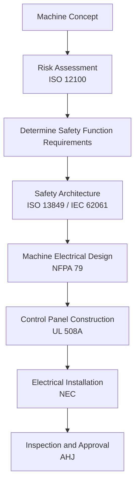

https://kyawminthu20.github.io/Control-System-Tools/crosswalks/standards-decision-workflow/
I reviewed the **Standards Decision Workflow** page. The concept is strong. It already frames the standards in a lifecycle sequence. However, to make it a **practical engineering decision tool**, several structural improvements are needed.

Below are **targeted recommendations**.

---

# 1. Clarify the Workflow Purpose at the Top

Right now the page jumps into steps. Add a short **purpose statement** so users know when to use the workflow.

Recommended addition:

**Purpose of this Workflow**

This workflow helps engineers determine **which standards apply at each stage of industrial machine design and installation** in the United States.

It is intended for:

- Control engineers
- Machine builders
- Panel designers
- System integrators

The workflow links the major standards used in industrial automation:

- ISO 12100 (risk assessment)
- ISO 13849 / IEC 62061 (functional safety)
- NFPA 79 (machine electrical design)
- UL 508A (control panel construction)
- NEC (electrical installation)

This framing prevents confusion about **scope overlap**.

---

# 2. Add a Visual Workflow Diagram

The page is text-driven. A **Mermaid diagram** would make it far easier to understand.

Example:



Your site already supports **Mermaid**, so this fits your architecture perfectly.

---

# 3. Add a “Decision Questions” Layer

Engineers think in **questions**, not standards.

Add a short **decision block** under each step.

Example:

### Step 2 — Risk Assessment

Key question:

**Can this machine cause injury?**

If YES → Perform risk assessment according to **ISO 12100**

Outputs:

- Identified hazards
- Risk reduction requirements
- Safety functions

---

### Step 3 — Safety Function Design

Key question:

**What reliability must the safety function achieve?**

Use:

- ISO 13849 → Performance Level (PL)
- IEC 62061 → Safety Integrity Level (SIL)

Outputs:

- Required PLr or SIL
- Safety architecture

---

This makes the page much more actionable.

---

# 4. Strengthen the NFPA 79 / NEC Boundary

Many engineers misunderstand this relationship.

Add a small clarification box:

**Machine Design vs Electrical Installation**

| Standard | Scope                                             |
| -------- | ------------------------------------------------- |
| NFPA 79  | Electrical design of industrial machines          |
| UL 508A  | Construction of control panels                    |
| NEC      | Installation of electrical equipment in buildings |

NFPA 79 governs **machine wiring**, while NEC governs **facility wiring**.

---

# 5. Add “Common Engineering Mistakes”

A short section like this will make the page very valuable.

Example:

### Common Mistakes

1. Designing safety circuits before performing risk assessment
2. Assuming NEC defines machine electrical design
3. Ignoring SCCR requirements when selecting components
4. Installing panels without verifying available fault current
5. Mixing NFPA 79 and UL 508A requirements incorrectly

This helps engineers avoid real-world problems.

---

# 6. Add a “Typical Machine Compliance Stack”

At the end of the page, add a concise stack summary.

Example:

**Typical Industrial Machine Compliance Stack**

```
Risk Assessment
ISO 12100

Safety Architecture
ISO 13849 / IEC 62061

Machine Electrical Design
NFPA 79

Control Panel Construction
UL 508A

Electrical Installation
NEC

Inspection
Authority Having Jurisdiction (AHJ)
```

This reinforces the workflow.

---

# 7. Add One Practical Example

The page would be much stronger if it contained a **simple machine example**.

Example:

### Example — Automated Conveyor System

1. Risk assessment identifies pinch hazards
2. Safety function required: guard door interlock
3. Required PLr = PL d
4. Safety circuit designed using ISO 13849
5. Machine wiring designed using NFPA 79
6. Control panel built to UL 508A
7. Machine installed according to NEC
8. AHJ inspection completed

This bridges theory and practice.

---

# 8. Minor Technical Improvements

Consider adding:

- **Edition references** (NEC 2023, NFPA 79 2024, etc.)
- Links to each standard page in your site
- A **“Last reviewed”** date
- A small **scope disclaimer**

---

# Overall Assessment

The page concept is **excellent**. It already contains the right standards and order.

What it needs is:

- clearer **purpose**
- **visual workflow**
- **decision questions**
- **practical examples**

Those changes will transform the page from a **reference page** into a **real engineering workflow tool**.

---

If you'd like, I can also show you **the ideal structure for the entire Control-System-Tools website**, including the **five core pages that would make it feel like a professional engineering standards platform**.
