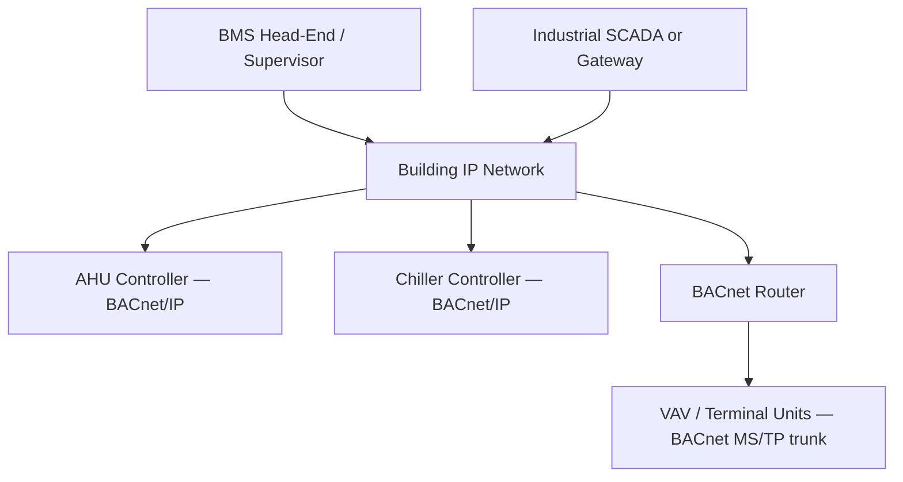

<div class="page-header">
  <span class="page-header__label">Industrial Communications</span>
  <h1>BACnet/IP</h1>
  <p>The building-automation protocol industrial controls engineers meet at the HVAC boundary — where discovery is broadcast-based and multi-subnet sites need BBMD to work at all.</p>
</div>

## Overview

BACnet (ASHRAE 135) is the dominant open protocol in building automation — HVAC controllers, air handlers, chillers, VAV boxes, meters, and building management systems (BMS). BACnet/IP is its Ethernet/UDP transport, using the well-known port UDP 47808 (0xBAC0). A controls engineer from the industrial side typically meets it when a process system must exchange data with facility systems: cleanroom pressure and AHU status into the SCADA, production heat-rejection demands to the chiller plant, or a plant-wide energy dashboard.

The data model is object-oriented: every device exposes a set of **objects**, each with typed **properties**. The workhorse objects map naturally to I/O thinking — Analog Input (AI), Analog Output (AO), Binary Input (BI), Binary Output (BO), plus Analog Value (AV) and Binary Value (BV) for internal/software points. Each object is addressed by type and instance number within its device, and the property you almost always want is `Present_Value`. Reading "AI-3 Present_Value from device 210045" is the BACnet equivalent of reading a register — but discovery, not configuration, is how you normally find it.

Richer object types exist beyond the I/O set — Schedule, Calendar, Trend Log, Notification Class, Loop — which is where BACnet stops looking like a register map and starts looking like a distributed BMS. For point integration you rarely touch these, but knowing they exist explains behavior: a setpoint that changes "by itself" is usually a Schedule object doing its job.



## Where It Is Used

- BMS-to-field-controller communication across a building or campus IP network.
- Industrial SCADA/PLC integration with facility HVAC — cleanroom environmental data, chilled water and compressed-services status, utility metering.
- Gateways bridging BACnet to industrial protocols (Modbus TCP, OPC UA) at the facility/process boundary.
- Below the IP layer, many field devices actually live on BACnet MS/TP (an RS-485 serial variant) behind BACnet routers — from the IP side you see them as devices on another BACnet network number. This page covers the IP side; MS/TP has its own serial wiring rules.
- Newer deployments may use BACnet/SC (secure, TLS/WebSocket-based); verify what the site actually runs before assuming plain BACnet/IP.

## Network Design

- **Transport:** UDP port 47808 by default (additional ports such as 47809+ appear where multiple BACnet/IP networks share one IP subnet). No TCP session — every request/response is a UDP exchange.
- **Device instance numbers are the site-wide identity.** Each device has a device object whose instance number (range 0 to 4194302) must be unique across the *entire* BACnet internetwork — not just per subnet. Duplicate device instances are a classic cause of intermittent, confusing misbehavior because responses race. A written site numbering plan (e.g., ranges per building/floor/system) is normally the facility owner's document — get it, and get your gateway's instance assigned in it.
- **Discovery is broadcast-based.** A client broadcasts `Who-Is` and devices answer `I-Am` (carrying their device instance and address). This works effortlessly on one subnet and not at all across routers, because IP routers do not forward broadcasts — which leads to:
- **BBMD — the classic multi-subnet trap.** A BACnet Broadcast Management Device (a function usually enabled in one controller or router per subnet) forwards BACnet broadcasts between subnets using unicast, based on its Broadcast Distribution Table (BDT) listing its peer BBMDs. Devices on a subnet without their own BBMD can instead register with a remote BBMD as a **Foreign Device** (FDR). If discovery works locally but a device "doesn't exist" from the head-end across a router, the BBMD/BDT configuration is the first suspect — before anything else.
- **BACnet network numbers:** each link (each IP subnet acting as a BACnet network, each MS/TP trunk) gets a BACnet network number, unique across the site, so routed messages can be addressed. This is a separate numbering plan from IP subnets — confusing the two is common.
- **Determinism:** none. BACnet/IP is supervisory-grade monitoring and setpoint traffic; do not route interlocks through it.

Integration information worth recording before commissioning:

- device instance number and IP address per device, cross-referenced to the site numbering plan;
- BACnet network number per link, and which physical link it corresponds to;
- BBMD locations, their BDT contents, and any foreign-device registrations (with time-to-live);
- object type/instance/property per consumed point, taken from the live object list;
- write priorities agreed with the BMS integrator per commandable object.

## Configuration

1. **Assign IP settings** per the building network plan (these are ordinary IP devices; RFC1918 addressing such as 192.168.x.x / 10.x.x.x is typical).
2. **Assign the device instance number** from the site plan and set it in the device; confirm it is not the vendor default (many devices ship with a default instance, and two unconfigured devices of the same brand collide).
3. **Set the BACnet network number** for each port/link on routers and multi-network devices, per the site network-number plan.
4. **Configure BBMD/FDR** where subnets are crossed: enable the BBMD function on one device per subnet, populate matching BDTs on all peer BBMDs, or register isolated devices as foreign devices with an existing BBMD. Verify with the facility integrator — sites often already have BBMDs, and adding an uncoordinated one causes duplicate broadcast forwarding.
5. **Map the points.** Discover the device, browse its object list, and record object type + instance + property for every point consumed (e.g., `Device 210045 / AI-3 / Present_Value` = supply air temp). Point lists from the mechanical contractor are frequently stale — trust the live object list.
6. **Choose COV vs polling.** BACnet supports Change-of-Value (COV) subscriptions: the client subscribes to an object and the device notifies on change, which scales far better than polling many points. Support varies by device and by property; where COV is unsupported or subscription counts are limited, fall back to polling at a deliberate rate rather than the driver default.
7. **Mind writable points and priority arrays.** Commandable objects (notably AO/BO/AV/BV) use a 16-level priority array; writing `Present_Value` at a given priority interacts with the BMS's own commands. Agree priorities with the BMS integrator before writing anything — releasing a command (writing NULL) matters as much as writing it.
8. **Check units and reliability properties.** Analog objects carry an engineering-units property and typically a `Reliability`/`Status_Flags` indication. Map the units explicitly rather than assuming (metric vs imperial mismatches between facility and process systems are routine), and bring the status flags into the consuming system so a failed sensor reads as failed, not as a plausible frozen value.

## Commissioning Checks

- [ ] Device instance unique site-wide and recorded in the facility's numbering plan (not a vendor default).
- [ ] BACnet network numbers unique per link and consistent with the site plan.
- [ ] Who-Is/I-Am discovery verified from the same subnet first, then from across each router that matters.
- [ ] BBMD placement agreed with the facility integrator: one per subnet, BDTs consistent on all peers, foreign-device registrations (and their re-registration time-to-live) configured where used.
- [ ] UDP 47808 permitted through any firewalls between the consuming system and the devices.
- [ ] Every mapped point read back live and sanity-checked against the physical process (a fan status that never changes is a mapping error waiting to be found in winter).
- [ ] COV subscriptions verified to deliver notifications, and to re-subscribe after a device restart; polling rates set deliberately where COV is not used.
- [ ] Write priorities agreed and tested, including command release (NULL) behavior.
- [ ] Duplicate-instance sweep: discovery run twice comparing responses, and vendor defaults checked on recently added devices.
- [ ] Point list documentation updated from the live object list, not the design submittal.
- [ ] Engineering units and status/reliability flags verified per analog point against the physical process, not just against the contractor's schedule.

## Diagnostics

Layer the approach: IP reachability first (ping the device), then BACnet discovery (Who-Is from the same subnet, then across routers), then object/property reads, then subscription behavior. A free BACnet discovery/browse tool (e.g., YABE-class utilities) on a laptop is the standard first instrument — it separates "device unreachable" from "device reachable but head-end misconfigured".

Wireshark dissects BACnet/IP well, and because the protocol is normally unencrypted UDP, captures are genuinely informative: you can watch Who-Is broadcasts go out and see whether any I-Am returns, watch BBMD-forwarded broadcasts arrive (or not), and read property values in the decode.

```text
bacnet
udp.port == 47808
bvlc
```

The `bvlc` filter isolates the BACnet Virtual Link Control layer — where BBMD forwarding, BDT reads, and foreign-device registration are visible, which is exactly the layer that fails on multi-subnet sites. Verify filter names against the Wireshark version in use.

Capture placement matters for broadcast problems: capture on the subnet where the device lives *and* on the subnet where the client lives — a Who-Is visible on one side and absent on the other localizes the fault to the BBMD path between them.

A workable diagnostic sequence for a missing device:

1. Ping the device IP; if unreachable, it is an IP/network problem, not BACnet.
2. Ranged Who-Is from a laptop on the *same* subnet as the device; if no I-Am, the device's BACnet configuration (port, enable, instance) is the problem.
3. Same Who-Is from the client's subnet; if it now fails, the fault is the BBMD path — capture `bvlc` on both sides.
4. Read a known object (`Device` object properties) directly by address, bypassing discovery; a device that answers directed reads but not discovery confirms a broadcast-handling fault.
5. Only then debug the head-end/gateway driver configuration.

One political note that saves time: on most sites the building network and its BBMDs belong to the facility or BMS contractor, not the process-controls team. Uncoordinated changes to BDTs or an extra BBMD added "to make discovery work" can break the BMS side. Diagnose with captures and read-only tools freely; change broadcast infrastructure only with the owner in the loop.

## Common Faults

| Symptom | Likely causes | First checks |
|---|---|---|
| Device discovered locally but not from across a router | Missing/misconfigured BBMD, BDT entries not matching between peers, foreign-device registration expired | Capture `bvlc` traffic on both subnets; verify one BBMD per subnet and consistent BDTs; check FDR time-to-live |
| Two devices intermittently swap identities / values flip between two sources | Duplicate device instance numbers (often vendor defaults on new devices) | Run discovery and compare I-Am responses per instance; sweep recently added devices for default instances |
| Device pings but no BACnet response | Wrong UDP port (47809+ variants), firewall dropping UDP 47808, BACnet disabled/misconfigured in the device | Confirm the device's configured UDP port; test with a browse tool from the same subnet; check firewall rules |
| Points read but values frozen | COV subscription lapsed after device restart, polling disabled, or stale gateway cache | Re-subscribe and watch for notifications in a capture; verify the client re-subscribes automatically |
| Setpoint writes appear to work then revert | BMS writing at higher priority, or command never released at the old priority | Read the full priority array of the object; agree priority levels with the BMS integrator |
| Whole MS/TP trunk of devices missing from the IP side | BACnet router down, wrong network number on the router port, MS/TP trunk fault | Check router status and network-number config; treat the MS/TP side as a serial bus with its own rules |
| Broadcast storms / duplicate replies after adding a device | Two BBMDs on one subnet, or a device registered as foreign while its subnet already has a BBMD | Inventory BBMDs per subnet with the facility integrator; remove the duplicate function |
| Discovery floods slow the network at scale | Unbounded Who-Is (no instance range) across a large site | Use ranged Who-Is in tools and head-end drivers; schedule full sweeps outside busy periods |

## Related Pages

- [Industrial Communications overview]({{ site.baseurl }}/communications/)
- [Modbus TCP]({{ site.baseurl }}/communications/modbus-tcp/) — the other protocol commonly found on facility meters and packaged equipment
- [OPC UA]({{ site.baseurl }}/communications/opc-ua/) — frequent gateway target when facility data must reach industrial SCADA/historians
- [Modbus RTU]({{ site.baseurl }}/communications/modbus-rtu-rs485/) — serial-side sibling issues comparable to BACnet MS/TP trunks
- [IEC 62443 — Industrial Cybersecurity]({{ site.baseurl }}/standards/cybersecurity/iec-62443/) — zone thinking for the facility/process network boundary
