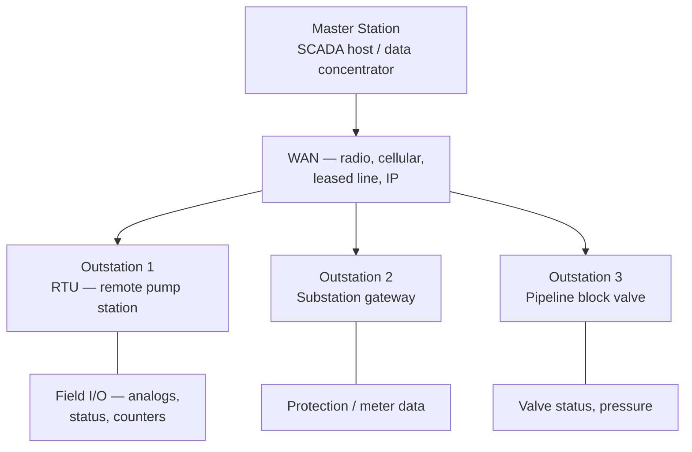

<div class="page-header">
  <span class="page-header__label">Industrial Communications</span>
  <h1>DNP3</h1>
  <p>The SCADA telemetry protocol built for slow, remote, geographically spread utility links — where devices push time-stamped events instead of waiting to be polled.</p>
</div>

## Overview

DNP3 (Distributed Network Protocol, standardized as IEEE 1815) is a SCADA and telemetry protocol widely used across utilities — electric substations and distribution, water and wastewater, and oil and gas pipelines. It grew up on slow, expensive, sometimes unreliable communication links (leased lines, radio, dial-up historically, now often cellular or IP-over-radio), and its design reflects that: it is built to move field data efficiently over links where bandwidth is scarce and round-trips are slow.

The relationship is **master/outstation**. A master station (the SCADA host or a data concentrator) talks to one or more outstations (RTUs, substation gateways, or PLCs with a DNP3 stack in the field). The idea that distinguishes DNP3 from a simple poll-response protocol is **event-driven, report-by-exception reporting**. Rather than the master re-reading every point on every scan, outstations buffer *events* — a point that changed — each carrying a time stamp and a quality flag, and report them when polled or, where configured, push them **unsolicited**. Over a slow link this is a large efficiency win: only what changed crosses the wire, and each change carries the time it happened at the field, not the time the master got around to reading it.



## Where It Is Used

- RTUs and substation gateways in electric utilities — status, analog measurements, and control from distribution and transmission sites back to a control center.
- Geographically distributed SCADA generally: many field sites, one or a few masters, links that are slow or intermittent by nature rather than by fault.
- Water and wastewater remote sites — remote pump stations, reservoirs, lift stations, and well fields reporting levels, flows, and pump status over radio or cellular. See [Water & Wastewater]({{ '/industries/water-wastewater/' | relative_url }}).
- Oil and gas pipeline telemetry — block valves, pressure and flow points, and cathodic protection along a line.

Scope notes: DNP3 is a telemetry/supervisory protocol, not a machine-control fieldbus. It is not designed for deterministic real-time I/O or motion. The version most controls engineers meet is DNP3 over TCP/IP, but a great deal of installed base is still serial DNP3 over radio or leased lines; the two behave the same at the application layer but are diagnosed very differently (see Diagnostics).

## Network Design

- **Serial vs TCP/IP.** DNP3 runs either over a serial link (RS-232/RS-485 to a radio or modem) or over TCP/IP, commonly on TCP port 20000 by convention (verify against the site and the specification). The application-layer object model is identical either way — the difference is the transport underneath and, crucially, how you capture and diagnose it.
- **Master/outstation addressing.** Every DNP3 station has a data-link address. Each message carries a source and destination address, so one master can address many outstations, and outstations know which master to answer. Addresses must be planned and unique within the system; a duplicated outstation address is a classic confusing fault because two field sites answer to the same identity.
- **The object and point model.** DNP3 organizes field data by object *groups*: **Binary Inputs** (status), **Binary Outputs** (controls), **Analog Inputs** (measurements), **Analog Outputs** (setpoints), and **Counters** (accumulators such as flow or energy pulses). Each point of each type has an index. Reading "Analog Input index 5" from an outstation is roughly the DNP3 equivalent of reading a register — but the master normally learns points through events and classes, not by fixed polling of every index.
- **Object variations.** Within a group, each object has *variations* that decide how the value is encoded — for example, whether an analog event is sent as a 16-bit or 32-bit value, and critically whether an event carries a **time stamp** and **quality flags**. Master and outstation must agree on variation, and choosing a variation without time on a time-critical point defeats the purpose of event reporting. Take the supported variations from the device profile, not from assumption.
- **Classes 0/1/2/3 — the polling-priority model.** Every event-capable point is assigned to a **class**:
  - **Class 0** is the *static* (current-value) data — a full snapshot, read by an **integrity poll**.
  - **Classes 1, 2, and 3** are *event* classes, used to prioritize change-driven data. A common convention assigns the most urgent points (e.g., critical status) to Class 1 and less urgent trending data to Class 2 or 3, so the master can poll event classes at different rates. The exact assignment is an engineering decision, not a fixed rule — verify how the specific system is configured.
- **Unsolicited responses.** An outstation can be configured to send events to the master *without being polled* the instant they occur, rather than waiting for the next event poll. This minimizes reporting latency on slow links, but it has to be enabled and the master has to be configured to accept it. If unsolicited reporting is expected but not enabled at both ends, the master silently falls back to only seeing changes at poll time.
- **Determinism:** none in the machine-control sense. DNP3 is supervisory telemetry; do not route interlocks or protection trips through it.

Integration information worth recording before commissioning:

- master and outstation data-link addresses, cross-referenced to a site list;
- transport per link (serial + radio/modem, or TCP/IP with the port in use);
- the point map per outstation — object group, index, and description for every binary/analog/counter point, plus its class assignment;
- which classes are polled and at what rate, and whether unsolicited reporting is enabled;
- time-sync method and expected accuracy for time-stamped events.

## Configuration

1. **Assign data-link addresses.** Set the outstation address and the master address per the site addressing plan; confirm each outstation address is unique.
2. **Set the transport.** For serial, match baud, parity, and stop bits to the radio/modem path and set link-layer timeouts appropriate to the link's round-trip time. For TCP/IP, set the IP addressing (RFC1918 such as 192.168.x.x is typical on private telemetry networks) and the TCP port (commonly 20000 — verify).
3. **Build the point map / device profile.** The **DNP3 device profile document** is the integration contract: it declares exactly which object groups, points, variations, and features the outstation supports. Treat it the way you treat a register map for Modbus — the master configuration must be built from the outstation's actual device profile, not from a generic template.
4. **Assign event classes.** Put each event-capable point into Class 1, 2, or 3 per the reporting-priority design, and leave the static snapshot as Class 0. Getting a critical point into the wrong (rarely polled) class means the master learns about it late.
5. **Choose integrity poll vs event poll rates.** Configure a periodic **integrity poll** (Class 0, plus events) to refresh the full picture and recover any missed events, and configure **event polls** for the event classes at their intended rates. The integrity poll is the safety net that re-synchronizes the master's picture after a comms outage.
6. **Enable unsolicited responses where intended.** If the design calls for push reporting, enable it on the outstation *and* configure the master to accept unsolicited messages; otherwise leave both off and rely on event polling. Do not enable it on one end only.
7. **Configure time synchronization.** DNP3 events are time-stamped at the outstation, so the outstation clock must be disciplined — either by the master's DNP3 time-sync function or by an external source such as GPS/PTP/NTP at the site. Decide and configure the method; unsynchronized outstation clocks make the event time stamps misleading.
8. **Confirm control models for outputs.** Binary and analog output controls (e.g., select-before-operate) have specific behaviors; verify the control model expected by the outstation and the master match before issuing any control.

## Commissioning Checks

- [ ] Outstation and master data-link addresses correct and unique across the system.
- [ ] Point map matches at both ends: every object group, index, and variation the master expects is actually present in the outstation's device profile.
- [ ] Event classes assigned as designed, with critical points in the intended (frequently polled) class.
- [ ] Integrity poll runs at its intended interval and returns the full Class 0 snapshot.
- [ ] Event polling verified: force a change in the field and confirm the master receives the event with the correct value, index, and time stamp.
- [ ] Unsolicited responses verified end to end where used (enabled on the outstation, accepted by the master), or confirmed intentionally disabled.
- [ ] Time sync working: outstation clock disciplined, and event time stamps sane against a known reference.
- [ ] Event buffer behavior understood: buffer size adequate for the worst-case change burst over the link's poll interval, so events are not lost.
- [ ] Controls tested through the full select/operate model with a witnessed, safe point before any live control.
- [ ] Behavior after a comms outage verified: link drops and restores, and the integrity poll recovers the picture without missing points.
- [ ] Point-map / device-profile documentation archived with the project.

## Diagnostics

Layer the approach: confirm the link first (is the serial path or TCP session actually up), then the DNP3 conversation (is the outstation answering, and to the right address), then the data (are the right events arriving with sane values and time stamps). Master and outstation event logs are the primary instruments — most masters and many outstations log link state, polls, and communication errors, and reading those logs usually localizes the problem before any capture.

For **DNP3 over TCP/IP**, Wireshark dissects the protocol. Because telemetry links are often slow, a capture that spans several poll cycles is more useful than a short one.

```text
dnp3
tcp.port == 20000
tcp.flags.reset == 1
tcp.analysis.retransmission
```

The `dnp3` dissector decodes the data-link addresses, function codes, object groups, and event data — enough to confirm which outstation is answering, whether events or only static data are flowing, and whether unsolicited messages are present. Verify filter names against the Wireshark version in use, and confirm the actual TCP port on the site rather than assuming 20000.

**Serial DNP3 cannot be seen by Wireshark on an Ethernet interface.** If the outstation is on RS-232/RS-485 to a radio or modem, a laptop Ethernet capture shows nothing of the DNP3 exchange. To see serial DNP3 you need a serial line monitor or protocol analyzer tapped onto the serial link (an isolated adapter capturing both directions), the radio/modem's own link diagnostics, and — for physical-layer faults — the RS-485 checks (polarity, termination, bias, grounding) and potentially an oscilloscope. A clean master-side TCP capture at a data concentrator proves nothing about the serial hop beyond it.

Things worth watching specifically for DNP3:

- **Event buffer overflow.** If field changes arrive faster than the link carries them away for long enough, the outstation's event buffer fills and the oldest events are discarded — the master then has a gap it may not notice until the next integrity poll. Outstation diagnostics usually expose a buffer-overflow or event-count indication; watch it on busy or slow sites.
- **Link-layer confirms.** DNP3's data link can use confirmed frames; repeated retries or confirm timeouts in the logs point at a marginal link rather than an application-layer problem.
- **Time-stamp drift.** Event time stamps that are plausible but consistently offset point at outstation clock sync, not at the data itself.

## Common Faults

| Symptom | Likely causes | First checks |
|---|---|---|
| Master shows some points but not others, or wrong values on some indices | Point-map mismatch between master config and the outstation device profile (index/variation offset) | Compare the master's point map against the outstation's actual DNP3 device profile, point by point |
| Rapid field changes are missed; master's picture lags reality on a slow site | Event buffer overflow on the outstation — changes queued faster than the link drains them | Check the outstation's event-buffer/overflow indication; raise poll rate or buffer size, or reduce reported points |
| Event time stamps implausible or consistently offset | Outstation clock not synchronized, or time-sync method not configured | Verify the time-sync source/method; check outstation clock against a known reference |
| Two field sites appear to be the same device / responses confused | Duplicate outstation data-link address | Audit the addressing plan; confirm each outstation address is unique |
| Master only sees changes at poll time, never instantly | Unsolicited responses expected but not enabled on the outstation, or not accepted by the master | Confirm unsolicited is enabled on the outstation *and* accepted at the master |
| Outstation unreachable; nothing in the master's data | Link down (radio/modem/serial or TCP path), wrong port/address, outstation offline | Check link/TCP session state first; for serial, use a line monitor — Wireshark-on-Ethernet cannot see it |
| Master's picture wrong after a comms outage, and stays wrong | Integrity poll interval too long or not configured, so missed events never recover | Verify an integrity poll runs and returns Class 0; shorten its interval if recovery is too slow |
| Intermittent gaps and retries on the conversation | Marginal link, link-layer confirm timeouts, radio path fading | Read link-layer retry/confirm counts in the logs; for serial, check the RF/serial path and RS-485 physical layer |

## Related Pages

- [Industrial Communications overview]({{ '/communications/' | relative_url }})
- [Modbus TCP]({{ '/communications/modbus-tcp/' | relative_url }}) — the simpler polled protocol often found alongside DNP3 at meters and packaged equipment
- [IEC 62443 — Industrial Cybersecurity]({{ '/standards/cybersecurity/iec-62443/' | relative_url }}) — required reading; base DNP3 has no authentication, and telemetry links often cross wide areas — segment it and consider DNP3 Secure Authentication
- [Water & Wastewater]({{ '/industries/water-wastewater/' | relative_url }}) — remote-site SCADA where DNP3 is common over radio and cellular
- [Energy]({{ '/industries/energy/' | relative_url }}) — electric utility SCADA and distribution telemetry, the protocol's original home
- [Wireshark Methodology]({{ '/communications/wireshark-methodology/' | relative_url }}) — general capture and analysis workflow (TCP/IP DNP3 only; serial needs a line monitor)
