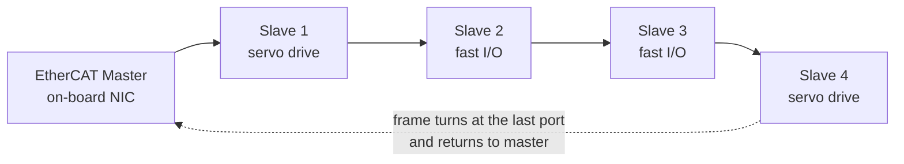

<div class="page-header">
  <span class="page-header__label">Industrial Communications</span>
  <h1>EtherCAT</h1>
  <p>The processing-on-the-fly fieldbus — one frame passes through every slave, which reads and writes its own data as the frame flies past, giving very low cycle times without switches in the segment.</p>
</div>

## Overview

EtherCAT (Ethernet for Control Automation Technology) is managed by the EtherCAT Technology Group (ETG) and standardized within IEC 61158. Its defining idea is **processing on the fly**. The master sends one Ethernet frame down the line; as that frame passes through each slave, the slave's dedicated hardware reads the outputs addressed to it and inserts its inputs into the same frame — all in the time it takes the frame to pass through the node, without buffering the whole packet. The frame reaches the last device, turns around, and returns to the master.

Because the data for the whole segment rides in one (or a few) frames processed at wire speed, EtherCAT achieves very short cycle times and low jitter. **Distributed clocks (DC)** give the slaves a shared, precisely synchronized time reference, so outputs can be applied and inputs latched at the same instant across many nodes — the basis for tight multi-axis coordination.

The point to hold onto: **EtherCAT uses the Ethernet physical layer, but it is not switched, standard Ethernet.** There are no managed switches inside an EtherCAT segment and no IP addressing on the process data. The slaves themselves contain the ports and the on-the-fly processing hardware — this is a fundamental difference from EtherNet/IP or PROFINET, which run over ordinary switched Ethernet infrastructure.



Physically a line (or a tree with branches); logically a single ring — the frame goes out through every node and comes back.

## Where It Is Used

- **High-performance motion and many-axis machines** — coordinated servo systems, robotics, packaging, printing, machine tools, where cycle time and synchronization dominate the design.
- **Fast, distributed I/O** — measurement, condition monitoring, and control loops that need short, deterministic update times.
- **The Beckhoff ecosystem** — EtherCAT originated at Beckhoff and is prominent in PC-based (TwinCAT) control; it is used well beyond that vendor, with a broad range of ETG member devices (drives, I/O, sensors) from many manufacturers.

Scope notes: this page covers the common copper 100BASE-TX EtherCAT segment with standard process data. Variants and extensions — EtherCAT G (gigabit), the EtherCAT Automation Protocol (EAP) for master-to-master, and Safety-over-EtherCAT (FSoE) — have their own rules and validation scope and are not covered here. Verify against ETG and vendor documentation.

## Network Design

- **Topology** — physically a line or tree: cable runs from the master into slave 1, out to slave 2, and so on. Most slaves have two or more ports; the segment behaves as **one logical ring** because the frame travels out through the chain and returns on the same path. Branches (via slaves with three or more ports, or dedicated junctions) form trees while preserving the ring logic.
- **No switches in the segment** — do not place managed or unmanaged Ethernet switches inside an EtherCAT segment. The slaves' built-in ports and processing perform the forwarding; inserting a standard switch breaks the on-the-fly model. This is a key difference from EtherNet/IP and PROFINET, which depend on managed switches.
- **Not switched standard Ethernet** — state this plainly on any design review: EtherCAT reuses the Ethernet physical layer (cable, connectors, PHYs) but the process data is not IP traffic and there is no MAC-learning switch fabric. Addressing is by position/order in the segment and by configured station address, not by IP.
- **Addressing** — slaves are addressed by their **position** in the segment (auto-increment during start-up) and by a **configured station address**; a **station alias** can be set (often via a device switch or stored in EEPROM) so a device keeps a stable identity regardless of physical position, which helps with replacement.
- **Distributed clocks** — where synchronization matters, one slave (typically the first DC-capable device) provides the reference clock and the master compensates for propagation delay so every node shares the same time base. Plan which devices need DC and confirm they support it.
- **Segmentation** — the EtherCAT segment sits behind its master; the master's upstream/plant network is where IEC 62443 zone and conduit thinking applies. The fieldbus itself has no inherent authentication.

## Configuration

1. **Import ESI files** — the **EtherCAT Slave Information** file (XML) describes each slave's objects, process-data options, and mailbox capabilities. Load the correct ESI for every device type into the master's engineering tool, and verify the ESI matches the device firmware/revision — object dictionaries differ between revisions.
2. **Scan the bus / build the configuration** — let the master scan the physically connected segment, or build it offline from ESI files, then reconcile the two. The master assembles the **process image**: which bytes of the cyclic frame belong to which slave's inputs and outputs.
3. **Set process data (PDO) mapping** per device where the ESI allows options — pick the assemblies/PDOs that match how the application uses the device (e.g., a drive's cyclic-synchronous position vs velocity mode).
4. **Configure station alias / addressing** for devices that need a fixed identity independent of position, so a replacement slotted into the same place is recognized correctly.
5. **Configure distributed clocks** — enable DC on the devices that require synchronization, choose the reference clock, and set the sync signal (e.g., SYNC0) periods to match the control cycle.
6. **Record per device** — device type and revision, ESI file/version, station alias, DC role and sync period, PDO mapping, and the physical position/port in the segment. This register is what makes a 03:00 slave swap routine.

## Commissioning Checks

- [ ] Slave count matches the configuration exactly — no missing or extra devices
- [ ] Slave order/topology matches the project (position and branches as designed)
- [ ] ESI versions match the installed device firmware/revisions
- [ ] Every slave reaches the **OP** state (INIT → PREOP → SAFEOP → OP) and stays there
- [ ] Working counter is correct on every cyclic frame — no persistent WKC mismatch
- [ ] Distributed-clock synchronization is locked where DC is used (sync error within tolerance)
- [ ] Station aliases set and verified on devices that need position-independent identity
- [ ] Process image maps to the physical I/O as intended (force/monitor a channel and confirm)
- [ ] Cable pull test: interrupt the line and confirm the master reports the break and recovers cleanly after reconnection
- [ ] Slave replacement test: swap one device and confirm it is recognized and returns to OP
- [ ] Master diagnostics counters (lost frames, CRC per port) reviewed and near zero under full load
- [ ] Configuration, ESI versions, station-alias assignments, and a healthy-state baseline archived

## Diagnostics

Work in layers: physical (link/activity, port error counters), then the **state machine** (did each slave reach OP), then cyclic health (the **working counter**), then device-level object diagnostics.

**Working counter (WKC)** is the key health indicator. Each datagram in the frame increments the working counter as slaves that are addressed successfully read/write their data. The master knows the expected WKC for a fully healthy segment; a **WKC lower than expected means a slave did not contribute** — it dropped out, is in the wrong state, or has a mapping problem. Watch WKC first when cyclic data looks wrong.

**Slave state** tells you where a stuck device is: a slave that will not leave PREOP or SAFEOP usually has a mailbox/configuration or DC problem rather than a wiring fault. The master's error registers expose **lost-frame and CRC counters per port**, which localize a marginal cable or connector to a specific link in the chain — a rising CRC count on one port points straight at that segment of cable.

Read all of this **through the master's diagnostic interface** — that is where WKC, per-slave state, and per-port error counters are exposed.

On packet capture: generic Wireshark on a standard laptop NIC has real limits here. EtherCAT process traffic is not switched IP traffic you can pick up from a spare switch port — there are no switches, and the frames are consumed and returned on the line. Capturing meaningfully usually requires the right point and tooling (for example, capturing at the master's NIC where supported, or a purpose-built EtherCAT analysis tool/tap), not a laptop plugged into the segment. Wireshark does include an EtherCAT dissector, so a capture taken at a valid point can be decoded — the constraint is *getting* the capture, which differs fundamentally from switched-Ethernet port mirroring. If you do decode a valid capture (verify filter names against the Wireshark version in use):

```text
ecat
ecat_mailbox
```

What capture will not give you easily: per-port CRC counts and live slave-state/WKC — those come from the master's diagnostics, which is the faster route for most EtherCAT faults anyway.

## Common Faults

| Symptom | Likely causes | First checks |
|---|---|---|
| A slave stuck in PREOP or SAFEOP, will not reach OP | DC/sync config, mailbox/object mismatch, ESI vs firmware mismatch, invalid PDO mapping | Master's per-slave state and error text; compare ESI version to device firmware |
| Working counter lower than expected | A slave not contributing — dropped out, wrong state, or mapping error | Which slave's WKC is short in the master diagnostics; check that slave's state |
| Everything downstream of a point disappears | Cable/connector break or device power loss on the line (line topology consequence) | Which slave is the last one seen; port error counters either side of the gap; check power |
| Distributed-clock sync errors | Wrong reference clock, non-DC device in a DC-required position, sync period vs cycle mismatch | DC configuration; confirm the reference and that DC-required devices support it |
| Rising CRC / lost-frame count on one port | Marginal cable, poor connector, EMC on that segment | Per-port error counters in the master; inspect/replace that specific cable |
| Replacement slave not recognized | Missing/incorrect station alias, different device revision, wrong ESI | Station-alias setting; device revision vs project; reload correct ESI |
| Intermittent dropouts under machine motion | EMC coupling on a cable run, marginal connector, or a device fault under load | Correlate drop timestamps with motion; per-port CRC; segregation from drive cables |

## Related Pages

- [Industrial Communications overview]({{ '/communications/' | relative_url }}) — where EtherCAT fits among the protocol families
- [Copper Ethernet]({{ '/communications/copper-ethernet/' | relative_url }}) — the physical layer EtherCAT reuses, with the switching caveats that do *not* apply inside a segment
- [PROFINET]({{ '/communications/profinet/' | relative_url }}) — a switched-Ethernet I/O protocol; contrast its managed-switch design with EtherCAT's switchless segment
- [Servo drive wiring]({{ '/design/wiring/servo-drive/' | relative_url }}) — power and feedback wiring for the drives EtherCAT commonly coordinates
- [Communication cable]({{ '/design/wiring/comm-cable/' | relative_url }}) — cable selection, routing, and shielding for the bus links
- [IEC 62443 — Industrial Cybersecurity]({{ '/standards/cybersecurity/iec-62443/' | relative_url }}) — segment the master's upstream network; the fieldbus itself has no authentication
