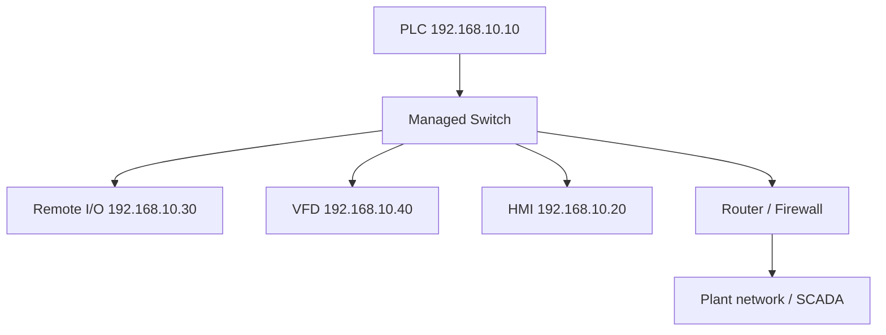

<div class="page-header">
  <span class="page-header__label">Industrial Communications</span>
  <h1>Industrial Ethernet Fundamentals</h1>
  <p>The addressing, switching, and transport concepts that every industrial Ethernet protocol builds on — and why office-network habits break plant networks.</p>
</div>

## Overview

Industrial Ethernet protocols share the IEEE 802.3 physical and data-link foundation, but they do not all use the same upper-layer stack: Modbus TCP and OPC UA normally ride TCP/IP, EtherNet/IP uses TCP and UDP/IP depending on message type, while PROFINET RT carries cyclic traffic directly in Ethernet frames at Layer 2. (EtherCAT diverges even further and needs its own explanation.) When a device "won't connect," the fault is usually in these lower layers, not the automation protocol itself. Understanding them turns network troubleshooting from guesswork into a layer-by-layer elimination.

Two addresses matter, and they are not interchangeable:

- **MAC address** — a 48-bit Layer-2 interface identifier (e.g., `00:11:22:33:44:55`). Manufacturers normally assign a globally unique hardware address, but operating systems, virtual machines, and some devices allow it to be overridden or locally administered. Switches forward frames by MAC; it is normally used for forwarding within a Layer-2 broadcast domain and is not forwarded through ordinary IP routers.
- **IP address** — a logical, configurable address (e.g., `192.168.10.40`). Routers forward packets by IP. It is what you assign during commissioning and what your PLC project references.

**ARP** (Address Resolution Protocol) is the glue: before a device can send an IP packet locally, it broadcasts "who has 192.168.10.40?" and caches the MAC that answers. Duplicate IP addresses typically surface as ARP conflicts — two devices answering for the same address — which is why intermittent comms faults often trace back to an address collision.



## Where It Is Used

These fundamentals apply to essentially every modern machine and plant network:

- Machine-level networks: PLC to remote I/O, drives, HMIs, robots.
- Plant-level networks: controller-to-SCADA, historians, engineering stations.
- The boundary between them: routers and firewalls segmenting cell networks from plant and enterprise networks (see IEC 62443 zones and conduits).

Honest scope note: this page covers switched copper/fiber Ethernet concepts. It does not cover deterministic extensions (TSN), EtherCAT's modified frame processing, or wireless — those have their own rules layered on top of or replacing parts of this model.

## Network Design

**Subnets and gateways.** The subnet mask defines which addresses are "local." With `192.168.10.0/24` (mask `255.255.255.0`), devices `192.168.10.1–254` talk directly; anything else is sent to the **default gateway** (a router). Two classic field mistakes: a wrong mask makes a local device look remote (traffic goes to a gateway that may not exist), and a missing gateway means the device works locally but is unreachable from the plant network. For an isolated machine network, leaving the gateway blank is normally acceptable — verify against the site design.

**TCP vs UDP.** TCP is connection-oriented and retransmits lost data — used for configuration, messaging, Modbus TCP (port 502), OPC UA (port 4840), and EtherNet/IP explicit messaging (TCP 44818). UDP is connectionless and fast, with no retransmission — used for cyclic I/O where a stale retransmitted sample is worse than a fresh one (e.g., EtherNet/IP implicit I/O on UDP 2222). This is why "the network is fine, ping works" does not prove cyclic I/O is healthy: ping tests one traffic type, not the one carrying your I/O.

**Unicast, multicast, broadcast.**

- *Unicast* — one sender to one receiver. Most traffic.
- *Multicast* — one sender to a subscribed group. Some protocols use it for cyclic I/O; without switch-side management (IGMP snooping) it floods every port like broadcast.
- *Broadcast* — one sender to everyone (`ff:ff:ff:ff:ff:ff`). ARP and some discovery mechanisms depend on it. Excessive broadcast load degrades every device on the segment; small embedded automation interfaces suffer first.

**VLANs** (IEEE 802.1Q) partition one physical switch into multiple logical networks. Typical industrial use: separating machine I/O traffic from camera/IT traffic sharing the same infrastructure, and limiting broadcast domains. A device in the wrong VLAN behaves exactly like an unplugged device — check VLAN membership early when a "known good" device is unreachable.

**QoS** (IEEE 802.1p priority / DSCP) lets switches forward time-critical frames ahead of bulk traffic. Industrial protocols that ship QoS defaults (e.g., EtherNet/IP, PROFINET) rely on switches honoring those markings; unmanaged switches ignore them.

**Ring redundancy.** Physically looping switches provides a backup path, but an uncontrolled loop creates a broadcast storm that can take down the whole segment in seconds. Loops must be managed by a redundancy protocol:

- **RSTP** (IEEE 802.1w) — standard, interoperable, but reconvergence typically takes on the order of seconds — often too slow for cyclic I/O.
- **Vendor/industrial ring protocols** — most industrial switch vendors offer a fast ring protocol (recovery typically tens of milliseconds; verify against the vendor specification). These are normally not interoperable between vendors: one vendor's ring protocol on a ring means all switches in that ring usually must support it.

## Configuration

Ethernet itself has no device-description files; configuration is per-device IP settings plus switch settings.

1. **Build an IP address plan first.** One subnet per machine or cell is a common pattern. Document address, mask, gateway, device, and switch port. Reserve ranges (e.g., `.1–.9` infrastructure, `.10–.99` controllers/devices, `.100+` engineering).
2. **Assign addresses** by the method each device supports: rotary switches, vendor commissioning tool, web interface, BOOTP/DHCP, or the PLC programming software. Prefer static addresses (or DHCP reservations under strict control) — a lease change mid-production disconnects I/O.
3. **Set speed/duplex to auto-negotiate on both ends** unless a device specifically requires a fixed setting. A forced/auto mismatch produces a duplex mismatch: link comes up, but CRC and late-collision errors accumulate under load.
4. **Configure the switch** where managed: VLANs, IGMP snooping and querier (for multicast I/O), QoS, ring protocol, and port descriptions. See the [managed switches page]({{ site.baseurl }}/communications/managed-switches/).
5. **Document the as-built** — address register, switch config backup, topology drawing.

**Why office-network habits break industrial networks.** Practices that are routine in IT can stop a machine:

- DHCP without reservations — automation devices need stable addresses; a renumbered drive is a lost I/O connection.
- Plugging "just one more" unmanaged switch into a managed ring — instant loop risk.
- Letting spanning tree reconverge during production — seconds of outage that an office user never notices will fault cyclic I/O.
- Treating multicast as negligible — office networks rarely carry multicast I/O; industrial ones may, and unmanaged flooding hits every CPU on the segment.
- Scanning the network with aggressive IT discovery/security tools — some embedded automation stacks handle malformed or high-rate traffic poorly. Coordinate scans; never assume a production network tolerates them.

## Commissioning Checks

- [ ] IP address plan documented; every device address, mask, and gateway matches it
- [ ] No duplicate IP addresses (check ARP tables / duplicate-address warnings, not just ping)
- [ ] Subnet mask consistent across all devices on the segment
- [ ] Gateway set where cross-subnet communication is required; blank or correct on isolated segments
- [ ] Link, speed, and duplex confirmed per port (auto/auto or deliberately fixed both ends)
- [ ] VLAN membership verified for every access port carrying automation traffic
- [ ] IGMP snooping and an active querier confirmed where multicast I/O is in use
- [ ] Ring redundancy protocol enabled and tested: pull one ring link and confirm recovery time is acceptable to the I/O connections
- [ ] Broadcast level observed at idle and at full production load
- [ ] Switch configuration backed up; topology drawing and address register archived

## Diagnostics

Work the layers in order — physical, Ethernet, IP, then application:

1. **Physical:** link LEDs, cable condition, port error counters (CRC, alignment, late collisions), speed/duplex agreement.
2. **Ethernet:** MAC learning tables, VLAN membership, broadcast/multicast rates, loop symptoms (storming, MAC flapping between ports).
3. **IP:** ping, ARP table contents, duplicate addresses, mask/gateway settings.
4. **Application:** the protocol's own connection status and diagnostics.

Ethernet/IP-layer traffic is fully capturable with Wireshark, but a laptop on an ordinary switch port only sees its own traffic plus broadcast/flooded frames — use managed-switch port mirroring or a TAP to see traffic between two other devices. Useful display filters:

```text
arp
icmp
eth.dst == ff:ff:ff:ff:ff:ff
tcp.analysis.retransmission
tcp.flags.reset == 1
ip.addr == 192.168.10.40
```

Verify filter names against the Wireshark version in use.

A clean capture does not prove the physical layer is healthy under all operating conditions — pair captures with switch port counters and, where suspicion remains, cable certification.

## Common Faults

| Symptom | Likely causes | First checks |
| --- | --- | --- |
| Device unreachable, no ping | Wrong IP/mask, wrong VLAN, cable/port fault, device power | Link LED, VLAN membership of the port, address settings, ping from same subnet |
| Ping works but protocol connection fails | Firewall between subnets, wrong port blocked, application-layer mismatch | Test from same subnet, check firewall rules, check protocol-specific status |
| Intermittent drops, worse under load | Duplex mismatch, damaged cable, oversubscribed uplink | Port counters (CRC, late collisions), speed/duplex both ends, error trend during load |
| Everything on a segment fails at once | Broadcast storm from an unmanaged loop, switch failure, storm from a faulty device | Storm indications, MAC flapping, unplug suspected loop link, switch logs |
| Device works locally, unreachable from plant network | Missing/wrong default gateway, missing route/firewall rule upstream | Gateway setting on device, traceroute from remote side |
| Comms fail after an unrelated device was added | Duplicate IP, DHCP handed out a conflicting address, new loop | ARP table for two MACs on one IP, DHCP scope vs static plan |
| Multicast I/O floods the network after a switch swap | Replacement switch lacks IGMP snooping or no querier active | Snooping/querier status, per-port multicast rate |
| Slow reconvergence outage when a ring link fails | RSTP where a fast ring protocol was intended, mixed ring protocols | Ring protocol config on every ring switch, measured recovery vs I/O timeout |

## Related Pages

- [Managed Switches in Industrial Networks]({{ site.baseurl }}/communications/managed-switches/) — VLANs, IGMP snooping, port mirroring, and diagnostics counters in practice
- [Modbus RTU over RS-485]({{ site.baseurl }}/communications/modbus-rtu-rs485/) — the serial world these Ethernet concepts do not apply to
- [IEC 62443 — Industrial Cybersecurity]({{ site.baseurl }}/standards/cybersecurity/iec-62443/) — segmentation formalized as zones and conduits
