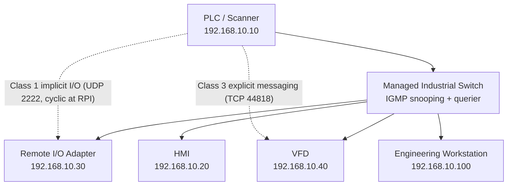

<div class="page-header">
  <span class="page-header__label">Industrial Communications</span>
  <h1>EtherNet/IP</h1>
  <p>The Common Industrial Protocol (CIP) carried over standard Ethernet and IP — the dominant I/O network in Rockwell-centric plants.</p>
</div>

## Overview

EtherNet/IP is an ODVA-managed industrial protocol that places the Common Industrial Protocol (CIP) — the same object model used by DeviceNet and ControlNet — on top of standard Ethernet, IP, TCP, and UDP. Because it uses unmodified Ethernet, it runs through ordinary managed switches and coexists with IT traffic, which is both its main convenience and its main design trap: cyclic I/O shares the wire with everything else unless the network is designed for it.

Two transport types matter in practice:

- **Explicit messaging (CIP Class 3)** — request/response over TCP port 44818. Used for configuration, parameter reads/writes, diagnostics, and MSG instructions. Tolerant of latency.
- **Implicit messaging (CIP Class 1)** — cyclic I/O data over UDP port 2222. Each connection repeats at its **Requested Packet Interval (RPI)**; if packets stop arriving within the connection timeout (typically a multiple of RPI), the connection faults.



## Where It Is Used

- PLC to remote I/O, VFDs, servo drives, and safety I/O (CIP Safety) — the typical Rockwell ecosystem (ControlLogix/CompactLogix scanners with Point I/O, Flex, PowerFlex, Kinetix), plus Omron, Keyence, and many third-party adapters.
- PLC-to-HMI/SCADA and controller-to-controller (produced/consumed tags) data exchange.
- Robot and machine-device integration where the cell controller is Rockwell-based.

Scope notes: this page covers standard EtherNet/IP. CIP Safety, CIP Motion, and Device Level Ring (DLR) redundancy add their own configuration and diagnostic layers — verify against vendor documentation. EtherNet/IP is not inherently deterministic; timing behavior depends on network design, RPI selection, and switch configuration.

## Network Design

- **Topology** — star around managed switches is the normal case; linear/DLR topologies use devices with embedded two-port switches. Keep machine I/O traffic in its own VLAN or physically separate subnet, segmented from the plant network per IEC 62443 zone/conduit thinking.
- **Addressing** — plan static addresses before commissioning. A typical machine subnet:

| Device | Address | Purpose |
|---|---:|---|
| PLC (scanner) | 192.168.10.10 | I/O connection originator |
| HMI | 192.168.10.20 | Operator interface |
| Remote I/O adapter | 192.168.10.30 | Distributed I/O |
| VFD | 192.168.10.40 | Motor drive |
| Engineering workstation | 192.168.10.100 | Configuration and diagnostics |

  Subnet mask 255.255.255.0; leave the gateway blank when traffic stays local, unless the site design requires routing.
- **Unicast vs multicast I/O** — modern devices normally support unicast Class 1 connections, which is the simpler choice. Older adapters and some produced-tag/listen-only arrangements use **multicast**. Multicast I/O on a switch without **IGMP snooping plus an active querier** is flooded to every port, which can saturate low-bandwidth devices and cause seemingly random connection drops. If any multicast I/O exists, verify snooping and querier configuration on every switch in the path.
- **RPI selection** — set RPI to what the process actually needs (drives and I/O typically in the 10–50 ms range for general machinery; faster only where justified). Aggressively low RPIs multiply network load and CPU load on both ends.

## Configuration

1. **Establish the IP plan** and assign addresses via rotary switches, BOOTP/DHCP utility, embedded web page, or vendor commissioning tool. Confirm each device retains its address after power cycle.
2. **Install the EDS file** (Electronic Data Sheet) for each device where the engineering software requires it. Verify catalog number, firmware revision, and EDS version match — a mismatched EDS is a common source of connection errors.
3. **Add the device to the scanner project.** Configure input/output/configuration assembly instances, **connection sizes** (must match the device exactly), RPI, unicast/multicast selection, and **electronic keying** (Exact Match, Compatible Module, or Disable Keying — Compatible Module is the usual choice; Disable Keying hides real mismatches).
4. **Set connection ownership.** An **Exclusive Owner** connection controls outputs — only one scanner may own it. **Listen Only** and **Input Only** connections let additional controllers read inputs without ownership; a Listen Only connection drops when the exclusive owner's connection drops.
5. **Configure the switch** — VLAN membership, IGMP snooping/querier (if multicast), port descriptions, and a spare port pre-configured for mirroring.

## Commissioning Checks

- [ ] Physical link active on every device; speed/duplex as expected (typically 100 Mb/s or 1 Gb/s full duplex, auto-negotiated)
- [ ] Every device answers ping from the engineering workstation; no duplicate IP or MAC alerts
- [ ] Scanner establishes all I/O connections — module status healthy, no connection error codes
- [ ] Input/output assembly instances and data sizes match device documentation
- [ ] RPI values match the design document; connection timeouts observed under normal load
- [ ] Electronic keying set deliberately (not left at Disable Keying without a documented reason)
- [ ] Ownership verified: exactly one exclusive owner per output assembly; listen-only consumers identified
- [ ] Communication recovers cleanly after cable pull and device power cycle tests
- [ ] IGMP snooping and querier verified if any multicast connections exist
- [ ] Documentation archived: network drawing, IP register, EDS file versions, firmware list, switch configuration backup, and a baseline Wireshark capture taken while healthy

The baseline capture deserves emphasis: a fault capture is far easier to interpret next to a known-good one showing normal RPI spacing, connection counts, and multicast volume.

## Diagnostics

Work up the layers rather than opening Wireshark first:

1. **Physical** — link LEDs, cable condition, switch port error counters (CRC/alignment errors indicate cabling or noise), speed/duplex mismatch.
2. **Ethernet/IP layer** — ARP resolution, ping response, duplicate-address detection, VLAN membership, multicast flooding.
3. **CIP layer** — connection status codes in the scanner, assembly/size/RPI/keying mismatches, ownership conflicts, device fault codes via explicit messaging or the device web page.

For packet capture, a laptop on an ordinary switch port normally cannot see PLC-to-device traffic. Use one of:

- **Managed-switch port mirroring** — mirror the PLC (scanner) port, both RX and TX, to the analyzer port; watch for oversubscription when mirroring multiple busy ports.
- **A network TAP** in the path of interest — captures both directions independently of switch configuration, but insertion interrupts the link.
- **Capture on the engineering workstation** — only useful for traffic that terminates there (explicit messaging, web pages), not for PLC-to-device I/O.

Useful display filters (verify filter names against the Wireshark version in use):

```text
cip
enip
tcp.port == 44818
udp.port == 2222
ip.addr == 192.168.10.40
tcp.analysis.retransmission
arp
```

In a healthy capture, Class 1 frames from each connection repeat at a steady RPI. Gaps, jitter clusters, or repeated Forward Open requests point at the failure window. Repeated Forward Open with error responses means the device is rejecting the connection parameters — decode the CIP status code in the response.

## Common Faults

| Symptom | Likely causes | First checks |
|---|---|---|
| Device cannot be pinged | Wrong IP/mask, wrong VLAN, cable/power fault, duplicate address | Link LED, ARP table, address on device display/web page |
| Pings OK but no I/O connection | Assembly instance or connection **size** mismatch, wrong RPI, electronic keying mismatch, ownership conflict | Scanner connection error code; compare configured size/instances against device docs; check for a second scanner owning the output |
| Connection drops periodically | Cable/connector fault, switch port errors, multicast flooding (no IGMP querier), duplicate IP, overload from too-low RPIs | Switch error counters; capture across a drop; check querier status |
| Many devices fault simultaneously | Switch failure, uplink loss, broadcast storm, ring fault, scanner issue | Switch logs, spanning-tree/ring status, controller fault buffer |
| Drive connected but does not run | Control source not set to network, safety input open, enable chain, command-word mapping | Drive local display/parameters — this is usually not a network fault |
| Repeated Forward Open attempts in capture | Device rejecting configuration (size, RPI out of range, keying) | CIP error code in Forward Open response |
| High jitter on cyclic data | Congestion, unmanaged switch in path, mirroring oversubscription, excessive multicast | Baseline-vs-fault capture comparison; switch QoS/port utilization |

## Related Pages

- [Modbus TCP]({{ site.baseurl }}/communications/modbus-tcp/) — simpler register-based alternative for meters, VFDs, and instruments
- [PROFINET]({{ site.baseurl }}/communications/profinet/) — the Siemens-ecosystem counterpart
- [Managed Switches]({{ site.baseurl }}/communications/managed-switches/) — IGMP snooping, port mirroring, and VLAN configuration this protocol depends on
- [Wireshark Methodology]({{ site.baseurl }}/communications/wireshark-methodology/) — general capture and analysis workflow
- [IEC 62443]({{ site.baseurl }}/standards/cybersecurity/iec-62443/) — zone/conduit segmentation for the networks this protocol runs on
- [NFPA 79]({{ site.baseurl }}/standards/us-electrical/nfpa-79/) — machine wiring context for network cabling on industrial machinery
