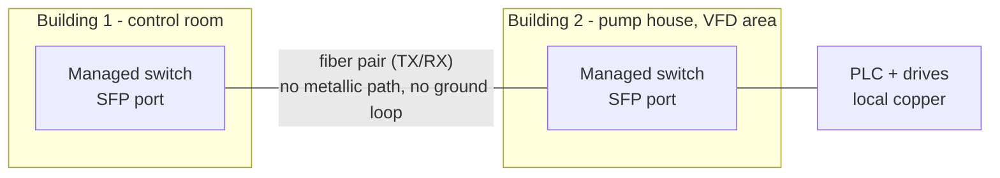

<div class="page-header">
  <span class="page-header__label">Industrial Communications</span>
  <h1>Fiber Optics for Industrial Networks</h1>
  <p>Distance, noise immunity, and galvanic isolation that copper cannot offer — and the polarity, cleanliness, and power-budget discipline fiber demands in return.</p>
</div>

## Overview

Fiber carries data as light in a glass core, which buys three things copper cannot provide: distance far beyond 100 m, complete immunity to electromagnetic interference, and **galvanic isolation** — no metallic path, so no ground loops, no coupling from drives, and nothing for a lightning surge to travel along. In exchange, fiber demands more discipline in handling, cleanliness, and matching of parts (fiber type, wavelength, transceiver) than copper installers are used to.

Reasons to choose fiber over copper in a plant, roughly in order of frequency:

- **Distance:** any link over the 100 m copper channel limit — long buildings, tank farms, conveyor galleries.
- **EMC immunity:** runs through VFD-heavy areas, welding zones, or along medium-voltage routes where even well-shielded copper struggles.
- **Galvanic isolation:** links between buildings, structures, or systems at different ground potentials — the fiber simply does not care.
- **Lightning exposure:** anything routed outdoors, between buildings, or up structures. A copper network cable between buildings is a lightning conductor into both switch rooms.



**Single-mode vs multimode, at overview level.** Multimode fiber (OM designations: OM1/OM2 legacy, OM3/OM4 current laser-optimized, OM5 niche) has a larger core (50 µm typical, 62.5 µm legacy) and uses cheaper transceivers, but distance is limited — typically hundreds of meters at gigabit, less at higher speeds. Single-mode fiber (OS1/OS2, ~9 µm core) supports kilometers to tens of kilometers with the right optics; the transceivers cost more, though the gap has narrowed. Practical plant guidance: multimode is common within a building; single-mode is the safer default for anything between buildings or with an uncertain future — the cable is not the expensive part, re-pulling it is. **The fiber type and the transceiver must match**: a single-mode SFP into multimode fiber (or the reverse) may link marginally or not at all, and mode-conditioning workarounds are a legacy niche, not a plan.

**Wavelengths, at overview level.** Multimode optics typically run at 850 nm (and 1300 nm for some legacy PHYs); single-mode typically at 1310 nm or 1550 nm. Both ends of a link must use the same wavelength — it is part of transceiver matching, not a tuning knob. All of these are infrared: **you cannot see whether a fiber is live**, which is both a safety issue and a diagnostic trap (see below).

## Where It Is Used

- Building-to-building backbone links on plant sites (single-mode, outdoor-rated or ducted cable).
- Long in-building runs: conveyor lines, cranes (with special flex fiber), tank farms, water/wastewater sites.
- Through electrically hostile areas: drive rooms, electrolysis plants, near induction furnaces.
- SCADA and substation links where isolation from switchyard ground potential rise is a requirement, not a preference.
- Media converters or SFP ports extending an otherwise-copper machine network across one long or noisy segment.

Honest scope note: within a normal machine or panel, copper remains simpler and cheaper — fiber earns its keep on specific segments, not everywhere. This page covers point-to-point plant links; telecom outside-plant design, DWDM, and PON systems are out of scope.

## Design Rules

**Optical power budget — the core design calculation.** A link works when the power arriving at the receiver sits between its sensitivity (minimum) and overload (maximum) limits:

```
margin = TX power (min, dBm)
       − receiver sensitivity (dBm)
       − Σ connector losses
       − Σ splice losses
       − fiber attenuation × length
```

Typical budgeting values (verify against the actual transceiver and cable datasheets rather than these rules of thumb): mated connector pairs are commonly budgeted at up to 0.75 dB each, fusion splices around 0.1–0.3 dB, and fiber attenuation is far higher for multimode at 850 nm (~3 dB/km class) than for single-mode at 1310/1550 nm (well under 0.5 dB/km class). Leave **margin** — commonly 3 dB or more — for aging, temperature, repairs (each repair splice adds loss), and dirt. On short single-mode links the opposite problem exists: too *much* power can overload the receiver, which is why some long-reach optics specify an attenuator on short runs — check the datasheet.

**Connectors.** LC is the dominant modern connector (small, duplex, used on SFPs); SC is common on older equipment and patch panels; ST (bayonet) is legacy but still everywhere in older plants. Adapters and hybrid patch cords exist, but every extra mated pair costs budget. UPC polish is normal for plant Ethernet; APC (angled, green) is a different polish that must not be mated with UPC — mixed polish means high loss and possible end-face damage.

**TX/RX polarity — the crossed-pair commissioning classic.** A duplex fiber link is two fibers: one device's transmitter must land on the other's receiver. Somewhere along patch panels and couplers the pair must cross exactly once (an odd number of times end-to-end). Get it wrong and both ends show no link with a perfectly good cable. It is the fiber equivalent of a crossover-cable mistake, and it is probably the single most common fiber commissioning fault after dirt. Plan polarity on paper (the cabling standards define polarity methods for structured systems); in the field, swapping the two connectors at *one* end is the fix — do it deliberately, once, and label it.

**SFP compatibility.** A transceiver must match the link in speed, wavelength, fiber type, and reach class at both ends. Additionally, many switch vendors lock their firmware to vendor-coded transceivers — a mechanically identical third-party SFP may be rejected or unsupported. Third-party "coded-for-vendor-X" optics normally work but sit in a support gray zone; decide the site policy consciously and stock spares accordingly. Also confirm temperature rating: industrial switches in hot panels normally warrant extended-temperature transceivers, not commercial-grade ones.

**Media converters** (copper-to-fiber boxes) extend copper networks segment-by-segment but add unmanaged, unmonitored failure points and dual power supplies to maintain. Where a managed switch with SFP ports can take the fiber directly, prefer it — you also gain the DOM diagnostics described below.

## Installation Practice

- **Bend radius is a hard constraint**, not a neatness preference: macrobends leak light and add loss, sometimes intermittently with temperature. Respect the cable datasheet minimum (commonly quoted around 10–15× cable diameter for installed multi-fiber cable; bend-insensitive patch fibers tolerate more, their cables still less than you think).
- **Pick the right cable construction.** "Fiber" is not one product: indoor tight-buffered distribution cable, indoor/outdoor loose-tube cable (gel or dry water-blocked), armored cable for direct burial or rodent exposure, and flex-rated fiber for drag chains are different builds. Between buildings, use outdoor-rated (UV- and water-resistant) cable and check whether the jacket is permitted indoors beyond a limited distance under the local electrical/building code — the common pattern is transitioning to indoor-rated cable at the entrance; verify against the applicable code.
- **Pulling:** use the cable's strength member; never pull on connectors or the fibers themselves. Observe the tension rating; fiber cable is strong along its strength member and fragile everywhere else.
- **Slack and protection:** leave service loops at both ends and at splice closures; route through protected pathways; fiber does not survive being stepped on, tie-wrapped hard, or slammed in a panel door.
- **Cleanliness discipline — the single most important habit.** A dirty connector end-face is *the* most common fiber fault, full stop. A speck of dust on a 9 µm single-mode core is proportionally a boulder on a road. The rules:
  - **Inspect before connect, every time** — with a fiber inspection scope, not eyesight. Even brand-new, just-uncapped connectors can be dirty.
  - Clean with proper tools (click-type cleaners, lint-free wipes with fiber-grade solvent). Never re-use wipes, never blow on connectors.
  - **Never touch ferrule end-faces**, and keep dust caps on every unmated connector and coupler — including the equipment side.
- **Splicing:** fusion splicing gives the lowest loss and is the norm for building-to-building cable; mechanical splices and field-terminated connectors are quicker but lossier — count them honestly in the budget.
- **Safety: never look into a fiber, connector, or transceiver port.** The light is infrared and invisible, and higher-power optics can injure eyes without any sensation. "Is there light?" is a question for a power meter, not an eyeball. Treat every fiber as live.

## Commissioning & Testing

Two very different test instruments, for different questions:

- **Optical light source + power meter (OLTS / LSPM):** measures the actual end-to-end **insertion loss** of the link at the working wavelength, referenced against the test cords. This is the number the power budget was designed around, and it is the pass/fail commissioning test.
- **OTDR:** sends pulses and maps reflections along the fiber — it shows *where* events are (connectors, splices, bends, breaks) and their individual losses. Essential for documenting long spliced links and for locating faults later, but an OTDR trace is not a substitute for a two-way insertion-loss measurement on short plant links, where launch dead zones can hide near-end problems.

Checklist before handover:

- [ ] Fiber type, wavelength, and transceiver reach class match at both ends and match the design (single-mode vs multimode confirmed, not assumed).
- [ ] Insertion loss measured with source + power meter at the working wavelength, both directions where practical; results within the calculated budget *with margin*, archived with the project.
- [ ] OTDR traces recorded for spliced backbone links (baseline for future fault-finding).
- [ ] Polarity verified: link established at working speed on every pair; any deliberate crossover documented and labeled.
- [ ] Every connector inspected with a scope and cleaned before final mating; dust caps on all spare ports and couplers.
- [ ] Received power at each end read from switch DOM (see Diagnostics) and recorded as the healthy baseline, with adequate distance from both the sensitivity and overload limits.
- [ ] SFPs are the approved type for the switch (vendor policy decided), extended-temperature where panels run hot; labeled spares on the shelf.
- [ ] Service loops, bend radii, and pathway protection verified by inspection; as-built drawings show splice and panel locations.

## Diagnostics

Start with the free instrumentation you already own: **DOM/DDM** (Digital Optical Monitoring) in most modern SFPs, readable from the managed switch CLI or web page. It reports TX power, **RX power**, temperature, bias current, and supply voltage per transceiver — effectively a built-in power meter at both ends of every link. Practical uses:

- Compare live RX power against the commissioning baseline: a link that has drifted several dB toward the sensitivity limit is degrading (dirt, a stressed bend, aging optics) *before* it drops.
- TX normal at one end but RX low at the other localizes loss to the fiber path in that direction — clean connectors first, then suspect bends or splices.
- Trend DOM readings (SNMP polling into the historian, if available) — slow degradation with temperature or seasons is visible long before failure. See [Managed Switches]({{ site.baseurl }}/communications/managed-switches/) for pulling these values.

A layered sequence for a suspect fiber link:

1. Switch port status and DOM at both ends (free, remote, immediate).
2. Inspect-and-clean the connectors at both ends and every intermediate patch point — this alone resolves the majority of fiber tickets.
3. Insertion-loss measurement with source + power meter against the commissioning result.
4. OTDR to localize whatever the loss measurement says is there.

Beyond DOM: power-meter measurements at patch points bisect the link; an inspection scope finds the dirty or damaged end-face; an OTDR locates the event on long runs. A visual fault locator (visible red laser) can trace patch cords and find gross breaks and tight bends at short range — still under the "never look into the end" rule.

Note what Wireshark cannot do here: a marginal optical link shows up as CRC-errored or lost frames counted by the switch and as retransmissions in a capture — the capture cannot see optical power, and a clean capture at one moment does not prove budget margin. Physical evidence (DOM, meter, scope) settles fiber questions; captures settle protocol questions ([Ethernet Fundamentals]({{ site.baseurl }}/communications/ethernet-fundamentals/) covers the layers above).

## Common Faults

| Symptom | Likely causes | First checks |
| --- | --- | --- |
| No link at all on a new installation | TX/RX polarity not crossed; SM/MM or wavelength mismatch; wrong SFP reach class | Swap the pair at one end; compare transceiver and fiber markings both ends |
| Link established but errors / low margin | Dirty connectors; stressed bend; loss budget exceeded | DOM RX power vs baseline; inspect and clean every end-face; check bends |
| Worked at handover, degrading over months | Contamination migrating in couplers; slow bend/temperature stress; aging optics | Trend DOM RX; re-measure insertion loss; inspect patch points |
| Link drops with temperature (day/night, seasons) | Marginal budget plus temperature-dependent loss; commercial-grade SFP in a hot panel | DOM temperature and RX vs time; check margin math; SFP temperature rating |
| Switch refuses to recognize the transceiver | Vendor coding lock; unsupported third-party SFP | Switch log messages; try an approved-coded unit; check the site SFP policy |
| Very short single-mode link errors constantly | Receiver overload from long-reach optics | DOM RX vs receiver overload limit; add an inline attenuator per datasheet |
| One direction fails after a repair | Repair splice loss unbudgeted; mixed UPC/APC mating | Post-repair OTDR/loss test; connector polish colors (blue vs green) |
| High loss localized at one panel | Damaged/cracked ferrule; dirt inside coupler; tight tie-wrap behind panel | Scope both sides of the coupler; replace coupler; inspect routing |

## Related Pages

- [Managed Switches in Industrial Networks]({{ site.baseurl }}/communications/managed-switches/) — where the DOM/DDM readings live, plus the port error counters that flag marginal links
- [Copper Ethernet for Industrial Installations]({{ site.baseurl }}/communications/copper-ethernet/) — the other half of the physical-layer decision, and the 100 m limit that sends you here
- [Industrial Ethernet Fundamentals]({{ site.baseurl }}/communications/ethernet-fundamentals/) — addressing, switching, and everything that rides on top of the light
- [Case Study — Intermittent EtherNet/IP I/O Dropout]({{ site.baseurl }}/communications/case-study-intermittent-io/) — the copper EMC failure mode that fiber through a VFD area avoids entirely
- [IEC 62443 — Industrial Cybersecurity]({{ site.baseurl }}/standards/cybersecurity/iec-62443/) — building-to-building links are also zone boundaries; treat them in the segmentation design
