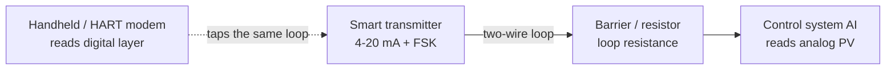

  Industrial Communications
  <h1>HART</h1>
  
A digital signal riding on top of the 4-20 mA analog loop — the analog process value and digital configuration, diagnostics, and multi-variable data share the same two wires, on infrastructure you already have.

## Overview

HART (Highway Addressable Remote Transducer), managed by the FieldComm Group, layers a **digital signal on top of the existing 4-20 mA analog loop**. It uses **FSK (frequency-shift keying)** — two audio-frequency tones superimposed on the analog current — to send digital data. Because the FSK signal averages to zero over time, it rides on the loop **without disturbing the 4-20 mA analog value**. You get the analog primary variable (PV) *and* a digital channel for configuration, diagnostics, and additional variables, all on the same two wires.

The killer feature is compatibility: HART **works with existing 4-20 mA infrastructure**. The analog loop keeps doing its job for the control system while the digital layer adds configuration and diagnostics — so a plant already wired for [analog 4-20 mA]({{ '/design/wiring/analog-4-20ma/' | relative_url }}) can gain smart-device capability without rewiring. That is why HART became the most widely installed field-instrument protocol despite the analog loop underneath it.

The control system reads the analog PV; a handheld communicator or HART modem taps the same loop to read the digital layer — configuration, status, and extra variables.

## Where It Is Used

- **Smart process transmitters** — pressure, temperature, flow, and level instruments across process industries, where the 4-20 mA loop already carries the control signal.
- **Configuration without disconnecting** — set range, tag, damping, and units over the digital layer instead of pulling the instrument or using local buttons.
- **Multi-variable devices** — a single instrument can report several variables (e.g., mass flow, temperature, and pressure from one flowmeter) digitally while the analog loop carries the primary variable.
- **Diagnostics and calibration** — read device status, sensor health, and diagnostic flags, and support calibration workflows, all over HART.

Scope notes: this page covers wired HART on the 4-20 mA loop. **WirelessHART** (the 2.4 GHz mesh variant) and **HART-IP** are related but separate — treat them as pointers and verify against FieldComm Group documentation.

## Network Design (Loop and Topology)

For HART the honest equivalent of "network design" is **loop and topology design** — HART lives on a current loop, not a switched network.

- **Point-to-point (analog + HART)** — the normal case: one instrument per loop, the 4-20 mA analog value drives the control system, and HART digital communication rides on top. Both layers are live at once.
- **Multidrop (digital only)** — several devices share one pair, each with a unique polling address; in classic multidrop the analog current is **parked at a fixed low value (around 4 mA)** and is no longer a usable process value — only the digital data is meaningful. Multidrop trades the analog PV for shared wiring; use it only where that trade is acceptable.
- **Loop resistance for HART communication** — HART's FSK signal needs **enough loop resistance** across which the modulation develops a readable voltage — a value in the low-hundreds-of-ohms range is typically required (verify the exact minimum/maximum against the specification and the master's manual). Too little loop resistance and HART will not communicate even though the analog loop works fine; too much and the loop compliance/voltage budget suffers.
- **HART multiplexers** — where many HART loops must be reached centrally (e.g., for asset management), a HART multiplexer connects to many loops and presents them to management software over a single upstream link.
- **Segmentation** — HART loops terminate in the control system's I/O and asset-management layer; apply IEC 62443 zone thinking to that upstream layer. The loop itself has no authentication.

## Configuration

1. **Obtain the DD/EDD** — the **Device Description / Enhanced DD** file describes the instrument's variables, methods, and diagnostics so a host can present them consistently. Load the correct DD for the exact device type and revision into the handheld or asset-management software; DD version must match the device revision.
2. **Choose the host** — a **handheld communicator** for field work, or **asset-management software** (often via a HART multiplexer or a HART-capable I/O card) for centralized configuration and diagnostics.
3. **Set the device address** — leave the polling address at 0 for point-to-point (analog active); assign unique non-zero addresses for multidrop.
4. **Set tag, range, units, and damping** over the digital layer to match the loop's engineering definition.
5. **Configure burst mode** where supported and wanted — the device pushes selected variables periodically rather than only answering polls, useful for multi-variable or gateway scenarios (confirm the host supports it).
6. **Record per device** — tag, device type and revision, DD file/version, polling address, loop resistance, configured range/units, and whether burst mode is on.

## Commissioning Checks

- [ ] Loop resistance is adequate for HART communication (within the master's required range) and the handheld/host actually connects
- [ ] Analog PV still reads correctly — confirm the HART configuration work did **not** disturb the 4-20 mA value the control system uses
- [ ] Device tag, range, and units are set and match the loop sheet
- [ ] DD/EDD version matches the installed device revision
- [ ] Polling address correct for the chosen scheme (0 for point-to-point, unique per device for multidrop)
- [ ] For multidrop: every device answers at its address and the analog parking value is understood by anyone reading the loop
- [ ] Device status/diagnostics read clean (no standing device-malfunction or out-of-range flags)
- [ ] Burst mode set intentionally (on only where wanted; off otherwise)
- [ ] Configuration and DD version recorded; a baseline of device status captured for later comparison

## Diagnostics

HART's real value in diagnostics is that it carries **device status the analog signal cannot** — an analog loop can tell you the current is, say, 12 mA, but only HART can tell you *why* (sensor fault, out-of-range input, saturation, or a device self-diagnostic flag). Read the device status and diagnostic variables over HART first when an instrument reads oddly.

Work in layers: loop physical (is the 4-20 mA loop healthy, is loop resistance adequate), then HART link (does the handheld/modem connect), then device diagnostics (status flags, extra variables).

**Wireshark does not apply here.** HART is a **current-loop FSK signal**, not Ethernet or IP traffic — there is nothing for a network capture tool to see. To observe HART you need a **HART modem or a handheld communicator** connected across the loop resistance, plus host software to interpret the DD. This is the sharp contrast with the Ethernet protocols on this site: for [PROFINET]({{ '/communications/profinet/' | relative_url }}) or Modbus TCP you mirror a switch port into Wireshark; for HART you put a HART modem on the loop and read the device with DD-aware software. No display-filter list applies to HART.

Physical-layer confirmation is still electrical: if HART will not communicate, verify loop resistance and loop integrity with a meter before suspecting the device — the same loop measurements that support [analog signal troubleshooting]({{ '/tools/troubleshooting/analog-signal-faults/' | relative_url }}).

## Common Faults

| Symptom | Likely causes | First checks |
|---|---|---|
| Handheld/host cannot connect to the device | Insufficient loop resistance for FSK, open/short in the loop, no device power | Measure loop resistance and loop current; confirm it meets the master's range |
| Analog input reads noisy or shifts when HART is active | HART FSK disturbing a sensitive analog input, marginal grounding/shielding | Check the AI's HART-tolerance/filtering; verify shielding and single-point ground |
| Device connects but parameters look wrong or methods fail | Wrong or outdated DD/EDD version for the device revision | Compare DD version to the device revision; load the matching DD |
| Some devices unreachable on a shared pair | Multidrop address conflict or a device left at address 0 | Poll each address; confirm unique non-zero addresses in multidrop |
| Control system PV frozen or wrong after config work | Device left in a fixed/multidrop mode, or range changed without updating the loop sheet | Confirm polling address 0 and analog output active; re-verify range/units |
| No analog value at all but HART works | Loop in digital-only/multidrop with analog parked at ~4 mA — expected, or a genuine loop fault | Confirm intended point-to-point vs multidrop; measure loop current |
| Intermittent HART, analog fine | Marginal loop resistance/voltage budget, poor connection, EMC on the loop | Loop resistance and compliance voltage; inspect terminations; check routing |

## Related Pages

- [Analog 4-20 mA wiring]({{ '/design/wiring/analog-4-20ma/' | relative_url }}) — the loop HART rides on; loop resistance, power, and grounding that HART depends on
- [Industrial Communications overview]({{ '/communications/' | relative_url }}) — where HART fits among the protocol families
- [Analog signal faults]({{ '/tools/troubleshooting/analog-signal-faults/' | relative_url }}) — loop-current troubleshooting that underlies HART connectivity problems
- [Grounding and bonding]({{ '/design/wiring/grounding-bonding/' | relative_url }}) — shield and reference practice that keeps FSK off sensitive analog inputs
- [IEC 62443 — Industrial Cybersecurity]({{ '/standards/cybersecurity/iec-62443/' | relative_url }}) — the upstream asset-management layer is where segmentation applies; the loop has none
