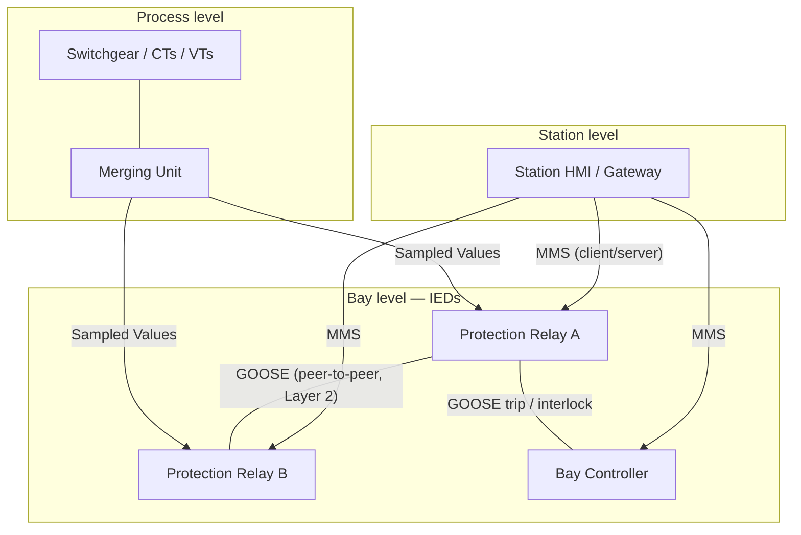

<div class="page-header">
  <span class="page-header__label">Industrial Communications</span>
  <h1>IEC 61850</h1>
  <p>The substation-automation standard that is far more than a protocol — a standardized data model plus several communication services, including GOOSE for fast peer-to-peer protection messaging.</p>
</div>

## Overview

IEC 61850 is the international standard for **electrical substation automation**. It is important to state up front what it is *not*: it is not a single protocol like Modbus or DNP3. It is a framework that standardizes two things together — a **data model** for what devices contain, and a set of **communication services** for how they exchange it. That combination is the whole point, and it is what makes IEC 61850 systems from different vendors interoperable in a way earlier substation protocols never achieved.

Two ideas carry most of the weight:

- **An object-oriented substation model.** Every intelligent electronic device (IED — a protection relay, bay controller, or merging unit) describes itself using standardized **logical nodes**: named building blocks for functions (for example, a logical node for a circuit-breaker, one for an overcurrent protection function, one for measurements). Because the naming is standardized, a "circuit breaker position" means the same thing across vendors, and configuration tools can understand a device they have never seen before.
- **GOOSE for fast peer-to-peer messaging.** For protection and interlocking, IEDs must exchange trip and status signals in milliseconds. GOOSE (Generic Object Oriented Substation Event) is a fast **publish/subscribe, peer-to-peer** service for exactly this — one IED publishes a status change and others subscribed to it react immediately, replacing hard-wired trip and interlock signals with a network message.



## Where It Is Used

- Substation automation — the standard's home ground, from distribution substations to transmission.
- Protection relays and other IEDs (bay controllers, merging units) that need to exchange fast trip and interlock signals.
- Increasingly, utility and large industrial power systems generally — generation switchyards, large plant main-intake substations, and renewable collector substations, wherever protection and control are being modernized onto a standardized model.

Scope note: IEC 61850 is a substantial multi-part standard covering data modelling, configuration, testing, and several communication services. This page introduces it from an integration and diagnostics viewpoint; the deep protection-engineering detail (per-logical-node semantics, protection scheme design) sits with the protection engineer and the standard's own parts.

## Network Design

IEC 61850 defines several services that behave very differently on the network — designing the network means treating each one on its own terms:

- **MMS (client/server).** The Manufacturing Message Specification service carries reporting, control, and configuration between IEDs and the station HMI/gateway. It is a **client/server, TCP/IP** service — routable, session-based, and the part that most resembles ordinary SCADA traffic. This is the **station bus** workhorse.
- **GOOSE (peer-to-peer).** GOOSE is a fast **Layer-2 multicast** publish/subscribe service for protection and interlocking. Like PROFINET RT, **GOOSE is not routable IP — it rides directly on Ethernet at Layer 2**, which means it stays within its Layer-2 domain and depends on switching, VLANs, and multicast handling rather than IP routing. State this clearly in any design: you cannot route GOOSE across an IP boundary the way you would MMS.
- **Sampled Values (SV).** SV carries digitized current and voltage measurements from merging units to protection and measurement IEDs — the **process bus**. It is also a fast Layer-2 multicast service and is extremely sensitive to timing and network loading, because the receiving IEDs reconstruct waveforms from the sample stream.
- **Station bus vs process bus.** The **station bus** carries MMS (and often GOOSE) between bay and station level. The **process bus** carries Sampled Values (and GOOSE) between process-level merging units and the protection/control IEDs. They are frequently separated physically or by VLAN because their traffic characteristics and criticality differ.
- **Redundancy — PRP/HSR.** Substation networks commonly use **PRP** (Parallel Redundancy Protocol) or **HSR** (High-availability Seamless Redundancy) so a single network fault does not interrupt protection communication. These provide seamless, zero-recovery-time redundancy by duplicating frames across two paths — see [Copper Ethernet]({{ '/communications/copper-ethernet/' | relative_url }}) for the physical-layer side.
- **Time synchronization — PTP / IEEE 1588.** Accurate time is critical, especially for Sampled Values and time-tagged protection events: SV samples from different merging units must share a common time base to be combined correctly. **PTP (IEEE 1588)**, in its power-utility profile, is the usual method; its accuracy requirement is much tighter than ordinary NTP-grade sync. Treat time distribution as a first-class part of the design, not an afterthought.

## Configuration

The defining feature of IEC 61850 configuration is that it is **file-based and tool-interoperable**, using the **Substation Configuration description Language (SCL)** — an XML-based description of the substation, its IEDs, and their communication. The whole point of SCL is that configuration is portable between vendors' tools rather than locked in a proprietary format. The main file types:

- **ICD** (IED Capability Description) — what a given IED type can do, supplied by the device vendor.
- **SSD** (System Specification Description) — the substation single-line and function specification, independent of specific devices.
- **SCD** (Substation Configuration Description) — the full, integrated system description: all IEDs, the network, and the GOOSE/report data flows between them. This is the master engineering document for the substation.
- **CID** (Configured IED Description) — the configuration for one specific IED, derived from the SCD and loaded into the device.

Configuration steps, in outline:

1. **Establish the SCD** as the single source of truth — the SSD specification plus each IED's ICD are integrated into one SCD in a system configuration tool.
2. **Name and map logical nodes** so functions and data objects line up with the substation design and the protection scheme.
3. **Configure GOOSE publish/subscribe.** Define each publisher's **GOOSE dataset** (the collection of data objects it sends), and configure each subscriber to receive exactly that dataset. Publisher dataset and subscriber configuration must match — a mismatch is the classic GOOSE fault.
4. **Configure MMS reporting** (report control blocks, datasets, trigger options) for the data the station HMI/gateway needs.
5. **Configure Sampled Values** publishers/subscribers where a process bus is used, in step with the time-sync design.
6. **Generate and load CID files** to each IED from the SCD, keeping the SCD and the device configurations in the same version — drift between them is a common source of confusing faults.

## Commissioning Checks

- [ ] SCD is internally consistent and is the controlled master; every IED's loaded CID was generated from the current SCD version.
- [ ] Logical node / data object mapping matches the protection and control design.
- [ ] GOOSE subscriptions verified received: for each subscription, confirm the subscriber actually receives the publisher's dataset (correct GoID/dataset, values changing as expected).
- [ ] GOOSE VLAN, priority, and multicast handling verified across every switch in the path.
- [ ] Sampled Values verified where used: samples received from the correct merging units with acceptable quality.
- [ ] Time sync verified: PTP (IEEE 1588) locked and within the accuracy the SV/protection scheme requires, checked at the IEDs — not just at the clock.
- [ ] MMS reporting verified: the station HMI/gateway receives the expected reports and can issue controls.
- [ ] Redundancy tested: with PRP/HSR, pull one path and confirm seamless operation with no protection interruption.
- [ ] Station bus and process bus separation (physical or VLAN) is as designed, with no unintended mixing.
- [ ] SCD, ICD/CID files, and version records archived with the project.

## Diagnostics

Layer the approach: physical and time first (link, PTP lock, switch health), then the services separately, because MMS, GOOSE, and SV fail in different ways and live at different network layers. Capture placement matters — GOOSE and SV are Layer-2 multicast confined to their bus, so you must capture at the right point on the **station** or **process** bus (a mirror port on the relevant switch), not on some unrelated segment.

IEC 61850 traffic is capturable, and Wireshark has dissectors for all three services:

```text
mms
goose
sv
```

Notes on what to watch, per service (verify filter names against the Wireshark version in use):

- **GOOSE** carries a **state number** and a **sequence number**, and it publishes on a **heartbeat** — it repeats even when nothing changes, with the interval shortening on an event. The key things to watch are a **stVal change** (the actual status transition being published) and a **missed or stalled GOOSE** (the state/sequence numbers not advancing, or the heartbeat stopping). A subscriber that never sees the publisher's multicast, or sees stale sequence numbers, is the signature of a GOOSE delivery problem.
- **Sampled Values** should arrive as a steady, correctly timed stream; gaps, jitter, or quality flags in the SV stream point at the process bus or time sync.
- **MMS** behaves like ordinary client/server TCP — connection resets and report gaps are diagnosed much like other TCP/IP SCADA traffic.

Because GOOSE and SV are multicast and Layer-2, switch configuration (VLANs, multicast filtering/IGMP behavior, priority) is frequently the real culprit when a subscription "should" work but nothing arrives. IED and switch diagnostics — GOOSE subscription status on the IED, multicast group membership on the switch, PTP lock status — often localize the fault faster than a capture alone.

## Common Faults

| Symptom | Likely causes | First checks |
|---|---|---|
| Subscriber IED does not react to a GOOSE trip/interlock | GOOSE subscription mismatch — publisher dataset does not match subscriber config (GoID, dataset, data object order) | Compare publisher dataset and subscriber config in the SCD; capture `goose` on the bus and confirm the multicast is present |
| Sampled-Values protection unstable / SV quality bad | Time-sync inaccuracy — PTP not locked or outside required accuracy; SV streams not sharing a time base | Check PTP (IEEE 1588) lock and accuracy at the IEDs; verify SV timing/quality flags in a `sv` capture |
| IED behaves unexpectedly after a config change | SCD/CID version mismatch — device running a CID not generated from the current SCD | Compare loaded CID version against the controlled SCD; regenerate and reload from the current SCD |
| GOOSE published but never received by a subscriber on another switch | VLAN/multicast/switch configuration blocking the Layer-2 multicast; wrong VLAN or multicast filtering | Verify VLAN and multicast handling on every switch in the path; capture at both ends of the path |
| Protection or SV traffic disturbed by unrelated load | Station and process bus mixed where they should be separated | Confirm station/process bus separation (physical or VLAN) matches the design |
| GOOSE heartbeat stops / subscriber flags loss of the publisher | Publisher offline, link/path fault, or subscriber not receiving the multicast stream | Capture `goose` and check state/sequence numbers advancing; check the publisher IED and the switch path |
| MMS reports missing at the station HMI/gateway | MMS report control block/dataset misconfigured, or TCP session dropped | Check report control block configuration; diagnose the MMS TCP session as ordinary client/server traffic |

## Related Pages

- [Industrial Communications overview]({{ '/communications/' | relative_url }})
- [PROFINET]({{ '/communications/profinet/' | relative_url }}) — the parallel case of a fast, non-routable Layer-2 real-time service (PROFINET RT) alongside routable traffic
- [Copper Ethernet]({{ '/communications/copper-ethernet/' | relative_url }}) — physical layer, switching, and the redundancy (PRP/HSR) that substation networks depend on
- [IEC 62443 — Industrial Cybersecurity]({{ '/standards/cybersecurity/iec-62443/' | relative_url }}) — zone and conduit thinking for substation networks, where protection traffic must be contained and protected
- [Energy]({{ '/industries/energy/' | relative_url }}) — the industry context where substation automation and IEC 61850 apply
