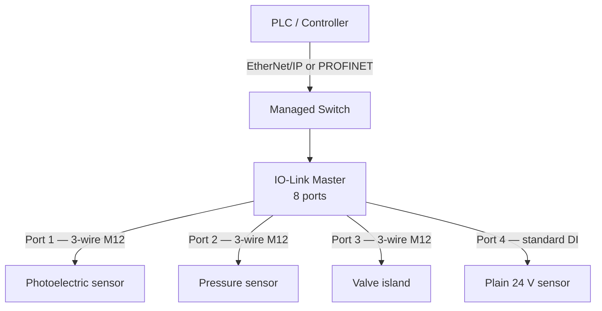

<div class="page-header">
  <span class="page-header__label">Industrial Communications</span>
  <h1>IO-Link</h1>
  <p>Point-to-point digital communication with individual sensors and actuators over standard 3-wire sensor cable — the last meter below the fieldbus, standardized as SDCI in IEC 61131-9.</p>
</div>

## Overview

IO-Link is **not a fieldbus and not a network**. It is a point-to-point serial
link between exactly one master port and exactly one device (sensor, actuator,
valve island, hub). There is no bus arbitration, no node addressing on the
link, and no multi-drop wiring. Each port is its own independent link.

What makes it useful is what rides on that link: instead of a bare 24 V
switching signal, the device exchanges structured digital data — process
values, parameters, identification, and diagnostics — over the same physical
pin that would otherwise carry a discrete signal.

The IO-Link master is the aggregation point. It typically sits on a fieldbus
(EtherNet/IP or PROFINET masters are the most common) and presents its ports
to the PLC as ordinary cyclic I/O. To the controller, the master is a fieldbus
device; to each sensor, the master is its single communication partner.



Each master-to-device link runs at one of three defined rates: COM1
(4.8 kbit/s), COM2 (38.4 kbit/s), or COM3 (230.4 kbit/s). The master
negotiates the rate with the device automatically; you normally do not
configure it. These speeds are modest by design — the link carries a few
bytes of process data per cycle over short sensor cable, not bulk traffic.

## Where It Is Used

- Smart sensors on machines: photoelectric, inductive, pressure, flow,
  temperature — anywhere a plain discrete or analog signal loses information.
- Actuators and valve islands where per-coil diagnostics matter.
- Replacing analog 4–20 mA / 0–10 V wiring on machines: the value travels
  digitally, so scaling lives in the device, not in the PLC analog card.
- Hub applications: an IO-Link hub converts one port into many plain 24 V
  discrete points, reducing home-run wiring.
- Format-change and recipe-driven machines, where sensor parameters
  (switch points, windows) are written from the PLC at changeover.

Honest scope notes: IO-Link is a machine-level technology for the last few
meters. It does not compete with EtherNet/IP or PROFINET — it feeds them.
Cable length per port is short (the specification limits it to roughly 20 m
of standard unshielded sensor cable; verify against the specification and
device documentation). Standard IO-Link is not functionally safe; IO-Link
Safety exists as a separate extension and is out of scope here.

## Port and Wiring Architecture

For a point-to-point link, "network design" honestly reduces to port and
wiring architecture — there is no topology to choose per device.

- **Cabling** — standard 3-wire sensor cable with M12 A-coded connectors:
  L+ (pin 1, 24 V), L− (pin 3, 0 V), and C/Q (pin 4), which carries either
  the IO-Link communication or a plain switching signal. No shielded or
  special cable is normally required; verify for high-noise installations.
- **Port Class A vs Class B** — Class A ports power the device from the
  master's sensor supply. Class B ports add a second, separately switchable
  power feed (pins 2 and 5) for actuators with higher current demand. Match
  the port class to the device; a Class B actuator on a Class A port is a
  common design error.
- **Port modes** — each port is individually configured: IO-Link mode,
  standard digital input (SIO), standard digital output, or deactivated.
  Mixed use on one master is normal.
- **Master placement** — masters are typically IP67 on-machine blocks or
  IP20 in-cabinet modules. Place masters to keep sensor cables short; the
  fieldbus does the long runs.
- **Determinism** — the port cycle time depends on COM rate and process-data
  length (low single-digit milliseconds at COM3 is typical). Total
  sensor-to-PLC latency stacks the port cycle on top of the fieldbus RPI or
  update time — budget both when a fast response is needed.
- **Addressing** — devices have no address; the port *is* the address. The
  master maps each port into its fieldbus assembly or module layout.

## Configuration

- **IODD files** — each device is described by an IODD (IO Device
  Description), an XML file defining its identity, parameters, process-data
  layout, and diagnostics. Engineering and commissioning tools use the IODD
  to present parameters by name instead of raw index/subindex numbers.
  IODDs are typically obtained from the vendor or the IODDfinder portal;
  match the IODD version to the device firmware.
- **Process data vs service data** — process data is exchanged cyclically
  (the measured value, switching states) and is what the PLC sees in its I/O
  image. Service data (ISDU — parameters, identification, diagnostics,
  events) is read and written acyclically on demand. Understanding this split
  tells you what is "free" every cycle and what costs an explicit read.
- **Device parameterization** — switch points, filters, output behavior, and
  units are written as service data: from a vendor or master configuration
  tool at commissioning, or from the PLC at runtime (recipe changes).
- **Data storage — the killer feature for maintenance** — the master can
  keep a copy of the device's parameter set. When a failed sensor is
  replaced with the same type, the master detects the new device and
  automatically writes the stored parameters back. A correctly configured
  data-storage mode turns sensor replacement into plug-and-run with no
  laptop and no tribal knowledge. Verify the mode on every port: typical
  options are backup+restore, restore-only, or disabled — and an
  inconsistent choice is a latent maintenance trap.
- **Fieldbus integration** — the master itself is configured like any other
  EtherNet/IP or PROFINET device (EDS or GSDML file, IP address or device
  name, assembly/module layout). Port process-data sizes must match what the
  PLC expects.

## Commissioning Checks

- [ ] Master reachable and healthy on the fieldbus (see the EtherNet/IP or PROFINET page for that layer).
- [ ] Each port configured for the correct mode (IO-Link / DI / DO / deactivated).
- [ ] Port class matches the device (Class A vs Class B, actuator supply switched on).
- [ ] Correct IODD version loaded in the engineering tool for each device type and firmware.
- [ ] Vendor ID / device ID validation behavior on each port understood and set as intended.
- [ ] Data storage mode explicitly set per port (backup+restore / restore / disabled) and documented.
- [ ] Device parameters written and verified — read back at least one changed parameter.
- [ ] Process-data mapping verified end-to-end: force or exercise the sensor, watch the PLC tag.
- [ ] Actual port cycle time acceptable for the application (check the master's diagnostics).
- [ ] Replacement test performed: swap one device with a spare and confirm parameters restore automatically.
- [ ] As-left parameter sets exported and archived with the project.

## Diagnostics

Layered approach — but note where the layers live:

1. **Device layer** — IO-Link devices report events (wire break to the
   sensor element, overtemperature, dirty lens, out-of-range) as service
   data. These surface in the master's diagnostics and, if mapped, in the PLC.
2. **Port/link layer** — the master reports per-port status: device present,
   communication lost, wrong device (vendor/device ID mismatch), data-storage
   conflict. A "wrong device" indication after a replacement usually means a
   different type or firmware was fitted, or data-storage validation rejected it.
3. **Master/fieldbus layer** — the master's own connection to the PLC fails
   like any other fieldbus device; diagnose it with the EtherNet/IP or
   PROFINET methods.

**Wireshark cannot see the IO-Link link itself.** The master-to-device wire
is a 24 V single-conductor serial link, not Ethernet — there is nothing to
capture with a laptop NIC. What you *can* capture is the fieldbus side of the
master: the cyclic process data and the acyclic parameter reads the PLC
issues. For the link itself, use the master's web or engineering-tool
diagnostics, or a vendor IO-Link USB master as a bench tool.

```text
# Capture the FIELDBUS side of the master, not the sensor wiring.
ip.addr == 192.168.10.50        # the master's IP
cip                              # EtherNet/IP masters
pn_io                            # PROFINET masters
```

Verify filter names against the Wireshark version in use.

## Common Faults

| Symptom | Likely causes | First checks |
|---|---|---|
| Port shows no device | Wrong port mode (SIO instead of IO-Link), wiring fault on C/Q, device unpowered | Port configuration in the master; L+/L− at the device; try a known-good device |
| Device found but flagged "wrong device" | Different device type or firmware fitted; ID validation stricter than intended | Compare vendor/device ID against the configured one; review validation setting |
| Replacement sensor behaves differently than the old one | Data storage disabled or in the wrong mode; parameters never restored | Data-storage mode on that port; whether the master holds a stored parameter set |
| Data-storage error after swapping a device | Stored set conflicts with the new device (type/firmware mismatch); both master and device claim valid data | Master diagnostics for the DS fault code; clear/re-upload per vendor procedure |
| Process value frozen in the PLC | Fieldbus connection to the master lost; port communication dropped; mapping error | Master's fieldbus status first, then per-port status, then the tag mapping |
| Intermittent communication loss on one port | Cable damage, connector ingress, cable too long, severe EMC on the run | Cable and M12 seating; length vs spec; master's port error counters if available |
| Parameters revert after power cycle | Written to volatile memory only, or master restoring an old stored set over them | Vendor store/save command executed; data-storage direction on the port |
| Actuator device drops out under load | Class B device on Class A port; auxiliary supply undersized or unswitched | Port class, pin 2/5 supply presence and sizing |

## Related Pages

- [EtherNet/IP]({{ '/communications/ethernet-ip/' | relative_url }}) — the upstream fieldbus for many IO-Link masters
- [PROFINET]({{ '/communications/profinet/' | relative_url }}) — the other common master integration
- [Industrial Ethernet Fundamentals]({{ '/communications/ethernet-fundamentals/' | relative_url }}) — the layer the master lives on
- [Network Diagnostics Methodology]({{ '/communications/wireshark-methodology/' | relative_url }}) — how to work a communication fault systematically
- [Packet Capture Methods]({{ '/communications/packet-capture-methods/' | relative_url }}) — capturing the fieldbus side of the master
- [IEC 62443]({{ '/standards/cybersecurity/iec-62443/' | relative_url }}) — securing the network the master sits on
