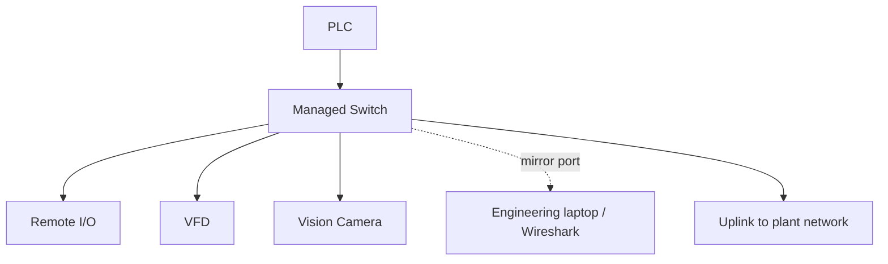

<div class="page-header">
  <span class="page-header__label">Industrial Communications</span>
  <h1>Managed Switches in Industrial Networks</h1>
  <p>Why the switch is a diagnostic instrument, not just a port multiplier — and when a managed switch is worth the configuration burden.</p>
</div>

## Overview

An unmanaged switch forwards frames and nothing else. A managed switch adds a configuration and monitoring plane on top of the same forwarding hardware, and in an industrial network that plane earns its keep three ways:

- **Traffic control** — VLANs, IGMP snooping, QoS, storm limiting: keeping the right traffic on the right ports.
- **Redundancy** — RSTP or a vendor fast-ring protocol, allowing loop topologies without broadcast storms.
- **Visibility** — port counters, port mirroring, logs, SNMP: the difference between guessing and measuring when communications fail.

The visibility point is the one most often undervalued at purchase time. A managed switch is the only device that can tell you, port by port, whether frames are arriving corrupted (CRC errors) or being discarded (drops) — and port mirroring is normally the only practical way to capture traffic passing between two other devices.



## Where It Is Used

Managed switches typically belong wherever any of these are true:

- **Multicast cyclic I/O** is present — e.g., EtherNet/IP implicit I/O configured as multicast. Without IGMP snooping, multicast floods every port.
- **Ring or redundant topologies** are required — a loop without a redundancy protocol is a broadcast storm waiting for the second cable to be plugged in.
- **Mixed traffic** shares infrastructure — I/O plus cameras, HMIs, or IT traffic that should be separated by VLAN and prioritized by QoS.
- **Diagnosability matters** — production-critical machines where "we can't see why it dropped" is not an acceptable answer.
- **Segmentation is a security requirement** — VLANs and port security supporting an IEC 62443 zone/conduit design.

**When unmanaged is acceptable.** A small, flat, unicast-only, star-topology machine network — a PLC, an HMI, and a couple of TCP-based devices with no ring, no multicast, and no uplink obligations — normally runs fine on a good industrial unmanaged switch. The trade you are accepting is zero visibility: when it misbehaves, your diagnostic options are swapping hardware and moving cables. Many integrators standardize on managed switches anyway for exactly that reason; verify against the project's budget and support expectations.

## Network Design

**VLANs (IEEE 802.1Q).** Partition the switch into logical networks: e.g., VLAN 10 for machine I/O, VLAN 20 for cameras, VLAN 99 for switch management. Access ports carry one untagged VLAN toward end devices; trunk/uplink ports carry multiple tagged VLANs between switches. Keep automation devices on access ports — most embedded devices do not handle tagged frames.

**IGMP snooping and querier — the EtherNet/IP multicast case.** A switch treats multicast like broadcast unless it knows who subscribed. IGMP snooping listens to devices' IGMP membership reports and prunes multicast to subscriber ports only. But snooping only works while something on the VLAN acts as the **IGMP querier**, periodically soliciting those reports. The classic failure: snooping enabled, no querier configured — multicast works for a few minutes after power-up (memberships still fresh), then times out and either floods everywhere or, on some switches, gets pruned entirely and I/O connections drop. On an isolated machine network with no multicast router, enable the querier function on exactly one switch (typically the one nearest the PLC). Modern EtherNet/IP systems often default to unicast I/O, which sidesteps this — verify what the controller configuration actually uses before assuming.

**Redundancy.** RSTP (IEEE 802.1w) is standard and interoperable but reconverges on the order of seconds — often longer than cyclic I/O timeouts. Vendor fast-ring protocols (most industrial switch vendors offer one) typically recover in tens of milliseconds but are normally single-vendor per ring. Pick one mechanism per ring and disable the others on those ports; mixing loop-control protocols on the same ring produces confusing, intermittent failures.

**The unmanaged-ring trap.** Physically cabling unmanaged switches in a ring — or adding one unmanaged switch into a managed ring — creates a loop with no loop control. Broadcast and flooded frames circulate and multiply until the segment saturates: a broadcast storm that takes down every device, usually within seconds. This is one of the fastest ways to stop an entire plant network with a single patch cable.

**Storm control.** Most managed switches can rate-limit broadcast/multicast per port. A modest limit on access ports contains a faulty device or accidental loop before it saturates the segment; set thresholds above legitimate peak traffic (measure first).

## Configuration

Managed switches have no EDS/GSDML-style description file for their own setup; configuration is via web interface, CLI, or a vendor tool. Some switches additionally *present themselves* to a PLC as a protocol device (e.g., via an EDS or GSDML file) for status monitoring — useful, but separate from configuring the switch itself.

A baseline configuration checklist:

- [ ] Change default credentials; disable unused management services (verify against site security policy)
- [ ] Set a static management IP on the management VLAN; document it in the address plan
- [ ] Set system name, location, and per-port descriptions (port ↔ device ↔ cable number)
- [ ] Create VLANs; assign access ports untagged, uplinks tagged; remove unused VLANs from trunks
- [ ] Enable IGMP snooping where multicast I/O exists; enable exactly one querier per VLAN on isolated networks
- [ ] Configure QoS to honor protocol priority markings where cyclic I/O shares links with bulk traffic
- [ ] Configure the ring/redundancy protocol on ring ports only; confirm every switch in the ring runs the same mechanism
- [ ] Enable storm control on access ports with measured, sensible thresholds
- [ ] Disable unused ports, or apply port security (see below)
- [ ] Set SNMP (read-only community/user at minimum) and syslog target where a monitoring system exists
- [ ] Set time synchronization (NTP/SNTP) so switch logs align with PLC and SCADA timestamps
- [ ] Save the running configuration to startup, export a backup, and archive it with the project

**Port security basics.** Options range in strictness: administratively disabling unused ports (cheap, effective); limiting learned MAC addresses per port (catches unauthorized switches/devices); static MAC binding for critical devices (strict, but every hardware swap needs a config change). Match strictness to the site's maintenance reality — a security posture that field technicians must bypass to do their jobs will be bypassed. Align the design with the IEC 62443 zone/conduit model where one applies.

## Commissioning Checks

- [ ] Firmware version recorded; matches other switches of the same model on site where practical
- [ ] Management IP reachable from the engineering station; credentials stored per site practice
- [ ] Every access port confirmed in the intended VLAN (test with a laptop, not just by reading config)
- [ ] Trunk links carry all required VLANs and no others
- [ ] IGMP querier active (query counters incrementing); multicast I/O confined to subscriber ports
- [ ] Ring tested: break one ring link under representative load, confirm recovery within I/O timeout, restore, confirm again
- [ ] No unexpected loop indications, MAC flapping, or storm-control triggers in logs
- [ ] Port error counters cleared after cabling work, then confirmed clean after a soak period at production load
- [ ] Unused ports disabled or secured
- [ ] Configuration backup exported and archived; port map documented

## Diagnostics

The switch itself is your first diagnostic tool — check its counters before reaching for a capture:

1. **Per-port error counters.** *CRC/FCS errors* mean frames arrived corrupted: suspect cabling, connectors, duplex mismatch, or EMI on that specific link. *Late collisions* strongly suggest a duplex mismatch. *Drops/discards* on egress mean congestion — the port is oversubscribed (common on mirror ports and uplinks). Counters that increment steadily under load point at the physical layer; counters that jump in bursts correlate with events — note timestamps.
2. **MAC and multicast tables.** A MAC address flapping between two ports indicates a loop or a duplicated device. The multicast/IGMP table shows which ports subscribed to which groups — an empty table with multicast I/O configured means the querier is missing.
3. **Logs and traps.** Ring topology changes, port up/down flaps, and storm-control events are timestamped here — this is why NTP on the switch matters.
4. **Port mirroring for Wireshark.** Mirror the suspect device's port (RX and TX) to a spare port and capture there. Mind oversubscription: mirroring a busy gigabit port both directions can exceed the mirror port's capacity and silently drop frames, producing misleading captures.

```text
tcp.analysis.retransmission
tcp.flags.reset == 1
eth.dst == ff:ff:ff:ff:ff:ff
igmp
arp
ip.addr == 192.168.10.30
```

Verify filter names against the Wireshark version in use. Switch counters and a capture answer different questions — counters tell you *that* and *where* frames are dying; the capture tells you *what* the surviving traffic is doing.

### Interpreting Port Counters

Counter names differ by manufacturer and model — the patterns below are the
common vocabulary:

| Counter or symptom | Likely interpretation |
|---|---|
| CRC / FCS errors | Cable, connector, noise, transceiver, or other physical-layer problem |
| Alignment errors | Physical-layer or duplex-related issue |
| Input discards | Congestion, buffer exhaustion, or a switch policy dropping traffic |
| Output discards | Egress congestion or oversubscription (common on mirror ports) |
| Link up/down events | Cable movement, device power loss, or connector issue |
| Excessive broadcasts | Loop, discovery storm, or a faulty device |
| Excessive multicast | Missing or misconfigured multicast control (IGMP snooping/querier) |
| Late collisions | Duplex mismatch or legacy shared-medium behavior |
| Unknown unicast flooding | MAC table aging, topology change, or unusual traffic pattern |
| STP topology changes | Link instability, an unintended loop, or a redundancy event |

## Common Faults

| Symptom | Likely causes | First checks |
| --- | --- | --- |
| Multicast I/O drops minutes after startup | IGMP snooping enabled with no active querier | Querier status per VLAN, IGMP group table, snooping config |
| Entire segment saturated, all devices offline | Broadcast storm — loop via unmanaged switch or unprotected ring link | Storm indications, MAC flapping, recently added cables/switches |
| One device gets intermittent errors under load | Bad cable/connector, duplex mismatch, EMI on that run | CRC and late-collision counters on that port, speed/duplex both ends |
| Device unreachable though link is up | Port in wrong VLAN, port disabled/secured, device in wrong subnet | Port VLAN assignment, port security log, laptop test on same port |
| Ring recovery faults I/O connections | RSTP instead of fast ring, mixed ring protocols, timeout margin too tight | Ring protocol per switch, measured failover time vs I/O timeout |
| Capture on mirror port looks incomplete | Mirror port oversubscribed, RX-only mirroring configured | Mirror direction config, drop counters on mirror port, mirror fewer ports |
| Switch management unreachable but traffic flows | Wrong management VLAN/IP, management service disabled, credential lockout | Console/USB access, management VLAN membership of uplink |
| Sporadic disconnects after maintenance work | Port security reacting to swapped hardware MAC, cable moved to wrong port | Port security violation log, port descriptions vs actual cabling |

## Related Pages

- [Industrial Ethernet Fundamentals]({{ site.baseurl }}/communications/ethernet-fundamentals/) — VLANs, multicast, and redundancy concepts behind these features
- [Modbus RTU over RS-485]({{ site.baseurl }}/communications/modbus-rtu-rs485/) — serial networks where none of this switching machinery exists
- [IEC 62443 — Industrial Cybersecurity]({{ site.baseurl }}/standards/cybersecurity/iec-62443/) — segmentation and port security in a formal zone/conduit design
