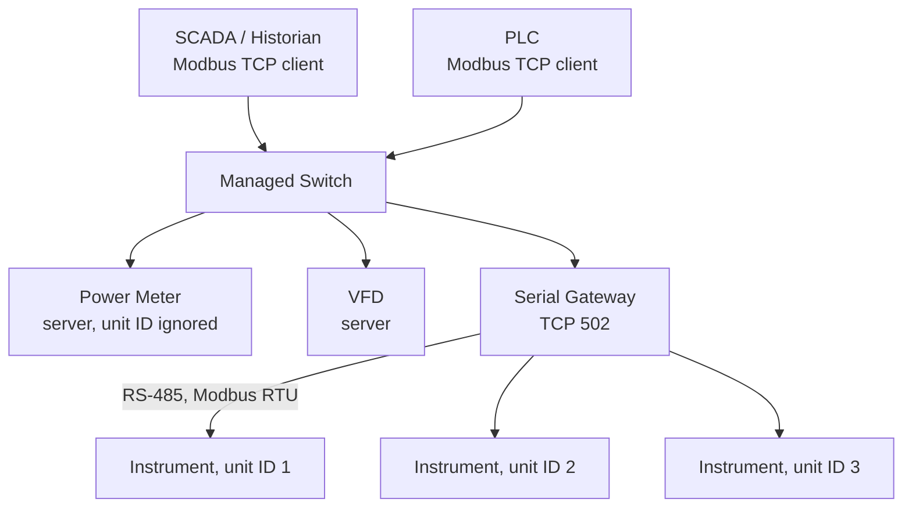

<div class="page-header">
  <span class="page-header__label">Industrial Communications</span>
  <h1>Modbus TCP</h1>
  <p>The simplest widely-deployed industrial protocol — a register read/write model over TCP port 502, supported by nearly every meter, VFD, and instrument.</p>
</div>

## Overview

Modbus TCP wraps the Modbus application protocol (maintained by Modbus.org) in a TCP connection on port 502. It is a **client/server** protocol: the client (historically "master") sends a request, the server (historically "slave") answers it. There is no cyclic connection, no device description file, and no producer/consumer model — just polled register reads and writes. That simplicity is why it survives everywhere, and why its failure modes are almost always about addressing and data interpretation rather than the protocol itself.

One distinction the terminology often blurs: **Modbus is an application protocol; RS-485 is an electrical physical layer.** Modbus RTU commonly runs over RS-485, but Modbus TCP runs over ordinary Ethernet — the two should never be treated as interchangeable terms.



## Where It Is Used

- SCADA/historian polling of power meters, flow meters, and analyzers.
- PLC communication with VFDs, temperature controllers, and packaged equipment where a full I/O protocol is unnecessary.
- Bridging legacy Modbus RTU (RS-485) devices to Ethernet through serial gateways.
- Inter-PLC data exchange in multi-vendor systems — Modbus is often the only protocol both sides implement.

Scope notes: Modbus has no device profiles — every vendor's register map is different, so the device manual is always the authority. Data beyond 16-bit registers (floats, 32-bit counters, strings) is a vendor convention, not part of the specification.

## Network Design

- **Register model** — four separate address spaces, each nominally 0–65535:

| Table | Access | Typical use |
|---|---|---|
| Coils | Read/write, 1 bit | Discrete outputs, command bits |
| Discrete inputs | Read-only, 1 bit | Discrete status inputs |
| Input registers | Read-only, 16 bit | Measured values |
| Holding registers | Read/write, 16 bit | Setpoints, configuration, and (in practice) most vendor data |

- **Function codes** — the common subset:

| FC | Action | Table |
|---:|---|---|
| 01 / 02 | Read coils / read discrete inputs | Bits |
| 03 / 04 | Read holding registers / read input registers | 16-bit registers |
| 05 / 06 | Write single coil / single register | One item |
| 15 / 16 | Write multiple coils / multiple registers | Block writes |

  A server that cannot honor a request returns an **exception response** (function code + 0x80, plus an exception code such as 01 illegal function, 02 illegal data address, 03 illegal data value). Not every device implements every function code — many meters support only FC03/FC04.
- **Client/server roles** — servers never speak unsolicited; all timing is set by the client's polling. Multiple clients may open connections to one server; verify the device's documented connection limit, and avoid two clients writing the same registers. When both a PLC and a SCADA system poll the same meter, budget the combined request rate against the device's documented capacity.
- **Unit ID** — on plain Modbus TCP the unit identifier is typically ignored (often set to 0 or 255, per the device manual). Behind a **serial gateway** it is essential: the gateway uses the unit ID to select the RS-485 slave address. A wrong unit ID through a gateway typically produces a gateway exception (0x0A/0x0B) or a timeout.
- **Security** — Modbus TCP has **no authentication and no encryption**; anyone with network reach can write coils and registers. Treat it as a protocol to be contained: segment it inside an IEC 62443 zone, restrict port 502 at conduits/firewalls, and never expose it across trust boundaries. (A Modbus Security specification over TLS exists but has limited device support — verify before relying on it.)
- **Polling design** — decide scan classes deliberately (e.g., fast data 1 s, slow data 10 s), group contiguous registers into block reads instead of many single-register reads, and set the client timeout longer than the worst-case server response — especially through serial gateways, where the RTU side adds delay per slave. Configure retries (typically 2–3) with the understanding that retries into a dead gateway multiply bus load.

## Configuration

1. **Assign the IP address** on the server device (web page, display keypad, or vendor utility) and record it in the address plan.
2. **Obtain the register map** from the device manual. Record register table, address, data type, scaling, and word order for every point — this document is the Modbus equivalent of a device description file, and you have to write it yourself.
3. **Check the addressing convention.** Documentation may be 0-based protocol addresses or 1-based register numbers (e.g., "40001" style for holding registers). A consistent off-by-one across all points almost always means the two conventions were mixed.
4. **Handle 32-bit values.** Floats and 32-bit integers span **two consecutive registers**, and the specification does not define which register holds the high word. If a float decodes as an absurd value (e.g., 5.8e-39) or a large counter jumps erratically, try swapping word order in the client before suspecting the device.
5. **For gateways**: map unit IDs to RS-485 slave addresses, set the serial parameters (baud, parity, stop bits) to match every slave, and set the gateway's RTU response timeout below the TCP client's timeout.

## Commissioning Checks

- [ ] Server answers ping and accepts a TCP connection on port 502
- [ ] A test client (e.g., a Modbus poll utility) reads a known register with the expected value before the PLC/SCADA is configured
- [ ] Unit ID confirmed — ignored value for direct devices, correct slave address through gateways
- [ ] Register offsets verified against a live known value (0-based vs 1-based resolved point by point, not assumed)
- [ ] 32-bit values decoded correctly at a known operating point (word order confirmed)
- [ ] Scaling verified against a local display or reference instrument
- [ ] Polling load acceptable: response times observed, no exception responses, no timeouts under normal operation
- [ ] Behavior on server power cycle and cable pull verified (client reconnects; stale-data handling defined)
- [ ] Port 502 reachable only from intended clients (firewall/segmentation verified)
- [ ] Write access reviewed: which clients can write which coils/registers, and whether writes are needed at all
- [ ] Register map document archived with the project, including data types, scaling, and word order per point
- [ ] For gateways: RTU-side serial parameters, termination, and per-slave response verified before blaming the TCP side

## Diagnostics

Layered approach: confirm the TCP layer first (ping, then whether the three-way handshake on port 502 completes), then the Modbus layer (does the server answer at all; does it answer with exceptions), then the data layer (are the values right). A refused or reset connection is a networking/security problem; an exception response is an addressing/configuration problem; wrong values with clean communication are a data-interpretation problem.

Modbus TCP is fully capturable in Wireshark. Capture on the client machine when the client is a PC; use switch port mirroring when it is a PLC. Useful display filters (verify filter names against the Wireshark version in use):

```text
modbus
mbtcp
tcp.port == 502
modbus.exception_code
tcp.flags.reset == 1
tcp.analysis.retransmission
```

`modbus.exception_code` isolates exception responses immediately — the exception code plus the request it answers usually identifies the fault without further work. The Wireshark dissector also decodes function codes and register addresses (as 0-based protocol addresses, which helps settle offset disputes).

What Wireshark cannot see: anything on the RS-485 side of a serial gateway. If the gateway answers with timeouts or gateway exceptions, the fault is on the serial segment — that requires the gateway's own diagnostics, an isolated USB-to-RS-485 adapter with a serial monitor, or in stubborn cases an oscilloscope on the A/B pair. A clean TCP capture proves nothing about the serial side.

## Common Faults

| Symptom | Likely causes | First checks |
|---|---|---|
| TCP connect refused / times out | Wrong IP, firewall blocking 502, device connection limit reached, server function disabled | Ping, then `tcp.port == 502` capture — SYN with no answer vs RST tells you which |
| Exception 01 (illegal function) | Device does not support that function code (e.g., FC04 on a holding-register-only device) | Device manual's supported-FC list; switch FC03/FC04 |
| Exception 02 (illegal data address) | Register offset wrong — usually the 0-based vs 1-based documentation mismatch, or read past the end of a block | Compare request address in capture against the manual's convention; try ±1 |
| Exception 03 (illegal data value) | Write value out of range, or wrong register count in a block request | Device limits for that register; block size |
| Exception 0x0A / 0x0B via gateway | Gateway can't reach the RTU slave: wrong unit ID, serial parameters, wiring, or slave offline | Gateway diagnostics page; RTU-side serial settings and termination |
| Values wrong but communication clean | Word order on 32-bit values, byte order, scaling factor, signed/unsigned mix-up | Read a known value; swap word order first — it is the most common culprit |
| All points shifted by one register | 0-based vs 1-based convention mixed between register map and client config | Fix the convention globally, not point by point |
| Intermittent timeouts through gateway | Client timeout shorter than gateway RTU round-trip, too many clients, RS-485 fault on the serial side | Gateway timeout settings; serial-side diagnostics (out of Wireshark's view) |

## Related Pages

- [EtherNet/IP]({{ site.baseurl }}/communications/ethernet-ip/) — full cyclic I/O protocol where polled registers are not enough
- [PROFINET]({{ site.baseurl }}/communications/profinet/) — the Siemens-ecosystem cyclic I/O counterpart
- [OPC UA]({{ site.baseurl }}/communications/opc-ua/) — the modern alternative for SCADA/MES integration, with the security model Modbus lacks
- [Wireshark Methodology]({{ site.baseurl }}/communications/wireshark-methodology/) — general capture and analysis workflow
- [IEC 62443]({{ site.baseurl }}/standards/cybersecurity/iec-62443/) — required reading, since Modbus TCP has no security of its own
