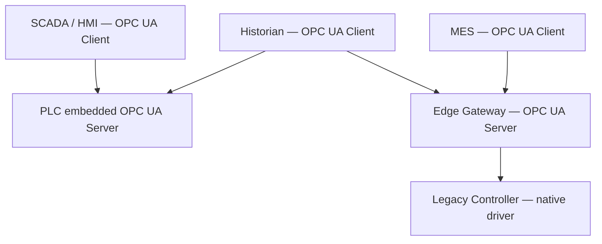

<div class="page-header">
  <span class="page-header__label">Industrial Communications</span>
  <h1>OPC UA</h1>
  <p>Vendor-neutral client/server protocol for controller-to-SCADA, MES, and historian integration — where certificate trust, not wiring, is the usual commissioning trap.</p>
</div>

## Overview

OPC UA (Unified Architecture, standardized as IEC 62541) is a platform-independent client/server protocol for exchanging structured data between automation systems and higher-level software. A server (in a PLC, gateway, drive, or SCADA node) exposes an address space of nodes; clients (SCADA, historian, MES, test tools) connect, browse, read, write, and subscribe. Unlike cyclic fieldbuses, OPC UA is not an I/O protocol — it is the integration layer above the control layer, typically over TCP (the well-known default port is 4840, though servers frequently use other ports; check the device documentation).

Data is organized as an **information model**: everything is a node with attributes and references to other nodes. At working level this means you locate a value by browsing a path (e.g., `Objects → PLC → DataBlocks → Line1 → MotorSpeed`) or by its NodeId, and the server tells you its data type, access rights, and structure. Vendors and industry groups publish companion specifications that standardize these models, but for commissioning purposes: browse the server, find the nodes, note the NodeIds.



## Where It Is Used

- Controller-to-SCADA and controller-to-historian data exchange, replacing classic OPC DA/DCOM.
- MES and enterprise integration — order data down, production data up.
- Edge gateways aggregating legacy protocols (Modbus, serial devices) into one modeled server.
- Machine-to-machine handshakes between lines from different vendors.
- Standardized data models via companion specifications (e.g., for machine tools, robotics, injection molding) where an industry group has defined the node structure — useful to know they exist when a vendor claims "OPC UA compliant" but you still need to ask *which* model.
- Not typically used for cyclic real-time I/O between a PLC and its field devices — fieldbuses and industrial Ethernet handle that layer. A PubSub variant of OPC UA exists for one-to-many and higher-performance patterns (including over UDP/TSN), but the client/server model described here is what you will normally meet on site.

## Network Design

- **Topology:** ordinary routed/switched Ethernet — OPC UA has no special physical layer. It crosses subnets, firewalls, and DMZs, which is exactly why it is the usual candidate for traffic that must pass between control and business zones (see IEC 62443 zone/conduit thinking).
- **Firewalls:** one TCP port per endpoint is normally sufficient (default 4840, often vendor-specific). No inbound connection to the client is needed — the client initiates.
- **Endpoints and discovery:** a server offers one or more endpoints, each a combination of URL (`opc.tcp://192.168.10.10:4840/...`), security policy, and message security mode. Clients can call the server's discovery service to list available endpoints. Caution: some servers return endpoint URLs containing their configured hostname rather than the IP the client used — a common failure when there is no DNS on the machine network.
- **Session and subscription limits:** embedded servers (PLC CPUs especially) enforce hard limits on concurrent sessions, subscriptions, monitored items, and sampling rates. These limits are typically modest — verify them in the controller documentation and budget them across SCADA, historian, and any diagnostic clients before commissioning, not after the historian mysteriously fails to connect.
- **Determinism:** none is promised over ordinary TCP. Treat OPC UA data as supervisory-grade, not interlock-grade.
- **Load planning:** an embedded server's cost scales with monitored items and sampling rates, not just clients. A design that reads 2,000 tags at 100 ms from a small PLC CPU may connect fine and then degrade the controller scan. Agree the tag count and rates with whoever owns the PLC performance budget.

Integration information worth recording per connection, before commissioning:

- endpoint URL, port, security policy, and message security mode;
- certificate source (self-signed vs site CA), validity dates, and where each trust list lives;
- user authentication method and the account used;
- subscription parameters: publishing interval, sampling intervals, queue sizes, lifetime/keep-alive counts;
- the server's documented session/subscription/monitored-item limits and the planned consumption per client.

## Configuration

1. **Enable and configure the server** in the controller/gateway: port, enabled security policies, and which variables are exposed to the address space.
2. **Choose the security mode deliberately.** The endpoint options are typically `None` (no signing, no encryption), `Sign` (integrity, readable payload), and `Sign & Encrypt`. `None` may be acceptable for isolated commissioning tests; production endpoints should normally use `Sign & Encrypt` with a current security policy, and many servers allow disabling the `None` endpoint entirely — verify against the site security requirements.
3. **Handle certificates — the classic commissioning trap.** Every OPC UA application (client and server both) has an application instance certificate. For a secured connection to succeed, **each side must trust the other's certificate**: the server must have the client's certificate in its trust list, and the client must trust the server's. Most first-connection failures are one direction of this handshake missing. Typical workflow: attempt a connection, the peer's certificate lands in a "rejected" folder/list, an engineer explicitly moves it to "trusted", and the next attempt succeeds. Self-signed certificates are common on machine networks; a site CA is cleaner where the infrastructure exists.
4. **Configure user authentication** separately from transport security: anonymous, username/password, or certificate-based user tokens. A perfectly trusted transport still fails with a bad user token — these are two different layers.
5. **Configure the client's subscriptions.** Prefer subscriptions/monitored items over polling: the client registers items with a sampling interval and the server sends notifications on change, with keep-alive messages when nothing changes. This is normally far cheaper for the embedded server than clients hammering cyclic reads. Set publishing intervals, queue sizes, and lifetime/keep-alive counts consciously — defaults vary widely between client tools.
6. **Tune monitored-item behavior.** For analog values, a deadband on the monitored item suppresses notification chatter from noisy signals; for event-like data, queue size determines whether intermediate changes between publishes are kept or discarded. The server may revise any requested interval to what it can actually support — read the revised values back rather than assuming the request was honored.
7. **Record NodeIds and browse paths** for every consumed variable in the integration documentation; NodeId schemes can change with a PLC project re-download depending on the vendor, so note the vendor's stability rules.
8. **Plan for restarts.** Decide, per client, how sessions and subscriptions are re-established after a PLC download, server restart, or network interruption. Production clients normally handle this automatically; bespoke or scripted clients often do not, and the failure mode is a silently stale value — arguably the worst failure a supervisory link can have.

## Commissioning Checks

- [ ] Endpoint URL reachable from the client machine (correct IP/hostname and port; hostname in returned endpoint resolvable by the client, or client configured to override it).
- [ ] Security policy and message security mode selected on the client exactly matches an endpoint the server actually offers.
- [ ] Certificate trust established **in both directions** — client cert in server trust list, server cert trusted by client; nothing left sitting in a rejected list.
- [ ] Certificate validity dates sane (device clocks set — an unset PLC clock can make a fresh certificate "not yet valid").
- [ ] User authentication method and credentials verified against the server configuration.
- [ ] Session/subscription/monitored-item counts across all clients (SCADA + historian + spares) fit within the embedded server's documented limits.
- [ ] Subscription behavior verified: values update on change, keep-alives arrive during quiet periods, and the client re-establishes the session after a server restart.
- [ ] Read/write access rights per node verified — writable setpoints writable, everything else read-only.
- [ ] `None` security endpoints disabled or documented as a deliberate, accepted exception.
- [ ] NodeIds/browse paths documented and re-verified after the final PLC program download.
- [ ] Reconnect behavior tested: pull the network cable for a minute, restore it, and confirm every client resumes with fresh values (not stale ones) without manual intervention.
- [ ] Certificate renewal ownership assigned — someone must own the calendar entry for when the application certificates expire, or the site inherits a guaranteed future outage at an unguaranteed time.

## Diagnostics

Layered approach: confirm TCP reachability first (ping, then a TCP connect to the port), then the security handshake, then session/subscription behavior. A generic OPC UA test client (several free ones exist, e.g., UaExpert-class tools) is the single most useful instrument — it isolates whether a problem is the server or the production client.

Server-side diagnostics help: many servers expose their own diagnostics nodes (session counts, subscription counts, rejected-certificate lists) in the address space, and controller web pages often show OPC UA status.

Wireshark sees OPC UA TCP traffic, with a caveat: **for Sign & Encrypt sessions the payload is opaque** — the capture shows the TCP connection and the initial Hello/Open Secure Channel handshake, then encrypted bulk. That is still useful (you can see whether the handshake completes, which side closes the connection, TCP resets and retransmissions), but application-level debugging of an encrypted session belongs in the client/server logs, not the capture.

```text
opcua
tcp.port == 4840
tcp.flags.reset == 1
tcp.analysis.retransmission
```

Adjust the port filter to the server's actual port; verify filter names against the Wireshark version in use.

Status codes are your friend: OPC UA errors come back as specific codes (`BadSecurityChecksFailed`, `BadCertificateUntrusted`, `BadIdentityTokenRejected`, `BadTooManySessions`, `BadNodeIdUnknown`, …). Read the exact code from the client log before theorizing — it usually names the failing layer.

A workable diagnostic sequence for a failed connection:

1. Ping the server IP; if that fails, it is a network problem, not an OPC UA problem.
2. TCP-connect to the port (any port-test tool); refused/timeout here means server not listening or firewall.
3. Discover endpoints with a test client over an unsecured discovery call; compare the offered policies/modes with what the production client requests.
4. Attempt the secured connection with the test client; resolve certificate trust in both directions.
5. Only then debug the production client's own configuration — you have now proven the server side end to end.

### Wireshark Workflow

1. Confirm TCP connection establishment to the endpoint port (default
   4840): filter `tcp.port == 4840` — a reset here is a port/endpoint
   problem, not a security one
2. Filter `opcua` and watch the Hello/Acknowledge exchange and
   **SecureChannel** establishment — failure at this stage points at
   security-policy or certificate mismatch
3. Certificate rejections are usually explicit only in the **application
   logs** of client and server — check both trust lists; the wire mostly
   shows the channel failing to open
4. With Sign&Encrypt sessions the payload is opaque by design — Wireshark
   confirms session health and timing, not data content
5. Subscription drops with a healthy TCP session point at keepalive/
   lifetime counts or server subscription limits rather than the network

## Common Faults

| Symptom | Likely causes | First checks |
|---|---|---|
| `BadSecurityChecksFailed` / `BadCertificateUntrusted` on connect | Certificate trust missing in one direction; expired or not-yet-valid certificate; clock skew | Check both trust lists and both rejected lists; verify certificate dates against device clocks |
| Connection refused / timeout before any OPC UA error | Wrong endpoint URL or port, server not enabled, firewall blocking, wrong subnet | TCP-connect test to the port; confirm server enabled in the controller; check firewall rules |
| Connects with `None` but fails with `Sign & Encrypt` | Policy mismatch, trust not established, server does not offer the selected policy | List endpoints from the server; match policy/mode exactly; complete the trust exchange |
| `BadIdentityTokenRejected` after secure channel opens | User authentication layer: wrong username/password, anonymous disabled, token type not supported | Verify user auth settings server-side; distinguish this from transport-certificate problems |
| Subscription silently stops updating; session appears alive | Keep-alive/lifetime counts exhausted after a network interruption; client not re-creating monitored items after reconnect | Check client reconnect logic and subscription lifetime settings; watch keep-alives in the client log |
| `BadTooManySessions` / new client cannot connect | Embedded server session limit reached — often stale sessions from crashed clients still counting | Check server diagnostics for active sessions; reduce clients or session timeouts; verify documented limits |
| Endpoint list returns unreachable hostname | Server returns its configured hostname; no DNS on the machine network | Override the endpoint hostname in the client, add hosts entry, or reconfigure the server's endpoint URL |
| Values update far slower than expected | Publishing interval / sampling interval set long, server clamping client-requested rates to its minimum | Compare requested vs revised intervals reported in the subscription creation response |

## Related Pages

- [Industrial Communications overview]({{ site.baseurl }}/communications/)
- [Modbus TCP]({{ site.baseurl }}/communications/modbus-tcp/) — the simpler register-based alternative OPC UA often aggregates
- [EtherNet/IP]({{ site.baseurl }}/communications/ethernet-ip/) and [PROFINET]({{ site.baseurl }}/communications/profinet/) — the cyclic I/O layers beneath the controllers OPC UA exposes
- [BACnet/IP]({{ site.baseurl }}/communications/bacnet-ip/) — the building-side protocol OPC UA gateways frequently bridge
- [IEC 62443 — Industrial Cybersecurity]({{ site.baseurl }}/standards/cybersecurity/iec-62443/) — zone/conduit context for OPC UA crossing network boundaries
