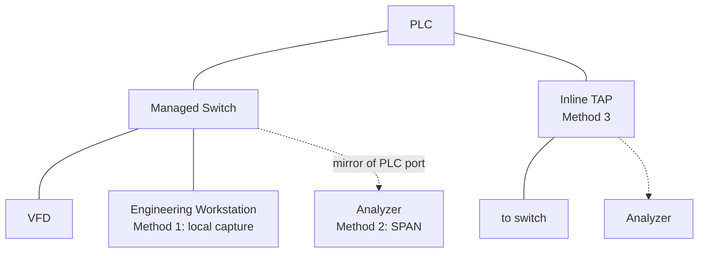

  Industrial Communications
  <h1>Packet Capture Methods</h1>
  
Where you attach the analyzer decides what you can see. On a switched network, most capture attempts fail before Wireshark even opens — because the packets never reach the capture port.

## Overview

Modern Ethernet is switched: frames are forwarded only to the port that
needs them. A laptop plugged into a spare switch port sees broadcast
traffic, multicast it happens to receive, and its own conversations —
**and normally nothing else**. Traffic between a PLC and a drive on two
other ports is invisible to it. Every capture plan starts by answering one
question: how do the packets I care about physically reach my capture
interface?

There are four answers, each with real trade-offs.

## The Four Methods

### Method 1 — Capture on the engineering workstation

Run Wireshark on the machine that is itself one end of the conversation.
Useful for traffic that originates or terminates there: OPC UA clients,
SCADA polling, programming software, device web interfaces, Modbus TCP test
clients.

- **Sees:** everything to and from that workstation.
- **Does not see:** PLC-to-drive or any other third-party traffic passing
  elsewhere through the switch. This is the classic false negative — "I
  captured and the network is fine" when the capture never contained the
  traffic in question.
- **Cost/risk:** none; no production change required. That is exactly why it
  is over-trusted.

### Method 2 — Managed-switch port mirroring (SPAN)

Configure the switch to copy traffic from a source port (or VLAN) to a
destination port where the analyzer sits. Usually the best general-purpose
method on industrial networks.

Configure: source port, destination port, direction (RX, TX, or both —
normally both), and optionally a VLAN source.

Risks and limits:

- **Oversubscription** — mirroring a full-duplex port means up to two ports'
  worth of traffic into one destination; mirroring several busy ports or a
  VLAN can exceed the destination's capacity.
- **Wrong direction selected** — an RX-only mirror silently hides half the
  conversation, which reads as "the device never replied".
- **Mirror drops under load** — most switches deprioritize mirrored frames;
  the capture can be missing exactly the packets from the moment of the
  fault. A gap in a SPAN capture is weaker evidence than a gap in a TAP
  capture.
- **Production change** — changing the configuration of a production switch
  normally requires authorization. Get it, and record what you changed so
  it can be reverted.

### Method 3 — Network TAP

A TAP (test access point) is installed inline in the link and copies both
directions to the analyzer. It is the most faithful method: it observes both
directions at full rate, does not depend on switch configuration, and a good
TAP does not drop frames.

Risks and limits:

- **Insertion requires a link interruption** — the cable must be unplugged
  to install the TAP. On a running machine that is an outage; plan it, or
  install TAPs permanently at key points during commissioning.
- **Link-negotiation influence** — copper TAPs sit in the negotiation path
  and can influence speed/duplex negotiation; verify the link comes back up
  at the expected rate after insertion.
- **Hardware suitability** — the TAP must match the link speed and be
  appropriate for the industrial environment (temperature, mounting, power).

### Method 4 — Legacy hub

An old half-duplex hub repeats every frame to every port, so a laptop on a
hub sees everything. It is generally a **poor** method: it forces
half-duplex operation, reintroduces collisions, and changes the timing
behavior of the network it is supposed to observe. Do not use a hub on
real-time or safety-related networks without a controlled test plan — the
measurement method itself can create the fault, or a new one.

| Method | Sees third-party traffic | Fidelity under load | Production impact to attach |
|---|---|---|---|
| Workstation capture | No | n/a | None |
| Port mirroring (SPAN) | Yes (mirrored ports) | Mirror may drop frames | Switch config change (authorized) |
| Network TAP | Yes (that link) | Highest | Link interruption to insert |
| Hub | Yes (all ports) | Alters network behavior | High — avoid on live systems |

## Where to Capture

- **As close to the suspect device as possible.** A capture near the device
  distinguishes "device never sent it" from "network lost it".
- **Both sides of a suspected boundary.** If a router, firewall, NAT device,
  or gateway is in the path, capture on both sides simultaneously — the
  comparison shows exactly what the boundary device altered, delayed, or
  dropped.
- Match the capture point to the fault boundary established in the
  [diagnostics methodology]({{ '/communications/wireshark-methodology/' | relative_url }}):
  a one-device fault wants the capture at that device's switch port; a
  machine-wide fault wants the uplink.

## Capture Hygiene

- **Ring buffers for intermittent faults.** Configure Wireshark/dumpcap to
  write multiple rotating files and leave it running until the symptom
  recurs. A fault that happens twice per shift will never be caught by a
  five-minute capture taken when someone is watching.
- **Time synchronization.** Sync the capture laptop, PLC clock, and switch
  logs before capturing (NTP where available; otherwise record the offsets).
  Root-cause arguments live or die on whether timestamps line up.
- **Note exactly when symptoms occur.** A capture is only searchable if you
  know where to look — have the operator or a PLC log mark the wall-clock
  time of each event.
- **Record the capture context:** capture point, method, mirror
  configuration, date, machine state. A .pcapng file without context is
  nearly worthless six months later.
- **Take a baseline** while the system is healthy, from the same capture
  point, and archive it with the project.

## Confidentiality

**Never share packet captures from an employer's or customer's network** —
not in forum posts, not in vendor support tickets without approval, not in a
public "capture library". Captures expose IP addressing schemes, hostnames,
device identities and firmware revisions, and operational data (setpoints,
recipes, production timing). Treat a capture file with the same
confidentiality as the network documentation itself. If a capture must be
shared for support, get authorization and sanitize it first — and be aware
that sanitization tools have limits.

## Common Faults

| Symptom | Likely causes | First checks |
|---|---|---|
| Capture shows almost nothing but broadcasts | Method 1 on a switched network — the traffic never reaches the laptop | Use SPAN or a TAP; confirm what the capture point can physically see |
| Only one direction of a conversation visible | RX-only or TX-only mirror; capturing on the wrong VLAN | Mirror direction setting; VLAN membership of source and destination |
| Gaps in the capture during the fault window | SPAN oversubscription or mirror deprioritization under load | Compare mirrored volume vs destination port rate; retry with a TAP |
| Link went down when the TAP was inserted | Expected — insertion interrupts the link; negotiation settled differently | Verify speed/duplex after insertion; schedule insertions as planned work |
| Wireshark reports dropped packets | Capture machine too slow, USB NIC limits, disk bottleneck | dumpcap with ring buffer, disable name resolution, faster capture hardware |
| Timestamps don't match PLC fault log | Clocks not synchronized before capture | Sync via NTP or record offsets; re-capture if correlation is the goal |
| Network misbehaved while a hub was inline | Half-duplex operation and collisions introduced by the hub | Remove the hub; use a TAP; treat any hub findings as suspect |
| Capture works on the bench, not on the machine | Different capture point sees different traffic; machine traffic stays local to its switch | Map the topology; move the capture point inside the fault boundary |

## Related Pages

- [Network Diagnostics Methodology]({{ '/communications/wireshark-methodology/' | relative_url }}) — the workflow these captures belong to (capture is step 6, not step 1)
- [Managed Switches]({{ '/communications/managed-switches/' | relative_url }}) — configuring port mirroring and reading port counters
- [Industrial Ethernet Fundamentals]({{ '/communications/ethernet-fundamentals/' | relative_url }}) — why switched networks forward the way they do
- [EtherNet/IP]({{ '/communications/ethernet-ip/' | relative_url }}) / [PROFINET]({{ '/communications/profinet/' | relative_url }}) / [Modbus TCP]({{ '/communications/modbus-tcp/' | relative_url }}) — protocol-specific filters once the capture exists
- [Modbus RTU over RS-485]({{ '/communications/modbus-rtu-rs485/' | relative_url }}) — serial buses need different capture hardware entirely
- [IEC 62443]({{ '/standards/cybersecurity/iec-62443/' | relative_url }}) — captures are sensitive artifacts under a security program
