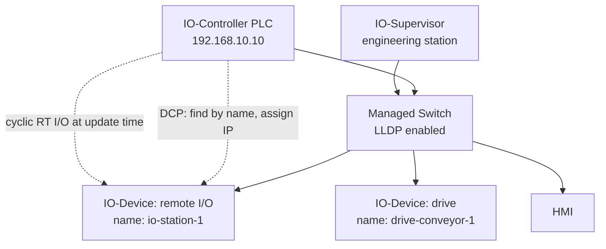

<div class="page-header">
  <span class="page-header__label">Industrial Communications</span>
  <h1>PROFINET</h1>
  <p>The PI-managed industrial Ethernet standard for cyclic I/O — common as the primary I/O network in Siemens-ecosystem machines, where the configured name-of-station is the commissioning identity.</p>
</div>

## Overview

PROFINET IO is the industrial Ethernet protocol managed by PROFIBUS & PROFINET International (PI), and the normal I/O network in Siemens-based systems (S7-1200/1500 with ET 200 I/O, SINAMICS drives) as well as many other European vendors. Three roles define an installation:

- **IO-Controller** — typically the PLC; establishes the cyclic I/O relationships and assigns IP addresses.
- **IO-Device** — remote I/O, drives, valve terminals; exchanges cyclic data with its controller.
- **IO-Supervisor** — an engineering station or diagnostic tool with temporary access for commissioning and troubleshooting.

Two real-time classes matter at overview level: **RT** (Real-Time) carries cyclic I/O directly in Ethernet frames — prioritized but running through standard switches, sufficient for most machinery — and **IRT** (Isochronous Real-Time) adds scheduled, clock-synchronized transmission through IRT-capable switch hardware for tight motion synchronization. Most installations are RT; treat IRT as a separate design exercise against vendor documentation.

The defining behavioral difference from other Ethernet protocols: **for PROFINET IO commissioning, the configured name-of-station is the primary identity** used to match an IO-Device to the engineering project. The controller finds devices by name using **DCP (Discovery and Configuration Protocol)** at Layer 2, then assigns each device the IP parameters configured in the project — IP addresses remain relevant for IP-based services and engineering access. Swapping a failed device therefore means giving the replacement the right name (or letting topology-based naming do it) — not setting an IP.



## Where It Is Used

- PLC to distributed I/O, drives, valve terminals, and identification systems — the standard fabric of Siemens-ecosystem machines and lines.
- Safety I/O via PROFIsafe layered over the same network (separate design and validation scope — not covered here).
- Motion control with IRT where drives and controller share a synchronized clock.
- Machine-to-machine and line-level data exchange (I-Device functionality, controller-to-controller).
- Brownfield migration from PROFIBUS DP: IE/PB link gateways present legacy DP slaves to a PROFINET controller, which keeps existing field wiring while the backbone moves to Ethernet.

Scope notes: this page covers PROFINET IO with RT communication. IRT engineering, PROFIsafe, and the newer TSN-based profiles have their own rules — verify against PI and vendor documentation.

## Network Design

- **Topology** — star, line (most PROFINET devices have integrated two-port switches), or ring. Line topology saves cabling but a device power loss drops everything downstream; note that in the design. Mixed forms (a line of I/O stations hanging off a star of switches) are common and fine, as long as the topology plan documents reality.
- **Switches** — use managed switches that pass DCP and LLDP correctly and honor PROFINET's Layer 2 priority tagging. Unmanaged office-grade switches in the RT path are a common source of update-time overruns.
- **Addressing** — plan names first, IP addresses second. Names should encode location/function (e.g., `io-station-1`, `drive-conveyor-1`); they must be unique and follow DNS-like naming rules (lowercase, no underscores — verify against the engineering tool's checker). The controller assigns IPs from the project, so the IP plan lives in the project, not in the devices. A typical machine subnet mirrors other industrial Ethernet practice:
  - controller 192.168.10.10, HMI 192.168.10.20, IO-Devices from 192.168.10.30, engineering station 192.168.10.100
  - subnet mask 255.255.255.0; gateway only where routing is genuinely needed
- **Update time and watchdog** — each device exchanges data at a configured update time (typically 1–8 ms for I/O, faster for drives). The watchdog is normally a small multiple (often 3×) of the update time; if frames stop for longer, the device connection faults. Set update times to what the process needs — uniformly minimal update times inflate network load without benefit.
- **Topology-based naming / LLDP** — devices and switches exchange LLDP neighborship information, so the engineering tool knows which port connects to which device. If the project's topology plan matches reality, a replacement device connected to the same port can receive its name automatically (device exchange without engineering tool). This only works if the as-built topology actually matches the project — keep the topology plan current.
- **Redundancy** — **MRP (Media Redundancy Protocol)** closes a ring of PROFINET switches/devices: one ring manager blocks the redundant path and unblocks it on failure, with reconfiguration typically in the 200 ms class — fast enough for RT I/O with adequate watchdogs, not a substitute for IRT-grade seamless redundancy. Never close a physical ring without MRP (or equivalent) configured; an unmanaged loop creates a broadcast storm.
- **Segmentation** — keep PROFINET inside its machine-level zone per IEC 62443; DCP is Layer 2 and unauthenticated, so anyone on the segment can rename devices.

## Configuration

1. **Install GSDML files** for every third-party device in the engineering tool (Siemens devices are usually built into the catalog). Verify the GSDML version matches the device firmware — module catalogs differ between versions.
2. **Configure the device in the project**: insert it, set its name-of-station, set the IP the controller will assign, and configure the exact module/submodule layout to match the physical hardware, slot by slot.
3. **Assign names to real devices** using the engineering tool's "assign device name" function (or DCP-based commissioning tools). The tool discovers devices via DCP, typically with an LED-flash function to physically identify which device you are naming.
4. **Set update times and watchdogs** deliberately per device class rather than accepting one global value.
5. **Enter the topology plan** (which port connects where) if topology-based device replacement or detailed port diagnostics are wanted.
6. **Configure MRP** ring roles (one manager, others clients) if a ring is used, and verify the ring ports match the physical cabling.

Record per device during design: name-of-station, planned IP, device type and order number, firmware revision, GSDML file/version, module layout, update time, watchdog factor, switch port, and cable identifier. This register is what makes device replacement at 03:00 routine instead of an investigation.

## Commissioning Checks

- [ ] Every device holds its correct, unique name-of-station (verify via DCP scan from the engineering tool)
- [ ] No leftover names from bench testing or previous projects on the segment (a stale duplicate name surfaces as an intermittent startup fault)
- [ ] Controller assigns IP addresses successfully — devices reachable after a cold start of the whole network
- [ ] Configured module layout matches physical hardware exactly — no "module mismatch" diagnostics per slot
- [ ] GSDML versions match installed device firmware
- [ ] All devices in cyclic data exchange: controller shows no device failure; BF/SF-type indicators off
- [ ] Update times and watchdog factors match the design document
- [ ] LLDP neighborship matches the topology plan (port-by-port check in the engineering tool)
- [ ] Device replacement test: swap (or reset) one device and confirm automatic naming works, if configured
- [ ] MRP ring test: open the ring at one point and confirm I/O rides through; alarm raised and logged
- [ ] Ring closed again and manager status verified after the test (an open ring left behind removes the redundancy silently)
- [ ] Recovery verified after cable pull and device power cycle; diagnostics buffer entries reviewed and understood
- [ ] Diagnostics buffer cleared of stale entries at handover so the next fault stands out
- [ ] Name/IP register, topology plan, GSDML versions, switch configuration backups, and a baseline capture archived

## Diagnostics

Layered sequence: physical (link LEDs, port errors), then identity (does the device have the right name — DCP scan), then configuration (module mismatch diagnostics in the controller), then cyclic behavior (frame gaps, watchdog drops). Status indicators on Siemens-style equipment follow a common pattern — generically, a **BF** (bus fault) type indicator points at missing communication (no link, wrong/missing name, no controller connection), while an **SF** (system fault) type indicator with communication present points at configuration or module-level diagnostics. Exact indicator behavior is vendor-specific — verify against the device manual.

The controller's diagnostics buffer and the engineering tool's online device view are usually faster routes to the fault than packet capture, because PROFINET devices report structured diagnostics (channel-level faults, wrong module, neighbor mismatch) natively.

For Wireshark work, note that cyclic RT frames are Layer 2 traffic between controller and device — **a laptop on a spare switch port will not see them**. Capture at the right location: managed-switch port mirroring of the controller or device port, or a TAP in the line. DCP and LLDP, by contrast, are often visible more broadly (DCP identify is multicast). Useful display filters (verify filter names against the Wireshark version in use):

```text
pn_io
pn_dcp
lldp
pn_mrp
dcerpc
arp
```

`pn_dcp` shows the discovery/naming conversation — name conflicts and failed identify requests appear here. In a healthy mirror-port capture, `pn_io` cyclic frames repeat at the update time; gaps longer than the watchdog explain device dropouts. The connect sequence at device startup (carried over UDP/DCE-RPC) shows the controller's module configuration being accepted or rejected — a reject here maps directly to a "module mismatch" diagnostic.

What Wireshark cannot show: channel-level device diagnostics (wire break on input 3, undervoltage) travel as alarm frames but are far easier to read in the engineering tool; and no capture proves physical-layer health — port error counters and, where warranted, cable certification cover that layer.

## Common Faults

| Symptom | Likely causes | First checks |
|---|---|---|
| BF-type indicator flashing, device not found | Wrong or missing name-of-station, device not reachable at Layer 2, duplicate name | DCP scan from engineering tool; compare found name against project |
| Device found but no cyclic exchange | IP assignment failed (address conflict), module configuration mismatch, watchdog too tight | Controller diagnostics buffer; online vs offline module comparison |
| SF-type indicator on, I/O running | Channel diagnostic (wire break, short), wrong submodule parameter, neighbor mismatch alarm | Device diagnostics in engineering tool, slot by slot |
| "Module mismatch" after device swap | Replacement hardware/firmware differs from project, wrong GSDML version | Compare ordered vs configured module; update GSDML or project |
| Replacement device not auto-named | Topology plan doesn't match actual port, LLDP blocked by a switch, feature not enabled | LLDP neighborship view; verify the port in the topology plan |
| Sporadic device dropouts | Line-topology upstream device power/port fault, update time too aggressive for path, EMC on a segment | Diagnostics buffer timestamps vs process events; port error counters |
| Whole segment drops and recovers | Ring open/close events (MRP), broadcast storm from an unmanaged loop, uplink flap | Switch/MRP event logs; check for unconfigured physical loops |
| Device lost after IP change from outside tool | External tool set an IP/name outside the project; controller reassigns or conflicts | DCP scan; re-assign name from the project; restrict who can run DCP tools |

## Related Pages

- [EtherNet/IP]({{ site.baseurl }}/communications/ethernet-ip/) — the Rockwell-ecosystem counterpart; IP-based identity instead of name-based
- [PROFIBUS DP]({{ site.baseurl }}/communications/profibus-dp/) — the serial predecessor still common in installed Siemens systems, often bridged via IE/PB links
- [Modbus TCP]({{ site.baseurl }}/communications/modbus-tcp/) — simple polled protocol often bridged into PROFINET systems via gateways
- [Managed Switches]({{ site.baseurl }}/communications/managed-switches/) — LLDP, mirroring, and priority handling that PROFINET RT relies on
- [Wireshark Methodology]({{ site.baseurl }}/communications/wireshark-methodology/) — general capture and analysis workflow, including where to capture
- [IEC 62443]({{ site.baseurl }}/standards/cybersecurity/iec-62443/) — segmentation guidance; DCP's unauthenticated naming is a concrete reason to enforce it
