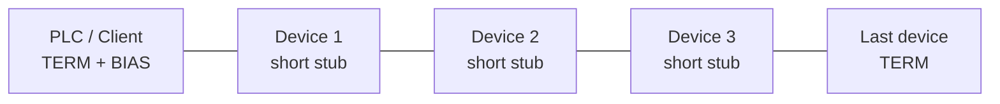

  Industrial Communications
  <h1>RS-485 Physical Layer</h1>
  
The electrical layer under Modbus RTU, PROFIBUS DP, BACnet MS/TP, and countless proprietary buses — where most "protocol" faults actually live, and where a multimeter and an oscilloscope settle arguments that software tools cannot.

## Overview

RS-485 (TIA-485) defines the *electrical* characteristics of a balanced multipoint bus — and nothing else. Keeping the boundary straight prevents a lot of confused troubleshooting:

- **The standard defines:** driver output levels, receiver sensitivity, common-mode range, and bus loading.
- **The standard does not define:** message format, addressing, baud rate, connectors, or cable — those belong to whatever protocol and installation practice ride on top.

For the protocol side of the most common pairing, see [Modbus RTU over RS-485]({{ site.baseurl }}/communications/modbus-rtu-rs485/); this page is the physical-layer companion — signaling and measurement.

**The core idea is differential signaling.** The bus is a twisted pair, conventionally labeled A and B. The driver puts complementary voltages on the two lines; the receiver reads only the *difference* V(A) − V(B), not either line's voltage against ground. Noise coupled into the cable — from a nearby VFD, a contactor coil, a welding circuit — tends to couple *equally* into both conductors of a twisted pair (that is what the twisting is for). Equal noise on both lines shifts them together but leaves the difference unchanged, so the receiver rejects it. This common-mode rejection is why one cheap twisted pair carries data through electrical environments that would bury a single-ended signal like RS-232.

**Receiver threshold.** Per the standard's receiver sensitivity requirement, a compliant receiver must resolve a differential input of ±200 mV: above +200 mV is one logic state, below −200 mV is the other. The band in between is undefined — an important fact, because an idle, undriven bus sits exactly in that undefined band unless something holds it out (see bias, below). Drivers typically produce 1.5 V or more differential into a loaded bus, so a healthy network has generous margin over the 200 mV threshold; measuring how much margin remains at the far end is one of the most useful things a scope tells you.

One linear trunk, devices tapped with short stubs, a terminator at each physical end, bias at one point. Every design rule below is a consequence of transmission-line behavior on this topology.

## Where It Is Used

- Under **Modbus RTU** — VFDs, power meters, temperature controllers, gensets (protocol page covers this pairing).
- Under **PROFIBUS DP** — the same electrical layer with its own connector, termination, and baud rules; see [PROFIBUS DP]({{ site.baseurl }}/communications/profibus-dp/).
- Under **BACnet MS/TP** in building automation, **DMX512** in lighting, and many proprietary vendor buses (drive keypads, chiller networks, fire panels).
- Anywhere a signal must run hundreds of meters through electrically noisy plant on inexpensive cable — RS-485's home turf. Runs of 1000 m or more are achievable at modest baud rates; length and baud rate trade off against each other (verify against transceiver and cable data).

Honest scope note: this page treats 2-wire half-duplex RS-485, by far the most common industrial form. 4-wire (full-duplex, RS-422-style) variants exist and follow the same electrical reasoning per pair.

## Design Rules

**Termination — why and where.** A long cable is a transmission line with a characteristic impedance (typically around 120 Ω for RS-485 cable). A signal edge arriving at an unterminated end sees an impedance discontinuity and reflects back down the line, where it superimposes on later bits.

- **Why:** the terminating resistor matches the cable impedance and absorbs the arriving energy, so nothing reflects.
- **Where:** across the pair at *each of the two physical ends of the trunk*. Two terminators total, nowhere else — mid-bus terminators add DC loading that drags down differential amplitude without helping reflections.
- **Value:** typically 120 Ω, matching the cable; using a "standard" 120 Ω on cable of unknown, different impedance only partially works.
- **Whether it is needed at all** depends on baud rate versus line length — a short bus at low baud may run unterminated because reflections settle before the bit is sampled — but terminating correctly by default is the defensible design position.

**Bias (fail-safe) resistors — why the idle bus needs help.** When no driver is enabled, both lines float and the differential voltage drifts through the ±200 mV undefined band, where receivers may chatter and UARTs register phantom start bits — the classic symptom is framing errors *between* otherwise-good frames.

- **What:** a pull-up on one line and a pull-down on the other (which line gets which depends on the idle polarity the protocol expects), holding the idle bus at a defined differential voltage outside the undefined band.
- **Where:** at **one point** on the network, commonly the client/master end. Duplicated bias at several nodes shifts the operating point unpredictably and adds loading.
- **Interaction with termination:** the two 120 Ω terminators appear in parallel (~60 Ω) across the pair, forming a voltage divider with the bias resistors — bias values must be sized against that load to still guarantee more than 200 mV idle differential. Bias sized for an unterminated bench test often proves too weak on the fully terminated trunk.
- Some modern transceivers have internal fail-safe receivers that treat a floating bus as idle — verify against the datasheet before deleting external bias.

**The third conductor.** RS-485 is differential but not magically floating: the standard defines a limited common-mode operating range (roughly −7 V to +12 V relative to the transceiver's ground — verify against the specification). If two nodes' local grounds differ by more than that, receivers misbehave or transceivers die.

- So "2-wire RS-485" is really **3-wire in practice**: the pair plus a signal-common conductor tying the transceiver references together, usually through some series resistance to limit circulating current.
- Within one panel or one building on one grounding system, the common conductor is cheap insurance.
- *Between* buildings, across large drive lineups, or anywhere ground potentials genuinely differ, a common conductor is not enough — use galvanically **isolated transceivers or isolated repeaters**, which break the ground loop entirely.
- Ground-potential difference is the leading cause of RS-485 links that fail intermittently, seasonally, or "only when the big drive runs."

**Polarity labeling chaos.** The standard's A/B naming is applied inconsistently across the industry: one vendor's A is another vendor's B, and the same two signals also appear as +/−, D+/D−, D0/D1, or TxD+/TxD−, with no reliable mapping between conventions. **Never assume two vendors' "A" terminals are the same wire.** Verify by measurement — scope the idle bias polarity, or check each device against a known-good reference on the bench — or accept swap-and-try as a legitimate commissioning technique on a two-terminal interface (a swapped RS-485 pair does not damage anything; it just fails to communicate). A swapped pair at one device inverts every bit that device sees and is the single most common RS-485 field fault.

**Stubs and topology.** The trunk must be a daisy chain; each device connects through the shortest practical stub.

- A stub is an unterminated branch — you cannot terminate it without ruining the trunk loading — so every stub end reflects.
- Whether the reflection matters depends on stub length relative to the signal's *rise time*: if it returns and settles well within the bit's sampling window it is harmless; if the stub is long or the baud rate high, it corrupts sampling.
- This is why star and tree topologies fail, why they fail *worse* as baud rises, and why a network that ran for years at 9600 baud collapses when someone raises it to 115200.
- Keep stubs to a fraction of a meter where possible; if branching is genuinely unavoidable, use an RS-485 repeater or hub designed for it rather than passive tees.

**Unit loading and device count.** The standard defines bus loading in "unit loads" (UL): a standard transceiver presents 1 UL, and a compliant driver must drive **32 unit loads** plus the two terminators. Modern fractional-load transceivers (1/2, 1/4, 1/8 UL) allow 64, 128, or 256 physical devices on one segment — verify against the transceiver datasheets, and remember that protocol addressing or polling time usually becomes the practical limit before electrical loading does. Beyond the limit, a repeater starts a fresh electrical segment with its own terminators and bias.

## Installation Practice

- Use twisted-pair cable specified for RS-485 (characteristic impedance ~120 Ω, low capacitance); generic instrument cable of unknown impedance invites reflection problems that no terminator value fixes.
- Route the bus per the trunk drawing — physically. The two terminators go at the two *physical* ends of the cable, which after field changes are not always the devices the drawing says they are.
- Land the shield per site practice (commonly grounded at one end to avoid shield ground loops — verify the site standard) and maintain shield continuity through every junction box.
- Carry the signal common with the pair (three-conductor shielded cable or the second pair of a two-pair cable); do not rely on building steel as the reference.
- Keep the bus segregated from power wiring per normal separation practice, and cross power cables at right angles where unavoidable — especially VFD output cables.
- Audit built-in termination and bias switches (DIP switches, jumpers, software settings) on every device as it is installed; the common field failure mode is too many enabled, not none.
- Label A/B polarity at every landing point *as measured*, not as the terminal legend claims.

## Commissioning & Testing

- [ ] Power off: resistance across the pair ≈ 60 Ω (two 120 Ω terminators in parallel); ~120 Ω means one terminator, ~40 Ω or less means too many
- [ ] Power off: continuity of the signal-common conductor end to end; shield continuity and single-point ground verified
- [ ] Power on, bus idle: differential voltage across A–B present, correct polarity, and above 200 mV — proves bias is fitted once and sized correctly
- [ ] A/B polarity verified by measurement at every device, not by terminal label
- [ ] Common-mode check: each line to local ground at the far devices stays well inside the transceiver common-mode range during operation
- [ ] Stub lengths measured and recorded; no star or tree branches beyond what the drawing shows
- [ ] Unit-load count vs the weakest driver's rating, including any fractional-UL math, recorded
- [ ] Isolation fitted where the bus leaves the building or grounding system; verified galvanic (no DC path pair-to-ground through the isolator)
- [ ] Far-end differential amplitude scoped under full traffic with all devices connected — adequate margin above 200 mV
- [ ] Soak test at the design baud rate with error counters logged; then re-verify at that rate, not a lower "test" rate

## Diagnostics with an Oscilloscope

Protocol monitors show you *what* went wrong; only a scope shows you *why*. Serial traffic is not capturable in Wireshark — the electrical layer needs electrical tools.

**Where to probe.**

- **Differential A-to-B** is the measurement that matters — ideally with a true differential probe. Failing that, two channels (A to ground, B to ground) with channel math A−B works, but beware: two single-ended probes ground-referenced to the scope can themselves create a ground loop on a live bus. A battery-powered scope or differential probe avoids this.
- **Single-ended A and B to ground, viewed separately**, is diagnostic in its own right: it reveals common-mode shifts, asymmetry between the lines, and ground-noise riding on both — all invisible in the differential view.
- Probe at the **far end** of the trunk first (worst-case amplitude and reflections), then at suspect midpoints.

**What healthy looks like.**

- Clean, fast edges with at most a small, quickly-settled step after each transition.
- Differential amplitude of roughly 1.5 V or more under load — generous margin above the 200 mV threshold — measured at the *far* end, not just next to the driver.
- A flat idle level held at the bias voltage between frames: not drifting, not oscillating, not sitting inside the ±200 mV band.

**Signatures and what they mean.**

- **Steps, ringing, or overshoot after edges** — reflections: missing/wrong-value terminator, terminator not at the true physical end, long stubs, or a star branch. The delay from edge to reflection even estimates the distance to the discontinuity (signal travels roughly 5 ns per meter in cable — verify velocity factor).
- **Rounded, slow edges** — cumulative cable capacitance: run too long for the baud rate, too many devices, or wrong cable type. If the edge has not settled by mid-bit, lower the baud or shorten/segment the bus.
- **Noise bursts synchronized to drive or machine operation** — coupled interference: check shield continuity and grounding, segregation from VFD output cables, and common-mode shift during the event on the single-ended views.
- **Sawtooth fighting or distorted overlapping waveforms** — two drivers on simultaneously: duplicate protocol address, a device with a stuck driver-enable, or a converter with bad automatic direction control.
- **Idle level inside ±200 mV or wandering** — missing, duplicated, or mis-sized bias; expect framing-error symptoms at the protocol level.
- **Differential looks fine but errors persist** — switch to the single-ended views: a large or moving common-mode offset can sit near the transceivers' limit while the difference still looks textbook.

A protocol-level companion to all of this — a listen-only isolated USB-to-RS-485 adapter with a serial monitor — is covered on the [Modbus RTU page]({{ site.baseurl }}/communications/modbus-rtu-rs485/); use both views together, since each sees what the other cannot.

## Common Faults

| Symptom | Likely causes | First checks |
| --- | --- | --- |
| Whole bus dead or garbled | A/B swapped somewhere on the trunk, broken conductor, transceiver killed by common-mode event | Idle bias polarity at several points, pair resistance, scope at client end |
| One device unreachable, rest fine | A/B swapped at that device, its termination switch left on mid-bus, dead transceiver | Its measured polarity vs the trunk, DIP/jumper audit, poll it alone |
| Random errors across many devices | Terminator count wrong, bias missing/duplicated, marginal cable, EMI | ~60 Ω pair test, idle differential voltage, scope far end for reflections and noise |
| Errors correlate with drives/welders/weather | Ground-potential difference, shield discontinuity, coupling | Single-ended A and B to ground during the event, shield continuity, fit isolation |
| Worked at low baud, fails at higher | Stub/star reflections now inside the bit window, cable length vs rate | Topology audit, scope for post-edge steps, measure edge settling vs bit time |
| Far-end devices marginal, near-end fine | Attenuation, missing far terminator, too many unit loads, damaged splice | Far-end differential amplitude, terminator presence, UL count |
| Framing errors between frames, data otherwise good | Bus floating at idle — bias missing or fighting | Idle differential voltage and stability on scope |
| Two devices' replies collide/overlap | Duplicate address (protocol) or stuck driver (electrical) | Scope for overlapping drivers; isolate devices one at a time |

## Related Pages

- [Modbus RTU over RS-485]({{ site.baseurl }}/communications/modbus-rtu-rs485/) — the protocol most often riding on this physical layer: framing, addressing, timing, and serial-monitor diagnostics
- [PROFIBUS DP]({{ site.baseurl }}/communications/profibus-dp/) — RS-485-based but with its own termination (powered), connector, and baud-dependent rules; do not mix the two practices
- [Packet Capture Methods]({{ site.baseurl }}/communications/packet-capture-methods/) — where serial buses fit (and do not fit) in a capture strategy
- [Case Study: Intermittent I/O]({{ site.baseurl }}/communications/case-study-intermittent-io/) — a worked diagnostic narrative in the same spirit as the scope method above
- [IEC 62443 — Industrial Cybersecurity]({{ site.baseurl }}/standards/cybersecurity/iec-62443/) — fieldbuses have no inherent security; segment accordingly
