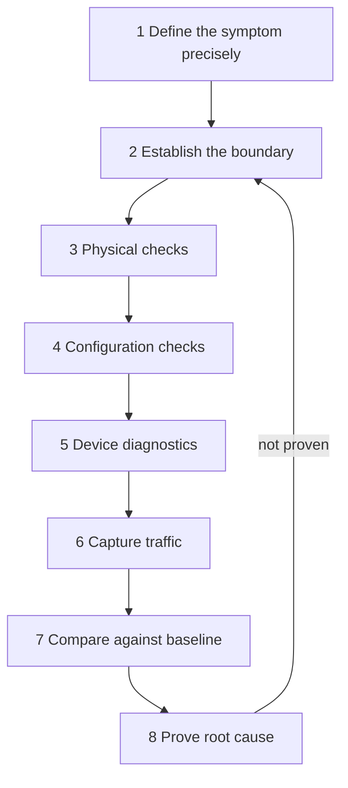

<div class="page-header">
  <span class="page-header__label">Industrial Communications</span>
  <h1>Network Diagnostics Methodology (with Wireshark)</h1>
  <p>A consistent workflow for network faults — because opening Wireshark first is how you spend a shift admiring packets while the actual problem is a loose M12 connector.</p>
</div>

## Overview

Most industrial network faults are solved by method, not by tools. Wireshark
is a core tool in this workflow, but it appears at step 6 — after the
symptom is defined, the boundary is established, and the physical and
configuration layers have been checked. Capturing packets before you know
what question you are asking normally produces a large file and no answer.



## The Eight-Step Workflow

### Step 1 — Define the symptom precisely

Bad:

> Network communication is not working.

Better:

> PLC 192.168.10.10 loses its cyclic I/O connection to VFD 192.168.10.40
> approximately twice per shift, for two to five seconds, and recovers on
> its own.

Record: affected devices, start time, duration, frequency, operating mode
when it occurs, recent changes (firmware, cable work, new devices), whether
the fault clears automatically, and any controller or switch fault messages.
A precise symptom statement is half the diagnosis — it defines what a
capture must contain to be useful.

### Step 2 — Establish the boundary

Determine whether the fault involves one device, one switch port, one VLAN,
one machine, multiple devices, an uplink, a router or firewall, a serial
gateway, or the whole plant network. The boundary tells you where to look —
and later, where to capture. A fault affecting every device on one switch is
a different investigation than a fault affecting one drive.

### Step 3 — Physical checks first

Device power, link LEDs, connector seating, visible cable damage, shield and
grounding, switch-port error counters, environmental noise sources,
temperature, vibration. A large share of "network problems" end here, and
none of them show up cleanly in a packet capture.

### Step 4 — Configuration checks

IP address, subnet mask, gateway, device name, node address, baud rate and
parity (serial links), VLAN membership, multicast configuration, PLC device
settings, firmware compatibility. Compare against the documented design, not
against memory.

### Step 5 — Collect device diagnostics

Before capturing, harvest what the devices already know: PLC fault buffer,
device and drive fault history, switch logs and SNMP counters, web-interface
diagnostics, topology information. Device diagnostics often timestamp the
fault for you and narrow the capture window dramatically.

### Step 6 — Capture traffic

Capture **before, during, and after** the failure — an intermittent fault
demands a ring buffer left running until the symptom recurs (see
[Packet Capture Methods]({{ '/communications/packet-capture-methods/' | relative_url }})
for where and how to attach).

Synchronize the clocks of everything that logs: PLC, SCADA, managed switch,
capture laptop, historian, and drive or device logs. Correlating a packet
timestamp with a PLC fault entry is only possible if the clocks agree — a
few seconds of drift is enough to make cause and effect ambiguous.

### Step 7 — Compare against a healthy baseline

A baseline capture taken when the system works is normally more useful than
an isolated fault capture. Compare packet intervals, sequence numbers,
response times, retries, multicast volume, error responses, connection
setup, and device identities. Without a baseline, you cannot tell whether
what you are looking at is abnormal — take one at commissioning and keep it
with the project documentation.

### Step 8 — Prove root cause, not correlation

Do not stop at correlation. "Communication dropped when the cable moved" is
a hypothesis, not a conclusion. Better evidence chain:

- the switch port showed CRC errors;
- packet loss occurred at the same timestamp;
- cable certification failed;
- replacing the cable eliminated the errors;
- repeated testing confirmed the correction.

Each link in that chain is independently checkable. If the fix cannot be
demonstrated to remove the symptom repeatably, the case is still open.

## What Wireshark Can Identify

- incorrect and duplicate IP addresses;
- ARP problems (missing replies, gratuitous ARP conflicts);
- TCP resets, retransmissions, and connection timeouts;
- protocol error responses — Modbus exception codes, CIP error status;
- cyclic I/O interruptions (gaps in what should be a steady packet interval);
- excessive broadcast or multicast traffic, including broadcast storms;
- repeated connection attempts and rejected configurations;
- slow-response patterns and unexpected communication partners.

## What Wireshark Cannot Replace

- cable certification;
- oscilloscope testing;
- RS-485 signal analysis (Wireshark on a laptop NIC cannot see serial buses at all);
- fiber power measurement;
- managed-switch internal counters and diagnostics;
- PLC diagnostic buffers and drive fault history;
- functional-safety validation;
- continuous cybersecurity monitoring.

**A clean packet capture does not prove the physical layer is healthy under
all operating conditions.** A marginal cable can pass traffic for hours at
low load and low temperature, then fail when the machine runs. Wireshark
sees frames that arrived; it says nothing about the ones that were never
sent or the electrical margin of the ones that were.

## General Display Filters

Protocol-specific filters live on each protocol page. These general filters
apply to almost any Ethernet investigation:

```text
arp                              # address resolution traffic — conflicts, storms
icmp                             # ping and unreachable messages
tcp.analysis.retransmission      # packets Wireshark believes were resent
tcp.flags.reset == 1             # TCP connections being torn down abruptly
ip.addr == 192.168.10.40         # all traffic to or from one device
eth.addr == 00:11:22:33:44:55    # all traffic to or from one MAC
```

Verify filter names against the Wireshark version in use — dissector and
field names occasionally change between releases; the Display Filter
Reference for your installed version is authoritative. Note also that
display filters (shown packets) and capture filters (collected packets) use
different syntaxes.

## Common Faults

| Symptom | Likely causes | First checks |
|---|---|---|
| One device unreachable, everything else fine | Wrong IP/mask/VLAN, cable or port fault, device powered down, duplicate address | Link LED, ping, ARP entry, switch port counters (steps 3–4) |
| Device pings but the application connection fails | Wrong application parameters (assembly, unit ID, name), firewall, keying mismatch | Device diagnostics and protocol page for that fieldbus (step 5) |
| Intermittent dropouts, seconds long, self-recovering | Marginal cable, duplicate IP, multicast flooding, oversubscribed link, EMC event | Ring-buffer capture spanning the event + switch logs with synced clocks (step 6) |
| Many devices fail simultaneously | Switch or ring failure, broadcast storm, uplink loss, controller fault | Boundary first (step 2); switch logs; `arp` and broadcast filters in the capture |
| Everything is "slow" but nothing faults | Congestion, retransmissions, half-duplex mismatch, overloaded device CPU | `tcp.analysis.retransmission` against the baseline capture (step 7) |
| Capture looks clean but the fault persists | Capturing in the wrong place; physical-layer margin; fault not in the captured window | Capture location vs boundary; physical-layer instruments; longer ring buffer |
| Fault "fixed" but returns weeks later | Correlation mistaken for root cause; symptom masked by the intervention | Re-run step 8 — demand the full evidence chain |

## Related Pages

- [Packet Capture Methods]({{ '/communications/packet-capture-methods/' | relative_url }}) — where and how to attach the analyzer
- [Industrial Ethernet Fundamentals]({{ '/communications/ethernet-fundamentals/' | relative_url }}) — the concepts the filters assume
- [Managed Switches]({{ '/communications/managed-switches/' | relative_url }}) — port mirroring, counters, and logs
- [Modbus TCP]({{ '/communications/modbus-tcp/' | relative_url }}) / [EtherNet/IP]({{ '/communications/ethernet-ip/' | relative_url }}) / [PROFINET]({{ '/communications/profinet/' | relative_url }}) — protocol-specific filters and symptom tables
- [Modbus RTU over RS-485]({{ '/communications/modbus-rtu-rs485/' | relative_url }}) — what to use when Wireshark cannot see the bus
- [IEC 62443]({{ '/standards/cybersecurity/iec-62443/' | relative_url }}) — monitoring beyond ad-hoc diagnostics
