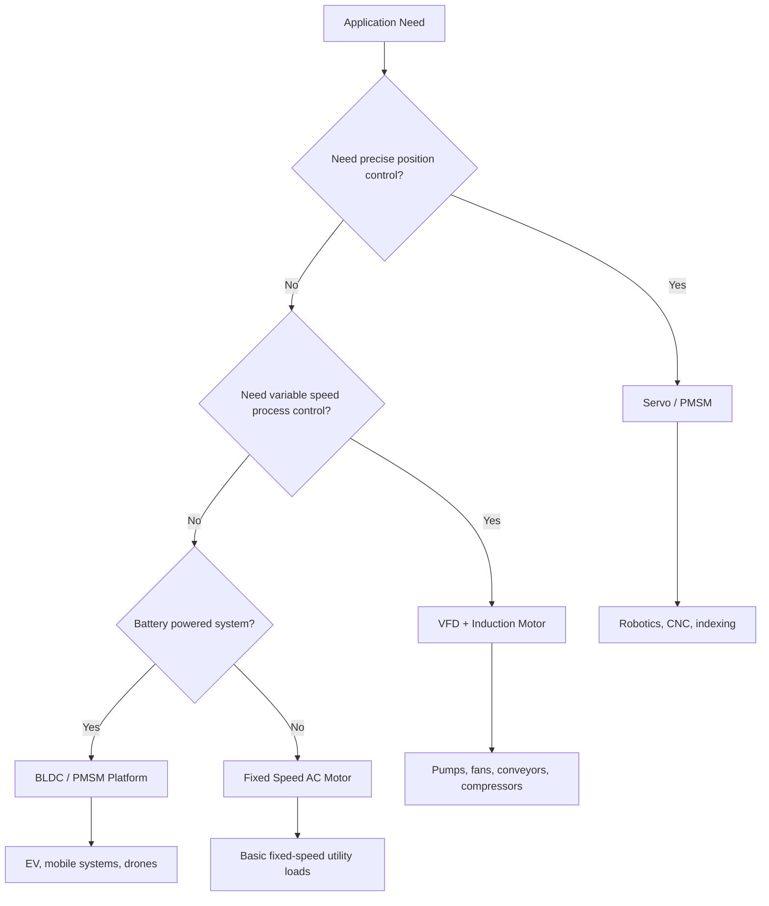

  Reference — Motor Systems
  <h1>Motor Selection Comparison Matrix</h1>
  
Use during early concept selection when the question is not just "what motor size?" but "what motor-system family fits the application?" Not a substitute for detailed motor sizing, thermal review, protection review, or manufacturer-specific drive selection.

## Selection Logic

---

## Comparison Matrix

| Motor/system type | Supply | Control complexity | Maintenance | Precision | Torque density | Typical applications |
|---|---|---|---|---|---|---|
| Fixed-speed induction motor | plant AC | low | low | low | moderate | pumps, fans, simple machinery |
| VFD + induction motor | AC + inverter | moderate | low | moderate | moderate | conveyors, pumps, process equipment |
| PMSM servo system | DC bus + servo inverter | high | low | high | high | robotics, CNC, packaging |
| BLDC system | DC bus + electronic commutation | moderate | low | moderate–high | high | compact battery systems |
| Stepper system | DC bus + stepper driver | low–moderate | low | moderate at low speed | lower at high speed | light positioning |
| Brushed DC motor system | DC | low–moderate | high | moderate | moderate | legacy variable-speed systems |
| EV traction motor system | HV battery + inverter | high | low | high torque/speed | very high | vehicle propulsion |
| Drone propulsion motor | battery + ESC | moderate | low | low | high for mass | UAV propulsion |

---

## Application Mapping

### Process and utility loads

Best fit: induction motor, VFD + induction motor

Typical loads: pumps, fans, blowers, conveyors, compressors

Primary concern: robustness, speed control, plant maintainability.

### Precision motion systems

Best fit: PMSM servo system

Typical loads: robotic joints, indexing axes, semiconductor stages, packaging axes, CNC feed systems

Primary concern: repeatability, dynamic response, precise control, coordinated motion.

### Compact battery-powered machines

Best fit: BLDC, PMSM platform

Primary concern: compactness, efficiency, power density.

---

## Decision Factors

Review at least the following:

1. Required motion type
2. Power source
3. Duty cycle
4. Thermal environment
5. Maintenance expectations
6. Control architecture

---

## Common Mistakes

**Selecting by power rating only** — power rating alone is not enough. Application behavior, torque profile, duty cycle, and control requirements matter.

**Selecting servo where VFD is sufficient** — servo complexity should be justified by motion-performance requirements.

**Ignoring the full system** — motor selection must be coordinated with drive, feedback method, cable and grounding design, protection strategy, machine mechanics, and safety function design.

---

## Related References

- [Motor Selection Workflow]({{ '/design/workflows/motor-selection/' | relative_url }}) — step-by-step selection process

---

Source: <code>control-standards/rag/design_framework/motor_systems/motor_selection_comparison_matrix.md</code>. This is a design aid derived from the canonical RAG. Verify against applicable standards before use.

