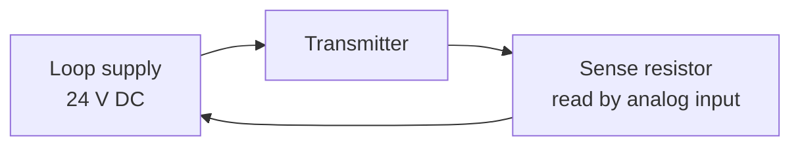

  Wiring &amp; Installation
  <h1>4–20 mA Current Loop Wiring</h1>
  
The workhorse of industrial analog — why a current signal shrugs off noise and wire resistance, how to match active and passive ends, and how to keep the loop inside its voltage budget.

> **Safety.** This guide is educational reference material, not a work
> instruction. Electrical work is performed de-energized and verified by
> qualified personnel under your site's LOTO procedures, following the device
> manufacturer's manual and the authority having jurisdiction. A live loop
> shares a panel with hazardous voltages — treat the enclosure as energized
> until proven otherwise.

## Overview

A 4–20 mA loop transmits an analog value as a **current**, not a voltage, and
that single choice explains almost everything about how it is wired. Because
the loop is a **series circuit**, the same current flows at every point — so
the resistance of the wire, the terminals, and any barrier in the loop does
not change the reading. A voltage signal depends on a shared reference and
degrades over distance; a current signal does not.

Two more properties fall out of the same idea. **Live zero:** 4 mA is 0% of
span and 20 mA is 100%, so a reading *below* 4 mA cannot be a legitimate
process value — it means a broken wire, a dead transmitter, or lost loop
power, and that built-in **broken-wire detection** is why the floor is 4 mA
and not 0 mA. **Noise immunity:** the low-impedance loop shunts capacitively
coupled noise that would corrupt a high-impedance voltage node.

Every loop, whatever the transmitter, has three functional roles spread
across one to three terminal groups: the **transmitter** (modulates the loop
current; needs a minimum terminal voltage), the **loop power source** (the DC
supply, commonly nominal 24 V DC), and the **receiver / input** (reads the
current as a voltage across a **sense resistor**, commonly 250 Ω,
card-dependent).

This guide covers wiring one 4–20 mA loop and matching its ends. Its
companion, [0–10 V analog signal wiring]({{ '/design/wiring/analog-0-10v/' | relative_url }}),
covers the voltage alternative and where the two differ — read both when
choosing a signal type. Terminal designations, minimum operating voltage,
active/passive designation, and torque are vendor-specific and come from the
device manual, never a guide.

## Before You Start

Have on hand before wiring:

- **Transmitter type — the defining decision.** Confirm whether each device
  is **2-wire (loop-powered)** — draws power from the same pair that carries
  the signal, simplest wiring but tightest voltage budget; **3-wire** —
  separate power feed and common with the signal on a third conductor; or
  **4-wire** — fully separate power input and an isolated output pair. The
  detail is in *Control / Signal Wiring* below.
- **Who powers the loop — active vs passive.** Every device is either
  *active* (it **sources** loop power) or *passive* (it needs the loop
  energized by the other end). The loop must contain **exactly one** power
  source. An active input card paired with a self-powered (active)
  transmitter double-powers the loop — the classic magic-smoke mistake.
  Confirm the designation of **both** card and transmitter against their
  manuals.
- **Input card burden and impedance** — note the card's sense resistance
  (burden); it is a term in the loop-resistance budget below.
- **Drawings and environment** — loop diagrams, supply location, cable route
  relative to power and VFD cabling, and any hazardous-area or barrier
  requirement decided upstream.

## Sizing & Protection

There are no conductor-ampacity tables here — a 4–20 mA loop carries
milliamps. The sizing that matters is the **loop-resistance budget**: at
20 mA the supply must overcome every series drop and still leave the
transmitter its minimum operating voltage.

- **The budget inequality.** Verify, at 20 mA worst case:

  V_supply ≥ V_transmitter(min) + 0.020 A × (R_sense + R_wire + R_barrier + …)

  where **V_transmitter(min)** is a vendor value (consult the manual),
  **R_sense** is the input burden (e.g., 250 Ω drops 5 V at 20 mA), and
  **R_wire** is twice the one-way conductor resistance — the term that grows
  with distance and shrinks with a heavier gauge.
- **Wire gauge for long runs.** On a long loop, undersized conductors eat the
  voltage budget. The resistance arithmetic is the same concept behind
  [`cst voltage-drop`]({{ '/design/wiring/wire-sizing/' | relative_url }}) —
  use it to keep the run inside the budget; never invent a resistance-per-
  length value, take it from the wire tables.
- **Compliance voltage.** The transmitter's usable voltage span from its
  supply is its compliance budget. Exceed the loop-resistance limit and the
  loop simply **cannot reach 20 mA** — it reads correctly low and **clips**
  near 100%. That symptom is a resistance-budget failure, not a transmitter
  fault.
- **Supply protection.** Fuse or current-limit the loop supply per device and
  panel practice — generally accepted practice, verify for your installation.

## Power Wiring

- **One source, sourced deliberately.** Establish which end supplies the
  loop (field supply or input card) and wire so there is exactly one. This
  is the active/passive match from *Before You Start*, made physical.
- **Series the sense element.** The sense resistor sits **in series** with
  the loop, carrying the full loop current — not a tap across the signal. On
  a 2-wire device the supply, transmitter, and sense resistor form one series
  ring.
- **HART coexists on the same pair.** Where the transmitter is HART-capable,
  the digital signal rides the same two wires as a small AC component on the
  4–20 mA DC and does not disturb the analog value, provided the loop has
  enough resistance (commonly the 250 Ω burden) for the modem. HART setup is
  out of scope — consult the device manual.
- **Torque discipline.** Terminal torque and wire ranges are vendor values;
  record what you used.

## Control / Signal Wiring

The core of loop wiring is getting the series circuit and the active/passive
match right. **The three transmitter wiring patterns** (verify terminal names
against the device manual — the roles are universal, the labels are not):

| Type | Power | Signal path | Sense resistor | Typical use |
| --- | --- | --- | --- | --- |
| **2-wire (loop-powered)** | Drawn from the signal pair; loop supply external (panel end) | Current on the same two wires that power the transmitter | External, at the input card | Most field transmitters; simplest wiring, tightest voltage budget |
| **3-wire** | Separate + and common | Signal returned on a third conductor referenced to that common | At the input, or internal | Higher drive than 2-wire; local power available |
| **4-wire** | Fully separate power input (line or 24 V) | Isolated 4–20 mA output pair, independent of power | At the receiver | Analyzers, high-drive or isolated outputs |

- **Where the sense resistor sits.** At the **receiving** end, in series, so
  the input reads the loop current as a voltage. One sense resistor per loop
  unless a second (e.g., a HART tap) is deliberately budgeted.
- **Match active to passive.** A passive transmitter needs an active
  (loop-powering) input or external supply; an active transmitter needs a
  passive input. Pairing two active ends double-powers the loop — the single
  most common way to release the magic smoke. Both manuals state the
  designation.
- **Ground the loop at one point only.** A single ground reference (commonly
  supply-negative at the panel end) prevents circulating ground-loop current;
  a second, unintended ground turns the return or shield into a ground-loop
  conductor.

## Grounding, Shielding & EMC

Device-specifics here; the deep treatment is owned by the
[noise &amp; EMC mitigation guide]({{ '/design/wiring/emc-noise-mitigation/' | relative_url }}) and the shield-landing theory by [panel grounding &amp; bonding]({{ '/design/wiring/grounding-bonding/' | relative_url }}).

- **Shield landed at ONE end only** for low-frequency analog. The shield
  drains capacitively coupled noise without becoming a conductor between two
  grounds. This is deliberately the **opposite** of the both-ends 360-degree
  rule for high-frequency VFD/motor cable — a current loop's frequencies are
  low, so a both-ends screen across any ground-potential difference just
  carries 50/60 Hz hum into the signal. The frequency reasoning behind the
  two rules is owned by
  [grounding &amp; bonding]({{ '/design/wiring/grounding-bonding/' | relative_url }}).
- **Isolators break ground loops.** Where the loop spans a ground-potential
  difference — long field runs, separate buildings, older plants, or a device
  that insists on grounding its own end — a loop isolator or isolated input
  card breaks the DC path instead of fighting it. That is where an isolator
  earns its cost; on a short in-panel loop it usually is not needed.
  Generally accepted practice — verify for your installation.
- **Separate from power and VFD cabling.** Analog is a Class 1 (quietest,
  most sensitive) victim; VFD output is Class 4. Keep them apart, cross at
  right angles, never share a duct — separation classes are in the
  [EMC guide]({{ '/design/wiring/emc-noise-mitigation/' | relative_url }}) and
  the network-side view on the
  [copper Ethernet page]({{ '/communications/copper-ethernet/' | relative_url }}).

## Common Mistakes

1. **Double-powering a passive loop.** Two active ends (an active card and a
   self-powered transmitter) push current from both sides — best case nothing
   reads, worst case the input stage or transmitter output is damaged.
   Confirm active/passive on both manuals before energizing.
2. **Loop resistance exceeding compliance.** Undersized wire on a long run,
   or an extra barrier, drives total loop resistance past the budget. The
   loop reads correctly low but **clips near 100%** — the giveaway symptom.
   Check the resistance budget, not the transmitter.
3. **Shield grounded at both ends.** The screen becomes a ground-loop
   conductor across any ground-potential difference and injects a steady
   50/60 Hz hum or ripple that tracks plant load. Land the analog shield at
   one end only.
4. **Sharing the analog common with digital or high-current returns.** The
   other circuit's return current develops a voltage on the shared conductor
   (common-impedance coupling) that appears as an offset moving with load.
   Give analog its own return.
5. **No isolator across a ground-potential difference.** Two grounds at
   different potentials drive circulating current through the loop — offset,
   noise, or damage. Break the loop with an isolator rather than hope the
   potentials match.
6. **Mixing an active card with an active transmitter (or two passive
   ends).** Either mismatch leaves the loop wrong: two passive ends give no
   power and no reading; two active ends double-power it. The fix is the
   same discipline every time — exactly one power source per loop.

## Verification Checks

Loop-check before handing the point to the process (evidence-retaining sheets
in [templates]({{ '/tools/templates/' | relative_url }})):

- [ ] Active/passive designation confirmed on **both** manuals; exactly one
      power source in the loop
- [ ] Loop-resistance budget checked at 20 mA — supply covers transmitter
      minimum + sense + wire + barriers with margin
- [ ] **Loop calibration at 4 / 8 / 12 / 16 / 20 mA** (0 / 25 / 50 / 75 /
      100%); source, receiver, and displayed value agree within tolerance
- [ ] Milliamp injection confirms the receiver independently of the
      transmitter
- [ ] Shield landed at one end only; loop grounded at a single point
- [ ] Analog run separated from power/VFD cabling per the routing plan
- [ ] Terminal torques per the device manual, recorded
- [ ] Completed loop sheet filed (`cst loop-sheets`); hand off to the
      [commissioning templates]({{ '/lifecycle/guides/commissioning-templates/' | relative_url }})
      loop-check workflow

## Standards References

- **ISA analog signal practice** — the 4–20 mA transmission convention and
  instrument-loop conventions are ISA-domain practice; cited as a category,
  not a specific clause.
- **NFPA 79:2024** — machine wiring-practice chapters: conductor
  identification, routing, and separation of signal from power (chapter-level
  citation).
- **IEC 60204-1:2016+AMD1:2021** — wiring practices for machine electrical equipment,
  the international counterpart; clause-level citation only.
- Device manuals are the authority for terminal designations, minimum
  operating voltage, active/passive designation, and torque.

## Related Pages

- [0–10 V analog signal wiring]({{ '/design/wiring/analog-0-10v/' | relative_url }}) — the voltage alternative and when to prefer it (or not)
- [PLC I/O wiring]({{ '/design/wiring/plc/' | relative_url }}) — where the analog card lives
- [Panel grounding &amp; bonding]({{ '/design/wiring/grounding-bonding/' | relative_url }}) — shield-landing policy and the jobs of "ground"
- [Noise &amp; EMC mitigation]({{ '/design/wiring/emc-noise-mitigation/' | relative_url }}) — separation classes and victim hardening; [copper Ethernet]({{ '/communications/copper-ethernet/' | relative_url }}) for the network-side separation view
- [Commissioning templates]({{ '/tools/templates/' | relative_url }}) — loop sheets and loop-check records
