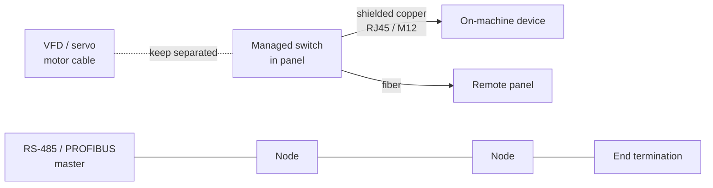

  Wiring &amp; Installation
  <h1>Communication Cable Installation in Machines &amp; Panels</h1>
  
The machine's nervous system — how to route, segregate, terminate, and shield Ethernet, RS-485/PROFIBUS, and device-level cable so the network survives the shop floor.

> **Safety.** This guide is educational reference material, not a work
> instruction. Electrical work is performed de-energized and verified by
> qualified personnel under your site's LOTO procedures, following the
> device and cable manufacturer's instructions and the authority having
> jurisdiction. Comm cable often shares a panel with lethal power circuits —
> treat the whole enclosure as live until proven otherwise.

## Overview

Communication cable is the machine's nervous system: industrial Ethernet
(PROFINET, EtherNet/IP, Modbus TCP), RS-485 multidrop (PROFIBUS DP, Modbus
RTU), and device-level buses (IO-Link, sensor/actuator cordsets). Each
carries data, not power, so the installation rules are about **mechanical
protection, routing, and freedom from electrical noise** rather than
ampacity.

This guide is the **installation-practice companion** to the communications
physical-layer pages. It covers the physical work: cable and connector
selection, routing and segregation from power, termination, shielding at the
panel entry, and verification. It deliberately does **not** re-explain
protocol theory, encoding, or the electrical physical layer — those are
owned by the [`/communications/`]({{ '/communications/' | relative_url }})
section, which this guide links to heavily.

- **The electrical/protocol layer** — how the bus signals, terminates
  electrically, and negotiates — lives on the
  [copper Ethernet]({{ '/communications/copper-ethernet/' | relative_url }}),
  [fiber optics]({{ '/communications/fiber-optics/' | relative_url }}), and
  [RS-485 physical layer]({{ '/communications/rs485-physical-layer/' | relative_url }})
  pages.
- **This guide** — where the cable physically goes in a real machine, how
  it's separated from drive cables, how it's terminated at a connector or
  gland, and how you prove it before handover.

Terminal designations, connector torque values, cable bend-radius and
pull-tension limits, and shield-landing details are vendor-specific — they
come from the cable and connector manufacturer's datasheet, never from a
guide, including this one.

## Before You Start

Have on hand before pulling cable:

- **The network design.** Media, topology (star vs line/daisy-chain),
  segment lengths, and node addresses are decided upstream on the
  communications side. This guide assumes you are implementing that design,
  not inventing it at the machine.
- **Which medium, per segment.** Copper, fiber, or RS-485 — selected on the
  [copper Ethernet]({{ '/communications/copper-ethernet/' | relative_url }}),
  [fiber optics]({{ '/communications/fiber-optics/' | relative_url }}), and
  [RS-485 physical layer]({{ '/communications/rs485-physical-layer/' | relative_url }})
  pages. Match the cable **rating** to the environment (flex/robotic rating
  for moving cable, oil- and weld-rated jacket on the floor); the ratings
  are vendor-specific — consult the datasheet.
- **Connector system — M12 vs RJ45.** M12 (D-/X-code for Ethernet, B-code
  for PROFIBUS) for sealed, on-machine, vibration-prone points; RJ45 inside
  the panel or in benign locations. This is an ingress/vibration decision,
  not a preference.
- **Environment.** Temperature, vibration, motion (fixed vs continuous
  flex), and EMI level — they drive cable rating, connector choice, and how
  hard you separate from power.

## Sizing & Protection

Comm cable has no ampacity or OCPD question. Its "sizing and protection" is
**mechanical** — pick the right cable category/rating and protect it from
mechanical abuse.

- **Cable category / rating selection.** Match the copper category and
  jacket rating (or fiber type) to the protocol and environment. The
  selection procedure is on the physical-layer pages; the ratings themselves
  are vendor-specific — consult the datasheet.
- **Bend radius.** Every comm cable has a minimum bend radius, and fiber's
  is tighter to respect than copper's; a separate, smaller value usually
  applies to flexing installs. Exceeding it degrades copper return loss and
  can microbend or break fiber. Take the figure from the datasheet.
  Generally accepted practice — verify for your installation.
- **Pull tension.** Data cable is far more tension-sensitive than power
  cable — over-pulling permanently stretches the pairs and degrades
  performance. Stay under the cable's rated maximum pull force; use pulling
  eyes and lubricant where appropriate. Generally accepted practice.
- **Strain relief.** Terminate into a gland or clamp that carries the
  mechanical load so the connector contacts never take the strain, and leave
  a service loop at each end.

## Routing & Segregation

This is the core of the guide. Keeping comm cable away from power is the
single highest-leverage installation decision, and getting it wrong is the
most common cause of "the network is flaky" calls.

- **Separate from VFD/servo motor cables and other power.** A drive's PWM
  output is the worst offender for coupling into a data cable that runs
  parallel to it. Route comm cable in its **own tray or duct**, or use a
  divider or a separated tray level, and keep clearance from all power
  wiring. This exact failure is documented in the
  [intermittent-I/O case study]({{ '/communications/case-study-intermittent-io/' | relative_url }}),
  where a network cable sharing a tray with motor leads produced
  intermittent, run-dependent I/O faults. NFPA 79 (wiring methods and
  practices chapter) and IEC 60204-1 (wiring clause) both require routing
  and separation that avoids interference between power and signal circuits.
  Generally accepted practice — verify against your EMC plan.
- **Cross power at right angles.** Where a comm cable must cross power
  wiring, cross at 90 degrees to keep the coupling length as short as
  possible. Generally accepted practice.
- **Separation grows with parallel run length.** The longer the parallel
  run, the more separation — or a physical barrier — it needs; a short
  crossing is far less of a problem than a long parallel haul. Specific
  separation classes and distances are owned by the
  [noise &amp; EMC mitigation guide]({{ '/design/wiring/emc-noise-mitigation/' | relative_url }}).
- **Never bundle comm cable with motor/drive output cable** in the same
  clamp or tie-wrap. Generally accepted practice.

## Termination & Connectors

- **Field-terminated RJ45 vs pre-made cordsets.** Pre-made, factory-tested
  cordsets are preferred wherever there is vibration or motion — a
  field-crimped RJ45 in a vibrating machine is a classic intermittent-fault
  source. Field termination is acceptable in benign, static panel locations
  with trained hands and the right tooling. Generally accepted practice.
- **M12 torque.** Torque M12 connectors to the connector maker's spec to
  reach the rated seal and contact integrity — consult the manual; do not
  hand-tighten by feel.
- **360-degree shield termination.** Land the shield in a full-circumference
  gland or EMC clamp at the connector or panel entry, not a pigtail — a
  pigtail is a significant impedance at network frequencies and largely
  defeats the shield.
- **RS-485 / PROFIBUS termination at the two physical ends.** A multidrop
  bus is terminated at its two physical ends **only** — PROFIBUS via the
  connector's switchable terminator, Modbus RTU via the characteristic-
  impedance resistor. Missing, doubled, or mid-bus termination causes
  reflections. Termination values and topology rules are on the
  [RS-485 physical layer page]({{ '/communications/rs485-physical-layer/' | relative_url }}).
- **Service loops.** Leave slack at each end for re-termination and strain
  relief.

## Grounding, Shielding & EMC

Device-specifics here; the deep treatment is owned by the
[noise &amp; EMC mitigation guide]({{ '/design/wiring/emc-noise-mitigation/' | relative_url }})
and [panel grounding &amp; bonding]({{ '/design/wiring/grounding-bonding/' | relative_url }}).

- **Shield/drain policy is per-medium.** Industrial Ethernet shields are
  commonly bonded at both ends through the connector/gland — the shielding
  system is designed for it — while a low-frequency signal screen is
  sometimes single-end grounded to avoid a ground loop. Follow the relevant
  physical-layer page and the device manual for the specific medium; do not
  apply one rule universally. Generally accepted practice.
- **Panel entry glands.** Bond the shield to the enclosure at the point of
  entry with an EMC gland, and mask or scrape paint at the bond point so the
  bond is metal-to-metal.
- **Fiber for galvanic isolation.** Where ground-potential differences
  between panels are a concern, [fiber]({{ '/communications/fiber-optics/' | relative_url }})
  removes the copper path entirely and is the clean fix — no shield, no
  ground loop, immune to the drive noise above.

## Common Mistakes

1. **Comm cable in the same tray as VFD motor cable.** The drive output
   couples into the data cable along the parallel run; the network faults
   intermittently and only while the drive is running — exactly the
   [intermittent-I/O case study]({{ '/communications/case-study-intermittent-io/' | relative_url }}).
2. **Field-crimped RJ45 in a vibrating machine.** The contacts work loose
   under vibration; link errors come and go with machine motion and defy a
   static bench test. Use a pre-made cordset.
3. **Exceeded bend radius.** A cable pulled tight around a corner shows
   degraded return loss on copper or microbending loss on fiber — a marginal
   link that passes today and fails next month.
4. **Missing or incorrect bus termination.** No terminator, two where one
   belongs, or a terminator mid-bus puts reflections on an RS-485/PROFIBUS
   segment; frames garble or drop with no obvious cause.
5. **Shield not landed at the gland.** The shield is electrically continuous
   end-to-end but never bonded to the enclosure — it looks terminated and
   the EMC performance is gone.
6. **Daisy-chaining where a star was designed.** An installer chains devices
   the design intended to home-run to a switch, changing the topology and
   its fault behavior — one loose link now takes down everything downstream.

## Verification Checks

Before handover (evidence-retaining checklists in
[templates]({{ '/tools/templates/' | relative_url }})):

- [ ] Baseline packet capture recorded at commissioning per the
      [Wireshark methodology]({{ '/communications/wireshark-methodology/' | relative_url }})
      so a healthy baseline exists for later comparison
- [ ] Switch error counters read and clean at the
      [managed switch]({{ '/communications/managed-switches/' | relative_url }})
      after a soak run
- [ ] Continuity/wiremap test passed for every copper segment
- [ ] Fiber DOM (digital optical monitoring) power levels within margin for
      every fiber segment
- [ ] RS-485/PROFIBUS termination present at the two physical ends only
- [ ] Shields landed at glands; 360-degree terminations, not pigtails
- [ ] Bend radius, pull-relief, and service loops verified by inspection
- [ ] Comm-vs-power segregation matches the routing plan; no shared trays
      or bundles with motor/drive cable

## Standards References

- **NFPA 79:2024** — wiring methods and practices chapter (conductor
  routing, separation of power and signal circuits, conductor
  identification), at chapter level
- **IEC 60204-1** — wiring clause (conductor routing and practices for
  machine electrical equipment), at clause level
- Physical-layer and protocol requirements: the
  [communications]({{ '/communications/' | relative_url }}) pages

## Related Pages

- [Copper Ethernet physical layer]({{ '/communications/copper-ethernet/' | relative_url }})
- [Fiber optics]({{ '/communications/fiber-optics/' | relative_url }})
- [RS-485 physical layer]({{ '/communications/rs485-physical-layer/' | relative_url }})
- [Intermittent-I/O case study]({{ '/communications/case-study-intermittent-io/' | relative_url }})
- [Wireshark methodology]({{ '/communications/wireshark-methodology/' | relative_url }})
- [Managed switches]({{ '/communications/managed-switches/' | relative_url }})
- [Noise &amp; EMC mitigation]({{ '/design/wiring/emc-noise-mitigation/' | relative_url }})
- [Panel grounding &amp; bonding]({{ '/design/wiring/grounding-bonding/' | relative_url }})
- [NFPA 79 overview]({{ '/standards/us-electrical/nfpa-79/' | relative_url }})
