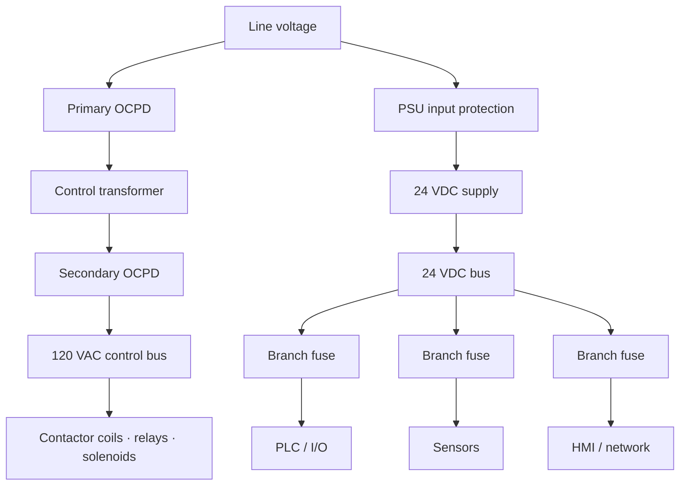

  Wiring &amp; Installation
  <h1>Control Power Distribution — Transformers, Supplies, and Fusing</h1>
  
Where control power comes from and how it's distributed and protected — the control transformer, the 24 VDC supply, and the fusing scheme that keeps one shorted device from dropping the whole panel.

> **Safety.** This guide is educational reference material, not a work
> instruction. Electrical work is performed de-energized and verified by
> qualified personnel under your site's LOTO procedures, following the
> device manufacturer's manual and the authority having jurisdiction. A
> control transformer primary and externally-supplied control conductors can
> remain live with the main disconnect open — verify every source is dead
> before working.

## Overview

Control power is derived and distributed, not taken raw from the line. Two
sources dominate, usually together:

- **Control power transformer (CPT)** — steps line voltage down to the AC
  control voltage (commonly 120 VAC in North America) for contactor coils,
  relays, solenoids, and pilot devices.
- **Switch-mode power supply (PSU)** — produces regulated 24 VDC for PLC
  I/O, sensors, HMIs, and network gear.

Both feed **terminal groups** — fused distribution terminals or bus bars —
from which individual protected branches leave. The distribution and
protection scheme (what is fused, where, how branches are grouped and
coordinated) matters as much as the source device itself.

This guide covers deriving and distributing control power and protecting it.
Coil VA ratings, transformer inrush curves, supply datasheets, terminal
designations, and torque values are vendor-specific — they come from the
device data, never from a guide, including this one.

## Before You Start

- **Control voltage choice — 120 VAC vs 24 VDC.** Set upstream by the
  installed base, device availability, and safety preference; 24 VDC is
  low-voltage and dominant on modern machinery, but many panels run both AC
  and DC control.
- **Load inventory and inrush.** Total the steady-state VA/current of every
  control load **and** its inrush — coil pickup for AC contactors and
  solenoids, capacitive input surge for DC devices. Inrush, not steady
  state, is where sizing goes wrong (see below).
- **Grounded vs ungrounded control circuit.** Decide before wiring whether
  the control circuit has one side intentionally bonded to ground or is left
  ungrounded. It is a design decision with real code and fault-detection
  consequences, not a wiring-time afterthought.

## Sizing & Protection

This is the core of the guide.

**CPT sizing — steady-state PLUS inrush.** The classic control-power mistake
is sizing a CPT on **holding VA** alone. A contactor or solenoid coil draws
several times its holding VA at the instant of pickup — sealed/holding VA and
inrush VA are very different numbers. A transformer sized only for the summed
holding load browns out when several coils pick up together: the voltage
dips, coils chatter or fail to seal, and the panel behaves erratically. Size
the CPT to hold the steady-state load **and** supply the simultaneous inrush
without excessive voltage dip; transformer makers publish inrush/sealed-VA
sizing guidance for exactly this. Generally accepted practice, grounded in
the coil inrush characteristic — verify with the transformer manufacturer's
sizing data and the coils' VA ratings. The
[`cst transformer`]({{ '/tools/engineering-toolkit/' | relative_url }})
tool computes the transformer OCPD limits (NEC Table 450.3(B)); the coil VA
totals come from device data, not from a guide.

**CPT fusing — primary AND secondary.** Both sides are protected, and for
different reasons:

- The **primary** OCPD protects the transformer and its supply conductors.
- The **secondary** OCPD protects the control-circuit conductors and lets
  the primary device be sized around inrush without over-protecting the
  wiring.

NFPA 79 (control-circuit protection chapter), NEC Art. 450 (transformer
overcurrent protection, Table 450.3(B)), and — where the control circuit is
tapped from a motor controller — NEC Art. 430 Part VI (motor-control-circuit
protection) govern the permitted ratings, at chapter/article level. The
specific percentages come from the code tables; verify against the current
edition rather than a remembered number.

**24 VDC PSU sizing with margin and inrush.** Sum the 24 VDC load with
meaningful headroom, and account for the capacitive inrush of the connected
devices at power-up — an undersized supply sags or hiccups on turn-on. The
exact margin target and inrush behavior are vendor-specific — consult the
supply datasheet. Generally accepted practice — verify for your installation.

**Per-branch fusing of 24 VDC.** Distribute 24 VDC through individually
protected branches (fused terminals or electronic circuit protectors) so a
single shorted device or field fault trips only its branch — one shorted
solenoid must not drop the PLC. Generally accepted practice.

**Selective coordination.** Arrange main and branch protection so the device
nearest a fault clears first, leaving the rest of the panel energized. The
concept applies to both the AC control side and the 24 VDC side; coordination
is verified against the device time-current data.

## Power Wiring

- **CPT primary/secondary connections.** Primary to the line side through
  its OCPD; secondary to the control bus through the secondary OCPD. Terminal
  designations and torque are vendor-specific — consult the manual.
- **One side of the secondary bonded — the grounded control circuit.** For a
  grounded control circuit, NFPA 79 requires the grounded secondary conductor
  to be arranged so a ground fault cannot energize a coil or start a machine
  function; the switching and the OCPD sit on the ungrounded side. See
  [panel grounding &amp; bonding]({{ '/design/wiring/grounding-bonding/' | relative_url }}).
- **PSU input/output distribution.** Input through its protection; output to
  a 24 VDC bus bar or distribution terminals, from which the fused branches
  leave.
- **Redundancy and 24 V bus bars.** Where uptime demands it, a diode-OR
  (redundancy) module combines two supplies so one can fail without dropping
  the bus; the 24 VDC bus bars are then fed from the redundancy module.
  Generally accepted practice.

## Control / Signal Wiring

- **Conductor identification.** NFPA 79 (conductor-identification chapter)
  specifies control-circuit conductor colors/identification, including
  distinct identification for AC control, DC control, and for conductors that
  stay energized with the main disconnect open (externally supplied). Follow
  the chapter; specifics are not reproduced here.
- **Keep control power separate from field signal.** Do not bundle control
  power (coil/relay switching) with low-level analog or network signal
  wiring; segregation is covered in the
  [noise &amp; EMC mitigation guide]({{ '/design/wiring/emc-noise-mitigation/' | relative_url }}).

## Grounding, Shielding & EMC

- **CPT secondary bonding.** Bond the designated secondary conductor to the
  equipment grounding system per NFPA 79 for a grounded control circuit; the
  deep bonding treatment is owned by
  [panel grounding &amp; bonding]({{ '/design/wiring/grounding-bonding/' | relative_url }}).
- **PSU 0 V reference policy.** Decide whether the 24 VDC 0 V (common) is
  referenced to ground or left floating — the DC-side mirror of the AC
  grounded/ungrounded choice, with the same fault-detection consequences.
  Apply one consistent policy across the panel. Generally accepted practice.
- **Suppression on the control-power side.** Coil suppression (RC, diode, or
  MOV) and input surge protection reduce switching noise coupled back into
  the control supply; the suppressor type is device-specific — consult the
  manual.

## Common Mistakes

1. **CPT sized on holding VA, not inrush.** The transformer browns out when
   several coils pick up together; contactors chatter or fail to seal and the
   fault moves around depending on what energizes at once.
2. **No secondary fuse.** The transformer is protected but the
   control-circuit conductors are not — and the primary device cannot be
   sized around inrush without over-protecting the wiring.
3. **One 24 VDC supply with no per-branch fusing.** A single shorted field
   device collapses the whole 24 VDC bus and drops the PLC, so an
   output-wiring short reads as a total control failure.
4. **Ungrounded control circuit where a first ground fault goes undetected.**
   The machine keeps running on a hidden ground fault until a second fault
   causes an unexpected operation — the reason ungrounded circuits need
   monitoring.
5. **Undersized 24 VDC PSU sagging under inrush.** The supply hiccups on the
   capacitive inrush at power-up; the PLC resets or I/O drops out on every
   start, intermittently.
6. **Mixing grounded and ungrounded schemes.** Part of the control circuit
   is grounded and part floating, defeating both fault-detection strategies
   and making troubleshooting a guessing game.

## Verification Checks

Before and during first energization (evidence-retaining checklists in
[templates]({{ '/tools/templates/' | relative_url }})):

- [ ] Control voltage measured **under load and during coil pickup**, not
      just at rest — the CPT holds the inrush without excessive dip
- [ ] 24 VDC holds within tolerance through device inrush at power-up
- [ ] Primary and secondary CPT OCPD ratings verified against the code
      tables and the current edition
- [ ] 24 VDC distributed on individually fused branches; a forced branch
      fault trips only its branch
- [ ] Fuse/OCPD coordination checked against device time-current data
- [ ] Ground-fault behavior tested for the chosen scheme (grounded branch
      trips; ungrounded circuit is monitored)
- [ ] Control-circuit conductor identification per NFPA 79, including
      externally-supplied conductors that stay live with the disconnect open

## Standards References

- **NFPA 79:2024** — control-circuit and control-power protection chapter;
  grounded-control-circuit requirements; conductor-identification chapter,
  at chapter level
- **NEC (NFPA 70), 2023** — Art. 450 (transformer overcurrent protection,
  Table 450.3(B)); Art. 430 Part VI (motor-control-circuit protection), at
  article level
- **IEC 60204-1** — control-circuit and control-supply clause (control
  transformer and protective measures), at clause level

## Related Pages

- [PLC I/O wiring]({{ '/design/wiring/plc/' | relative_url }})
- [Wire sizing walkthrough]({{ '/design/wiring/wire-sizing/' | relative_url }})
- [Panel grounding &amp; bonding]({{ '/design/wiring/grounding-bonding/' | relative_url }})
- [Engineering toolkit (`cst transformer`)]({{ '/tools/engineering-toolkit/' | relative_url }})
- [NFPA 79 overview]({{ '/standards/us-electrical/nfpa-79/' | relative_url }})
- [NEC overview]({{ '/standards/us-electrical/nec/' | relative_url }})
