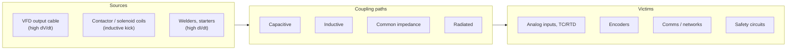

  Wiring &amp; Installation
  <h1>Noise &amp; EMC Mitigation in Panels and Field Wiring</h1>
  
Most "electrical gremlins" are one of four coupling mechanisms with a findable path — this guide is about finding the path and breaking it in the cheapest place.

> **Safety.** Perform all wiring work de-energized and verified, by qualified
> personnel, under your site's LOTO procedures and the device manufacturer's
> manual. This guide is educational reference material, not a work
> instruction.

## Overview

Noise problems feel random, but the physics is small: a **source** (something switching current or voltage fast), a **victim** (something listening to small signals), and a **coupling path** between them. There are only four paths:

- **Capacitive coupling** — a fast *voltage* edge (dV/dt) drives current into a neighboring conductor through stray capacitance. Grows with proximity and parallel run length. The signature source is a VFD output cable: PWM edges of hundreds of volts in well under a microsecond.
- **Inductive coupling** — a fast *current* change (dI/dt) induces voltage into any nearby loop. Grows with the victim circuit's loop area. Signature sources: contactor coils dropping out, motor inrush, welders.
- **Common-impedance coupling** — two circuits share a conductor (a common return wire, a shared stretch of ground path), so one circuit's current appears as a voltage offset in the other. This is the usual mechanism behind "the analog reads wrong when the pump runs."
- **Radiated coupling** — true far-field pickup; on the plant floor it normally matters only when long cable runs act as antennas near strong sources. Most problems blamed on "radiation" are actually the first three at close range.

The strategy hierarchy — generally accepted practice, ordered by cost-effectiveness:

1. **Separate first.** Distance and routing discipline are nearly free at design time and impossible to retrofit cheaply.
2. **Suppress and shield second.** Kill noise at the source (coil suppressors, shielded motor cable) and armor the victims (twisted pair, shields).
3. **Filter third.** Line filters, ferrites, and RC input filters treat what separation and shielding didn't.
4. **Fix at the receiver last.** Software debounce and averaging are legitimate *final* polish — never the first response to a wiring problem.

This guide owns the general EMC story for panels and field wiring. Drive-specific filtering and motor-cable detail live in the [VFD wiring guide]({{ '/design/wiring/vfd/' | relative_url }}); the physics of shield landing lives in [Grounding &amp; Bonding]({{ '/design/wiring/grounding-bonding/' | relative_url }}).

## Before You Start

Two inventories, made from the drawings before any tray or duct is routed:

**Source inventory** — everything that switches significant energy:

- VFD and servo output cables (the worst offenders in almost every panel and plant), plus braking-resistor wiring
- Contactor, relay, and solenoid coils — every unsuppressed coil is a scheduled noise event
- Welders, induction heaters, large DOL starters, capacitor banks
- Radio sources if relevant: site radios, wireless gateways near cabling

**Victim inventory** — everything that listens to small signals:

- Analog I/O (4–20 mA, 0–10 V), thermocouples and RTDs (millivolt-level — the most sensitive circuits in the system)
- Encoder and resolver feedback
- Communication cabling: RS-485, Ethernet, fieldbus
- Safety circuits — not because they are electrically sensitive, but because nuisance noise trips on monitored safety inputs erode trust in the safety system

Also confirm the upstream decisions: enclosure zoning (where drives sit vs. where the PLC sits), tray and duct routes, and whether shielded VFD cable was specified. If those were decided badly, no amount of ferrite fixes it later.

## Separation & Routing Classes

NFPA 79 Chapter 13 (wiring practices) and IEC 60204-1 Clause 13 both address routing, ducts, and segregation of circuits of different types and voltage classes — consult the current edition text for the specific provisions; this guide cites them at chapter level only.

On top of that, industry converged on a **signal-class scheme** — generally accepted practice, verify for your installation:

| Class | Contents | Character |
| --- | --- | --- |
| 1 | Analog, TC/RTD, encoder, comms | Quietest, most sensitive |
| 2 | 24 V DC discrete I/O, suppressed control | Quiet |
| 3 | 120/230 V AC control, unsuppressed coils | Noisy |
| 4 | AC power, motor circuits, **VFD output**, braking resistor | Noisiest |

The rules of the scheme (all generally accepted practice — verify for your installation):

- Different classes get **separate ducts, separate trays, or grounded steel dividers** in a shared tray.
- Where classes must cross, they cross **at right angles** — crossing couples for millimeters; running parallel couples for the full shared length.
- **Required separation grows with parallel run length** and with the neighbor's class. There is no single universal distance: verify against your cable vendor's and drive vendor's installation guidance, and for network cabling against the EN 50174-2 / TIA-569 separation tables (see the [copper Ethernet page]({{ '/communications/copper-ethernet/' | relative_url }}) for the network-side view of the same rule).
- Class 1 and Class 4 never share a duct, tray compartment, or multi-core cable. A VFD output cable shares a raceway with nothing quieter than other motor circuits.

Unlike the conductor-sizing guides, there is no `cst` calculator for this section — separation is a routing decision, not a computation. The [wire sizing walkthrough]({{ '/design/wiring/wire-sizing/' | relative_url }}) covers the ampacity side of the same drawings.

## Power Wiring — Source Suppression

The cheapest noise to mitigate is the noise that never leaves the source.

**Suppress every switched coil.** Contactor and relay coils generate a large inductive voltage kick at every drop-out; unsuppressed, that kick couples into everything sharing the duct. Fit suppression **directly at the coil** (suppression at the far end of the wire leaves the whole wire radiating):

- **AC coils:** RC snubber or varistor across the coil.
- **DC coils:** flyback diode, diode + zener, varistor, or RC — with one important caveat below.
- Most coil vendors offer plug-on suppressor modules keyed to the coil; consult the device manual for the recommended type.

**The flyback-diode caveat.** A plain diode gives the gentlest suppression but the *slowest* coil decay — it measurably delays contactor drop-out, sometimes by tens of milliseconds. Where drop-out time is part of a safety function's response-time budget (ISO 13849-1 / IEC 62061 assessments), a bare diode can quietly consume margin. Use a diode + zener, varistor, or RC suppressor on safety-related coils, and verify the measured response time *with suppression fitted*. Generally accepted practice — verify against your safety validation.

**Solenoid valves** get the same treatment as coils; large AC solenoids are notorious PLC-input chatter sources when unsuppressed.

**VFDs** are the dominant source in most plants, and their suppression toolkit — input reactors, EMC filters, dV/dt and sine filters, shielded symmetrical motor cable glanded at both ends — is vendor- and installation-specific. That material is owned by the [VFD wiring guide]({{ '/design/wiring/vfd/' | relative_url }}); from this page's perspective the rule is simply: *treat the VFD output as Class 4 and keep everything else away from it*.

## Control / Signal Wiring — Victim Hardening

What survives separation and suppression is handled at the victim.

- **Twisted pair for every low-level signal.** Twisting makes the two conductors occupy, on average, the same position in any interfering field, so noise couples *equally* into both — common-mode, which a differential receiver rejects. This is the single most powerful victim-side measure and it costs nothing at specification time.
- **Differential signals are inherently robust.** RS-485 is the textbook case: a cheap twisted pair carrying data through environments that would bury a single-ended signal — see the [RS-485 physical layer page]({{ '/communications/rs485-physical-layer/' | relative_url }}) for the common-mode reasoning and its limits.
- **Prefer 4–20 mA over 0–10 V for distance.** Loop current is immune to series resistance and far less sensitive to induced voltage than a high-impedance voltage input. Generally accepted practice — verify for your installation.
- **Shielded cable with a deliberate landing policy.** Shield the analog, encoder, and comms cables — and decide *where the shield lands* on purpose, not by habit. The both-ends vs. one-end reasoning (it is a frequency question, not a religious one) is owned by [Grounding &amp; Bonding]({{ '/design/wiring/grounding-bonding/' | relative_url }}); the short version: low-frequency analog screens commonly land at one end, high-frequency (drive, network) shields need 360-degree bonding at both ends.
- **Ferrite sleeves are a retrofit tool.** A clamp-on ferrite adds common-mode impedance to one specific cable and can rescue a marginal installation — but it treats a symptom on one path. It is not a design substitute for separation and shielding.
- **Signal isolators break common-impedance loops.** Where an analog circuit spans a ground-potential difference (long field runs, separate buildings, old plants), a loop isolator or isolated input card breaks the ground loop instead of fighting it.

## Grounding, Shielding & EMC — Panel-Level Practice

All items in this section are generally accepted practice — verify against your drive vendor's EMC installation guide and your panel standard. The underlying grounding theory is in [Grounding &amp; Bonding]({{ '/design/wiring/grounding-bonding/' | relative_url }}).

- **Clean/dirty layout.** Zone the panel: drives, filters, contactors, and power terminals in one zone; PLC, analog I/O, and comms in another. Wiring between zones is minimized and crosses at right angles. A panel where the drive output loops past the PLC rack has designed its own fault ticket.
- **Drive output cables take the shortest exit.** Out of the drive, straight to the gland plate — never routed along the door, past door-mounted HMIs, or bundled with the door harness.
- **360-degree shield entries at a conductive gland plate.** EMC glands (or shield clamps) bond the full circumference of the shield to bare panel metal at the point of entry.
- **Why pigtails fail:** a pigtail is a wire, and a wire is an inductor — a few centimeters of pigtail presents a high impedance at PWM and network frequencies, so the shield current that should flow to the panel instead re-radiates from the pigtail. At 50/60 Hz a pigtail is fine; at drive-edge frequencies it largely defeats the shield.
- **Bare-metal bonding everywhere it matters.** Mounting plates, filter chassis, and gland plates bond through masked or scraped bare metal — paint is an insulator at every frequency, and a painted "ground" is a decoration.

## Common Mistakes

1. **Analog and VFD output in the same duct.** The classic. Reads fine at commissioning (drive not running), then process values wander whenever the drive loads up. Shows up as analog noise *correlated with drive state* — exactly the pattern in the [intermittent I/O case study]({{ '/communications/case-study-intermittent-io/' | relative_url }}).
2. **Unsuppressed coils chattering PLC inputs.** Every contactor drop-out fires a voltage kick into the parallel input wiring; inputs flicker for one scan, counters miscount, sequence logic takes phantom steps. Fix at the coil, not in software.
3. **Shield pigtails on drive and network cables.** The shield is "connected" and the drawing is satisfied — but at high frequency the pigtail's inductance makes the shield nearly useless. Shows up as noise problems that persist despite "everything being grounded."
4. **Both-ends grounding of low-frequency analog screens across a ground-potential difference.** The screen becomes a ground-loop conductor and injects 50/60 Hz hum into the measurement. Shows up as a steady offset or ripple that tracks plant load. (The nuance — why both-ends is *right* for high-frequency cables — is in [Grounding &amp; Bonding]({{ '/design/wiring/grounding-bonding/' | relative_url }}).)
5. **Software filters before wiring fixes.** Averaging and debounce make the symptom disappear while the coupling path stays — and the same path later corrupts something a filter can't hide (comms, safety inputs). Filter last, after the path is found and broken.
6. **Ferrites everywhere instead of finding the path.** A bag of clamp-on ferrites sprinkled over every cable is diagnosis by superstition. One ferrite on the *identified* coupling path is engineering; twenty on unidentified cables is hope.
7. **Right-angle rule ignored "just for this one crossing."** A single long parallel detour of a Class 1 cable along a Class 4 route — added during a late change, absent from the drawings — routinely explains noise that appears only after a modification.

## Verification Checks

- [ ] Source and victim inventories exist and every Class 1 / Class 4 adjacency on the routing drawings has been challenged
- [ ] Tray dividers installed and bonded; crossings at right angles as drawn
- [ ] Every contactor, relay, and solenoid coil has suppression fitted at the coil; suppressor type matches coil voltage/type per the device manual
- [ ] Safety-circuit drop-out times verified *with* suppression fitted, against the safety validation
- [ ] Shield landings match the declared policy (360-degree entries where specified; no pigtails on drive or network cables)
- [ ] Gland plates and mounting plates bond through bare metal (spot-check with a milliohm reading, not by eye)
- [ ] **Scope the quiet plant, then the running plant.** Capture analog and comms baselines with drives stopped, then with the plant loaded — the difference *is* the coupling. The [RS-485 page]({{ '/communications/rs485-physical-layer/' | relative_url }}) shows the oscilloscope practice; the [case study]({{ '/communications/case-study-intermittent-io/' | relative_url }}) shows it settling a real investigation
- [ ] Network baseline captures taken and archived per the [capture methodology]({{ '/communications/wireshark-methodology/' | relative_url }}) — a pre-noise baseline is the cheapest diagnostic you will ever own
- [ ] Commissioning records filed — the [commissioning templates]({{ '/tools/templates/' | relative_url }}) include loop-check sheets suited to before/after noise captures

## Standards References

- **NFPA 79:2024, Chapter 13** — wiring practices: routing, ducts, and separation of circuits (chapter-level citation; consult the current text). Chapter 8 for the grounding/bonding basis.
- **IEC 60204-1:2018, Clause 13** — wiring practices; Clause 4 lists EMC among the physical-environment considerations (clause-level citation).
- **IEC 61000 series** — the international EMC framework (emission and immunity levels, test methods) that product standards reference. Cited here at overview level only; no clause claims.
- **Drive-vendor EMC installation guides** — the practical authority for drive-related separation distances, filter selection, and shield termination. Treated as a category; consult the manual for the specific drive.
- **EN 50174-2 / TIA-569** — separation tables for information-technology cabling vs. power; referenced from the communications section.

## Related Pages

- [How to Wire a VFD]({{ '/design/wiring/vfd/' | relative_url }}) — the dominant noise source, in full detail
- [Panel Grounding &amp; Bonding]({{ '/design/wiring/grounding-bonding/' | relative_url }}) — shield-landing policy and the three jobs of "ground"
- [Wire Sizing Walkthrough]({{ '/design/wiring/wire-sizing/' | relative_url }}) — the ampacity side of the same drawings
- [Copper Ethernet]({{ '/communications/copper-ethernet/' | relative_url }}) — VFD separation from the network cabling side
- [RS-485 Physical Layer]({{ '/communications/rs485-physical-layer/' | relative_url }}) — differential signaling and common-mode in practice
- [Case Study — Intermittent EtherNet/IP I/O Dropout]({{ '/communications/case-study-intermittent-io/' | relative_url }}) — a noise-coupling investigation end to end
