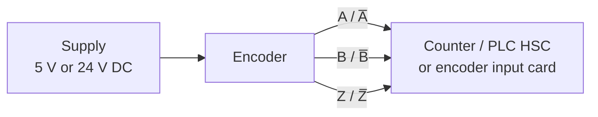

  Wiring &amp; Installation
  <h1>Encoder Wiring — Differential vs Single-Ended, Signals, and Shielding</h1>
  
Position and velocity feedback lives or dies on the feedback cable — why differential beats single-ended over distance, how to match the input card, and why the counts jump only when the motor runs.

> **Safety.** This guide is educational reference material, not a work
> instruction. Electrical work is performed de-energized and verified by
> qualified personnel under your site's LOTO procedures, following the device
> manufacturer's manual and the authority having jurisdiction. An encoder
> often shares an enclosure with drive and control voltages — treat the panel
> as energized until proven otherwise.

## Overview

An **encoder** turns shaft angle into electrical pulses, and the control
system derives **position and velocity** from them. However many wires the
device has, the landing falls into three terminal groups:

- **Power** — a supply pair (**+V** and **0 V**), commonly 5 V or 24 V DC.
- **Signal channels** — the quadrature pair **A** and **B**, plus the index
  / marker **Z** (one pulse per revolution). On a differential device each is
  a complementary pair: **A/A̅, B/B̅, Z/Z̅**.
- **Shield / ground** — the cable screen and where it lands.

**Incremental vs absolute** is a real distinction, but mostly a *protocol* one
(incremental = counted pulses needing a home reference; absolute = a coded
position, often on a serial channel such as SSI, BiSS, or EnDat). This guide
is about **wiring practice** for the electrical channels — not the protocol.

Scope: this guide covers **general-purpose incremental encoders** landing on
counters, PLC **high-speed-counter (HSC)** inputs, and dedicated encoder input
cards. **Servo / drive feedback wiring** — resolver, absolute serial feedback,
commutation (U/V/W) channels, and drive-matched cable — lives on the
[servo drive wiring guide]({{ '/design/wiring/servo-drive/' | relative_url }}).
The counts/units/RPM/linear-speed **math** is handled by the
[`cst encoder` tool]({{ '/tools/engineering-toolkit/' | relative_url }}) — this
guide is about the wiring, not the scaling.

## Before You Start

The **output type is THE decision** — it dictates cable, distance, and which
input card you can use. Have on hand:

- **Encoder output / interface type.** Confirm whether each device is
  **differential (RS-422 / line-driver)** — a complementary pair per channel,
  the choice for long or noisy runs — or **single-ended**: **push-pull / HTL**
  (typically 24 V logic), **open-collector** (needs a pull-up), or **TTL /
  5 V**. The receiving input card must match. The detail is in *Control /
  Signal Wiring* below.
- **Supply voltage — 5 V vs 24 V.** A 5 V TTL encoder over a long run is
  trouble: cable voltage drop browns out the device and its line driver.
  24 V devices carry far more headroom. Confirm the supply the encoder needs
  and what the run can deliver *at the encoder*.
- **PPR / resolution and speed.** Pulses-per-revolution times RPM sets the
  output frequency, which trades off against maximum cable length and the
  input card's maximum count frequency. Note PPR, top speed, and whether
  **index (Z)** and any commutation channels are used.
- **Drawings and environment.** Cable route relative to VFD/servo motor
  cabling, the input-card type already selected, and mechanical mounting
  decided upstream.

## Sizing & Protection

Encoder current is small, so this is a **voltage-integrity** problem, not an
ampacity one — there is no conductor-ampacity table to look up.

- **Supply voltage drop is the real failure.** The +V/0 V pair has
  resistance; on a long run at **5 V**, a fraction of a volt lost in the cable
  browns out the encoder and its line driver, and counts degrade or stop. The
  arithmetic is conductor voltage drop over the run — the concept behind
  [`cst voltage-drop`]({{ '/design/wiring/wire-sizing/' | relative_url }});
  never invent a resistance-per-length value, take it from the wire tables.
  Some line-driver encoders offer a **remote-sense** pair so the supply
  compensates for cable drop — consult the manual and use it on long 5 V runs.
- **Max cable length falls as PPR/frequency rises and as supply drops.** A run
  fine at low PPR fails when a higher-count encoder is fitted or the speed is
  raised. Verify length against the encoder's frequency-vs-length curve and the
  input card's maximum count frequency — both datasheet values.
- **Protect the supply.** Fuse or current-limit the encoder supply per device
  and panel practice — generally accepted practice, verify for your installation.

## Power Wiring

- **Clean, dedicated supply.** Feed the encoder from a clean DC source and
  keep its +V/0 V pair out of the motor-power routing; a noisy or sagging
  supply shows up as unstable counts before it shows up as a dead encoder.
- **Mind the drop on the +V/0 V pair.** Size the supply conductors so the
  voltage **at the encoder** stays in spec — especially at 5 V — and measure
  it at the device on long runs, not just at the panel terminal. On long
  line-driver runs, wire the encoder's remote-sense pair per the manual so
  the supply corrects for cable drop.
- **Torque discipline.** Terminal torque and wire ranges are vendor values;
  record what you used.

## Control / Signal Wiring

This is the core of encoder wiring: pick the right output type and pair the
conductors correctly.

**Output types (verify electrical type on both device manuals — the roles are
universal, the labels and thresholds are not):**

| Output type | Wires per channel | Noise immunity / distance | Notes |
| --- | --- | --- | --- |
| **Differential (RS-422 / line-driver)** | Complementary pair (A/A̅) | Highest; the choice for long / noisy runs | Receiver reads the difference; terminate fast/long lines |
| **Push-pull / HTL** | One (24 V logic) | Moderate; robust logic swing | Common 24 V single-ended; better margin than TTL |
| **Open-collector** | One (needs pull-up) | Low–moderate | Input or external resistor supplies the pull-up |
| **TTL / 5 V** | One (5 V logic) | Lowest; short runs only | 5 V swing over distance is trouble |

- **Differential rejects common-mode noise.** Each channel is a twisted pair
  carrying complementary signals. Noise couples roughly **equally** into both
  conductors of a tight pair, shifting them together; the receiver reads only
  the *difference*, so equal noise cancels. This is the same balanced-signaling
  idea that lets RS-485 run through noisy plant — the full explanation lives on
  the [RS-485 physical-layer page]({{ '/communications/rs485-physical-layer/' | relative_url }}).
- **Twist by channel complement, not at random.** Pair **A with A̅, B with B̅,
  Z with Z̅** — that pairing is *what makes* common-mode rejection work. Pairing
  A with B (a classic field error) destroys the rejection and can cross-couple
  the channels. Single-ended has no such rejection — its whole margin is the
  logic swing against a shared 0 V, which fades with distance and nearby power
  switching, so use it only on short, quiet runs.
- **Match the receiver to the driver.** A TTL (5 V) output into a 24 V HTL
  input under-drives it (no counts); a 24 V HTL output into a 5 V TTL input
  over-drives and can **damage** it. Open-collector needs a defined pull-up.
  Confirm driver and input electrical type on **both** manuals before energizing.
- **Terminate fast / long differential lines.** A long line-driver run at high
  edge rate reflects off an unterminated end, corrupting later edges; terminate
  across each receiver pair (commonly ~120 Ω, matching the cable) where length
  or frequency warrant. Short, slow runs may not need it — same reasoning as
  [RS-485 termination]({{ '/communications/rs485-physical-layer/' | relative_url }}).
- **Quadrature and index.** A and B are 90° out of phase; their lead/lag gives
  **direction**, and the ×4 edges give resolution. **Z** is one pulse per
  revolution for homing / reference. Wire every channel the counter uses; land
  unused complementary inputs per the card manual. Terminal designations,
  logic thresholds, pull-up values, and termination provisions are
  vendor-specific — consult the device manual.

## Grounding, Shielding & EMC

Device-specifics here; the deep treatment is owned by the
[noise &amp; EMC mitigation guide]({{ '/design/wiring/emc-noise-mitigation/' | relative_url }})
and the shield-landing theory by
[panel grounding &amp; bonding]({{ '/design/wiring/grounding-bonding/' | relative_url }}).

- **Shield landed at ONE end only** for the low-level encoder signal, commonly
  the **controller / panel** end. The shield drains coupled noise without
  becoming a conductor between two grounds. This is deliberately the
  **opposite** of the both-ends 360-degree rule for high-frequency VFD/servo
  motor cable — a signal cable screened at both ends across any
  ground-potential difference just carries 50/60 Hz hum into the counts. The
  frequency reasoning behind the two rules is owned by
  [grounding &amp; bonding]({{ '/design/wiring/grounding-bonding/' | relative_url }}).
- **Keep the encoder cable away from VFD / servo motor power.** This is the
  classic **encoder-counts-jumping-under-motor-load** fault: the drive's PWM
  output couples into the feedback cable, and the counts drift or jump *only
  when the motor runs*. Separate the routes, cross at right angles, and never
  share a duct with motor cable — separation classes are in the
  [EMC guide]({{ '/design/wiring/emc-noise-mitigation/' | relative_url }}) and
  the motor-cable side is covered on the
  [servo drive wiring guide]({{ '/design/wiring/servo-drive/' | relative_url }}).
  Maintain shield continuity through every junction box, and do not land the
  shield on a signal conductor.

## Common Mistakes

1. **Single-ended encoder on a long, noisy run.** A push-pull or TTL device
   where the distance and environment demanded differential leaves no
   common-mode rejection — counts come and go, worst when nearby equipment
   switches. Specify a line-driver (RS-422) encoder for the run.
2. **Wrong twisted-pair grouping.** Pairing **A with B** instead of A with A̅
   throws away the cancellation that makes differential work and can
   cross-couple the channels. Twist and land each channel with its complement.
3. **5 V supply drop over a long cable.** The +V/0 V drop browns out the 5 V
   encoder and its line driver — counts degrade, freeze, or read erratically,
   looking like a flaky encoder. Measure voltage *at the encoder*; size the
   supply pair, or use remote sense / a 24 V device.
4. **Encoder cable in the motor-cable tray.** Running feedback alongside VFD
   or servo motor cable couples PWM noise into the counts — the textbook
   **counts jump under motor load** symptom. Separate routes, cross at right
   angles.
5. **Shield landed at both ends.** On a low-level signal across any
   ground-potential difference, the screen becomes a ground-loop conductor and
   injects hum that corrupts counts. Land the encoder shield at one end only.
6. **TTL into an HTL input (or vice versa).** A 5 V output under-drives a 24 V
   input (no counts); a 24 V output over-drives a 5 V input and can damage it.
   Match the electrical type on both manuals before energizing.
7. **Missing termination on a fast differential line.** A long, high-edge-rate
   line-driver run left unterminated reflects and miscounts. Terminate each
   receiver pair where length/frequency warrant.

## Verification Checks

Prove the feedback before handing the axis to the machine (evidence-retaining
sheets in [templates]({{ '/tools/templates/' | relative_url }})):

- [ ] Output type confirmed on **both** manuals; input card electrical type
      matches (differential/HTL/open-collector/TTL)
- [ ] Supply voltage measured **at the encoder** on long / 5 V runs; within
      spec with margin
- [ ] Twisted pairs grouped by complement (A/A̅, B/B̅, Z/Z̅), not A-with-B
- [ ] Differential pairs **scoped for clean, fast edges** at the receiver end
      — same practice as reading an
      [RS-485 bus with a scope]({{ '/communications/rs485-physical-layer/' | relative_url }})
- [ ] **Count-per-rev check:** one shaft revolution equals the expected counts
      (PPR × decode factor) — [`cst encoder`]({{ '/tools/engineering-toolkit/' | relative_url }})
      gives the expected scaling
- [ ] **Direction / quadrature check:** A leads/lags B in the expected sense;
      count direction matches machine direction; Z pulse once per rev where used
- [ ] Termination fitted on fast/long differential lines; shield landed at one
      end only; encoder run separated from VFD/servo motor cabling
- [ ] **Run the machine and watch for count jumps under motor load** — the
      tell for coupling from drive/motor cable
- [ ] Terminal torques per the device manual, recorded

## Standards References

- **RS-422 / RS-423 line-driver convention** — the differential encoder
  output type; cited as a category, not a specific clause.
- **NFPA 79:2024** — machine wiring-practice chapters: conductor
  identification, routing, and separation of sensitive signal circuits from
  power (chapter-level citation).
- **IEC 60204-1:2018** — wiring practices for machine electrical equipment,
  the international counterpart; clause-level citation only.
- Device manuals are the authority for terminal designations, output
  electrical type, supply and remote-sense wiring, logic thresholds, and
  termination values.

## Related Pages

- [Servo drive wiring]({{ '/design/wiring/servo-drive/' | relative_url }}) — motor-feedback, resolver/absolute feedback, and drive-matched cable; the motor-cable side of the noise story
- [Noise &amp; EMC mitigation]({{ '/design/wiring/emc-noise-mitigation/' | relative_url }}) — separation classes and hardening the victim circuit
- [Panel grounding &amp; bonding]({{ '/design/wiring/grounding-bonding/' | relative_url }}) — shield-landing policy and the frequency reasoning behind one-end vs both-ends
- [RS-485 physical layer]({{ '/communications/rs485-physical-layer/' | relative_url }}) — the balanced-signaling and termination theory encoders share, plus the oscilloscope method
- [Engineering toolkit]({{ '/tools/engineering-toolkit/' | relative_url }}) — `cst encoder` for counts ↔ units ↔ RPM ↔ linear-speed scaling
