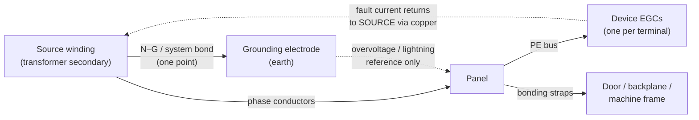

  Wiring &amp; Installation
  <h1>Panel Grounding &amp; Bonding Practice</h1>
  
Three distinct jobs hide behind the word "ground" — clearing faults, holding metal at one potential, and referencing electronics. Most grounding arguments end the moment you name which job is being discussed.

> **Safety.** Work de-energized and verified. Grounding and bonding work is
> performed by qualified personnel under your site's LOTO procedures,
> following the device manufacturer's manual and the authority having
> jurisdiction. This guide is educational, not a work instruction.

## Overview

"Ground it properly" is not one instruction — it is three, with different physics and different hardware:

1. **Safety fault return (protective bonding).** A low-impedance copper path from any faulted enclosure back to the **source winding**, so the overcurrent device opens fast. NEC 250.4(A)(5) is explicit: the earth is *not* this path — soil impedance is far too high to reliably trip a breaker. Faults are cleared by bonding, not by ground rods.
2. **Equipotential bonding (touch potential).** All simultaneously accessible conductive parts — enclosure, door, backplane, machine frame — held at the same potential so no one bridges a voltage difference during a fault or induced event. This is IEC 60204-1 Clause 8 and NFPA 79 Chapter 8 territory, and it matters even before any breaker trips.
3. **Functional grounding (FE / noise).** A stable reference for electronics and a drain path for cable shields. Legitimate — but never at the expense of jobs 1 and 2, and always bonded into the PE system at one deliberate point.

The connection to actual earth (the grounding-electrode system) exists mainly for overvoltage and lightning stabilization — NEC 250.4(A)(1) and (A)(2). It is upstream scope for the building electrical design; this guide covers the panel and machine side.

**This guide covers:**

- the panel PE bus and how conductors land on it
- door, backplane, and gland-plate bonding
- EGC/PE sizing procedure (tables cited, values not reproduced)
- shield-landing policy and isolated/instrument ground bars
- separately derived control power (CPT secondary bonding)
- verification of the protective bonding circuit

**This guide excludes:** grounding-electrode system design, lightning protection systems, hazardous-location grounding (see NEC Art. 500/505 material), and the deep EMC treatment — separation classes and suppression live in the [EMC guide]({{ '/design/wiring/emc-noise-mitigation/' | relative_url }}).

## Before You Start

Grounding decisions are mostly made upstream — confirm them before wiring:

- **Supply earthing system.** TN-S, TN-C-S, TT, or IT in IEC terms; solidly grounded, ungrounded, or impedance-grounded in NEC terms. It determines what the PE conductor must do during a fault and whether the first fault trips anything at all. On a TN system the PE conductor carries the full fault current back to the source and the loop impedance decides the trip time; on a TT system fault clearing typically depends on an RCD because the loop includes two electrode resistances; on an IT/ungrounded system the first fault trips nothing — NEC 250.4(B) still requires EGCs, bonding, and an effective fault path, plus ground-fault monitoring to catch the first fault before a second one becomes phase-to-phase. If these terms are not second nature, start with the [IEC earthing system types module]({{ '/fundamentals/electrical/earthing-systems-iec/' | relative_url }}) before making any panel-level decision.
- **Drawings that must exist before wiring starts:**
  - the **one-line diagram** showing the source bond point and every upstream OCPD rating — EGC sizing keys off these, and the location of the neutral-ground bond decides where fault current is allowed to meet the neutral;
  - the **panel layout** showing the PE bus location, the incoming PE terminal, and every door/backplane/gland-plate bond point;
  - a **grounding/shielding note block or drawing** stating the shield-landing rule for each signal class present in the machine. If there is no written shield policy, write one before pulling cable — retrofitting a policy after termination is rework, and reverse-engineering an undocumented one during a noise investigation is worse.
- **From the machine side:** IEC 60204-1 Clause 5 expects a single, marked external PE terminal where the installation's protective conductor lands. Everything inside the machine bonds back to that point — the machine builder owns everything downstream of it, the installer everything upstream.
- **Decisions already made upstream that you inherit, not revisit:** the earthing system type, the grounding-electrode design, and the service/source bonding. If any of these look wrong, escalate to the electrical designer — do not "fix" them from inside the control panel.

## Sizing & Protection

The sizing logic is a table lookup keyed to the upstream protection — cite the table, never guess the value:

- **NEC:** the equipment grounding conductor is sized from the rating of the overcurrent device ahead of the circuit per **Table 250.122** — not from the phase-conductor size, although when phase conductors are upsized for voltage drop the EGC is increased proportionally (250.122(B)). Bonding jumper sizing follows **Art. 250.102**.
- **NFPA 79:** the machine grounding conductor is sized from the largest upstream OCPD per the **Table 8.2.2.3** basis (Ch. 8). Green and green/yellow are reserved exclusively for grounding conductors — using those colors for anything else is a code violation.
- **IEC 60204-1:** the external protective copper conductor is sized per **Table 1** (Clause 5); the internal protective bonding circuit follows **Clause 8**, which defers the detailed cross-section method to IEC 60364-5-54.
- **Bonding jumpers** (door straps, backplane bonds, gland-plate bonds) are part of the protective bonding circuit and follow the same sizing basis as the EGC they parallel — verify against NFPA 79 Ch. 8 / IEC 60204-1 Cl. 8 for your case. Two distinct jumper roles are worth keeping straight: the **equipment bonding jumper** keeps non-current-carrying metal connected into the fault path (NEC 250.102), while the **system bonding jumper** is the single neutral-to-ground connection at a source (NEC 250.30) — one exists in many places, the other exactly once per source.
- **Functional-earth conductors** get their own identification — NFPA 79 Ch. 8 reserves green/green-yellow for protective grounding, so FE conductors are marked differently (commonly white-with-pink-stripe or the FE symbol; verify against your drawing standard). Never let an FE conductor masquerade as a PE conductor or vice versa.

The [wire sizing walkthrough]({{ '/design/wiring/wire-sizing/' | relative_url }}) covers the phase-conductor side of the same circuits; `cst ampacity` and `cst motor-branch` compute the conductor and OCPD chain that Table 250.122 then keys from.

## Power Wiring — the Panel PE Bus

Treat the PE bus as the single organizing structure, not an afterthought terminal:

- **One PE bus, individually landed conductors.** Every device EGC gets its own terminal on the bus — one conductor per terminal, no daisy-chaining through device to device. The NFPA 79 Ch. 8 principle: removing one device for service must never open another device's fault path.
- **Incoming PE lands first** and is the last conductor you would ever lift. Generally accepted practice — verify for your installation.
- **Doors, gland plates, and backplanes bond with dedicated straps.** Hinges, slides, and bearing surfaces are not acceptable bonding paths (NFPA 79 Ch. 8; IEC 60204-1 Cl. 8). A door carrying pushbuttons, an HMI, or a disconnect handle gets a flexible braided strap or green/yellow bonding conductor across the hinge line.
- **Paint is an insulator.** Scrape bond points to bare metal, or use serrated (star) washers or thread-forming hardware that bites through the coating — generally accepted practice, and the single most common grounding failure in third-party field evaluations. Mask bond areas before painting rather than grinding after.
- **Bond the backplane to the enclosure deliberately** — with hardware intended for bonding, not by trusting mounting screws through painted surfaces. Galvanized or zinc-plated backplanes give reliable metal-to-metal contact at every device foot; painted ones do not. Generally accepted practice — verify for your installation.
- **Keep bonding conductors short and direct.** For the safety function, length barely matters at 50/60 Hz; for the equipotential and EMC functions it matters a great deal — a long, looping bond strap has inductance that makes it nearly transparent to high-frequency events. Route bonds point-to-point, not around the wireway perimeter. Generally accepted practice — verify for your installation.
- **Multi-section lineups:** each section's PE bus bonds to its neighbors with a jumper sized to the same basis as the main PE conductor, so the lineup behaves as one enclosure. Verify against the enclosure manufacturer's lineup bonding kit instructions.

## Control / Signal Wiring — Functional Grounding

Functional grounding is where discipline pays off, because mistakes show up as drift and intermittent faults rather than tripped breakers:

- **One documented shield-landing rule per signal class.** Each class gets one written rule — which end lands, where, and how — applied everywhere. Consistency beats theoretical perfection; a mixed policy is undiagnosable later. A typical policy (generally accepted practice — verify against your device manuals):

| Signal class | Typical shield rule | Why |
|---|---|---|
| 4–20 mA, 0–10 V analog | One end only, usually panel end | Avoid 50/60 Hz loop current through the shield |
| Thermocouple / RTD | One end only, at the instrument input | Microvolt signals; loop current swamps them |
| Encoder / resolver | Per drive manual — often 360° at drive end | High frequency; pigtails degrade performance |
| Fieldbus (RS-485 etc.) | Per protocol spec — often bonded at one point, capacitively coupled elsewhere | Balance loop avoidance against HF drain |
| VFD motor cable | 360° gland at **both** ends | Shield *is* the common-mode return path |

- **Low-frequency analog shields typically land at one end only** — normally the panel end — so no power-frequency current circulates through the shield. Tape and insulate the floating end; a shield that brushes grounded metal at the "unlanded" end silently converts your policy to both-ends. Verify against the device manual; some vendors specify the device end.
- **Instrument / isolated ground (IG) bars:** the bar is insulated from the mounting surface so shield and reference currents take one deliberate path — but "isolated" never means floating. The IG bar is still bonded to the PE system at exactly one point (the NEC 250.146(D) concept at article level). An IG conductor with no path to the source bond is a shock hazard and a code violation, not a noise fix.
- **Star (single-point) grounding for analog references:** where analog commons and shield drains all return to one bar which then bonds once to PE, no two references can disagree — the classic remedy for PLC analog drift. NFPA 79 Ch. 8 acknowledges the arrangement with the same caveat as above: the star point *must* bond to PE. At high frequencies the star ideal breaks down (every spoke is an inductor), which is why VFD-class noise is handled with mesh bonding and 360° shields instead — one more reason the per-class policy matters.
- **Inter-panel and inter-building references:** two distant "grounds" are rarely at the same potential; bonding them through a signal-cable shield invites circulating current through your electronics. For RS-485 spans between buildings or across large machines, see the common-mode discussion on the [RS-485 physical layer page]({{ '/communications/rs485-physical-layer/' | relative_url }}); where the potential difference is real and persistent, galvanic isolators or [fiber optics]({{ '/communications/fiber-optics/' | relative_url }}) break the loop entirely.

## Grounding, Shielding & EMC

Panel-level specifics — the deep treatment of separation classes and suppression lives in the [EMC and noise mitigation guide]({{ '/design/wiring/emc-noise-mitigation/' | relative_url }}):

- **Separately derived sources.** A control power transformer secondary is a new source: NEC **Art. 250.30** requires a system bonding jumper connecting the secondary grounded conductor to the equipment grounding system — at one point, at the source. Skip it and the secondary has no fault-return path; duplicate it and you have created a parallel neutral path through the PE system.
- **VFD ground paths.** The drive's PWM output pushes high-frequency common-mode current that must return to the drive's PE terminal — via the motor-cable shield/ground, bonded 360° at both ends, not via the building ground. Flat braided straps outperform round wire at these frequencies. The full treatment is in the [VFD wiring guide]({{ '/design/wiring/vfd/' | relative_url }}).
- **EMC filters and drives bond to bare metal** — wide, short bonds to an unpainted mounting plate. A filter grounded through a long green wire is largely decorative at MHz frequencies. Generally accepted practice — verify against the device EMC installation instructions.
- **Surge protective devices** are only as good as their bonding: short, straight leads to the PE bus, because every centimeter of lead adds let-through voltage during a fast transient. Follow the SPD manual for lead-length limits.
- **Single-point vs mesh:** single-point (star) referencing suits low-frequency analog islands; mesh bonding (everything bonded to everything, short and wide) suits high-frequency environments like drive panels. Modern practice on drive-heavy machines leans mesh for the structure while keeping the analog star as an island bonded once into it. Generally accepted practice — verify for your installation.

## Common Mistakes

1. **Daisy-chained PE conductors.** Ground looped from device to device to save terminals. Removing one device for service opens the fault path for everything downstream — the failure is invisible until the fault that needed the path. NFPA 79 Ch. 8 principle: one conductor, one terminal.
2. **Shields grounded at both ends on low-frequency analog — or at one end on VFD motor cable.** The rules differ because the physics differ. At 50/60 Hz, a both-ends shield forms a loop and circulates hum current through the shield of a millivolt-level signal — so analog shields land at one end. At PWM frequencies, the motor-cable shield *is* the common-mode return path, and it only works bonded 360° at both ends. Applying either rule to the other class produces drifting analog values or a panel full of radiated noise.
3. **Relying on hinges for door bonding.** A hinge is a bearing surface with paint, grease, and oxide — its impedance is unknown and changes every time the door swings. NFPA 79 Ch. 8 and IEC 60204-1 Cl. 8 both reject it. Shows up as tingling door handles and ESD-like HMI resets.
4. **Ground bus used as a neutral.** Returning control-power neutral current through the PE bus "because it's all connected anyway." Now the safety system carries continuous load current: PE terminals run warm, touch voltage appears across bond resistances, and RCDs/GFCIs upstream trip mysteriously. Grounded conductor (neutral) and grounding conductor are distinct — they meet only at the source bond point (NEC 250.4; 250.30 for derived sources).
5. **Isolated ground treated as floating.** The IG bar left unbonded "to keep noise out." There is now no fault-return path for anything referenced to it — a shock hazard that also fails inspection. Isolated means *single-path*, not *disconnected*: one bond to PE, at one point.
6. **Paint under lugs.** A ground lug torqued onto a painted enclosure reads fine on a DC continuity beep but has real impedance at fault and EMI frequencies. The classic field-evaluation failure — scrape to bare metal or use hardware that penetrates the coating, then protect the joint.
7. **Expecting ground rods to clear faults.** A local electrode at the machine "so faults go to earth." Earth-path impedance is far too high to open an OCPD (NEC 250.4(A)(5)); the fault persists at full touch voltage. Electrodes are for overvoltage stabilization — copper back to the source clears faults.
8. **Removing the EGC to "fix" a ground loop.** A noise problem traced to a ground loop gets solved by lifting the safety ground on an instrument or drive. The noise goes away — and so does the fault path. Signal-integrity problems are solved with isolation, single-point referencing, or fiber, never by sacrificing the PE connection (NEC 250.4 purposes; NFPA 79 Ch. 8).

## Verification Checks

- [ ] Protective bonding circuit continuity verified with a proper continuity test — IEC 60204-1 Clause 18 (Verification) expects a test-current measurement, not a multimeter beep; a low-current beep passes through paint films and strand-or-two connections that a fault would vaporize
- [ ] Fault-loop impedance verified on TN systems (site-dependent — repeat at SAT even if measured at FAT)
- [ ] Incoming PE conductor landed, sized per the one-line, and identified; single external PE terminal marked per IEC 60204-1 Cl. 5
- [ ] Every EGC landed individually — one conductor per terminal on the PE bus, no daisy-chains
- [ ] Door, gland-plate, and backplane bonding straps installed and paint-penetrating hardware confirmed at every bond point
- [ ] EGC/PE sizes checked against upstream OCPD ratings per NEC Table 250.122 / NFPA 79 Table 8.2.2.3 / IEC 60204-1 Table 1
- [ ] Control transformer secondary bonding jumper present — once, at the source (NEC Art. 250.30)
- [ ] IG bar bonded to PE at exactly one point; no neutral current measurable on any grounding conductor
- [ ] Shield landings spot-checked against the written per-class policy; floating shield ends insulated, not bare
- [ ] VFD motor-cable shields confirmed 360°-terminated at both ends (see the [VFD guide]({{ '/design/wiring/vfd/' | relative_url }}) verification list)
- [ ] Green / green-yellow used only on grounding conductors; FE conductors identified per the drawing standard (NFPA 79 Ch. 8)
- [ ] Door bonding straps intact and flexible through the full swing — no strain, no fatigue kinks
- [ ] IG bar insulation from the mounting surface verified before its single PE bond is landed
- [ ] All grounding terminations torqued to manufacturer values and witness-marked; re-checked after shipment for machines that travel
- [ ] Results recorded — the [commissioning templates]({{ '/lifecycle/guides/commissioning-templates/' | relative_url }}) and [checklist downloads]({{ '/tools/templates/' | relative_url }}) include grounding line items

## Standards References

- **NEC (NFPA 70) 2023, Art. 250** — grounding and bonding: purposes (250.4), EGC sizing (Table 250.122), bonding jumpers (250.102), separately derived systems (250.30), isolated ground concept (250.146(D))
- **NFPA 79:2024, Ch. 8** — machine grounding and bonding: single PE terminal, continuity, no hinges/slides as bonding paths, conductor sizing basis (Table 8.2.2.3), color reservation
- **IEC 60204-1:2016+AMD1:2021, Cl. 5, Cl. 8, Cl. 18** — external PE terminal and conductor sizing (Table 1), equipotential bonding circuit, verification tests including protective-bonding continuity
- **IEC 60364-5-54** — referenced by IEC 60204-1 for detailed protective-conductor cross-section methodology
- **NEC 2023, Art. 409 / Art. 670** — industrial control panels and industrial machinery: where the panel meets the premises wiring system
- **UL 508A, 3rd Ed. (2018), revised 2025-06-26** — panel-shop construction practice for grounding and bonding within listed industrial control panels

## Related Pages

- [How to wire a VFD]({{ '/design/wiring/vfd/' | relative_url }}) — motor-cable shielding and high-frequency ground paths in depth
- [Noise & EMC mitigation]({{ '/design/wiring/emc-noise-mitigation/' | relative_url }}) — separation classes, suppression, and the full shield policy
- [Wire sizing walkthrough]({{ '/design/wiring/wire-sizing/' | relative_url }}) — the phase-conductor and OCPD chain the EGC tables key from
- [IEC earthing system types]({{ '/fundamentals/electrical/earthing-systems-iec/' | relative_url }}) — TN-S / TN-C-S / TT / IT fundamentals
- [RS-485 physical layer]({{ '/communications/rs485-physical-layer/' | relative_url }}) — common-mode limits and remote-ground problems on multipoint buses
- [Fiber optics]({{ '/communications/fiber-optics/' | relative_url }}) — galvanic isolation for inter-building links
- [NEC]({{ '/standards/us-electrical/nec/' | relative_url }}) · [NFPA 79]({{ '/standards/us-electrical/nfpa-79/' | relative_url }}) · [IEC 60204-1]({{ '/standards/machinery/iec-60204-1/' | relative_url }})
