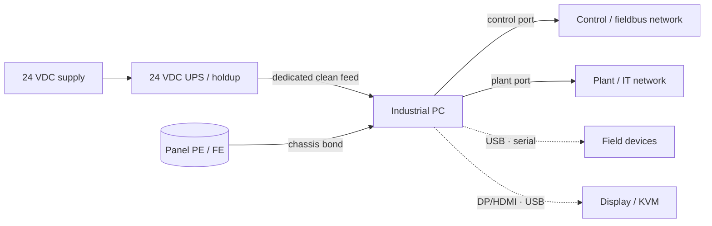

  Wiring &amp; Installation
  <h1>Industrial PC (IPC) Wiring &amp; Installation</h1>
  
An IPC is a computer in industrial clothing — power it clean, earth it properly even though it runs on DC, and give it a graceful way to shut down before the storage pays for a power blip.

> **Safety.** This guide is educational reference material, not a work
> instruction. Electrical work is performed de-energized and verified by
> qualified personnel under your site's LOTO procedures, following the device
> manufacturer's manual and the authority having jurisdiction. Confirm the
> input-voltage variant and polarity against the device nameplate before
> energizing — a DC device wired to the wrong supply is destroyed instantly.

## Overview

An industrial PC — box PC, panel PC, edge gateway, or PC-based
controller/HMI — is, underneath the DIN-rail bracket, a computer: it has an
operating system and non-volatile storage, and it does not enjoy losing power
mid-write. What makes it *industrial* rather than an office PC is the
packaging around that computer, and the packaging is what drives the wiring:

- **DC power input** — most IPCs take a nominal 24 VDC feed (some larger units
  are AC); an office PC's internal AC supply is gone.
- **Fanless, wide-temperature design** — heat leaves through the chassis by
  convection, so mounting orientation and clearance are electrical decisions.
- **DIN-rail / panel mounting** — it lives in a control panel, in the EMC
  company of contactors and drives.

The connection groups you actually wire:

- **Power input** — 24 VDC (often redundant dual input) or AC.
- **Protective earth / functional earth** — chassis PE lug, FE stud.
- **Network ports** — one or more Ethernet ports, frequently split into a
  control/fieldbus port and a plant/IT port.
- **Field & peripheral ports** — USB, isolated or non-isolated serial.
- **Display / KVM** — DisplayPort/HDMI/DVI/VGA plus USB for the operator
  interface.

This guide covers powering, earthing, and connecting one IPC in a control
panel. Operating-system configuration, application deployment, and network
addressing are out of scope. Terminal designations, input-tolerance windows,
inrush figures, thermal envelopes, and connector pinouts are vendor-specific —
they come from the device manual, never from a guide, including this one.

## Before You Start

Have on hand before wiring:

- **Device datasheet / nameplate** — input variant (**DC vs AC**), voltage
  tolerance band, **peak vs idle** power draw, **inrush** current, holdup
  capability, allowed mounting orientation, ambient-temperature and ingress
  ratings. These are the values this guide will not invent for you — read them
  off the specific unit.
- **Power architecture** — whether the unit has a single or **redundant
  (dual) 24 VDC input**, and whether the site provides a 24 VDC UPS or the IPC
  carries internal holdup. This decides how you feed it.
- **Shutdown strategy** — how the OS learns power is failing in time to flush
  and halt: internal holdup, external UPS with a signal line, or a
  loss-of-power digital input. Decided before wiring, not after the first
  corruption.
- **Mounting & segregation plan** — orientation and clearance per the
  datasheet, panel zone (clean side, away from drives), and which port lands
  on which network.

## Sizing & Protection

There is no motor-branch table to follow here; the governing logic is
control-circuit power integrity for a load that must not lose power
uncleanly. NFPA 79 Ch. 7 (control-circuit protection) and Ch. 8 (grounding)
provide the framework; the electrical numbers come from the device datasheet.

- **24 VDC supply sizing** — size the supply for the IPC's **peak** draw plus
  margin, not its idle figure, and include any **UPS-charging** load. Account
  for **inrush**: the input bulk capacitance draws a brief high current at
  power-up, which the supply and any upstream fuse must tolerate. Peak,
  inrush, and holdup figures are vendor-specific — sum them and verify against
  the supply rating.
  [`cst voltage-drop`]({{ '/tools/' | relative_url }}) checks the feeder run.
- **Fusing the IPC feed** — give the IPC a **dedicated, fused DC feed** sized
  to its rating rather than sharing an OCPD with unrelated loads, so a
  downstream fault elsewhere cannot drop the computer (NFPA 79 Ch. 7
  control-circuit protection principle). Generally accepted practice — verify
  the rating and method for your panel design.
- **Shared-rail risk** — powering the IPC from the same 24 V rail as
  contactor coils, solenoids, and brakes exposes the computer to the switching
  transients and voltage sags those inductive loads produce; a sag below the
  IPC's dropout threshold reboots it mid-task. Give the IPC a clean, dedicated
  (ideally UPS-backed) supply. Generally accepted practice.
- **Surge protection** — DC power and network entries are candidates for surge
  protective devices where the installation is exposed (long or outdoor runs,
  lightning-prone sites). SPD need and rating are application-specific.

## Power Wiring

- **Dedicated clean 24 V feed.** Run the IPC's supply from the clean side of
  the panel, separated from inductive-load and drive wiring. Do not daisy-chain
  it off a rail shared with switching loads.
- **Redundant / diode-OR / UPS-backed input.** Where the IPC has dual inputs,
  feed them from independent supplies through the vendor's redundancy
  (diode-OR) module, or back the feed with a **24 VDC UPS** so a supply loss
  triggers an orderly shutdown instead of a hard cut. Generally accepted
  practice — verify the topology against the device manual.
- **Protective earth is *not* optional on a DC device.** A DC-powered IPC
  still requires its chassis bonded to protective earth
  ([IEC 60204-1]({{ '/standards/machinery/iec-60204-1/' | relative_url }})
  equipotential bonding; NFPA 79 Ch. 8). "It's only 24 V DC" does not remove
  the PE requirement — PE is a safety and reference-integrity connection
  independent of the supply being DC. Terminate it to the chassis PE lug with
  a short, low-impedance bond; mask or scrape paint at the bond point. See
  [panel grounding &amp; bonding]({{ '/design/wiring/grounding-bonding/' | relative_url }}).
- **Functional-earth stud.** Many IPCs provide a separate FE stud for the
  signal-reference/shield network. FE and PE serve different purposes and are
  not interchangeable — wire the FE stud per the device manual.
- **Torque discipline.** Conductor range and terminal torque come from the
  device manual; record the values used.

## Ports & Connections

- **Network ports and segregation.** Where the IPC exposes a control/fieldbus
  port and a plant/IT port, keep each on its intended network and do not bridge
  them unintentionally. Route network cable away from drive-output and other
  power wiring; separation classes and distances are owned by the EMC and
  copper-Ethernet material —
  [copper Ethernet]({{ '/communications/copper-ethernet/' | relative_url }}).
- **USB / serial for field devices.** USB is convenient but not a rugged
  field bus — use captive/locking connectors and short runs where it carries
  anything permanent. For serial field devices, confirm whether the RS-232/
  RS-485 port is **isolated or non-isolated**: a non-isolated serial port tied
  to a device on a different ground reference is a ground-loop path and a
  failure point. Consult the device manual for isolation and pinout.
- **Display / KVM runs and length limits.** DisplayPort, HDMI, DVI, VGA, and
  USB each have an interface-specific maximum passive-cable length; beyond it,
  use active cable or a KVM extender. Verify the limit per interface and cable
  rather than assuming a long passive run will work.

## Grounding, Shielding & EMC

Device-specifics here; the deep treatment is owned by the
[noise &amp; EMC mitigation guide]({{ '/design/wiring/emc-noise-mitigation/' | relative_url }}).

- **Chassis PE bond.** Short, low-impedance bond from the chassis PE lug to
  the panel ground system — the same bond called out under Power Wiring, and
  the foundation for everything below.
- **Functional-earth stud purpose.** The FE stud references the IPC's internal
  signal ground and shield terminations; wiring it correctly keeps shield and
  reference currents off the PE safety path instead of sharing it.
- **Keep the IPC on the clean side.** Mount it away from VFD output cables and
  other high-dV/dt sources; the drive output cable is the worst offender for
  parallel network runs. Separation distances live in the
  [EMC guide]({{ '/design/wiring/emc-noise-mitigation/' | relative_url }}).
- **Shielded network entries.** Use shielded network cable for runs exposed to
  panel noise and bond the shield per the port/segregation scheme.

## Common Mistakes

1. **No UPS or holdup — storage corrupted by a power blip.** The IPC runs a
   real filesystem; a brownout or momentary cut mid-write corrupts the OS image
   or data. It shows up as an IPC that boots fine for months, then one day
   won't boot after a plant power event — and nobody connects the two. Provide
   holdup/UPS and an orderly-shutdown path.
2. **Protective earth left unconnected on a DC IPC.** "It's only 24 V" logic
   skips the PE bond. The safety bond is missing and the signal reference
   floats — intermittent noise, comms errors, and a code violation
   (IEC 60204-1 / NFPA 79 Ch. 8) that a passing inspection may not catch.
3. **IPC on the same 24 V rail as contactors and solenoids.** Coil-switching
   transients and sags ride into the computer; it reboots or glitches whenever
   a big load switches, and the fault "moves around" with plant activity.
4. **Blocked airflow from mounting orientation.** A fanless unit mounted in a
   disallowed orientation or with no clearance overheats; it throttles or shuts
   down under summer ambient or heavy load, months after a clean bench test.
5. **Unshielded network run past drive cables.** The IPC's Ethernet is routed
   in the same tray as a VFD output cable; the link drops or errors only while
   the drive runs, and packet captures look fine on the bench.
6. **Relying on the OS to survive a hard power-off.** Journaling filesystems
   reduce but do not eliminate corruption risk, and pending writes are lost.
   Always shut down through the OS or a holdup-triggered orderly shutdown.
7. **Non-isolated serial across a ground difference.** A non-isolated RS-485/
   RS-232 field port tied to a device on a different ground reference passes
   circulating current through the port — intermittent comms and, eventually, a
   dead port.

## Verification Checks

Before and during commissioning (evidence-retaining checklists in
[templates]({{ '/tools/templates/' | relative_url }})):

- [ ] **Clean-shutdown-on-power-loss test** — with holdup/UPS in place, cut the
      feed and confirm the IPC performs an orderly shutdown or rides through,
      not a hard power-off
- [ ] Protective-earth bond to the chassis PE lug complete and low-impedance;
      FE stud wired per the device manual
- [ ] Input variant, voltage, and polarity match the nameplate; dedicated fused
      feed sized to the device rating
- [ ] **Thermal check under load** — run at expected load in the final
      orientation and enclosure; confirm within the datasheet thermal envelope
- [ ] **Port / comms verification** — each network port on its intended
      network; serial isolation/wiring correct; display and peripheral runs
      within interface length limits
- [ ] Network and power cable segregation matches the routing plan; shielded
      entries bonded per scheme
- [ ] Terminal torques per the device manual, recorded

## Standards References

- **NFPA 79:2024** — Ch. 7 (control-circuit protection, applied to the IPC
  feed); Ch. 8 (grounding and bonding, protective-earth requirement); Ch. 13
  (location and mounting of control equipment) at chapter level
- **IEC 60204-1** — protective/equipotential bonding for machine electrical
  equipment; the PE requirement is independent of the supply being DC
  (international counterpart)
- **NEC (NFPA 70), 2023** — supply, overcurrent, and grounding principles for
  the panel feeding the IPC; **UL 508A** for panel construction context where
  the IPC sits in a listed industrial control panel (chapter level)
- **Manufacturer environmental & electrical specification** — the governing
  vendor category for input tolerance, inrush, holdup, thermal, mounting, and
  ingress values deliberately not reproduced here

## Related Pages

- [PLC wiring]({{ '/design/wiring/plc/' | relative_url }})
- [Panel grounding &amp; bonding]({{ '/design/wiring/grounding-bonding/' | relative_url }})
- [Noise &amp; EMC mitigation]({{ '/design/wiring/emc-noise-mitigation/' | relative_url }})
- [Copper Ethernet]({{ '/communications/copper-ethernet/' | relative_url }})
- [NFPA 79 overview]({{ '/standards/us-electrical/nfpa-79/' | relative_url }})
