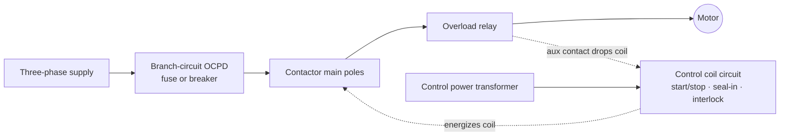

  Wiring &amp; Installation
  <h1>Motor Starter Wiring — DOL, Reversing, and Star-Delta</h1>
  
The classic across-the-line contactor starter — its power poles, its control rung, and the Article 430 protection chain that keeps the wire and the motor each protected by the right device.

> **Safety.** This guide is educational reference material, not a work
> instruction. Electrical work is performed de-energized and verified by
> qualified personnel under your site's LOTO procedures, following the device
> manufacturer's manual and the authority having jurisdiction. A reversing
> starter wired without its interlock can fault line-to-line on the first
> simultaneous close — prove the interlock before energizing.

## Overview

An across-the-line starter switches a motor directly onto the line through
an electromechanical contactor. It is the classic alternative to a
[variable frequency drive]({{ '/design/wiring/vfd/' | relative_url }}):
simpler, cheaper, and more rugged, but with no speed control and full
starting inrush. Where a drive shapes current and speed, a starter just makes
and breaks the connection. This guide covers three common configurations:

- **DOL (direct-on-line)** — one contactor connects all three phases straight
  to the motor. Full inrush at start (typically 6–8× FLA, motor-dependent).
- **Reversing** — two contactors, one per phase sequence; energizing either
  selects rotation. Requires interlocking so both can never close together.
- **Star-delta (wye-delta)** — a reduced-voltage starter (main, star, and
  delta contactors plus a timer) that starts the windings in star to cut
  inrush, then transitions to delta for run, for larger motors where DOL
  inrush is unacceptable.

Three terminal groups recur across all three: **power (line/load)** switched
through the contactor main poles; the **control coil circuit** (start/stop,
seal-in, interlocks, timer, overload contact); and the **overload** relay in
the motor power leads with its auxiliary contact in the coil circuit.

This guide covers wiring a single across-the-line starter feeding one
induction motor. Terminal designations, coil voltages, contactor and overload
catalog numbers, and torque values are vendor-specific — from the
manufacturer's data, never from a guide, including this one.

## Before You Start

Have on hand before pulling wire:

- **Motor nameplate data** — voltage, FLA, service factor, speed, power
  ([motor fundamentals]({{ '/fundamentals/motors/' | relative_url }})). The
  nameplate **FLA** feeds the overload setting; conventional branch-circuit
  sizing uses the NEC table full-load current (NEC 430.6 principle).
- **Starting-method decision (upstream).** DOL is simplest but imposes full
  inrush; **reduced-voltage star-delta** cuts starting current for large
  motors where the supply, a generator, or the driven mechanics cannot
  tolerate DOL inrush. Driven by motor size, supply stiffness, and load —
  decided in design, not at the panel.
- **Contactor and overload selection.** Contactors are rated by **utilization
  category** — AC-3 for ordinary squirrel-cage starting/running, AC-4 for the
  far harsher plugging/inching/**reversing** duty (breaking locked-rotor
  current). Size the contactor and overload to the motor FLA and the *actual*
  duty from the manufacturer tables; a contactor fine for AC-3 may be
  undersized for AC-4 reversing service.
- **Drawings.** The branch-circuit design (OCPD type/size, conductor sizes,
  disconnect location) is decided upstream; this guide assumes you are
  implementing it.

## Sizing & Protection

This is the core. The governing framework is NEC Article 430, and its central
discipline applies to a starter exactly as to any motor circuit: **the
short-circuit/ground-fault protection and the overload protection are two
separate devices doing two separate jobs.**

- **Branch-circuit short-circuit / ground-fault protection (OCPD).** A fuse or
  breaker that protects the **wiring** against short-circuit and ground-fault
  currents (NEC Art. 430 Part IV). It is sized separately from — and larger
  than — the overload, because it must let starting inrush pass without
  tripping. `cst motor-branch` computes the conventional motor-branch chain;
  conductor sizing follows the
  [wire sizing walkthrough]({{ '/design/wiring/wire-sizing/' | relative_url }}).
- **Motor overload (running overcurrent).** A thermal or electronic overload
  relay that protects the **motor** against sustained running overcurrent
  (NEC Art. 430 Part III), sized to the nameplate FLA and service factor —
  **not** to the breaker and **not** to the wire.
- **The fundamental distinction.** The OCPD protects the conductors against a
  fault; the overload protects the motor against overload. Neither can do the
  other's job — a breaker large enough to pass inrush never protects the motor
  from a locked-rotor or running-overload condition, and an overload sized to
  the motor will not clear a bolted fault. Crossing these two roles is the
  single most common motor-circuit error (see Common Mistakes).
- **SCCR of the starter combination.** The combination of OCPD, contactor, and
  overload has a short-circuit current rating that must equal or exceed the
  available fault current at its location, established per the
  [UL 508A]({{ '/standards/us-electrical/ul-508a/' | relative_url }})
  methodology and dependent on the specific device pairing — verify it against
  the panel's SCCR documentation, do not assume it.

## Power Wiring

- **DOL** — line to the contactor main poles, load side through the overload
  to the motor. Straightforward three-phase; the overload sits in the motor
  leads.
- **Star-delta** — both ends of each winding are brought out (six leads). The
  **main and star contactors** energize first, putting the windings in star
  (~58% of line voltage, reduced inrush); after the timer the **star contactor
  drops out and the delta contactor closes**, putting the windings across full
  line voltage for run. Standard star-delta is **open-transition** — the motor
  is briefly disconnected during the changeover, producing a current and
  torque surge as it re-connects. Correct lead identification and contactor
  sequencing are essential; miswiring can short windings or reverse a phase.
- **Reversing** — two contactors feed the motor with two phases swapped between
  them. If both close at once, the swapped phases create a direct
  **phase-to-phase short** across the line. Reversing power wiring is only safe
  behind the interlock below — this is not optional. Terminal torque values and
  wire ranges come from the device data; record the values used.

## Control / Signal Wiring

The control circuit is the low-power ladder that energizes the contactor
coil. It is where the starter's logic lives.

- **Start/stop with seal-in (holding contact) — the fundamental rung.** A
  momentary **start** pushbutton energizes the coil; a **normally-open
  auxiliary contact** of that contactor, wired in parallel with the start
  button, "seals in" and holds the coil after the button is released; a
  **normally-closed stop** button in series drops it out. Without the seal-in,
  the motor stops the instant you let go of the start button.
- **Control voltage from a CPT.** The coil circuit is commonly fed from a
  control power transformer stepping the line down to a control voltage, so
  operators and pilot devices are not exposed to line voltage — see
  [control power wiring]({{ '/design/wiring/control-power/' | relative_url }}).
- **Overload auxiliary contact in the coil circuit.** The overload relay's
  normally-closed auxiliary contact sits in series in the coil circuit, so an
  overload trip de-energizes the coil and stops the motor.
- **Reversing interlock — electrical and mechanical, both.** *Electrical:* each
  direction contactor's normally-closed auxiliary contact is wired in series
  with the **other** contactor's coil, so energizing one direction blocks the
  other. *Mechanical:* a physical interlock between the two contactors prevents
  both armatures closing at once even if the electrical interlock is defeated or
  a contact welds. Both are used together; neither alone is treated as
  sufficient for reversing duty. Generally accepted practice — verify for your
  installation.
- **Star-delta timing.** An on-delay timer holds the star state for the
  starting interval, then commands the transition to delta. The star and delta
  contactors are interlocked against each other (they must never close
  together); transition timing is application-specific.

## Grounding, Shielding & EMC

Device-specifics here; the deep treatment is owned by
[panel grounding &amp; bonding]({{ '/design/wiring/grounding-bonding/' | relative_url }}).

- **Motor frame and enclosure bonding.** Bond the motor frame and the starter
  enclosure to PE per NFPA 79 Ch. 8 / IEC 60204-1 — sized on the table basis
  (largest upstream OCPD), procedure per the table, values not reproduced.
- **Coil suppression.** A DC-operated contactor coil is inductive; a
  suppression device across the coil (a diode, RC, or varistor per the coil
  type) limits the switch-off spike that would otherwise stress the controlling
  contact or a PLC output; AC coils commonly use an RC snubber. Coil-specific —
  consult the manufacturer. Generally accepted practice.

## Common Mistakes

1. **Reversing starter without an interlock.** If both direction contactors
   can close together, the two swapped phases short line-to-line — a violent
   fault on the first simultaneous energization. Fit **both** electrical
   (aux-contact) and mechanical interlocks; it shows up as a bang and a
   cleared upstream OCPD the first time both are commanded.
2. **Overload sized to the breaker rating instead of the motor FLA.** The
   overload is then set far above the motor's running current and never
   protects it; a genuine overload runs the motor to insulation failure while
   the "protection" never trips.
3. **OCPD relied on for overload protection, or vice versa.** The two devices
   are not interchangeable. A breaker sized to pass inrush cannot protect
   against a running overload; an overload cannot clear a bolted fault. Crossed
   roles leave either the motor or the wiring unprotected.
4. **No seal-in contact.** The motor runs only while the start button is
   physically held and stops the moment it is released — the classic missing
   holding contact, mistaken for a bad coil or control fault.
5. **Star-delta open-transition surge misdiagnosed.** The current and torque
   spike at the star-to-delta changeover is inherent to open-transition
   starting; it is often chased as a fault. Closed-transition starting or
   corrected timing addresses it where the surge is unacceptable.
6. **Contactor undersized for the utilization category / duty.** Sizing a
   reversing or plugging (AC-4) application from AC-3 tables under-rates the
   contactor; the contacts erode or weld under the harsher breaking duty.

## Verification Checks

Before and during first energization (evidence-retaining checklists in
[templates]({{ '/tools/templates/' | relative_url }})):

- [ ] Overload set to the motor FLA (and service factor), and its trip
      function verified per the relay's method
- [ ] Overload auxiliary contact proven to drop the coil on trip
- [ ] Reversing interlock proven — attempt to command both directions and
      confirm the interlock prevents both contactors closing
- [ ] Star-delta transition proven — timer interval correct, sequence star →
      open → delta, star/delta interlock confirmed
- [ ] Rotation verified on a brief bump before coupling the load; correct by
      swapping two phases if wrong
- [ ] OCPD type and rating match the design, and the starter combination SCCR
      matches the panel's SCCR documentation
- [ ] Terminal torques per the device data, recorded

## Standards References

- **NEC (NFPA 70), 2023** — Art. 430 (motors, motor circuits, controllers):
  Part III (overload protection), Part IV (branch-circuit short-circuit and
  ground-fault protection), Part IX (disconnecting means)
- **NFPA 79:2024** — machine electrical wiring practice, protection, and
  conductor/grounding chapters (chapter-level)
- **UL 508A:2022** — industrial control panel construction and the SCCR
  methodology for the starter combination (section-level)
- **IEC 60947-4-1 / utilization categories** — AC-3, AC-4 contactor duty as a
  concept

## Related Pages

- [How to wire a VFD]({{ '/design/wiring/vfd/' | relative_url }}) — the drive alternative to across-the-line starting
- [Wire sizing walkthrough]({{ '/design/wiring/wire-sizing/' | relative_url }})
- [Control power wiring]({{ '/design/wiring/control-power/' | relative_url }})
- [Panel grounding &amp; bonding]({{ '/design/wiring/grounding-bonding/' | relative_url }})
- [Engineering toolkit]({{ '/tools/engineering-toolkit/' | relative_url }}) — `cst motor-branch` and the motor-circuit calculators
- [NEC overview]({{ '/standards/us-electrical/nec/' | relative_url }})
- [UL 508A overview]({{ '/standards/us-electrical/ul-508a/' | relative_url }})
