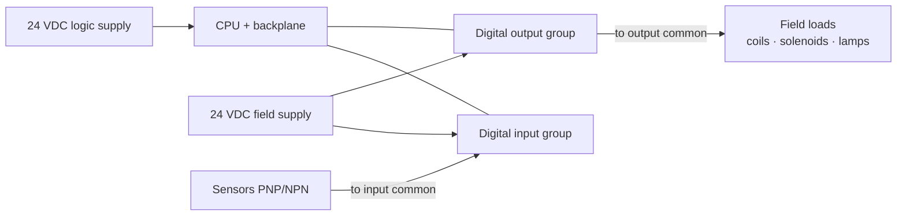

  Wiring &amp; Installation
  <h1>PLC Wiring — Power, I/O, and Commons</h1>
  
Controller power, digital inputs and outputs, and the common/return
  terminals — and why the module type, not the schematic alone, decides how
  each point is wired.

> **Safety.** This guide is educational reference material, not a work
> instruction. Electrical work is performed de-energized and verified by
> qualified personnel under your site's LOTO procedures, following the
> module manufacturer's datasheet and the authority having jurisdiction.
> Forcing outputs drives real field devices — treat a controller as live
> whenever field power is present.

## Overview

A PLC I/O system looks like a lot of identical terminals, but it is really a
handful of distinct wiring zones — and the **module type dictates the wiring**
for each. Get the terminal groups straight and most I/O problems disappear.

- **Controller / backplane power** — the logic supply for the CPU and
  backplane (commonly 24 VDC, sometimes 120 VAC on larger racks).
- **Digital input groups** — field contacts and sensors landing on an input
  module, referenced to an **input common** that is either per-point or
  per-group.
- **Digital output groups** — the module's switching elements driving field
  loads, referenced to an **output common**, with the output *type* (relay,
  transistor, triac) setting the rules.
- **Field-device power** — the separate supply that powers sensors and
  actuators, kept distinct from backplane/logic power.

This guide covers wiring a rack or block of discrete digital I/O for a single
controller. Analog I/O lives in the
[4-20 mA analog loop guide]({{ '/design/wiring/analog-4-20ma/' | relative_url }});
distributed drops in the
[remote I/O guide]({{ '/design/wiring/remote-io/' | relative_url }}); fieldbus
I/O in [communications]({{ '/communications/' | relative_url }}). Terminal
designations, per-point ratings, and torque values are vendor-specific — from
the module datasheet, never from a guide, including this one.

## Before You Start

Field wiring cannot be finalized from the schematic alone. Pull the datasheet
for every module and confirm:

- **Input type** — sinking or sourcing, and whether the sensor is **PNP or
  NPN**. The two must agree (see Control / Signal Wiring). The datasheet tells
  you which polarity the input common sits at.
- **Output type** — **relay** (dry contact, AC or DC, often isolated per
  point), **sourcing/sinking transistor** (DC only), or **triac** (AC only).
  The load's compatibility and its suppression needs follow from this.
- **Voltage and per-point current limits**, and whether commons are
  **per-point or per-group** — the common groupings are the module's
  isolation boundaries.
- **Simultaneity / derating** — many modules cannot carry every point at full
  current at once, or at elevated ambient. Read the simultaneity curve before
  assuming all points can run loaded.
- **Field-device data** — for each output, the load's steady-state *and*
  inrush current, and whether it is inductive (needs suppression).

Upstream decisions — supply voltages, which loads are on which module, panel
layout — are assumed made; this guide is about implementing them cleanly.

## Sizing & Protection

The framework is NFPA 79 for the machine panel (Ch. 6 overcurrent protection,
Ch. 7 control-circuit protection) with NEC Article 725 principles for
control circuits generally.

- **Control-power fusing.** Control circuits are typically supplied at reduced
  voltage — 24 VDC or 120 VAC through a control transformer or power supply —
  and protected as a control circuit (NFPA 79 Ch. 7; Ch. 6 for overcurrent).
  Fuse the logic supply and the field-device supply per their ratings.
- **Output-point current limits.** Each output point has a maximum continuous
  current, and grouped modules add a per-group total capped by the
  simultaneity rating. **Fused-output** modules protect each point or group
  internally; **unfused-output** modules need external fusing sized to the
  point rating. Verify which type you have — do not assume internal
  protection.
- **Inrush vs steady-state.** The rating that matters for an output is the
  load's **inrush**, not its steady draw. Tungsten lamps, contactor coils, and
  the input capacitors of downstream supplies pull many times their running
  current at switch-on; a transistor output sized only to the steady current
  can fail on inrush. Size to inrush and verify against the module's surge
  rating. *Generally accepted practice — verify for your installation.*
- **Interposing relays.** When the field load exceeds the output point's
  rating — current, voltage, AC vs DC, or isolation — drive an interposing
  relay from the PLC output and switch the load through the relay contact.
  *Generally accepted practice.*

## Power Wiring

- **24 VDC supply.** Most modern PLC logic and field I/O run on a regulated
  24 VDC supply, sized for the summed logic + field load with headroom for
  inrush. *Generally accepted practice.*
- **Redundant / diode-OR supplies.** Critical systems may combine two
  supplies through a redundancy (diode-OR) module so one supply can fail
  without dropping the rail; detailed sizing is left to the supply vendor.
- **Backplane vs field power separation.** Keep logic/backplane power and
  field/actuator power on separate protected rails, so a field short or an
  actuator surge cannot brown out the CPU. *Generally accepted practice —
  verify for your installation.*
- **Terminations and torque.** Land every conductor to the module's marked
  wire range at the datasheet torque and record it; support conductors in duct
  so no strain reaches the terminal (NFPA 79 Ch. 16).

## Control / Signal Wiring

This is the core of PLC wiring, and where the field-diagnosable mistakes live.

- **Sinking vs sourcing DI — the classic mismatch.** A **PNP (sourcing)**
  sensor delivers +V when active and needs a **sinking input group** (common
  tied to 0 V). An **NPN (sinking)** sensor pulls the point to 0 V when active
  and needs a **sourcing input group** (common tied to +V). Sensor output type
  and input-card common polarity **must match**, or the input never reads —
  or reads inverted. Confirm both against the datasheet before you land a
  single sensor.
- **Shared vs isolated commons.** A shared common ties every point in a group
  to one return — fine within a single field supply. Tie two independently-fed
  circuits through a shared common, or bridge an isolated group's common to
  another supply, and you create a **sneak (backfeed) path**: current finds an
  unintended return and points read energized that are physically open. Use
  isolated commons where circuits come from different supplies or must not
  interact. *Generally accepted practice.*
- **Output types and freewheeling diodes.** Relay (dry-contact) outputs
  switch AC or DC and ignore polarity, at the cost of contact wear and bounce.
  Sourcing transistor outputs (DC only) are fast and silent but
  polarity-sensitive and vulnerable to inductive kickback. **Every switched
  inductive DC load — relay coil, contactor coil, solenoid, DC valve — needs a
  freewheeling (flyback) diode across the coil** to clamp the turn-off spike,
  or the transistor output degrades and then fails. AC inductive loads on
  triac outputs use an RC snubber or MOV instead. *Generally accepted practice,
  echoed by every module vendor — consult the datasheet for the specified
  suppression.*
- **Wire numbering and terminal discipline.** Identify every wire at each
  termination to match the schematic (NFPA 79 Ch. 16). The North American
  color convention is **blue for DC control, red for AC control**, and
  **orange for externally-sourced interlock circuits that stay hot when the
  main disconnect is off** (NFPA 79 Ch. 16) — get orange right, because it is a
  shock-hazard warning, not decoration.

## Grounding, Shielding & EMC

Device-specifics here; the deep treatment is owned by the
[noise &amp; EMC mitigation guide]({{ '/design/wiring/emc-noise-mitigation/' | relative_url }}).

- **0 V reference bonding policy.** Decide **once** whether the 24 VDC 0 V rail
  is bonded to PE (grounded reference) or left floating, and apply it
  consistently across the system. A mixed policy makes ground loops and
  phantom inputs. Set it per
  [panel grounding &amp; bonding]({{ '/design/wiring/grounding-bonding/' | relative_url }})
  (NFPA 79 Ch. 8 basis).
- **Analog card grounding.** Low-level analog I/O uses shielded home-runs with
  the shield grounded at one end — rules in the
  [4-20 mA analog loop guide]({{ '/design/wiring/analog-4-20ma/' | relative_url }}).
  Do not carry analog on the digital commons.
- **Suppression at the source.** The flyback diodes (DC) and snubbers/MOVs
  (AC) above are also EMC measures — they kill the switching transient where it
  is born. Separation classes and distances belong to the
  [EMC guide]({{ '/design/wiring/emc-noise-mitigation/' | relative_url }}).

## Common Mistakes

1. **Sink/source mismatch.** A PNP sensor landed on a sourcing input group
   (or NPN on sinking). The input never asserts, or reads inverted — and it
   looks like a dead sensor until someone checks the datasheet polarity.
2. **No freewheeling diode on a DC inductive output.** The turn-off spike
   erodes the transistor output; it works for weeks, then goes intermittent,
   then dead. The load "randomly stopped working" and the module gets blamed.
3. **Shared-common sneak paths.** Two supplies bridged through a common let
   current backfeed — a point reads "on" with nothing wired to make it on.
4. **Output overload without an interposing relay.** A load beyond the point
   rating welds a relay contact or blows a transistor; contactor and lamp
   loads are the usual culprits, via inrush rather than steady current.
5. **Mixing 24 V and higher voltages in one group.** Conductors of different
   voltages may share a group only if all are insulated for the highest
   voltage present (NFPA 79 Ch. 16). A 24 V-rated wire beside 120 V is a fault
   and a shock hazard.
6. **Floating unused inputs where the card needs a defined state.** Noise
   toggles the point and phantom events appear in logic; tie unused inputs to
   the group's defined level per the datasheet.

## Verification Checks

Before and during first energization (evidence-retaining checklists in
[templates]({{ '/tools/templates/' | relative_url }})):

- [ ] Point-to-point continuity against the loop/wiring sheets, module by
      module, before applying field power
- [ ] Each input group's common polarity matches its sensors (PNP→sinking,
      NPN→sourcing), confirmed against the datasheet
- [ ] Each output group's common matches its load supply; isolated groups kept
      isolated
- [ ] Freewheeling diodes / snubbers fitted on every switched inductive load
- [ ] Fused-vs-unfused outputs identified; external fusing fitted where the
      module is unfused
- [ ] Terminal torques per the datasheet, recorded; wire markers match the
      schematic
- [ ] Outputs forced **only** with actuators safe to move and personnel clear
      — a force drives the physical device
- [ ] Hand off to the machine commissioning workflow for functional I/O checks

## Standards References

- **NFPA 79:2024** — Ch. 6 (overcurrent protection), Ch. 7 (control-circuit
  protection and electric-shock protection), Ch. 8 (grounding and bonding),
  Ch. 9 (control circuits and control functions), Ch. 16 (wiring methods,
  segregation and color conventions)
- **NEC (NFPA 70), 2023** — Art. 725 (Class 1/2/3 control circuits), general
  overcurrent and conductor principles for control wiring
- **UL 508A** — industrial control panel construction, control-circuit and
  supply provisions
- **IEC 60204-1** — control circuits, conductor identification, and wiring
  practices for machine electrical equipment (international counterpart)

## Related Pages

- [Remote I/O station wiring]({{ '/design/wiring/remote-io/' | relative_url }})
- [4-20 mA analog loop wiring]({{ '/design/wiring/analog-4-20ma/' | relative_url }})
- [Panel grounding &amp; bonding]({{ '/design/wiring/grounding-bonding/' | relative_url }})
- [Noise &amp; EMC mitigation]({{ '/design/wiring/emc-noise-mitigation/' | relative_url }})
- [NFPA 79 overview]({{ '/standards/us-electrical/nfpa-79/' | relative_url }})
- [Communications (fieldbus I/O)]({{ '/communications/' | relative_url }})
