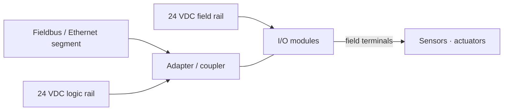

  Wiring &amp; Installation
  <h1>Remote I/O Station Wiring</h1>
  
A remote drop is three problems in one box — a network, a local power
  budget, and field wiring — and the failures that look like "flaky network"
  usually live in the power and grounding.

> **Safety.** This guide is educational reference material, not a work
> instruction. Electrical work is performed de-energized and verified by
> qualified personnel under your site's LOTO procedures, following the
> coupler and module manufacturer's documentation and the authority having
> jurisdiction. A remote drop can be fed from more than one source — verify
> every rail is dead before working on it.

## Overview

A remote I/O drop pushes the I/O out to the process and connects it back with
a network. That makes it **three wiring problems in one enclosure**:

- **Network** — the fieldbus / industrial-Ethernet segment landing on the
  drop's **adapter/coupler** (bus coupler, network adapter, head module).
- **Power** — one or more 24 VDC rails feeding the coupler logic and the
  field modules, commonly with a **separate field/actuator rail**.
- **Local field wiring** — the digital and analog modules and their field
  terminals, wired like any [PLC I/O]({{ '/design/wiring/plc/' | relative_url }}).

Contrast with **central I/O**, where every module sits in the main PLC rack:
central I/O has one power environment and no network in the I/O path. A remote
drop adds a network, a local power budget, and a remote environment to every
calculation — and most "the network is flaky" calls trace back to the power
and grounding, not the network.

This guide covers wiring one remote drop: its network entry, its power rails,
and the local field terminals. Network protocol selection and diagnostics are
in [communications]({{ '/communications/' | relative_url }}); the field I/O
rules themselves are in the
[PLC wiring guide]({{ '/design/wiring/plc/' | relative_url }}). Coupler
terminal designations, ratings, and torque values are vendor-specific — take
them from the datasheet, not from a guide.

## Before You Start

- **Network type** — EtherNet/IP, PROFINET, EtherCAT, Modbus TCP, and the
  like — decides cabling, connectors, and addressing. Start from
  [communications]({{ '/communications/' | relative_url }}).
- **Addressing** — the coupler's node/IP or device-name assignment; a
  consistent, documented scheme across drops is a commissioning prerequisite,
  and duplicates are a classic first-power-up failure.
- **Power budget per drop** — sum the coupler logic draw, the module backplane
  draw, and the field/actuator load at that drop, with headroom for inrush.
- **Environment at the remote location** — ambient temperature, ingress,
  vibration, and — importantly — the **cable distance from the main panel**,
  which sets the 24 VDC feeder voltage drop.

## Sizing & Protection

The machine-panel framework is NFPA 79 (Ch. 6 overcurrent protection, Ch. 7
control-circuit protection); the DC feeder is a conductor-sizing and
voltage-drop problem.

- **Per-drop 24 VDC supply and fusing.** Each drop's 24 VDC is sized and fused
  for that drop's load. A **per-drop disconnect and fusing** lets one drop be
  isolated for service without dropping the network segment or the other
  drops — omit it and every service call takes the line down. *Generally
  accepted practice.*
- **Module-group current.** As with central I/O, grouped modules carry a
  per-group total limited by the simultaneity rating; read it from the
  datasheet rather than assuming every point can run loaded.
- **Separate field vs logic rails — the common gotcha.** Many couplers provide
  (or expect) a **separate rail for field/actuator power**, distinct from the
  logic/backplane power that keeps the coupler and network alive. Whether the
  two are separable, and how they are fused, is a per-coupler question —
  consult the coupler manual, then keep them separate (see Power Wiring).

## Power Wiring

- **Separate logic and field/actuator rails.** Run coupler/logic power on its
  own protected rail and actuator/field power on another. The reason is
  concrete: an actuator surge or a field short on a shared rail sags the
  voltage the coupler sees, the coupler resets, and the **whole drop drops
  off-bus** — then the fault clears before anyone can measure it, and it
  reads as random comms loss. *Generally accepted practice — verify for your
  installation.*
- **24 VDC to remote panels and feeder voltage drop.** Long 24 VDC feeders to
  distant drops lose voltage under load, and at 24 V the margin to the
  coupler's brownout threshold is small — a feeder that measures fine
  unloaded can brown out the coupler under full actuator load. **Size the
  feeder for the loaded voltage at the far end**, not the no-load reading;
  `cst voltage-drop` computes the DC feeder drop for the run length and load.
  Bump the conductor size or split the supply if the far-end voltage is
  marginal.
- **Terminations and torque.** Land conductors to the coupler's marked wire
  range at the datasheet torque and record it; support cabling so no strain
  reaches the terminals (NFPA 79 Ch. 16).

## Control / Signal Wiring

- **Commons across a distributed drop.** The sink/source and
  shared-vs-isolated-common discipline of central PLC I/O applies at each drop
  — see the [PLC wiring guide]({{ '/design/wiring/plc/' | relative_url }}).
  Reference each drop's I/O to **its own** supply; do not carry a common
  between drops, or you tie two ground references together through the signal
  wiring.
- **Analog on shielded home-runs.** Keep analog signals on individual shielded
  home-runs into the drop — **not** daisy-chained across drops and not bundled
  with digital field wiring. Daisy-chaining shares a noise source and a single
  fault across every signal on the chain. The loop rules are in the
  [4-20 mA analog loop guide]({{ '/design/wiring/analog-4-20ma/' | relative_url }}).
  *Generally accepted practice.*

## Grounding, Shielding & EMC

Device-specifics here; the deep treatment is owned by the
[panel grounding &amp; bonding]({{ '/design/wiring/grounding-bonding/' | relative_url }})
and [EMC]({{ '/design/wiring/emc-noise-mitigation/' | relative_url }}) guides.

- **Single-point vs multi-panel grounding across drops.** Drops in separate
  enclosures sit at different points of the plant ground reference. Bonding
  0 V and shields to local ground at every drop **without a considered scheme**
  forms inter-panel ground loops — circulating current through the shield and
  signal returns. Set the grounding/bonding policy deliberately across all
  drops (NFPA 79 Ch. 8 basis). The inter-panel ground-potential difference is
  the same common-mode problem that
  [RS-485 physical-layer design]({{ '/communications/rs485-physical-layer/' | relative_url }})
  addresses — the network's common-mode range is finite, and a large ground
  offset eats it.
- **Network cable segregation.** Keep network cable segregated from power and
  actuator wiring — separate glands/entries, no shared bundle — per NFPA 79
  Ch. 16 segregation and the
  [copper Ethernet guidance]({{ '/communications/copper-ethernet/' | relative_url }}).

## Common Mistakes

1. **One 24 VDC rail for logic and actuators.** Actuator inrush resets the
   coupler and the whole drop drops off-bus — intermittently, tracking machine
   activity, so it reads as a network fault.
2. **Undersized 24 VDC feeder to a distant drop.** Voltage drop under load
   browns out the coupler; it measures fine unloaded, then fails when the
   actuators fire. The single hardest remote-I/O fault to catch after the fact.
3. **Network and power sharing one gland with no segregation.** Coupling from
   the power/actuator wiring produces comms errors that track machine activity
   — the packet-capture shows retries only while the drive or valves run.
4. **Analog daisy-chained across drops.** One noise source or one fault
   corrupts every signal on the chain instead of one home-run; the readings
   wander together.
5. **Missing per-drop disconnect/fusing.** No way to isolate a drop for service
   without taking down the network segment or the neighbouring drops — every
   service call becomes a line stop.
6. **Inconsistent addressing across drops.** Duplicate node/IP or device names,
   or a scheme nobody documented, so a drop never joins the network or two
   drops collide at power-up.

## Verification Checks

Before and during first energization (evidence-retaining checklists in
[templates]({{ '/tools/templates/' | relative_url }})):

- [ ] Logic and field power on **separate** fused sources; confirm one rail can
      dip without resetting the coupler
- [ ] 24 VDC feeder holds voltage at the **far end under load** (`cst
      voltage-drop` on the run) — not just the no-load reading
- [ ] Per-drop disconnect and fusing present and labelled; the drop can be
      isolated without dropping the segment
- [ ] Coupler comms LED interpreted against the manual — solid typically
      "connected", blinking a link/config state, off no link (confirm the
      pattern in the coupler manual)
- [ ] Per-drop point-to-point loop checks against the drop's wiring sheets
- [ ] Network cable segregated from power/actuator wiring; addressing matches
      the documented scheme with no duplicates
- [ ] Shields/0 V bonded per the agreed inter-panel grounding scheme, not
      ad-hoc at each drop

## Standards References

- **NFPA 79:2024** — Ch. 6 (overcurrent protection), Ch. 7 (control-circuit
  protection), Ch. 8 (grounding and bonding), Ch. 16 (wiring methods and
  segregation), Ch. 20 (system integration)
- **NEC (NFPA 70), 2023** — conductor sizing and voltage-drop principles for
  the 24 VDC feeder; Art. 725 control-circuit principles
- **IEC 60204-1** — equipotential bonding, conductor identification, and
  wiring practices for machine electrical equipment (international counterpart)

## Related Pages

- [PLC wiring — power, I/O, and commons]({{ '/design/wiring/plc/' | relative_url }})
- [4-20 mA analog loop wiring]({{ '/design/wiring/analog-4-20ma/' | relative_url }})
- [Panel grounding &amp; bonding]({{ '/design/wiring/grounding-bonding/' | relative_url }})
- [Communications overview]({{ '/communications/' | relative_url }})
- [Copper Ethernet]({{ '/communications/copper-ethernet/' | relative_url }})
- [RS-485 physical layer]({{ '/communications/rs485-physical-layer/' | relative_url }})
