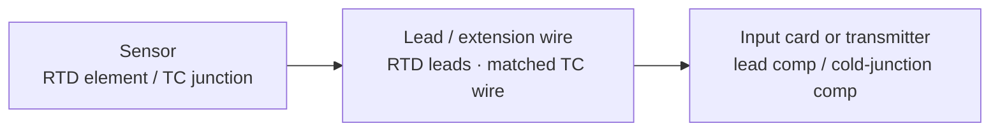

  Wiring &amp; Installation
  <h1>RTD &amp; Thermocouple Wiring</h1>
  
The two dominant temperature sensors and why their wiring is unlike anything else — an RTD reads resistance, so the leads lie unless you compensate; a thermocouple makes its own millivolts, so the wire itself has to be the right metal.

> **Safety.** This guide is educational reference material, not a work
> instruction. Electrical work is performed de-energized and verified by
> qualified personnel under your site's LOTO procedures, following the device
> manufacturer's manual and the authority having jurisdiction. Temperature
> sensors often sit on hot or pressurized process connections — treat the
> process side as hazardous until proven otherwise.

## Overview

Industrial temperature measurement is dominated by two sensor types, and what
makes each one's wiring special is completely different:

- **RTD (resistance temperature detector)** — a precision resistor whose
  resistance tracks temperature (Pt100 = 100 Ω at 0 °C, Pt1000 = 1000 Ω). The
  instrument measures **resistance**, so the resistance of the lead wires adds
  to the reading unless it is compensated. Lead-resistance compensation is the
  entire wiring story.
- **Thermocouple (TC)** — two dissimilar metals joined at a measuring junction
  that generate a small **millivolt** signal proportional to the difference
  between that junction and a reference junction. That forces two things: the
  extension wire must be the **matched thermocouple type**, and the instrument
  must perform **cold-junction compensation**.

Both are low-level signals — resistance or millivolts — so **noise, not
current, is the enemy**, which is why the shielding and separation rules
matter as much as the connections. Three terminal groups recur:

- **Sensor** — the RTD element or TC junction in the process.
- **Extension / lead** — RTD lead wire (2, 3, or 4 conductors) or matched TC
  extension wire from the sensor head to the input.
- **Input card / transmitter** — the RTD/TC analog input module, or a
  head/rail-mounted transmitter that converts to 4–20 mA.

This guide covers wiring one RTD or thermocouple point to its input. Terminal
designations, the region-specific TC color codes, and card type selection are
vendor- and standard-specific — they come from the device manual and the
applicable color-code standard, never from a guide.

## Before You Start

Have on hand before wiring:

- **Sensor type and the matching input.** Confirm the sensor — RTD (Pt100 /
  Pt1000) or thermocouple **type** (J, K, T, E, N, …) — and that the input card
  or transmitter is configured for exactly that type. A Type J sensor on a
  Type K input applies the wrong characteristic and reads a systematic error.
- **RTD 2/3/4-wire decision.** Decide the lead configuration up front — it
  determines the conductor count and the accuracy (see *Control / Signal
  Wiring*). Retrofitting from 2-wire to 3-wire means pulling another
  conductor.
- **Transmitter at the sensor, or direct to the card?** A head/rail transmitter
  converting to 4–20 mA at the sensor is often the better answer for long runs;
  a direct raw run to an RTD/TC card is simpler for short in-panel distances.
- **Drawings and environment.** Loop/instrument diagrams, cable route relative
  to power and VFD cabling, and process connection details are decided
  upstream.

## Sizing & Protection

There are no conductor-ampacity tables here — these are signal circuits
carrying resistance or millivolts, not power. The "sizing" that matters is
**signal integrity**:

- **RTD lead resistance is the sizing concern.** On a 2-wire RTD the lead
  resistance adds directly to the element resistance and reads as extra
  temperature. Heavier gauge and shorter runs cut the error; 3-wire and 4-wire
  methods compensate it (below).
- **TC extension gauge and length.** Matched extension wire has a defined loop
  resistance; long runs and the input impedance affect the millivolt signal.
  On a long run, converting to 4–20 mA at the sensor sidesteps the problem.
- **Noise, not current.** Because these are low-level signals, the design
  target is keeping induced noise below the measurement resolution — there is
  no overcurrent sizing in the power sense.

## Power Wiring

- **The loop-powered transmitter option — often the better long-run answer.**
  A head- or rail-mounted temperature transmitter can sit at the sensor and
  convert RTD resistance or TC millivolts to a robust **4–20 mA** signal that
  shrugs off lead resistance and coupled noise, doing the cold-junction and
  lead compensation locally. For anything but short in-panel runs this is
  frequently preferable to running the raw sensor signal all the way to the
  card. The loop practice — loop-resistance budget, active/passive matching,
  single-point grounding — is covered in
  [4–20 mA current loop wiring]({{ '/design/wiring/analog-4-20ma/' | relative_url }}).
- **Torque discipline.** Terminal torque and wire ranges are vendor values;
  record what you used.

## Control / Signal Wiring

This is the core. Getting the RTD lead configuration and the thermocouple
material/polarity right is the whole job.

### RTD — 2-wire vs 3-wire vs 4-wire

| Configuration | How it handles lead resistance | Accuracy | Typical use |
| --- | --- | --- | --- |
| **2-wire** | No compensation — lead resistance adds directly to the reading as error | Lowest | Short runs, low-accuracy points only |
| **3-wire** | A third conductor lets the input measure and subtract the leads, **assuming all leads are equal** | Good — the industrial standard | The workhorse for most plant RTDs |
| **4-wire** | True Kelvin sensing — a separate excitation pair and sense pair cancel lead resistance entirely, regardless of matching | Best | Traceable measurement, long or unequal leads |

- **2-wire** — the lead resistance is read as extra temperature, an
  uncompensated error that grows with cable length. Short runs only.
- **3-wire** — the industrial standard: compensates the lead resistance on the
  assumption that the leads are equal, so keep the three conductors the same
  gauge and length.
- **4-wire** — best accuracy, lead resistance cancels regardless of matching;
  used where the point must be traceable or the leads are long.

### Thermocouple

- **Use matched extension wire — always.** The extension must be the **same
  thermocouple type** as the sensor. Running plain **copper** wire from a
  thermocouple creates a second, unintended junction at the transition and
  injects error — the classic thermocouple mistake.
- **Observe polarity, and mind the region.** TC polarity matters (the two legs
  are different metals), and the **color codes differ by region** — the same
  color means different things under different code standards, and in several
  codes the negative leg is the distinguishing color. Consult the applicable
  color-code standard and the device manual; do not assume.
- **Cold-junction compensation happens at the card / transmitter.** The
  instrument measures its reference-junction temperature and corrects for it —
  but only if the matched extension wire carries the signal unbroken all the
  way to that point.
- **Keep both away from power and VFD cabling.** The millivolt/low-resistance
  signal is highly susceptible to coupled noise; segregation is not optional
  for a clean reading.

## Grounding, Shielding & EMC

Device-specifics here; the deep treatment is owned by the
[noise &amp; EMC mitigation guide]({{ '/design/wiring/emc-noise-mitigation/' | relative_url }})
and the shield-landing theory by
[panel grounding &amp; bonding]({{ '/design/wiring/grounding-bonding/' | relative_url }}).

- **Shield landed at ONE end only** for these low-frequency, low-level signals.
  The shield drains capacitively coupled noise without becoming a conductor
  between two grounds; grounding it at both ends across any ground-potential
  difference carries 50/60 Hz hum straight into the signal. Same single-end
  policy as other low-frequency analog — the frequency reasoning is owned by
  [grounding &amp; bonding]({{ '/design/wiring/grounding-bonding/' | relative_url }}).
- **Grounded vs ungrounded TC junction.** A *grounded* junction (bonded to the
  sheath) responds faster but ties the signal to process ground — a ground-loop
  source; an *ungrounded* (isolated) junction is slower but floating, preferred
  where ground loops or isolation matter. Application-specific.
- **Ground loops corrupt millivolt signals.** Two ground references at
  different potentials drive circulating current that appears as an offset or
  noise on the tiny signal. Single-point grounding, an ungrounded junction, or
  an isolated input breaks the loop.

## Common Mistakes

1. **Copper extension wire on a thermocouple** instead of matched TC wire. The
   copper-to-TC transition forms an unintended junction; the error tracks the
   transition-point temperature and defeats the cold-junction compensation.
2. **Thermocouple polarity reversed.** The reading moves the wrong way or shows
   a large offset — made easier to get wrong by region-varying color codes.
   Verify against the applicable code, not from memory.
3. **2-wire RTD on a long run.** Lead resistance adds directly to the reading:
   a steady positive temperature error that grows with cable length. Use
   3-wire (or 4-wire) for anything but a short run.
4. **RTD/TC cable in the tray with VFD motor cable.** PWM noise couples into
   the low-level signal; the giveaway is a reading that is noisy **only while
   the drive runs**. Segregate the routes.
5. **Shield grounded at both ends.** The screen becomes a ground-loop conductor
   and injects a steady 50/60 Hz hum into the millivolt signal. Land the shield
   at one end only.
6. **Mixing TC types, or the wrong card type.** A Type J sensor on a Type K
   card (or mismatched extension) applies the wrong characteristic — a
   systematic error that looks plausible until it is checked against a
   reference.

## Verification Checks

Before handing the point to the process (evidence-retaining sheets in
[templates]({{ '/tools/templates/' | relative_url }})):

- [ ] Sensor type confirmed against the card/transmitter configuration (RTD
      Pt100/Pt1000, or TC type)
- [ ] **Signal injection** — inject a known resistance (RTD decade box) or
      millivolt value (TC source) at the field terminals and confirm the input
      reads the corresponding temperature, verifying the card independently of
      the sensor
- [ ] **Known-temperature comparison** against a reference thermometer or
      ice-point/bath at a known temperature
- [ ] **Lead-resistance check (RTD)** — leads within the configuration's
      tolerance, especially before trusting a 2- or 3-wire point
- [ ] TC polarity confirmed against the applicable color-code standard
- [ ] Shield landed at one end only; low-level cable segregated from power/VFD
      routes per the plan
- [ ] Terminal torques per the device manual, recorded; completed loop sheet
      filed

## Standards References

- **IEC 60751** — industrial platinum RTDs: the standard characteristic (Pt100
  etc.) and tolerance classes (category-level).
- **IEC 60584** — thermocouples: TC types (J, K, T, E, N, R, S, B), reference
  tables and tolerances; region color codes per the applicable part
  (category-level).
- **NFPA 79:2024 / IEC 60204-1:2018** — machine electrical wiring-practice
  chapters: conductor identification, routing, and separation of low-level
  signal from power (chapter-level).
- Device manuals and the applicable TC color-code standard are the authority
  for terminal designations, color codes, and card configuration.

## Related Pages

- [4–20 mA current loop wiring]({{ '/design/wiring/analog-4-20ma/' | relative_url }}) — the transmitter output and where converting at the sensor pays off
- [Panel grounding &amp; bonding]({{ '/design/wiring/grounding-bonding/' | relative_url }}) — shield-landing policy and the jobs of "ground"
- [Noise &amp; EMC mitigation]({{ '/design/wiring/emc-noise-mitigation/' | relative_url }}) — separation classes and victim hardening
- [PLC I/O wiring]({{ '/design/wiring/plc/' | relative_url }}) — where the RTD/TC input card lives
- [Commissioning templates]({{ '/tools/templates/' | relative_url }}) — loop sheets and signal-injection records
