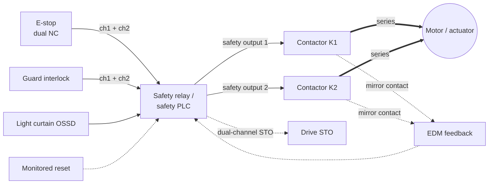

  Wiring &amp; Installation
  <h1>Safety Circuit Wiring — E-Stops, Safety Relays, and Monitored Reset</h1>
  
How to wire a safety circuit whose architecture was already decided
  upstream: input devices into a safety relay or safety PLC, dual-channel
  wiring that survives a single fault, redundant final elements, feedback, and
  a reset that cannot itself start the machine.

> **Safety.** This guide is educational reference material, not a work
> instruction, and **not a substitute for a functional-safety design**.
> Electrical work is performed de-energized and verified by qualified personnel
> under your site's LOTO procedures, following the device manuals and the
> authority having jurisdiction. The architecture, performance level, and
> category of a safety function come from a risk assessment and a safety
> requirements specification — this guide covers only the **wiring** that
> realizes an architecture already determined by that work. Wiring cannot
> create safety performance the design does not specify.

## Overview

This guide covers **wiring** a safety circuit — it does not design one. The
architecture (single vs dual channel, the required Performance Level per
[ISO 13849-1]({{ '/standards/functional-safety/iso-13849-1/' | relative_url }})
or SIL per [IEC 62061]({{ '/standards/functional-safety/iec-62061/' | relative_url }}),
the category, the reset type, the diagnostic coverage) is an **output of the
risk assessment and the [safety requirements specification]({{ '/lifecycle/safety-requirements-spec/' | relative_url }})**
and an **input to this wiring**. Realizing that architecture in copper is what
this page is about; determining it belongs to the
[safety architecture]({{ '/lifecycle/safety-architecture/' | relative_url }})
work. Good wiring can *defeat* a specified architecture (parallel the channels,
skip the feedback) but cannot *upgrade* one — a single-channel design does not
become dual-channel because the panel is neat.

The safety functions in scope are the common ones — **emergency stop**
(ISO 13850), **guard/interlock** monitoring, and **light curtain / ESPE** trip
— each feeding a **safety relay** or **safety controller/PLC**, whose outputs
act on the final elements. Terminal groups:

- **Input devices** — e-stop NC contacts, interlock switches, ESPE outputs;
  wired as independent channels, typically monitored by the logic's test
  outputs for cross-fault detection.
- **Safety logic** — the safety relay or safety PLC that performs redundancy,
  discrepancy monitoring, and diagnostics.
- **Safety outputs** — to redundant contactors, or to a drive's Safe Torque
  Off (STO).
- **Feedback / EDM** — the external-device-monitoring loop that reads the
  final elements' mirror contacts back into the logic.

**Dual channel** here is a wiring property: two independent circuits carrying
the same safety signal so a single credible fault does not defeat the function
and is detected. This guide assumes the architecture is fixed. Component-level
PL/SIL determination, MTTFd/diagnostic-coverage math, and vendor terminal
designations, torque values, and backup-fuse ratings are **not** here — they
come from the safety design and the device manuals, never from a guide,
including this one.

## Before You Start

The most important input is not a wire size — it is the safety design.

- **The architecture is handed to you, not chosen at the panel.** The required
  **PL / Category** (ISO 13849-1) or **SIL / SILCL** (IEC 62061), whether the
  function is **single or dual channel**, and whether reset is **monitored or
  automatic** all come from the risk assessment and the
  [SRS]({{ '/lifecycle/safety-requirements-spec/' | relative_url }}). If any of
  those is unknown, stop — that is a design gap, not a wiring decision.
- **Safety-rated vs standard device selection.** Where the architecture
  requires it, devices must be **safety-rated**: e-stop actuators with
  **direct-opening (positively-guided) NC contacts**, rated interlock switches,
  listed ESPE, a safety relay/controller, and contactors with
  **mirror/positively-guided** auxiliaries for feedback. A standard control
  relay or a pushbutton without direct-opening contacts does not give the fault
  behavior the safety calculation assumes. Which parts must be safety-rated is
  specified upstream — confirm against the SRS.
- **Drawings and the safety function matrix** — the input-to-output logic,
  which devices belong to which function, the stop category required, and the
  final elements are defined in the design; this guide assumes you are
  implementing them.
- **Device manuals** — wiring of test-pulse outputs, EDM loops, reset inputs,
  and output backup protection is vendor-specific. Consult the safety-device
  manual for the actual terminals and values.

## Sizing &amp; Protection

Sizing in a safety circuit is mostly about protecting the **safety outputs** and
the wiring so a fault cannot both disable the function and go undetected.

- **Output contact rating vs the load.** A safety relay or safety-controller
  output has a rated making/breaking capacity; size it against the actual load
  — normally **contactor coil inrush and seal current**. Verify the coil
  burden against the output rating; an under-rated output welds. Consult the
  device manual for the rating and the output type (electromechanical relay vs
  semiconductor OSSD behave differently).
- **External / backup protection on the safety contacts.** Safety-relay outputs
  typically require an **external backup fuse** to protect the output contacts
  from a short-circuit fault on the load side — fit the type and rating the
  manual specifies. Omitting it can weld a safety output closed, which is
  exactly the failure the architecture is trying to survive.
- **Short-circuit protection of the safety wiring.** The safety wiring is
  protected against short circuit like other control wiring (NFPA 79 Ch. 7;
  IEC 60204-1) and, where the logic supplies test pulses, cross-fault detection
  supplements that protection — the two are complementary, not interchangeable.
- **Final-element coil suppression** follows the contactor manual; note the
  suppression choice affects drop-out time, which affects stop timing on a
  Category-1 stop.

## The Safety Output Circuit

The output circuit is the final element — what actually removes the hazard.

- **Redundant contactors in series.** The classic final element is **two
  contactors in series** on the load supply, each driven by an independent
  safety output, so a single welded contactor still leaves the load isolated by
  the other. This is dual-channel realized in power wiring.
- **Positively-guided / mirror contacts for feedback (EDM).** Each contactor's
  **mirror (positively-guided) auxiliary contact** wires back into the safety
  logic's **external device monitoring** loop. A welded main contact holds its
  mirror contact open, the logic sees the feedback did not confirm, and it
  **blocks the reset** — this is how a welded contactor is detected instead of
  silently halving the redundancy. If the design calls for EDM and it is not
  wired, a welded contactor goes undetected (see Common Mistakes).
- **Drive STO as the final element.** Alternatively the safety output drives a
  drive's dual-channel **Safe Torque Off**; the STO wiring detail lives in the
  [servo drive guide]({{ '/design/wiring/servo-drive/' | relative_url }}). STO
  removes torque but is **not** a disconnect and **not** a brake — a loaded or
  vertical axis can still fall, and mains LOTO is still required. STO is a stop
  function, not isolation (IEC 60204-1).
- **Stop category drives the topology.** IEC 60204-1 defines stop **Category 0**
  (immediate removal of power — dropping the contactors), **Category 1**
  (controlled stop, *then* power removal — sequence the drive stop before the
  contactors open), and **Category 2** (controlled stop, power retained). The
  category is specified by the design; wire the output to match it.

## Input Device Wiring

This is where most safety-circuit wiring goes wrong, and where the fault
detection the PL depends on is won or lost.

- **Dual-channel e-stop and interlock.** Wire **two independent NC circuits**
  per device into the safety logic; the logic checks both channels agree and
  detects a discrepancy. Do **not** simply parallel two contacts — paralleling
  lets one stuck-closed path mask the other, destroying the single-fault
  detection. Independent series channels with discrepancy monitoring preserve
  it. Generally accepted practice, and the reason safety inputs come in pairs —
  verify against the safety-logic manual.
- **Cross-fault detection via test/pulse outputs.** The safety controller's
  **pulsed test outputs** put distinct patterns on each channel so a
  channel-to-channel short, or a short to 24 V, shows up as a mismatch. Using a
  **separate test source per channel** is what makes those cross-faults
  visible; tying both channels to one source can hide them. Follow the manual's
  test-output wiring.
- **Series-connecting multiple e-stops.** Multiple e-stops are commonly
  daisy-chained in series on each channel — standard practice — but
  series-connection **reduces the achievable diagnostic coverage** (faults on a
  shared chain can mask one another), which can **cap the PL** for the function.
  The design accounts for this; do not add devices to a chain without checking
  it against ISO 13849-1 and the SRS.
- **Monitored reset vs automatic reset, and why it matters.** With **monitored
  (manual) reset** the function does **not** re-enable when the e-stop is
  released — a separate, deliberate reset action is required, and the logic
  watches the reset signal for a proper edge (typically a falling/trailing edge)
  so a jammed or shorted reset button cannot reset. This matters because **the
  reset must not itself start the machine**: clearing the safety condition and
  commanding motion are two distinct acts (IEC 60204-1 e-stop/reset principle;
  ISO 13850). **Automatic reset** — the function re-enabling on device release
  — is permitted **only** where the risk assessment allows it and no unexpected
  start-up can result. Which one applies is a design decision, not a wiring
  convenience.

## Grounding, Shielding &amp; EMC

Device-specifics here; the deep treatment is owned by the
[noise &amp; EMC mitigation guide]({{ '/design/wiring/emc-noise-mitigation/' | relative_url }}).

- **A ground fault must not defeat the function or cause a dangerous state.**
  Safety circuits are arranged so an earth fault drives the function toward the
  **safe state** rather than masking it — for example referencing the switched
  side so a fault to earth de-energizes the load, per the IEC 60204-1
  earth-fault and protective-bonding principle. Verify the intended earth-fault
  behavior against the safety-logic manual and the design; do not assume it.
- **Route safety wiring away from noise.** Keep OSSD, test-pulse, and input
  channels clear of drive motor cables and switching loads; induced noise can
  cause nuisance trips or, worse, disturb the discrepancy monitoring.
  Separation classes and distances are in the
  [EMC guide]({{ '/design/wiring/emc-noise-mitigation/' | relative_url }}).
- **PE and bonding** terminated per the NFPA 79 Table 8.2.2.3 basis (procedure
  per the table, values not reproduced here); see
  [panel grounding &amp; bonding]({{ '/design/wiring/grounding-bonding/' | relative_url }}).

## Common Mistakes

1. **Single channel where the SRS requires dual.** One e-stop contact and one
   coil where the design calls for two independent channels — the circuit
   *looks* like it works and stops the machine on demand, but a single welded
   contact defeats it silently. It passes the happy-path test and fails the
   fault case nobody ran. The channel count comes from the SRS, not from what
   fits.
2. **E-stops paralleled instead of series/independent.** Wiring device contacts
   in parallel to "make it simpler" lets one stuck-closed contact mask another;
   the function still trips in normal use, so the loss of fault detection is
   invisible until an audit or an accident. Keep channels independent and in
   series with discrepancy monitoring.
3. **Automatic reset where monitored reset is required.** The function
   re-enables the instant the e-stop is released, so releasing the button — or
   a machine that was mid-cycle — restarts motion with no deliberate reset. It
   shows up as an unexpected start-up, the exact hazard monitored reset exists
   to prevent.
4. **EDM/feedback loop not wired.** The contactor mirror contacts are left
   unconnected (or jumpered out to "get it running"), so a welded contactor is
   never detected and the logic allows a reset onto a half-defeated output.
   Everything works until the day one contactor welds — and then there is no
   redundancy and no warning.
5. **Standard relay used where safety-rated is required.** A general-purpose
   control relay or a pushbutton without direct-opening contacts substituted
   for a safety-rated device. The fault behavior the safety calculation assumed
   (positive opening, defined failure modes) is not there; the PL on paper is
   not the PL in the panel.
6. **A channel bypassed during commissioning and left bypassed.** A jumper
   dropped across a nuisance-tripping channel to finish start-up, then never
   removed — the function runs single-channel in production. Bypasses belong in
   a tracked, removed-before-handover list, and the verification below is meant
   to catch a forgotten one.
7. **STO used as the e-stop stop without regard to stop category.** Wiring the
   drive STO as the emergency-stop means without accounting for whether a
   Category 0 or Category 1 stop is required, whether the load can fall when
   torque is removed, and that STO is not isolation — so the "stop" leaves a
   vertical axis dropping or the mains live for maintenance.

## Verification Checks

Functional verification of a safety circuit confirms both that it trips **and**
that each fault is detected — a checklist of "it stopped" is not enough.
Evidence-retaining checklists live in
[templates]({{ '/tools/templates/' | relative_url }}); functional-safety
validation follows the machine's validation plan (ISO 13849-2 principle).

- [ ] **Each channel tested independently** — open/disconnect **one** channel,
      confirm the function still commands the safe state **and** the logic
      detects and latches the fault; repeat for the other channel
- [ ] **Reset behavior** — releasing the e-stop does **not** restart the
      machine; a deliberate reset with a proper edge is required
- [ ] **Reset cannot be defeated** — a held or shorted reset input does not
      reset the function
- [ ] **EDM / feedback** — simulate a welded contactor (force one mirror
      contact) and confirm the reset is blocked
- [ ] **Cross-fault** — where the logic uses test pulses, a channel-to-channel
      short or short to 24 V is detected per the device manual
- [ ] **No bypasses remain** — every commissioning jumper removed and accounted
      for
- [ ] **Stop category and stop time** verified against the design (Cat 0/1/2)
- [ ] Hand off to the [commissioning]({{ '/lifecycle/commissioning/' | relative_url }})
      and functional-safety validation activities for the full validation record

## Standards References

- **ISO 13849-1** — safety-related parts of control systems: Performance Level,
  categories, dual-channel architecture, diagnostic coverage, and the
  series-connection / fault-masking considerations that bound achievable PL
  (determination is upstream of this guide)
- **IEC 62061** — functional safety of machine control systems: SIL/SILCL,
  architecture, and diagnostics (the IEC route to the same architecture inputs)
- **IEC 60204-1** — electrical equipment of machines: **stop categories 0, 1 and 2**
  for stop functions generally, of which **only Category 0 and Category 1 are valid
  for an emergency stop** (Category 2 leaves power on the actuators); the
  emergency-stop function and its reset requirement, earth-fault behavior, and the
  principle that a stop function is not an isolation function
- **ISO 13850** — emergency stop as a machinery-level function: dual-channel,
  direct-opening actuation, latched until deliberately reset
- **NFPA 79:2024** — Ch. 7 (control-circuit protection), Ch. 8 (grounding and
  bonding, Table 8.2.2.3 basis), stop-function and e-stop provisions for
  industrial machinery
- **IEC 60947-5-5 / -5-1** — direct-opening (positively-guided) contact
  principle for e-stop devices and control switches (component level)

## Related Pages

- [Servo drive wiring]({{ '/design/wiring/servo-drive/' | relative_url }}) — dual-channel STO as the final element
- [Control power wiring]({{ '/design/wiring/control-power/' | relative_url }}) — the 24 V control supply behind the safety logic
- [Noise &amp; EMC mitigation]({{ '/design/wiring/emc-noise-mitigation/' | relative_url }}) — routing and separation for safety wiring
- [ISO 13849-1 overview]({{ '/standards/functional-safety/iso-13849-1/' | relative_url }})
- [IEC 62061 overview]({{ '/standards/functional-safety/iec-62061/' | relative_url }})
- [IEC 60204-1 overview]({{ '/standards/machinery/iec-60204-1/' | relative_url }})
- [Safety requirements specification]({{ '/lifecycle/safety-requirements-spec/' | relative_url }}) — where the architecture is defined
- [Safety architecture]({{ '/lifecycle/safety-architecture/' | relative_url }}) — single vs dual channel, PL/SIL, category
