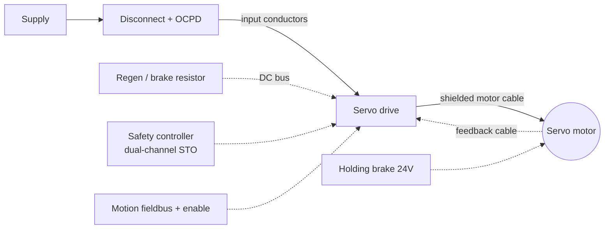

  Wiring &amp; Installation
  <h1>Servo Drive Wiring — Power, Motor, Feedback, STO, and Brake</h1>
  
A servo axis is a VFD with a closed loop bolted on: the same power and
  shielding rules apply, but the feedback path, Safe Torque Off, and the
  holding brake are what make or break the install.

> **Safety.** This guide is educational reference material, not a work
> instruction. Electrical work is performed de-energized and verified by
> qualified personnel under your site's LOTO procedures, following the drive
> and motor manuals and the authority having jurisdiction. Servo drive DC bus
> capacitors hold a lethal charge after power removal — observe the drive's
> marked discharge wait time. Safe Torque Off is **not** a disconnect: it does
> not isolate the mains and is not a substitute for LOTO.

## Overview

A servo axis is a closed-loop motion system, and that loop is the difference
that matters. Where a [VFD]({{ '/design/wiring/vfd/' | relative_url }})
typically runs an induction motor open-loop on speed, a servo drive
continuously reads a **feedback device** on the motor shaft and regulates
position, velocity, and torque with tight dynamics — adding two wiring groups
a basic VFD does not have (feedback and, almost always, Safe Torque Off) plus
a motor-mounted holding brake on most axes. The terminal groups:

- **Mains / DC bus** — supply from the branch-circuit OCPD, plus DC-bus
  terminals for multi-axis bus sharing and the regen/braking resistor; a
  stored-energy hazard.
- **Motor power** — the PWM output to the servo motor; the noisy circuit,
  treated exactly like the VFD load side.
- **Feedback** — resolver, encoder, or single-cable digital protocol;
  signal-level, and the circuit most likely to cause faults.
- **STO / safety** — dual-channel Safe Torque Off inputs into the safety system.
- **Holding brake** — 24 V to a motor-mounted brake that *holds* a stopped axis.
- **Control / network** — enable, references, and the motion fieldbus.

This guide covers a single low-voltage servo axis and builds on the VFD guide
rather than repeating it — the power-wiring, shielding, and reflected-wave
rules are shared, so this page focuses on what is **different** for a servo:
the feedback loop, STO, the holding brake, and the sizing consequences of high
peak torque. Commutation, phasing, and autotune are commissioning steps,
covered in the
[servo commissioning workflow]({{ '/lifecycle/guides/servo-commissioning/' | relative_url }});
STO PL/SIL determination belongs to the machine's functional-safety design.
Terminal designations, feedback pinouts, torque values, and cable-length
limits are vendor-specific — they come from the drive and motor manuals, never
from a guide, including this one.

## Before You Start

Have on hand before pulling wire:

- **The matched set.** Drive, motor, and feedback device are normally selected
  together, usually from one vendor, and commissioned as a unit. The drive
  firmware must support the motor's feedback type — a mismatched device will
  not commutate. Confirm the combination against the manuals before wiring.
- **Motor nameplate and data sheet** — voltage, **continuous** current/torque
  and **peak** current/torque (servos run several times continuous torque for
  short intervals), feedback type, and whether a holding brake is fitted
  ([motor fundamentals]({{ '/fundamentals/motors/' | relative_url }})).
- **Cable-system decision.** Digital-feedback families offer a *single-cable*
  solution (power and feedback in one hybrid cable, to vendor rules) or
  separate power + feedback cables. Which is permitted — and the maximum motor
  and feedback **lengths** — is set by the drive/feedback system, not a
  universal number; feedback protocols have hard length limits. Consult the
  manual.
- **DC-bus / regen architecture.** On a multi-axis machine, decide upstream
  whether axes share a DC bus (so one axis's braking energy feeds another) and
  how excess is dumped — braking resistor or regen unit. Bus-sharing, fusing,
  and same-family rules are vendor-defined.
- **Drawings** — the branch-circuit design, the safety circuit driving the STO
  inputs, and the field-network topology are decided upstream; this guide
  assumes you are implementing them.

## Sizing & Protection

The governing framework is NEC Article 430 (Part X, adjustable-speed drive
systems) with NFPA 79 Chapters 6 and 7 for machinery panels — the same
backbone as a VFD.

- **Mains input protection.** Size branch-circuit conductors and OCPD to the
  drive's **rated input current** (NEC 430.122), not the motor current, and
  use the OCPD type/rating in the drive listing — deviating can invalidate the
  drive's SCCR contribution and the panel's marked SCCR (NFPA 79 Ch. 6;
  UL 508A methodology). `cst motor-branch` computes the branch chain and
  `cst voltage-drop` checks the run; the
  [wire sizing walkthrough]({{ '/design/wiring/wire-sizing/' | relative_url }})
  works the full chain.
- **Motor-cable sizing.** Size to the servo motor's **continuous** current,
  then verify the cable and terminations tolerate the **peak** current the
  drive can command — a servo's peak can be several times continuous, so a
  cable picked from continuous current alone may be under-rated for the peaks.
  The drive manual states the continuous/peak ratings and any min/max
  cross-section.
- **DC-bus and regen protection.** Shared-bus links and braking-resistor
  circuits are high-energy; protect and thermally monitor them per the manual,
  and wire the resistor thermal switch into the control/safety chain.
- **STO is not overcurrent protection.** Safe Torque Off removes torque
  capability; it does **not** protect conductors and is no substitute for
  branch-circuit or motor protection — a distinction worth keeping clear.
- **Disconnecting means** — a disconnect within sight of the drive is required
  (NEC Art. 430 Parts IX/X; NFPA 79 Ch. 5), and it is what you LOTO for
  maintenance — not the STO inputs.

## Power Wiring

The servo motor circuit follows the VFD load-side rules; see the
[VFD power-wiring section]({{ '/design/wiring/vfd/' | relative_url }}) for the
full reasoning, summarized here with the servo differences.

- **Shielded servo motor cable, 360-degree termination at both ends.** A
  full-circumference gland or clamp at the drive **and** motor end — the same
  both-ends rule as the VFD motor cable, and for the same reason: a pigtail is
  a significant impedance at PWM frequencies and largely defeats the shield.
  Verify against the drive's EMC installation instructions.
- **Keep motor power away from feedback.** In a two-cable system, route motor
  power and feedback apart. In a single-cable/hybrid system the segregation is
  engineered *inside* the cable to vendor rules — follow those rules, do not
  improvise a substitute hybrid from separate cables in one conduit.
- **Reflected-wave / lead length** applies as on a VFD: long leads overshoot
  the terminal voltage and stress winding insulation. Threshold and remedy are
  vendor- and voltage-class-specific — from the manual, not a universal number.
- **DC-bus link wiring** (multi-axis): vendor bus bars or cables, short runs,
  correct polarity and fusing. **Regen / brake-resistor wiring** is a
  high-energy switched circuit — short, shielded/twisted, routed away from
  control **and feedback** wiring, thermal contact wired into the safety chain.
- **Torque discipline** — terminal torque values and wire ranges come from the
  drive manual; record the values used.

## Control / Signal Wiring

This is the core of a servo install. Three circuits — feedback, STO, and the
holding brake — have no real counterpart on a basic VFD.

### Feedback

- **Use the specified feedback cable.** Resolver, incremental/absolute
  encoder, or a single-cable digital protocol — the cable, connector, pinout,
  and grounding are defined by the feedback system. Consult the manual; do not
  assume across vendors or motor families. Ground and terminate the feedback
  shield per the manual — no pigtails, any more than on the motor cable.
- **Never route feedback with motor power** beyond the manufacturer's
  single-cable rules. Motor-cable coupling into the feedback path is the
  classic servo fault — it shows up as position error, following error, or
  commutation faults only while the axis moves.

### Safe Torque Off (STO)

- **Dual-channel, into the safety system.** STO is typically wired as two
  independent channels to a safety relay or safety controller, as part of a
  rated safety function per
  [ISO 13849-1]({{ '/standards/functional-safety/iso-13849-1/' | relative_url }})
  and [IEC 62061]({{ '/standards/functional-safety/iec-62061/' | relative_url }}).
  The wiring, diagnostics, and PL/SIL determination belong to the machine's
  safety design and the planned safety-circuit guide.
- **STO removes torque — it is not a brake.** On a vertical or loaded axis the
  load can still fall when torque is removed; STO alone does not hold it. That
  is what the holding brake and the safety design are for.
- **STO is not galvanic isolation and not a maintenance disconnect.** It stops
  the drive from producing torque but leaves the mains and DC bus live. For
  maintenance you still LOTO the upstream disconnect (IEC 60204-1 treats STO
  as a stop function, not an isolation function).

### Holding brake

- **The brake holds; it does not stop.** A motor-mounted holding brake is
  typically 24 V, fail-safe (spring-applied, electrically released), and rated
  to *hold* a stopped axis — not to decelerate a moving load repeatedly, and
  **not** as a safety or e-stop stopping function.
- **Sequence release with enable.** The drive must hold the load *before* the
  brake releases, and the brake must re-apply *before* enable drops; get the
  order wrong and the axis drops or jerks. Sequencing is configured in the
  drive — verify it against the manual.
- **Suppress the coil and size for the current.** Fit the freewheel diode or
  varistor the manual specifies across the brake coil, and account for brake
  current, which can be significant relative to a signal-level 24 V load.

## Grounding, Shielding & EMC

Servo systems are aggressive EMC sources — fast switching and high dynamics.
Device-specifics here; the deep treatment is owned by the
[noise &amp; EMC mitigation guide]({{ '/design/wiring/emc-noise-mitigation/' | relative_url }}).

- **PE first**, sized on the NFPA 79 Table 8.2.2.3 basis (largest upstream
  OCPD) — procedure per the table, values not reproduced here. See
  [panel grounding &amp; bonding]({{ '/design/wiring/grounding-bonding/' | relative_url }}).
- **HF grounding of drive and motor.** The motor-cable shield/ground is the
  dedicated high-frequency return for PWM common-mode current back to the drive
  PE terminal; the building ground alone is not sufficient. Ground the feedback
  shield per the manual.
- **Feedback corruption from the motor cable is the signature servo fault.**
  Coupling into the feedback path produces intermittent position errors —
  shield integrity and separation on the feedback path are decisive. See the
  [encoder wiring guide]({{ '/design/wiring/encoder/' | relative_url }}) for
  feedback-cable detail.
- **Bearing currents** — common-mode voltage drives current through motor
  bearings; mitigation (insulated bearings, shaft-grounding rings) is generally
  accepted practice for larger machines. The servo motor cable is also a
  worst-offender for parallel network runs; separation classes and distances
  are in the [EMC guide]({{ '/design/wiring/emc-noise-mitigation/' | relative_url }}).

## Common Mistakes

1. **Feedback cable routed with motor power.** PWM common-mode current couples
   into the feedback path; the axis throws position/following/commutation
   faults *only while it moves*, and the drive gets blamed for a wiring
   problem. Keep feedback off the motor cable except within a vendor
   single-cable system.
2. **Treating STO as a maintenance disconnect.** STO removes torque but leaves
   the mains and DC bus live — it is not isolation. You still LOTO the upstream
   disconnect before working on the axis. Assuming otherwise is a shock and
   unexpected-restart hazard.
3. **Using the holding brake as a safety or e-stop stop.** The brake is rated
   to hold a stopped axis, not to stop a moving load on demand; relying on it
   as a stopping function wears it out and does not meet the safety function.
   Use STO and the safety design for stopping.
4. **Shield pigtails on the feedback cable.** A few centimeters of pigtail is a
   real impedance at these frequencies — the shield reads continuous on a meter
   but its EMC performance is gone, and feedback noise returns under load.
5. **Mismatched drive / motor / feedback set.** A motor or feedback device that
   the drive firmware does not support will not commutate or will fault at
   enable — confirm the matched set against the manuals before wiring, not at
   power-up.
6. **Wrong brake/enable sequence.** Releasing the brake before the drive holds
   torque drops the axis; dropping enable before the brake re-applies lets it
   fall or jerk. Verify the release/apply sequence against the drive manual.
7. **Sizing the motor cable from continuous current only.** A servo's peak
   current runs several times continuous; a cable picked on continuous current
   alone runs hot on the peaks. Size continuous, verify peak.

## Verification Checks

Before and during first energization (evidence-retaining checklists in
[templates]({{ '/tools/templates/' | relative_url }})):

- [ ] Drive, motor, and feedback confirmed as a supported matched set against
      the manuals
- [ ] Feedback signal reads position/velocity cleanly in drive diagnostics
      **before** torque is enabled
- [ ] Feedback shield/ground and motor-cable 360-degree glands complete at both
      ends; no pigtails
- [ ] Motor cable sized for continuous current and verified for peak; terminal
      torques per the manual, recorded
- [ ] STO functional test — both channels remove torque, and a channel
      mismatch is detected and faults — per the safety validation plan
- [ ] Brake sequencing test — axis holds through the release/apply cycle with
      no drop or jerk
- [ ] Insulation-resistance test the motor and cable with the drive output
      **disconnected** — never megger through a connected drive
- [ ] Discharge wait time observed before any terminal re-work (NFPA 79 Ch. 7)
- [ ] Hand off to the
      [servo commissioning workflow]({{ '/lifecycle/guides/servo-commissioning/' | relative_url }})
      for commutation/phasing, autotune, and functional checks

## Standards References

- **NEC (NFPA 70), 2023** — Art. 430 Part X (adjustable-speed drive systems,
  incl. 430.122 input conductors); Parts IX/X (disconnecting means); 430.6
  with Tables 430.247–430.250 (FLC vs FLA discipline for the motor circuit)
- **NFPA 79:2024** — Ch. 5 (supply and disconnect), Ch. 6 (protection, SCCR),
  Ch. 7 (stored-energy discharge), Ch. 8 (grounding and bonding, Table
  8.2.2.3 basis)
- **IEC 60204-1** — stop categories (STO as a Category-0 style stop) and
  equipotential-bonding/wiring practices; stop functions are not isolation
- **ISO 13849-1 / IEC 62061** — govern the STO safety function (PL/SIL
  determination, dual-channel architecture); the wiring detail is outside this
  guide
- **UL 508A** — SCCR methodology for the drive/OCPD combination in panels

## Related Pages

- [How to wire a VFD]({{ '/design/wiring/vfd/' | relative_url }}) — shared power, shielding, and reflected-wave rules
- [Encoder wiring]({{ '/design/wiring/encoder/' | relative_url }}) — feedback-cable detail
- [Noise &amp; EMC mitigation]({{ '/design/wiring/emc-noise-mitigation/' | relative_url }})
- [Panel grounding &amp; bonding]({{ '/design/wiring/grounding-bonding/' | relative_url }})
- [Servo commissioning workflow]({{ '/lifecycle/guides/servo-commissioning/' | relative_url }})
- [ISO 13849-1 overview]({{ '/standards/functional-safety/iso-13849-1/' | relative_url }})
- [Motor fundamentals]({{ '/fundamentals/motors/' | relative_url }})
