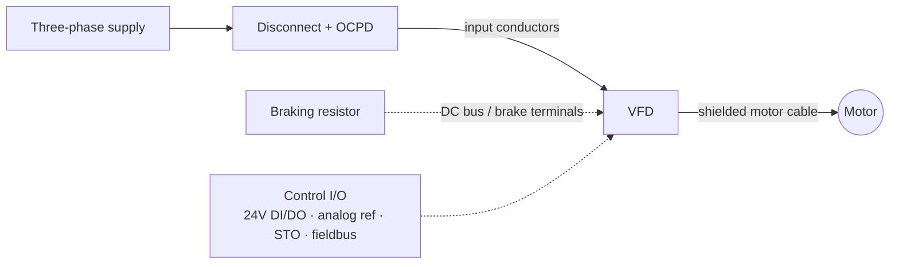

  Wiring &amp; Installation
  <h1>How to Wire a VFD</h1>
  
From the branch-circuit OCPD to the motor terminal box — sizing, protection, segregation, shielding, and the checks that keep a drive alive past first power-up.

> **Safety.** This guide is educational reference material, not a work
> instruction. Electrical work is performed de-energized and verified by
> qualified personnel under your site's LOTO procedures, following the drive
> manufacturer's manual and the authority having jurisdiction. VFD DC bus
> capacitors hold a lethal charge after power removal — always observe the
> drive's marked discharge wait time.

## Overview

A variable frequency drive presents four distinct wiring zones with
different rules; treating them the same is the root cause of most drive
installation problems.

- **Line side (input)** — three-phase supply from the branch-circuit OCPD;
  ordinary power wiring, sized from the drive's rated input current.
- **Load side (output)** — the PWM output to the motor; the noisiest
  circuit in the panel, which gets the special cable and shield discipline.
- **Control terminals** — 24 V digital I/O, analog speed reference, relay
  outputs, safety (STO) inputs, fieldbus; signal-level wiring protected
  *from* the load side.
- **DC bus / brake terminals** — DC link access and braking
  resistor/chopper connections; a stored-energy hazard and a high-energy
  switched circuit.

This guide covers wiring a single low-voltage drive feeding one induction
motor. Parameter setup and startup live in the
[VFD commissioning workflow]({{ '/lifecycle/guides/vfd-commissioning/' | relative_url }});
STO circuit design belongs to the safety function (see below); multi-motor
and bypass arrangements appear only where they change the rules. Terminal
designations, torque values, and wire-range limits are vendor-specific —
they come from the drive manual, never from a guide, including this one.

## Before You Start

Have on hand before pulling wire:

- **Motor nameplate data** — voltage, FLA, frequency, speed, power, service
  factor ([motor fundamentals]({{ '/fundamentals/motors/' | relative_url }})).
  Two currents do different jobs: the **nameplate FLA** feeds the overload
  function, while the **NEC table FLC** (Tables 430.247–430.250) governs
  conventional branch-circuit sizing (NEC 430.6 principle). For a VFD the
  drive's rated input current takes over the conductor-sizing role, but the
  FLA/FLC distinction still applies to overload settings and any bypass.
- **Drive rating match** — drive rated for the motor voltage and current,
  margin decided upstream. Confirm the **duty / overload class** (normal vs
  heavy duty in vendor terms) matches the application; the same frame
  carries different ratings per class.
- **Environment** — ambient temperature, altitude, and enclosure type all
  derate the drive; the curves are vendor-specific — consult the drive
  manual rather than assuming the catalog rating applies.
- **Drawings** — the branch-circuit design (OCPD type/size, conductor
  sizes, disconnect location) is decided upstream; this guide assumes you
  are implementing it, not inventing it at the panel.

## Sizing & Protection

The governing framework is NEC Article 430 (Part X covers adjustable-speed
drive systems) alongside NFPA 79 Chapters 6 and 7 for machinery panels.

- **Input conductors** — NEC 430.122 requires ampacity of at least 125% of
  the drive's **rated input current**, not the motor current: the drive is
  the load on the branch circuit. `cst motor-branch` computes the
  conventional motor branch chain and `cst voltage-drop` checks the run; see
  the [wire sizing walkthrough]({{ '/design/wiring/wire-sizing/' | relative_url }})
  for the full worked chain.
- **Short-circuit / ground-fault protection** — the drive's listing
  typically specifies the permitted OCPD type and maximum rating (often
  specific fuse classes, sometimes specific breakers). Deviating from the
  listed combination can invalidate the drive's SCCR contribution and with
  it the panel's marked SCCR (NFPA 79 Ch. 6; UL 508A SCCR methodology) —
  verify the pairing against the panel's SCCR documentation.
- **Motor overload** — a listed drive with an integral electronic overload
  typically serves as the motor overload device under NEC Article 430
  Part X, so a separate overload relay is usually unnecessary; verify
  against the current NEC edition and the drive's listing. One drive
  feeding several motors still needs individual overloads per motor.
- **Disconnecting means** — a disconnect within sight of the
  drive/controller location is required (NEC Art. 430 Parts IX/X; NFPA 79
  Ch. 5). Never open an output-side disconnect or contactor under load —
  see Common Mistakes.
- **Output conductors** — sized for the motor circuit per Article 430; the
  drive manual may impose minimum/maximum cross-sections and lengths.

## Power Wiring

- **Segregate input from output.** Route input and output power wiring
  apart; never bundle the PWM output cable with input, control, or signal
  wiring. Generally accepted practice — verify for your installation.
- **Use inverter-duty motor cable.** Shielded, symmetrical VFD-rated cable
  — three phase conductors plus symmetrical grounds under a continuous
  shield — supports the bonding intent of NFPA 79 Ch. 8 and mitigates
  bearing currents and radiated noise (NFPA 79 Ch. 12 recognizes VFD
  cabling). Ordinary tray cable is not equivalent at PWM frequencies.
- **Terminate the shield 360 degrees at both ends.** A full-circumference
  gland or clamp at the drive end **and** the motor end is the drive-vendor
  consensus; a pigtail largely defeats the shield at PWM frequencies.
  Generally accepted practice — verify against the drive's EMC installation
  instructions.
- **Respect motor lead length.** Long leads produce voltage overshoot at the
  motor terminals (reflected-wave effect) that stresses winding insulation.
  The threshold length and the remedy — output reactor, dV/dt filter, or
  sine filter — are vendor- and voltage-class-specific: take them from the
  drive manual, not from a universal number.
- **Braking resistor wiring** is a high-energy, PWM-switched circuit: short
  runs, shielded or tightly twisted conductors, routed away from control
  wiring, thermal contact wired into the control/safety chain. Generally
  accepted practice plus the vendor manual.
- **Torque discipline** — terminal torque values and wire ranges come from
  the drive manual; record the values used.

## Control / Signal Wiring

- Keep **24 V digital I/O, analog reference, and relay wiring separated**
  from each other and from all power wiring. The analog speed reference
  (0–10 V / 4–20 mA) is the most corruption-prone circuit on the drive.
- Use **screened control cable** for analog signals; ground the screen per
  the drive manual — commonly at the drive end only for low-frequency signal
  screens, unlike the both-ends rule for the motor cable.
- **Do not mix commons.** Check the drive's internal reference topology
  (PNP/NPN sourcing, isolated vs non-isolated commons) before tying drive
  I/O common to other system commons. Consult the drive manual.
- **STO wiring** exists on most modern drives; its design belongs to the
  machine's safety function per
  [ISO 13849-1]({{ '/standards/functional-safety/iso-13849-1/' | relative_url }}) and
  [IEC 62061]({{ '/standards/functional-safety/iec-62061/' | relative_url }}),
  with wiring depth deferred to the planned servo drive guide.

## Grounding, Shielding & EMC

Device-specifics here; the deep treatment is owned by the
[noise &amp; EMC mitigation guide]({{ '/design/wiring/emc-noise-mitigation/' | relative_url }}).

- **PE first.** Terminate the protective earth conductor before anything
  else, sized on the NFPA 79 Table 8.2.2.3 basis (largest upstream OCPD) —
  procedure per the table, values not reproduced here. See
  [panel grounding &amp; bonding]({{ '/design/wiring/grounding-bonding/' | relative_url }}).
- **The motor cable is the ground path.** Its symmetrical grounds and
  shield provide the dedicated high-frequency return for PWM common-mode
  current back to the drive PE terminal; the building ground path alone is
  not sufficient. Generally accepted practice.
- **EMC filter bonding** — ground the integral or external EMC filter with
  wide, short bonds to the mounting plate; mask or scrape paint at bond
  points. A filter bonded through paint is decorative.
- **Bearing currents** — common-mode voltage drives current through motor
  bearings; mitigation (insulated bearings, shaft-grounding rings, common-mode
  chokes) is generally accepted practice for larger machines — verify per
  drive and motor vendor guidance.
- **Separation from signal cabling** — the drive output cable is the worst
  offender for parallel network runs; separation classes and distances are
  covered in the [EMC guide]({{ '/design/wiring/emc-noise-mitigation/' | relative_url }})
  and the [copper Ethernet page]({{ '/communications/copper-ethernet/' | relative_url }}).

## Common Mistakes

1. **Opening an output contactor or disconnect under load.** The drive sees
   a sudden open circuit at full current and can fault or fail — sporadic
   output faults that "only happen sometimes." Interlock the output to open
   only with the drive stopped.
2. **Unshielded motor cable routed beside analog runs.** The PWM output
   couples into the 0–10 V reference; the drive hunts and the analog signal
   is noisy only while the drive runs.
3. **Shield pigtails instead of 360-degree terminations.** A few centimeters
   of pigtail is a significant impedance at PWM frequencies — the shield
   measures continuous but its EMC performance is gone.
4. **Sizing input conductors from motor nameplate FLA.** The 430.6
   discipline uses table FLC for conventional motor conductors — and for a
   VFD, 430.122 uses the drive's rated input current, which normally
   exceeds the motor current. Undersized input wiring runs hot.
5. **Long unfiltered motor leads.** Reflected-wave overshoot roughly
   doubles the voltage stress at the motor terminals; winding insulation
   fails months later and the drive gets the blame. Fit the reactor or
   filter the manual specifies.
6. **Mixed control commons.** Tying drive I/O common to another supply's
   common without checking isolation topology produces phantom inputs and
   ground loops — intermittent starts/stops nobody can reproduce.
7. **Megger through the drive.** An insulation tester applied to the motor
   circuit with the drive output still connected destroys the output stage.
   Disconnect the drive first — see Verification Checks.

## Verification Checks

Before and during first energization (evidence-retaining checklists in
[templates]({{ '/tools/templates/' | relative_url }})):

- [ ] Insulation-resistance test the motor **and** motor cable with the
      drive output **disconnected** — never megger through a connected drive
- [ ] PE and motor-cable ground/shield terminations complete; 360-degree glands at both ends
- [ ] OCPD type and rating match the drive listing and panel SCCR documentation
- [ ] Input/output segregation and control-wiring separation match the routing plan
- [ ] Terminal torques per the drive manual, recorded
- [ ] Discharge wait time observed before any terminal re-work (NFPA 79 Ch. 7)
- [ ] Rotation verified by a low-speed bump **under drive control**, not by swapping leads under power
- [ ] Hand off to the [VFD commissioning workflow]({{ '/lifecycle/guides/vfd-commissioning/' | relative_url }})
      for motor data entry, first power-up, and functional checks

## Standards References

- **NEC (NFPA 70), 2023** — Art. 430 Part X (adjustable-speed drive systems,
  incl. 430.122 input conductors and overload provisions); Parts IX/X
  (disconnecting means); 430.6 with Tables 430.247–430.250 (FLC vs FLA)
- **NFPA 79:2024** — Ch. 5 (supply and disconnect), Ch. 6 (protection,
  SCCR), Ch. 7 (stored-energy discharge), Ch. 8 (grounding and bonding,
  Table 8.2.2.3 basis), Ch. 12 (conductors and VFD cabling)
- **UL 508A** — SCCR methodology for the drive/OCPD combination in panels
- **IEC 60204-1** — equipotential bonding and wiring practices for machine
  electrical equipment (international counterpart)
- **ISO 13849-1 / IEC 62061** — govern the STO safety function (outside this guide)

## Related Pages

- [Wire sizing walkthrough]({{ '/design/wiring/wire-sizing/' | relative_url }})
- [Panel grounding &amp; bonding]({{ '/design/wiring/grounding-bonding/' | relative_url }})
- [Noise &amp; EMC mitigation]({{ '/design/wiring/emc-noise-mitigation/' | relative_url }})
- [NEC overview]({{ '/standards/us-electrical/nec/' | relative_url }})
- [NFPA 79 overview]({{ '/standards/us-electrical/nfpa-79/' | relative_url }})
- [Motor fundamentals]({{ '/fundamentals/motors/' | relative_url }})
- [VFD commissioning workflow]({{ '/lifecycle/guides/vfd-commissioning/' | relative_url }})
