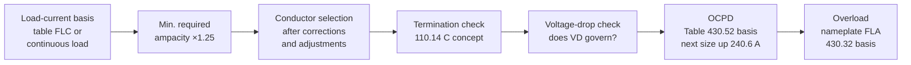

<div class="page-header">
  <span class="page-header__label">Wiring &amp; Installation</span>
  <h1>Wire Sizing Walkthrough — Nameplate to Conductor, OCPD, and Overload</h1>
  <p>One 10 hp motor circuit worked end to end, with every step computed by the <code>cst</code> toolkit and cited to the article that requires it.</p>
</div>

> **Safety.** This guide is educational, not a work instruction. Electrical
> work is performed de-energized and verified by qualified personnel under
> your site's LOTO procedures, following the device manufacturer's manual
> and the authority having jurisdiction.

## Overview

Wire sizing is a **decision chain**, not a table lookup. Each link has its
own rule, its own basis current, and its own failure mode when skipped:



This guide works the whole chain once, for a single three-phase motor branch circuit, using the [engineering toolkit]({{ '/tools/engineering-toolkit/' | relative_url }}) so every number arrives with its citation. Unlike the other wiring guides, the power and control sections here merge into one worked walkthrough — the chain *is* the content. Multi-motor feeders, tap rules, and cable-tray ampacity are out of scope (see the [Art. 430 workflow page]({{ '/fundamentals/nec-application/article-430-workflow/' | relative_url }})).

> **Sample-data notice — mandatory reading.** Every toolkit output below is computed from clearly marked **SAMPLE table data**. The rule *logic* is faithful to the cited articles, but the table values are demonstration stand-ins. Before any design use, transcribe values from your own licensed copy of the NEC into `data/standards_tables/` — the tool warns on every run until you do.

## Before You Start

Data you need in hand before sizing anything:

- **Motor nameplate** — voltage, hp, FLA, service factor, temperature
  rise, design letter. Photograph it; nameplates get painted over.
- **The run** — one-way length, raceway type, how many *current-carrying*
  conductors share the raceway, and the worst-case ambient along the route
  (a wireway across a compressor mezzanine is not at 30 °C).
- **Terminations** — temperature ratings of the breaker, contactor,
  overload, and motor terminal box lugs. Consult the device manuals; 75 °C
  is typical for modern industrial gear, but verify — never assume.
- **OCPD type decided upstream** — inverse-time breaker vs dual-element
  fuse changes the Table 430.52(C)(1) multiplier and interacts with the
  panel's SCCR strategy.

**What governs where.** The NEC (NFPA 70) governs premises wiring up to the machine; NFPA 79 governs conductors inside the industrial machine's electrical equipment (Ch. 12 aligns with, but is not identical to, Art. 310); IEC 60204-1 (Cl. 7 and Cl. 12) is the international counterpart with its own base tables. This walkthrough uses NEC numbering; the *sequence* is the same in all three.

**The FLA vs FLC rule (Art. 430.6(A) principle).** Conductor, OCPD, and disconnect sizing use the NEC full-load current **tables** (430.247/.248/.250), not the nameplate — deliberately, so the installation doesn't fail when a replacement motor draws slightly more. Only the **overload** setting uses nameplate FLA, because it protects the specific motor installed. This distinction drives most of the walkthrough.

## Sizing &amp; Protection — the Walkthrough

**The circuit:** 10 hp, 460 V, three-phase, Design B, service factor 1.15,
nameplate FLA 13.2 A. 100 ft one-way run in EMT shared with another motor
circuit — 4 current-carrying conductors. Worst-case ambient 40 °C.
Inverse-time breaker, 75 °C terminations (verified from the device
manuals), THHN copper.

### Step 1–2 — Basis current, minimum ampacity, OCPD, overload in one shot

`cst motor-branch` runs the whole Art. 430 chain:

```text
$ cst motor-branch --hp 10 --volts 460 --nameplate-fla 13.2
Motor branch circuit — 10 hp, 460 V, 3-phase: 17.5 A (min conductor ampacity)
  table_flc_a: 14
  ocpd_rating_a: 35
  overload_max_a: 16.5
  overload_percent: 125
  Warnings:
    ! Loaded SAMPLE table data — demonstration values only; verify ...
  References:
    - NEC 2023 Table 430.250 — table FLC 14 A (SAMPLE data)
    - NEC 2023 430.22 — branch conductors >= 125 % of table FLC
    - NEC 2023 Table 430.52(C)(1) + Exc. 1 — inverse time breaker max 250 %
    - NEC 2023 240.6(A) — standard rating selected: 35 A
    - NEC 2023 430.32(A)(1) — overload at 125 % of nameplate FLA
```

Reading it back: table FLC is 14 A (not the 13.2 A nameplate); minimum
conductor ampacity is 14 × 1.25 = **17.5 A** per 430.22 — the same
continuous-load 125% concept 210.19(A)/215.2(A) apply to general circuits.
The OCPD lands at 14 × 250% = 35 A — already a standard 240.6(A) rating;
had the multiplier produced 33 A, the next standard size up would be
permitted by 430.52(C)(1) Exception 1. The overload maximum is
13.2 × 1.25 = **16.5 A** — nameplate, not table, per 430.32(A)(1).

Notice the OCPD (35 A) is **larger** than the conductor requirement
(17.5 A). For motor circuits this is correct: the breaker handles
short-circuit and ground fault only and must ride through starting
inrush; the overload relay covers sustained overcurrent. Do not "fix" it.

### Step 3 — Conductor selection with corrections and adjustments

Table ampacities assume 30 °C ambient and ≤ 3 current-carrying conductors.
This run violates both, so the table value gets corrected (ambient, via the
310.15(B) equation) and adjusted (Table 310.15(C)(1)). First try 12 AWG:

```text
$ cst ampacity --awg 12 --ambient 40 --ccc 4
Allowable ampacity (12 AWG CU, 75 degC col.): 17.6383 A
  base_ampacity_a: 25
  correction_factor: 0.881917
  adjustment_factor: 0.8
```

12 AWG survives at 17.64 A vs 17.5 A required — a 0.14 A margin. Legal,
but a fifth conductor pulled into that EMT next year, or a 45 °C summer,
sinks it. Generally accepted practice is to step up on margins this thin:

```text
$ cst ampacity --awg 10 --ambient 40 --ccc 4
Allowable ampacity (10 AWG CU, 75 degC col.): 24.6937 A
  base_ampacity_a: 35
  correction_factor: 0.881917
  adjustment_factor: 0.8
  References:
    - NEC (NFPA 70) Table 310.16 — base ampacity 35 A (SAMPLE data)
    - NEC 2023 310.15(B) Equation — ambient correction 0.882 at 40 degC
    - NEC 2023 Table 310.15(C)(1) — adjustment 80% for 4 CCCs
```

**10 AWG Cu: 24.7 A ≥ 17.5 A** with real margin. Both runs used the 75 °C
column because of the terminations — the 110.14(C) concept: THHN's 90 °C
rating may serve as *headroom for corrections*, but the ampacity delivered
to a 75 °C lug may never exceed the 75 °C column value.

### Step 4 — Voltage drop: does it govern?

The NEC treats voltage drop as informational (210.19(A) Info. Note 4:
3% branch/feeder, 5% combined); NFPA 79 and IEC 60204-1 reach it through
the requirement that equipment work across the supply-tolerance band.
Check the selected conductor at load current over the 100 ft run:

```text
$ cst voltage-drop --amps 14 --feet 100 --volts 460 --phases 3 --awg 10
Voltage drop (10 AWG CU, 3-phase): 3.01269 V
  percent_drop: 0.654933
  voltage_at_load: 456.987
  Assumptions:
    - K = 12.9 ohm-cmil/ft; reactance neglected (<= ~4/0, ~unity PF)
```

0.65% — ampacity governs this run, as is typical at 460 V in-plant. The
balance flips on runs of several hundred feet, and almost immediately at
120 V AC or 24 V DC, where voltage drop usually selects the conductor and
the ampacity table merely confirms it. Whichever check demands the larger
conductor wins; run both every time.

### Step 5 — Result

| Item | Value | Basis |
|---|---|---|
| Table FLC | 14 A | Table 430.250 (sample data — verify) |
| Min. conductor ampacity | 17.5 A | 430.22 (125% of table FLC) |
| Conductor | 10 AWG Cu THHN | Table 310.16 at 75 °C, corrected 0.882, adjusted 0.80 → 24.7 A |
| Voltage drop | 0.65% at 100 ft | Ch. 9 Table 8 K-factor method; does not govern |
| OCPD | 35 A inverse-time breaker | Table 430.52(C)(1) 250%; 240.6(A) standard rating |
| Overload | ≤ 16.5 A | 430.32(A)(1), 125% of **nameplate** 13.2 A |

The equipment grounding conductor follows the 35 A OCPD (Table 250.122
basis); if the breaker is later upsized under the starting exception,
repeat the EGC check. Termination torque values are vendor-specific —
consult the device manual and record actual torques.

## Common Mistakes

1. **Everything sized from nameplate FLA.** Conductor and OCPD come out
   slightly small, pass commissioning, then a replacement motor with a
   higher-draw nameplate makes the installation non-compliant. Shows up
   years later as an inspection finding or trips after a motor swap.
2. **Termination ratings ignored.** The 90 °C THHN column gets used
   directly against 75 °C lugs. Shows up as discolored lug insulation and
   high-resistance joints found by thermography — the conductor was fine,
   the termination was cooking.
3. **Bundle adjustment forgotten in loaded wireways.** Each circuit added
   was "fine" calculated alone at ≤ 3 conductors. Shows up as a warm
   wireway and embrittled insulation on the oldest runs in it.
4. **90 °C ampacity used with 75 °C terminations even after corrections.**
   Correcting *from* the 90 °C column is legitimate; *delivering* more than
   the 75 °C column value to the lug is not. The subtle version of mistake
   2 — it survives review because the correction math looks diligent.
5. **Voltage drop skipped on long runs, then blamed on the drive.** The
   460 V habit ("VD never governs") gets carried to a 350 ft run or a 24 V
   DC valve bank. Shows up as undervoltage faults at start, chattering
   relays, and analog readings that sag with load — after weeks of
   drive-parameter tinkering that could never have fixed it.
6. **OCPD maximum confused with conductor protection.** Someone "corrects"
   the 35 A breaker over 17.5 A conductors down to 20 A and the motor can't
   start; or, inverted, sizes the conductor up to the breaker and pulls
   8 AWG everywhere. The Table 430.52 OCPD is short-circuit and
   ground-fault protection only; the overload relay covers overcurrent.
7. **Next-standard-size-up applied where it isn't permitted.** The 240.6(A)
   round-up habit from motor branch OCPDs gets applied to overload settings
   or other cases with their own rounding rules — verify which permission
   you're actually using.

## Verification Checks

- [ ] Basis current documented: table FLC for conductor/OCPD, nameplate FLA for overload — with the nameplate photo filed
- [ ] Toolkit sample-data warning resolved: values re-checked against a licensed NEC copy (or `data/standards_tables/` populated from one)
- [ ] Ambient and current-carrying-conductor count reflect the *worst* segment of the actual route, not the drawing default
- [ ] Ampacity math uses the termination temperature column (device manuals checked, not assumed)
- [ ] Voltage drop calculated for the actual one-way length; result recorded even when it doesn't govern
- [ ] OCPD is a 240.6(A) standard rating with the Table 430.52(C)(1) basis noted; any exception use documented with the reason
- [ ] Overload set ≤ the 430.32 limit and recorded on the panel documents
- [ ] EGC size re-checked against the final OCPD rating (Table 250.122 basis)
- [ ] Terminations torqued to the device manual's value and marked; record kept with the [commissioning templates]({{ '/tools/templates/' | relative_url }})

## Standards References

- **NEC (NFPA 70) 2023** — Art. 430 (430.6, 430.22, 430.32, 430.52, Tables 430.250 and 430.52(C)(1)); Art. 310 (Table 310.16, 310.15(B) equation, Table 310.15(C)(1)); 110.14(C) termination provisions; 240.6(A) standard ratings; 240.4 conductor protection; 210.19(A)/215.2(A) informational notes on voltage drop; Ch. 9 Tables 8–9; Table 250.122 EGC basis
- **NFPA 79:2024** — Ch. 7 (overcurrent/overload protection), Ch. 12 (machine conductors and ampacity)
- **IEC 60204-1:2016** — Cl. 7 (protection of equipment), Cl. 12 (conductors and cables)
- **UL 508A:2022** — panel-internal wire sizing and SCCR interaction for listed panels

## Related Pages

- [How to Wire a VFD]({{ '/design/wiring/vfd/' | relative_url }}) — where drive rated input current replaces table FLC (430.122)
- [Panel Grounding &amp; Bonding]({{ '/design/wiring/grounding-bonding/' | relative_url }}) — the EGC side of the same circuit
- [Engineering toolkit]({{ '/tools/engineering-toolkit/' | relative_url }}) — `cst motor-branch`, `ampacity`, `voltage-drop`, `wire-size`
- [NEC overview]({{ '/standards/us-electrical/nec/' | relative_url }})
- [Conductor &amp; OCPD sizing worked examples]({{ '/fundamentals/nec-application/conductor-ocpd-sizing/' | relative_url }}) — more worked circuits, incl. the multi-motor feeder formula
